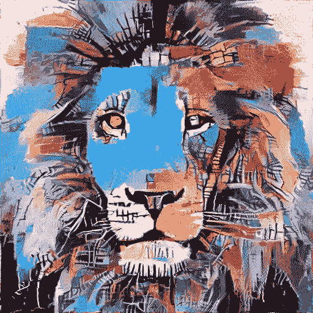
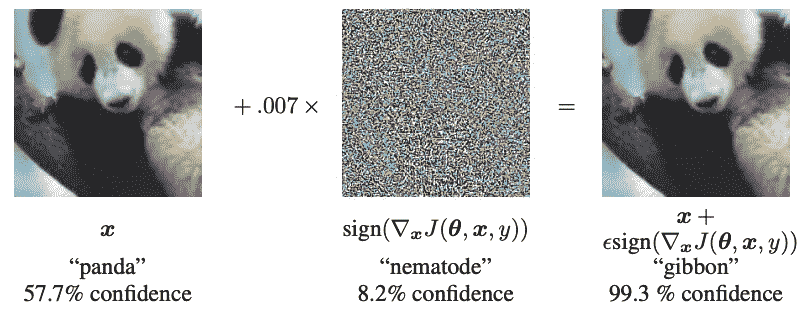
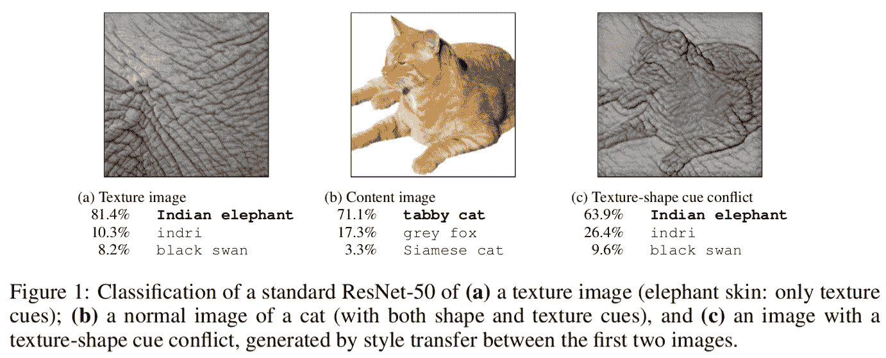
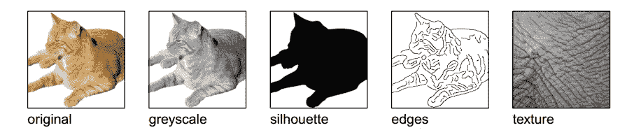

# 纹理与形状:CNN 中的偏见

> 原文：<https://towardsdatascience.com/texture-vs-shape-the-bias-in-cnns-5ee423edf8db?source=collection_archive---------18----------------------->

## 论文“图像网络训练的细胞神经网络偏向于纹理”概述



来自[博客](https://modelzoo.co/model/neural-style)

十多年前，随着 CNN 在当时可用的少数数据集上用于分类任务的引入，深度学习和计算机视觉领域已经走过了漫长的道路。我们已经看到了许多令人兴奋的应用，从自动驾驶汽车中用于了解其环境的检测和分割到 [*基于 GAN 的图像修复、着色和风格转移*](https://medium.com/analytics-vidhya/top-5-gan-generative-adversarial-networks-projects-for-final-year-computer-science-students-ff35eab94e4f) 。


甘使用案例:从报纸上，[深度试衣](https://github.com/switchablenorms/DeepFashion_Try_On)

尽管我们看到了这么多激动人心的关于 CNN 架构及其应用的研究论文，但我们仍然不知道为什么这些系统会做出这样的决定。这就是为什么我们认为这些系统是“黑匣子”，我们不知道特定决策背后的“推理”。不能因为这些行为在预定义的指标上得分高就忽视它们。例如， [*性别形状项目*](http://gendershades.org/overview.html) 显示，各种人脸识别系统在少数族裔类上的表现更差(肤色较浅的男性和肤色较深的女性之间的准确率差异高达 34%)。现在，如果这种系统用于执法、机场或就业筛查， [*这种偏差可能会产生重大影响*](https://sitn.hms.harvard.edu/flash/2020/racial-discrimination-in-face-recognition-technology/) 。这突出了“可解释性”在计算机视觉系统中的重要性。

“对抗性攻击”展示了 CNN 的一种违反直觉的行为。这些例子是专门设计来欺骗 CNN 预测错误的标签，只是通过用人眼无法分辨的噪声改变图像。



FSGM 攻击对抗示例来自[论文](https://arxiv.org/pdf/1412.6572.pdf)

这被称为“白盒”对抗性攻击，因为我们可以访问 CNN 的权重。为了训练 CNN，我们最小化对给出输入数据的标签的损失。这里，我们使用梯度计算输入，以优化最大损耗。结果，我们得到了人眼无法识别的失真，而 CNN 预测了错误的标签。

论文[’*捕捉到了一个这样的行为，ImageNet 训练的 CNN 偏向纹理’*](https://arxiv.org/pdf/1811.12231.pdf)。让我们开始吧…

***以前纹理偏向的迹象:***

对于 CNN 是如何运作的，有一种被广泛接受的直觉。CNN 结合底层特征(线条、边缘)，分层学习更复杂的特征(车轮、人脸、树干)。换句话说，最后一层的预测将更多地取决于对象的全局形状，而不是局部纹理。但是有一些矛盾的发现，我把它们列在下面。

```
1\. “CNNs can still classify texturized images perfectly well, even if the global shape structure is completely destroyed” (Gatys et al., 2017; Brendel & Bethge, 2019).
2\. “Standard CNNs are bad at recognizing object sketches where object shapes are preserved yet all texture cues are missing” (Ballester & de Araujo, 2016).
3\. “Gatys et al. (2015) discovered that a linear classifier on top of a CNN’s texture representation (Gram matrix) achieves hardly any classification performance loss compared to original network performance”.
4\. “Brendel & Bethge (2019) demonstrated that CNNs with explicitly constrained receptive field sizes throughout all layers are able to reach surprisingly high accuracies on ImageNet, even though this effectively limits a model to recognizing small local patches rather than integrating object parts for shape recognition.”
```

因此，这篇论文确定了 CNN 的这种特殊行为，这将解释上述观察结果。下图总结了这种行为。



摘自[论文](https://arxiv.org/pdf/1811.12231.pdf)

在这里，我们可以清楚地看到，即使猫的全局结构在那里，所有的顶部预测都是基于纹理，即象皮。

***心理物理实验:***

为了深入研究这种行为，作者提出了心理物理学实验来测试人类中枢神经系统。为了理解这种偏见，我们首先要理清形状和纹理信息，看看受试者倾向于哪里。这是通过各种方式交换原始纹理信息来完成的，即心理物理学实验的数据集。

***数据集:***

*   **原稿:** 160 张自然彩色图像，白色背景(避免任何来自背景的信息)
*   **灰度:**图像转换为灰度，用于堆叠在 3 个通道上的 CNN
*   **剪影:**白色背景上的黑色图像，类似语义分割图
*   **边缘:**通过 Canny 边缘检测器进行基于边缘的表示
*   **纹理:** 48 幅自然纹理图像或同一物体的重复
*   **提示冲突:**使用 [*样式转移算法*](https://www.tensorflow.org/tutorials/generative/style_transfer) 生成的图像，使用原始(内容)和纹理(样式)



来自[的论文](https://arxiv.org/pdf/1811.12231.pdf)

这里，灰度、轮廓、边缘和线索冲突形成了实验设置。对这些图像的预测可以是基于形状的，也可以是基于纹理的。使用多种方式交换出纹理，我们可以确定结果不是由于特定的源纹理。

现在，关于标签，作者通过 wordnet 层次结构使用 16 个 imagenet 类作为标签。作者选择了在 imagenet 上训练的 4 个 CNN 网络，即 VGG16、GoogleLeNet、AlexNet 和 ResNet50。现在，关于标签，作者通过 WordNet 层次结构使用 16 个 imagenet 类作为标签。对于试验的参与者来说，他们必须从 16 个标签中为每张显示的图片选择一个。

***结果:***

作者分三步解释了论文的结果。

*   CNN 和人类的形状与纹理偏见。
*   使用风格化的 Imagenet 克服纹理偏见(下面讨论)
*   以及在风格化 Imagenet 上训练的模型的鲁棒性

[*这里*](/food-for-thought-paper-tuesday-3c0a9b3e432f) ，这些实验的结果解释得非常透彻。

***解决方案:风格化 Imagenet***

现在，纹理偏见被证实了，下一步将是试着把 CNN 推向形状偏见，就像人类对应物所展示的那样。作者解释说，imagenet 任务本身并不需要 CNN 学习基于形状的表示，局部特征的集成对于最大化准确性非常有用。基于这一假设，作者提出了一种新的数据集作为解决方案:风格化的 Imagenet。目标是去除原始图像的纹理，并用随机化的样式替换它。这既作为稳健模型的训练数据，又作为稳健性的测试，这对于具有形状偏差的模型来说是难以解决的。

上面还讨论了这些 SIN 训练模型的好处和传统模型的稳健性测试。

**结论:**

本文假设纹理偏见是一种解释零散发现的方式，这些发现无法用我们之前对 CNN 工作方式的直觉来解释。对于本文的范围，作者检查了 ImageNet 训练模型的纹理偏差，发现这种行为在模型之间是一致的。为了推动模型学习形状偏差，作者提出了一个新的风格化 imagenet 数据集，通过各种失真图像来检验其纹理偏差结果。

***进一步讨论:***

现在，这留给我们两个问题…

*   这种行为是否仅发生在 Imagenet 训练图像上，即它是数据集属性吗？

如上所述，解决 imagenet 不需要模型学习基于形状的表示。另一篇论文讨论了类似的思路，深入解释了对立的例子，在许多事情中回答了这个问题。

*   如果我们之前的理解是错误的，是什么原因导致 CNN 出现这样的行为？

这属于 CNN 的可解释性研究范式，是一个活跃的研究领域。要了解更多关于这个话题，你可以试试[这个](https://distill.pub/2017/feature-visualization/)和[这个](https://distill.pub/2018/building-blocks/)博客。

这篇论文由 [Bethge 实验室](http://bethgelab.org/)的惊人团队发表，他们也发表了[神经类型转移](https://arxiv.org/abs/1508.06576)算法。你可以在他们的网站上查看一些其他有趣的项目。

希望你喜欢我对这篇研究论文的看法，如果有任何问题或建议，请告诉我。快乐学习！！！