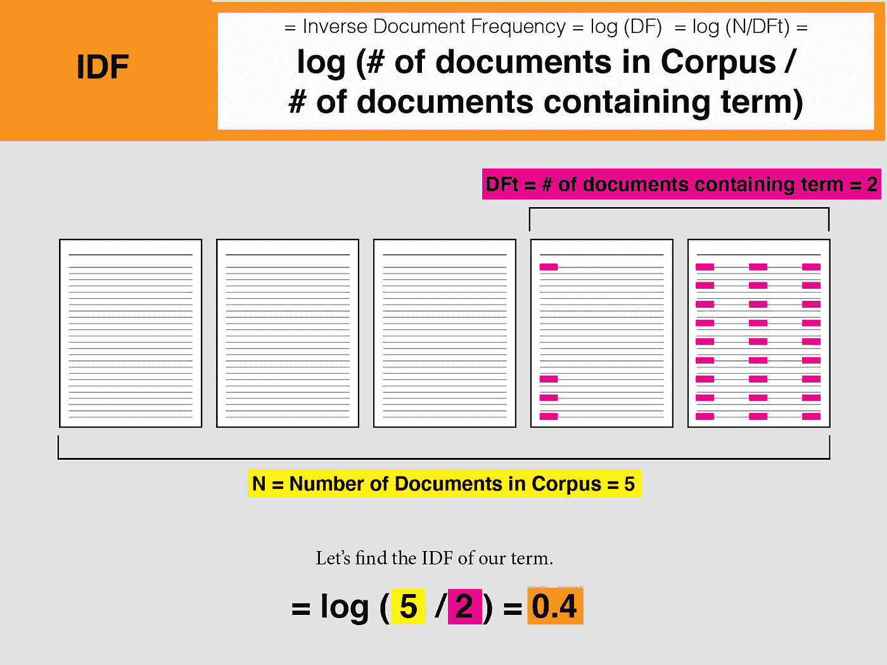
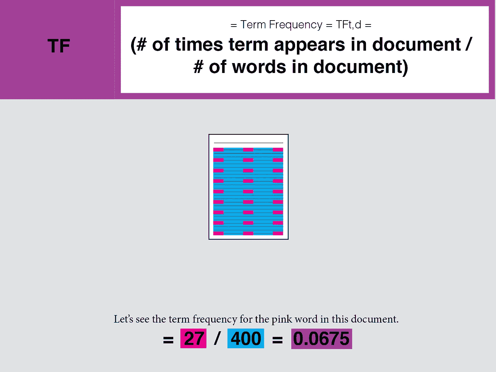
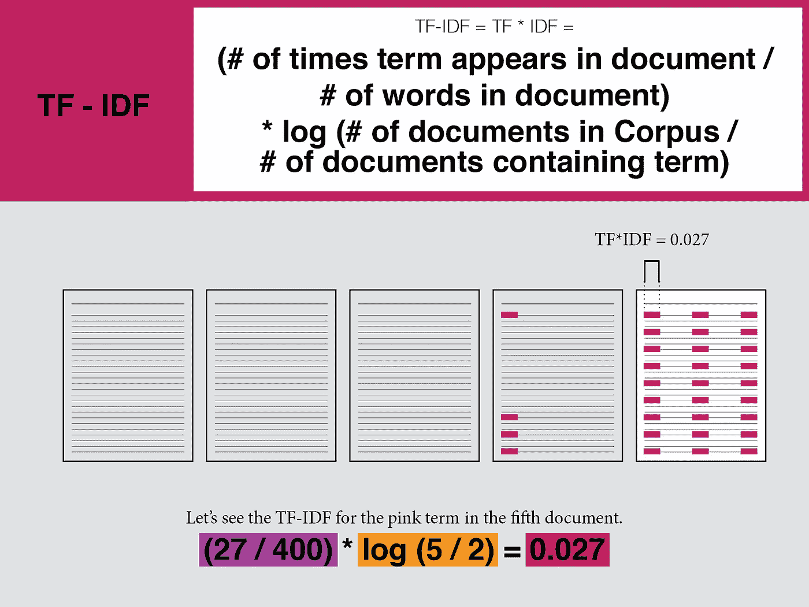
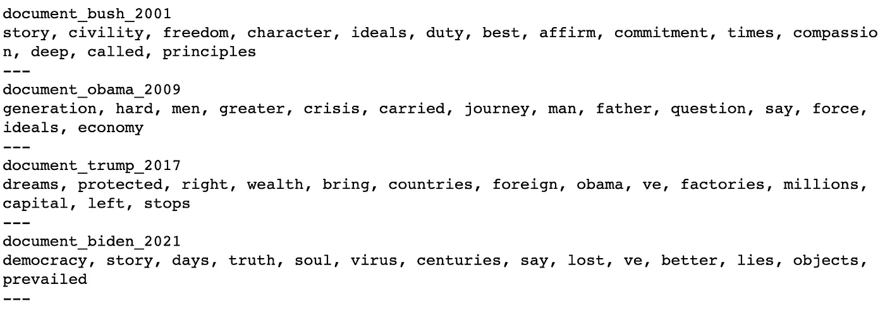

# TF-IDF:总统就职演说的可视化解释器和 Python 实现

> 原文：<https://towardsdatascience.com/tf-idf-a-visual-explainer-and-python-implementation-on-presidential-inauguration-speeches-2a7671168550?source=collection_archive---------10----------------------->

曾经被要求向非技术观众解释 TF-IDF 吗？这里有一个 TF-IDF(词频-逆文档频率)的可视化解包，与非技术同行分享，并获得对驱动从 Google 到 Amazon 的搜索引擎排名的方程以及许多行业标准自然语言处理算法的直观感受。Python 示例和实现如下。


我们希望从中提取意义的 5 个文档—作者提供的图片

# 我们如何从大量的文档中提取意义？

我们将一组文本转换成数字来回答如下问题:

*   这些文件中的主要主题是什么？
*   你能从最相似到最不相似排列这些文件吗？
*   正在使用的最有意义的词是什么？

还有很多问题可以用 TF-IDF 和自然语言处理来回答。但首先，让我们了解数据科学家和我们的许多文献喜欢使用的术语。

**术语**

我们使用**文档**来指代我们正在比较的文本片段——这些可以是报纸文章、一本书的章节、产品描述、评论、主页等等。**文集**就是这样一组文档。一个**术语**是一个单词。


术语—按作者分类的图像

将单词转换为有意义数字的两种方法是**“单词包”**计数矢量器方法和 **TF-IDF** 矢量器。计数矢量器根据每个单词在每个文档中出现的次数对单词进行排序。TF-IDF 考虑文档中有多少单词与该计数相关，以及该单词在语料库中的文档中出现的频率。因此，TF-IDF 值指示语料库中每个单词的相对重要性。让我们看看如何导出这个值。

**IDF —逆文档频率**

*这个术语是我们语料库中所有文档的共同主题吗？*

IDF 回答这个问题。接近 0 的值表示该术语非常常见，对区分本文档和其他文档没有太大帮助。较高的值表示该术语不太常用，可能对理解本文档的主题至关重要。



IDF 解释——图片由作者提供

**TF —词频**

这个术语在本文件中重要吗？

TF 回答这个问题。接近 1 的值表示该术语对文档非常重要，并且主要由它组成。低值可能意味着该术语不太重要。



TF —按作者分类的图像

**TF-IDF —词频-逆文档频率**

*这个术语在这个文档中的重要性是什么，这也说明了这个术语在语料库中的出现频率？*

TF-IDF 回答这个问题。接近 0 的值表示该术语在语料库和/或文档中不重要。较大的值表示该术语对于文档和/或语料库是唯一的。这个值最适合于同一个文档中的其他术语以及其他文档。



TF-IDF —作者提供的图片

**TF-IDF 矩阵**

*我如何使用 TF-IDF 值来生成关于文档和术语的见解？*

当您能够跨文档比较术语时，Corpus TF-IDF 值变得很有价值。你可以分辨出哪些文档是相似的，哪些是不同的——哪些文档没有什么新意，哪些有。出现在较少文档中的术语得分较高，而出现在所有文档中的术语得分为 0。


语料库 TF-IDF 值—按作者分类的图片

**术语文档矩阵**

通过检查显示每个文档中每个术语的 TF-IDF 值的术语文档矩阵，我们可以了解哪些文档最相似，哪些术语最重要。当在 Google 或 Amazon 上搜索一个项目时，或者创建一个找到最相似的书籍、电影、合作伙伴等的推荐系统时，这很有用。


TF-IDF 文档术语矩阵学习—作者图片

TF-IDF 文档术语矩阵的用途是无穷无尽的，它建立在一个相对简单的等式上。机器学习的力量是利用这些小逻辑，在巨大的数据集上重复它们，以产生新产品、工具、洞察力和影响。见鬼，即使很小的数据集也可以用来产生洞察力。这里有一个 python 中的例子，它查看了总统就职演说，这些演说摘录自 UCSB 的美国总统项目。

# **Python 实现**

首先，您想要导入您将需要的 Python 库。

*   scikit 学习库中的 TfidfVectorizer，用于处理文本
*   熊猫将使用数据框架

```
from sklearn.feature_extraction.text import TfidfVectorizer
import pandas as pd
```

接下来，选择您的文档集。我从之前四位总统的就职演说中提取了文本，并将它们存储在字符串中。我的语料库列表就是这些字符串的列表。

```
corpus = [document_bush_2001, document_obama_2009,   document_trump_2017, document_biden_2021]
```

有很多方法可以通过使用词干化或词汇化来预处理字符串，但我在这里将跳过这些，因为重点是 TF-IDF。要使用 TF-IDF 矢量器，您需要将模型存储在一个变量中，在这个变量中您可以设置许多设置。一些起始设置是停止字、ngrams、最小和最大 df。我建议查看 scikit learn [文档](https://scikit-learn.org/stable/modules/generated/sklearn.feature_extraction.text.TfidfVectorizer.html)以了解更多信息。

*   **停用词**是你不想考虑的常用词，如“the”或“of”。你总是可以添加停用词，但是我发现 min 和 max df 会自动处理这个问题。
*   **N-grams** 允许你选择一定范围的单词长度——1、2 或更多——我坚持使用单个单词
*   **max-df** 忽略文档频率大于所选阈值的术语
*   **min-df** 忽略文档频率小于所选阈值的术语

```
vectorizer = TfidfVectorizer(stop_words='english', ngram_range = (1,1), max_df = .6, min_df = .01)
```

将 tfidf 矢量器应用于语音文本。x 是保存所有非零值的位置的稀疏矩阵。

```
X = vectorizer.fit_transform(corpus)
```

从矢量器中提取单词，又名“特征名”。

```
feature_names = vectorizer.get_feature_names()
```

创建一个密集的矩阵来转换成一个列表，最后是一个数据帧。

```
dense = X.todense()
denselist = dense.tolist()
df = pd.DataFrame(denselist, columns=feature_names)df.head()
```

我的 TF-IDF 文档术语矩阵输出如下所示:


TF-IDF 文档-按作者输出的术语矩阵

在那里！没什么意思吧？如果我们给文档命名，按照每个文档的最高 TF-IDF 分数排序，并按照总统就职演说显示 15 个最有意义的单词，会怎么样？让我们看看:

```
data = df.transpose()
data.columns = ['document_bush_2001', 'document_obama_2009', 'document_trump_2017', 'document_biden_2021']# Find the top 30 words said by each President
top_dict = {}
for c in range(4):
    top = data.iloc[:,c].sort_values(ascending=False).head(30)
    top_dict[data.columns[c]]= list(zip(top.index, top.values))# Print the top 15 words said by each President
for president, top_words in top_dict.items():
    print(president)
    print(', '.join([word for word, count in top_words[0:14]]))
    print('---')
```



作者撰写的每篇总统就职演说前 15 个词

# **结论**

对于 NLP 爱好者和政治爱好者来说，这些结果很有启发性。话语是强大的，我们可以清楚地看到每个候选人当选后的关注点，以及国情咨文。例如，特朗普专注于财富、梦想和左翼与右翼。拜登关注的是民主、灵魂、病毒和损失，以及做得更好。一个有趣的主题是布什和拜登演讲中的“故事”。我想知道他们每个人在他们的演讲中都谈到了什么“故事”。这只是冰山一角，但我希望你能看到 TF-IDF 在从文本中提取意义方面有多么强大。事实上，我使用 TFIDF 矢量器构建了 *Storytimes* ，这是一个面向父母的基于内容的插图儿童书籍推荐器，你可以在这里阅读[。](/building-a-content-based-childrens-book-recommender-for-parents-680e20013e90)

对于一般的数据科学家来说，生成 TF-IDF 的方法可以用在非文本应用程序中。例如，如果您想对已经是数字的数据进行一些特征工程，使已经有意义的特征更加强大，您可以。例如，假设你发现一所房子的浴室和卧室的数量是预测房子价格的重要特征，你可以设计一个比浴室或卧室的原始数量更具预测性的特征。您可以查看每间卧室的浴室密度，我们称之为浴室频率= (2 间浴室/ 3 间卧室)并乘以邻居的这一特征的稀有度，我们称之为逆邻居频率= log(邻居房屋的数量/有 2 间浴室的邻居房屋的数量)以获得“BF-INF”特征。事实上，我在我的特征工程中做了类似的事情来预测 airbnb 在洛杉矶的租赁价格，你可以在这里阅读。

TF-IDF 是伟大的，它的应用在自然语言处理内外都很广泛。

延伸阅读:

[](/building-a-content-based-childrens-book-recommender-for-parents-680e20013e90) [## 为家长构建基于内容的儿童图书推荐系统

### 睡前故事崩溃的解决方案

towardsdatascience.com](/building-a-content-based-childrens-book-recommender-for-parents-680e20013e90) [](/prospecting-las-backyard-houses-with-machine-learning-8fdc191e1cf) [## 用机器学习探测洛杉矶的后院房屋

### 在 METIS 数据科学进行的项目 5/5 沉浸式解决我自己制造的一个商业问题

towardsdatascience.com](/prospecting-las-backyard-houses-with-machine-learning-8fdc191e1cf)