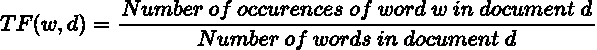
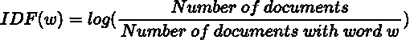
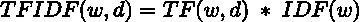
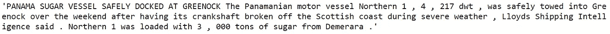
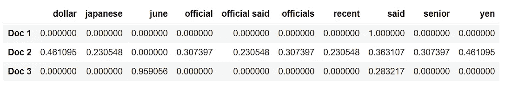

# TF-IDF 揭秘

> 原文：<https://towardsdatascience.com/tf-idf-demystified-7dd3ef071b24?source=collection_archive---------19----------------------->

## 了解文本矢量化中的关键人物

照片由[像素](https://www.pexels.com/photo/alphabet-close-up-communication-conceptual-278887/?utm_content=attributionCopyText&utm_medium=referral&utm_source=pexels)的[皮克斯拜](https://www.pexels.com/@pixabay?utm_content=attributionCopyText&utm_medium=referral&utm_source=pexels)拍摄

有很多方法可以将文本转换为机器学习和自然语言应用的向量。在这里，我们探索一种更令人头痛的方法:TF-IDF。

当然，当我称之为头痛诱发时，我主要是为我自己说话。这是我刚开始学习数据科学时难以理解的一个话题。

TF-IDF 用于许多需要分析文本或构建利用 NLP 的产品的项目中。当我深入研究各种 NLP 项目时，我经常发现自己一次又一次地碰到这个话题。

为此，我强调熟悉以色列国防军特遣部队的重要性。

也就是说，仅仅理解概念可能是不够的；你可能还需要能够口头解释它。

TF-IDF 经常出现在需要 NLP 专业知识的职位的数据科学面试中。虽然它不是最复杂的单词矢量化方法，但它可能很难用单词来解释。

因此，这已经成为许多善意的(或虐待狂的)希望淘汰候选人的面试官的热门话题。

我写这篇文章时投入了一些感情，希望这个五个字母的谜不要像我一样让人绕着圈子跑。

# TF-TDF

术语频率-逆文档频率，或 TF-IDF，是一种将单词表示为向量以从文本数据中提取洞察力的方法。

初学者难以理解 TF-IDF 的原因之一是它的数字表示是抽象的。分配给每个文档中每个单词的值没有具体的含义。

TF-IDF 的抽象性源于它不是一个实际的统计数据；它是两个独立统计数据的产物。

单词的 TF-IDF 由两个因素决定:术语频率(TF)和逆文档频率(IDF)。

让我们慢慢地分解每一部分，以免你头疼，过早地放弃这篇文章。

## 检索词频率

术语频率指的是一个单词在所选文本体中出现的次数。它可以通过以下公式导出:

由作者创建

仅根据每个单词在文档中的出现频率来表示它，与单词袋方法非常相似。

单词袋模型只是记录每个单词在每个文档中出现的次数。仅依赖于上下文的词频会导致可能在多个文档中普遍存在的词(例如停用词)的较高权重。

## 逆文档频率

这个问题可以通过引入逆文档频率(IDF)组件来抵消在许多文档中高频出现的单词来解决。

逆文档频率可以通过以下公式导出:

由作者创建

有了这个统计，如果一个词出现在许多文档中，它就不会得到过高的评价。

可以把 IDF 组件看作一种平衡，确保 TF 组件不会高估一个单词在文档中的相关性。

有了单词的 TF 和 IDF 值，您现在就能够有效地量化该单词在文档中的重要性。

由作者创建

通过组合 TF 组件和 IDF 组件，可以得到 TF-IDF。

令人震惊，我知道。

文档中某个单词的数字表示可以让我们了解该单词在文档中的重要性。如果向量中的一个单词比另一个单词具有更高的 TF-IDF 值，则认为它与该文档的相关性更大。

## 用例

TF-IDF 已被证明是一种有效的文本矢量化方法，适用于许多现实场景。

由于它能够量化一个单词在文档中的重要性，所以它是关键字提取的理想选择。利用 TF-IDF 对文档中每个单词的评估，它可以识别具有最高值的单词，并将它们视为关键词(对于文本分类或文本摘要也是有用的)。

TF-IDF 通常也用于信息检索。想想你经常使用的搜索引擎。它们旨在通过基于文档与用户查询的相关性评估每个文档并返回排名最高的结果，为您提供最相关的文档。

## 限制

尽管 TF-IDF 能够对文档中出现的单词给出很多见解，但它也有一些缺点。

首先，TF-IDF 没有注意到文本中单词的顺序。仅这一点就会导致文本矢量化后丢失一些上下文。

其次，TF-IDF 没有考虑单词的语义值。每个单词都被认为是独立的。

假设您正在搜索与单词“king”相关的信息。在这种情况下，TF-IDF 只会考虑“王”这个词。像“统治者”或“君主”这样的同义词将被视为完全不同的实体，即使它们具有相似的语义。

# **在 Python 中使用 TF-IDF**

一个词的 TF-IDF 值不难计算；这是简单的代数。您可以很容易地开发自己的矢量器，使用公式将文本转换成 TF-IDF 矢量。

也就是说，如果您的目标是在任何 NLP 项目中使用 TF-IDF，那么最好依赖 scikit-learn 模块的 [TF-IDF 矢量器](https://scikit-learn.org/stable/modules/generated/sklearn.feature_extraction.text.TfidfVectorizer.html)。

scikit-learn 的 TF-IDF 矢量器可以为您执行所有繁琐的计算，但不仅仅是这样。

矢量器还允许您:

*   归一化 TF-IDF 值(这减轻了来自过长或过短的语料库的偏差)
*   选择矢量化中使用的 n-gram 范围(如果你需要复习，我写过一篇文章介绍了[n-gram](/leveraging-n-grams-to-extract-context-from-text-bdc576b47049)
*   通过仅包括词频最高的词来降低维度

这里，我们将从 NLTK 包的内置语料库中加载 3 段文本。

代码输出(由作者创建)

为了便于演示，让我们构建一个矢量器，它删除了停用词，考虑了单词和双词，并且只选择了 10 个词频最高的词。

代码输出(由作者创建)

从输出中，您可以看到 TF-IDF 值的每一行是如何表示每个文档的。

*注意:选择的参数不是最优的。向量的最佳 n 元语法范围和维度取决于所讨论的文本，并且只能通过实验来确定。*

# 结论

照片来自 [Pexels](https://www.pexels.com/photo/black-and-white-laptop-2740956/?utm_content=attributionCopyText&utm_medium=referral&utm_source=pexels)

现在您已经熟悉了 TF-IDF 是如何计算的，它的值代表什么，以及为什么它在 NLP 应用中如此普遍。

如果您已经对这种文本矢量化方法有了深入的了解，那么您在掌握自然语言处理的道路上已经到达了一个重要的里程碑。

我祝你在数据科学的努力中好运！