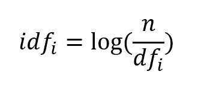
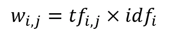
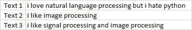
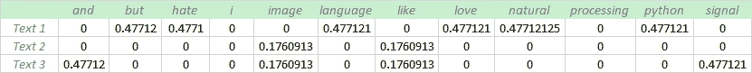

# TF-IDF 简化版

> 原文：<https://towardsdatascience.com/tf-idf-simplified-aba19d5f5530?source=collection_archive---------5----------------------->

## 自然语言处理

## TF-IDF 矢量器简介

[梁杰森](https://unsplash.com/@ninjason?utm_source=medium&utm_medium=referral)在 [Unsplash](https://unsplash.com?utm_source=medium&utm_medium=referral) 上的照片

M ost 机器学习算法是用统计、代数、微积分等数学东西来完成的。他们希望数据是数值型的，比如以行作为实例，以列作为特征的二维数组。自然语言的问题是，数据是原始文本的形式，因此文本需要转换为向量。将文本转换为矢量的过程通常称为文本矢量化。这是自然语言处理中的一个基本过程，因为没有任何机器学习算法理解文本，甚至计算机也不理解。文本矢量化算法，即 TF-IDF 矢量器，是传统机器学习算法中非常流行的方法，可以帮助将文本转换为矢量。

## TF-IDF

术语频率-逆文档频率是一个文本矢量器，将文本转换成可用的矢量。它结合了两个概念，术语频率(TF)和文档频率(DF)。

术语频率是特定术语在文档中出现的次数。词频表示文档中特定术语的重要程度*。*术语频率将数据中的每个文本表示为一个矩阵，矩阵的行是文档的数量，列是所有文档中不同术语的数量。

文档频率是包含特定术语的文档的数量。文档频率表明该术语的常见程度。

逆文档频率(IDF)是术语的权重，其目的是如果术语的出现分散在所有文档中，则降低术语的权重。IDF 的计算方法如下:

作者图片

其中，idfᵢ是术语 I 的 idf 分数，dfᵢ是包含术语 I 的文档数，n 是文档总数。一个期限的 DF 越高，该期限的 IDF 越低。当 DF 的数量等于 n 时，这意味着该术语出现在所有文档中，IDF 将为零，因为 log(1)为零，当有疑问时，只要将该术语放在停用词列表中，因为它不提供太多信息。

顾名思义，TF-IDF 得分只是术语频率矩阵与其 IDF 的乘积，其计算方法如下:

作者图片

其中，wᵢⱼ是文档 j 中术语 I 的 TF-IDF 得分，tfᵢⱼ是文档 j 中术语 I 的术语频率，idfᵢ是术语 I 的 IDF 得分

## 例子

假设我们有 3 个文本，我们需要使用 TF-IDF 对这些文本进行矢量化。

作者图片

*   **第一步**

创建一个术语频率矩阵，其中行是文档，列是所有文档中的不同术语。统计每个文本中出现的单词。

作者图片

*   **第二步**

使用前面解释的公式计算反向文档频率(IDF)。

作者图片

术语 *i* 和*处理*的 IDF 值为 0，如前所述，我们可以删除这些术语，但为了简单起见，我们保留这些术语。

*   **第三步**

将 TF 矩阵分别乘以 IDF

作者图片

好了😃！文本现在可以输入机器学习算法了。

## 限制

*   它仅作为词法级别的特性有用。
*   同义词被忽略了。
*   它没有抓住语义。
*   最高的 TF-IDF 分数可能对文档的主题没有意义，因为如果术语的 DF 低，IDF 给出高权重。
*   它忽略了术语的顺序。

## 结论

为了处理自然语言，文本必须表示为数字特征。将文本转换为数字特征的过程称为文本矢量化。TF-IDF 是最流行的文本矢量器之一，计算非常简单，易于理解。它赋予罕见术语高权重，赋予普通术语低权重。

## 参考

 [## 用 Python 进行应用文本分析

### 第四章。文本矢量化和转换管道机器学习算法对数字特征进行操作…

www.oreilly.com](https://www.oreilly.com/library/view/applied-text-analysis/9781491963036/ch04.html)  [## 自然语言处理在行动

### 学习理论和实践技能需要超越仅仅理解自然语言处理的内部工作，并…

www.manning.com](https://www.manning.com/books/natural-language-processing-in-action)  [## 单词袋模型的温和介绍-机器学习掌握

### 词袋模型是在用机器学习算法对文本建模时表示文本数据的一种方式。的…

machinelearningmastery.com](https://machinelearningmastery.com/gentle-introduction-bag-words-model/)