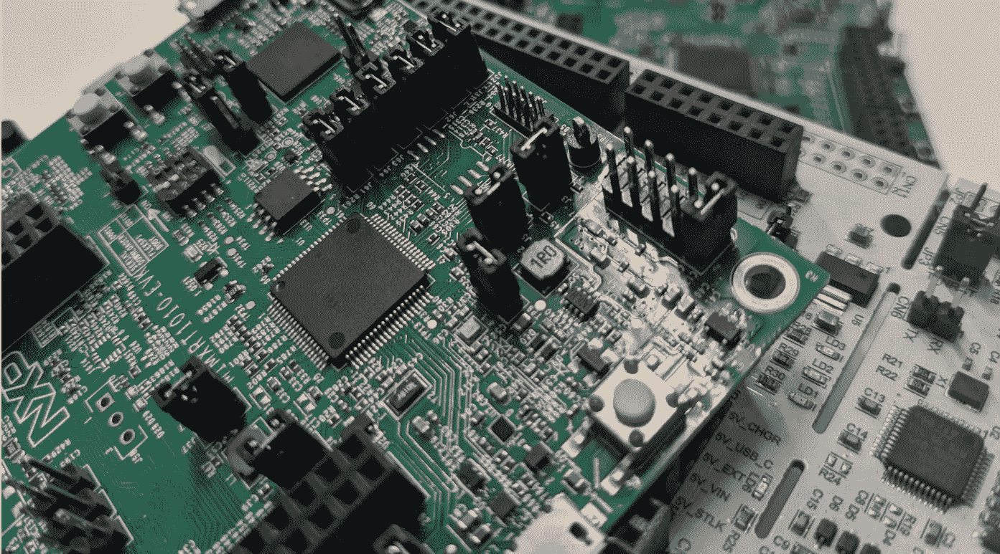

# TFLite 微型 vs 辉光 AOT

> 原文：<https://towardsdatascience.com/tflite-micro-vs-glow-aot-6524be02ba2a?source=collection_archive---------25----------------------->

## 比较 TinyML 框架

我用于 TinyML 推理的两个框架是用于微控制器的[tensor flow Lite](https://www.tensorflow.org/lite/microcontrollers)和 [GLOW](https://github.com/pytorch/glow) (更具体地说，是提前发光的[(AOT)](https://github.com/pytorch/glow/blob/master/docs/AOT.md)编译器)。由于我还没有真正看到两者之间的比较，我决定比较两个框架的实现，并执行一些基准测试。

# 非常基本的概述

将经过训练的模型部署到微控制器(MCU)时，需要两个要素:

1)量化，针对大小和延迟优化模型。虽然从技术上讲，这不是严格要求的，但很可能只有极少数(如果有的话)模型可以在没有量化的情况下在 MCU 上运行

2)推理机，用于对目标进行实际的推理。

虽然这两个框架都提供了量化模型的工具，但是我将把重点放在推理机上，因为这两个框架所采用的推理方法是非常不同的。

TensorFlow 将模型转换为包含执行推理所需的序列化步骤的 [FlatBuffer](https://google.github.io/flatbuffers/) ，与运行在目标 MCU 上的库一起使用，该库解释 FlatBuffer。FlatBuffer 中包含的信息是模型中使用的权重和操作。为了有效地执行操作，TFlite 微库针对不同的目标优化了内核。

GLOW 生成编译后的代码来推断目标上的模型，因此得名“提前”编译器。将模型部署到 MCU 由一个包组成，该包包含一个编译的目标文件、头文件和权重文件，这些文件可以动态使用(在运行时)或静态使用(在为目标编译时)。

# 比较这两种方法

每种框架采用的两种方法都有其优点。我将试着在下面列出优势和区别。

我不打算进入整个“在嵌入式中使用 OOP”的争论。我只想说，如果在您的嵌入式项目中看到一个`.cpp`或`.cc`文件让您感到不舒服，那么您不必进一步阅读，因为 GLOW 是适合您的框架。TensorFlow 使用 C++，这是一个嵌入式友好的实现，但它仍然是 C++。

## 内存使用

你可能想知道为什么我没有在下面的基准测试中包括内存使用；这是因为我觉得这不是一个苹果与苹果的比较。

GLOW 的包输出包含持久和可变内存所需的确切大小，因为推理代码已经编译好了，所以也很容易计算出来。这是非常确定的，它允许你很容易地把你的常数和/或你的程序放在 ram 中；如果您使用的是带有紧密耦合内存的 ARM Cortex-M7，这可能特别有用。此外，使用 GLOW 生成的最终二进制文件更小。

另一方面，张量流不太确定。FlatBuffer 大小是您得到的唯一精确值。可变内存可能是我最大的不满，因为你需要在 RAM 中分配一个名为`tensor_arena`的区域，引用 TensorFlow 文档，“所需的大小将取决于你正在使用的模型，可能需要通过实验来确定。”。至于程序大小，在你的程序中，你指定你的模型将使用哪些操作，并且只有那些操作将被包含在你的可执行文件中。

作为一名嵌入式软件开发人员(阅读:控制狂)，我更喜欢 GLOW 方法。但是，如果您计划运行使用相似运算符的多个模型，TensorFlow 可能会占上风，因为您将对所有模型使用相同的指令内存。

## 部署

ML 野兽的本质是不断升级更新的；因此，现场升级是必须的。这里我更喜欢 TensorFlow 实现。当您的模型改变时，只要您的输入和输出的形状保持不变，并且您在原始代码中包含了所有的操作，那么您需要做的就是替换您的 FlatBuffer。

这意味着您可以将 Flatbuffer 存储在文件系统中，并使用您实现的任何通信协议来更新您的模型。从安全的角度来看，您可以在不改变可执行文件的情况下更新您的模型。并不是说它消除了所有的安全顾虑，但它仍然是有益的。也就是说，GLOW bundle 是足够孤立的，通过一些思考，人们可以设计一个只允许模型升级的系统。

虽然我更喜欢 TensorFlow 在现场更新模型，但这有多大好处将取决于用例。例如，如果用例不需要很多更新，或者如果更新很重要(需要改变输入或输出形状，或者引入新的操作)，好处可能不太有效。

## 轻便

可移植性有两个不同的元素:用于训练的框架和目标硬件。从技术上来说，GLOW 是 PyTorch 的一部分，但可以很容易地与 TensorFlow 中训练的模型一起使用(但请注意，将 PyTorch 中训练的模型与 TensorFlow Lite 一起使用要复杂一些。)

TensorFlow 中的目标架构可移植性非常简单。如果您能够为您的目标编译 C++代码，那么您应该能够为微控制器编译 TensorFlow Lite。大概不会太优化，但是很管用。该库确实包含针对几种不同架构优化的[内核](https://github.com/tensorflow/tensorflow/tree/master/tensorflow/lite/micro/kernels)(例如， [ARM CMSIS NN](https://github.com/tensorflow/tensorflow/tree/master/tensorflow/lite/micro/kernels/cmsis_nn) 或 [Cadence Xtensa](https://github.com/tensorflow/tensorflow/tree/master/tensorflow/lite/micro/kernels/xtensa) )。您还可以编写针对您的目标硬件优化的定制内核。例如，假设您的目标硬件有一个矩阵乘法引擎，并且您的模型使用许多深度卷积。在这种情况下，您可以创建一个定制的[深度卷积内核](https://github.com/tensorflow/tensorflow/blob/master/tensorflow/lite/micro/kernels/depthwise_conv.cc)的实现，同时使用库的其余部分。

GLOW 使用 [LLVM](https://llvm.org/) 作为其后端编译器。如果 LLVM 编译器支持您的目标，它应该可以工作。我不知道它会被优化到什么程度——对于 ARM 来说，它似乎做得不错(见下面的基准测试)。如果您的目标架构不被支持，您可以随时添加它；毕竟 LLVM 是开源的。

我对 TensorFlow 内核的定制实现做了一些简单的实验，它非常简单，并且库中包含了单元测试。

我主要使用 TensorFlow 进行训练，ARM Cortex-M 进行推理，所以这两个框架对我来说都很好。

# 基准

[MLCommons](https://mlcommons.org/en/) 最近发布了 [MLPerf Tiny](https://mlcommons.org/en/inference-tiny/) ，让基准测试变得真正简单。但是，应该注意的是，这里执行的基准测试仍然可以进一步优化，并不代表最高的可实现结果，而是显示了每个框架的性能，只需最少的挖掘。

## 硬件

我使用制造商的开发工具在两个不同的 MCU 上运行了基准测试。纸板

*   [LPC55S69](https://www.nxp.com/products/processors-and-microcontrollers/arm-microcontrollers/general-purpose-mcus/lpc5500-cortex-m33/high-efficiency-arm-cortex-m33-based-microcontroller-family:LPC55S6x) —拥有双核 Arm Cortex-M33，运行频率高达 150 MHz。它还有一个硬件加速器，实质上是一个微型 DSP。我喜欢使用的配置是用于预处理的 Mini DSP(我尝试为 DSP 编写定制的 TF 内核，但我觉得用它进行预处理更有效)，其中一个内核作为推理引擎。虽然两个内核都是 Cortex-M33，但只有一个内核支持 [SIMD](https://developer.arm.com/architectures/instruction-sets/dsp-extensions/dsp-for-cortex-m) ，这大大加快了推理速度。
*   I . MX rt 1010——有一个 Arm Cortex-M7，可以以高达 **500 MHz、**的速度运行，尽管它的 IOs 非常有限，但大量生产时它的价格仅为 **$0.99** 。对于需要强大计算能力且不需要太多外围设备的应用程序，这是一个很有吸引力的选择(一个推理引擎浮现在脑海中)。

## 设置

从 MLPerf，我使用了[关键字定位](https://github.com/mlcommons/tiny/tree/master/v0.5/reference_submissions/keyword_spotting)基准的 [v0.5](https://github.com/mlcommons/tiny/tree/master/v0.5) 和 ee MBC[Windows 10](https://www.eembc.org/energybench/redist/?win)runner[v 3 . 0 . 6](https://github.com/eembc/energyrunner/tree/3.0.6)，我运行了中间性能和准确性测试。

对于软件，我使用了 MCUXpresso IDE 和恩智浦的 SDK。我目前正在将不同的实现移植到一个单独的可移植项目中。一旦完成，可以在[项目回购](https://github.com/sbranover/kws-bm)中找到。两个 MCU 使用的 [MCUXpresso SDK](https://github.com/NXPmicro/mcux-sdk) 版本 I 是 2.9.1。

对于 TensorFlow 基准测试，我编译了没有经过优化和经过`-O3`优化的库。如果可能，我用存储在闪存和 RAM 中的值进行测试。对于 i.MX RT1010，我将 RAM 配置为 DTCM，以加快推断速度。

## 结果呢

结果可以在下表中看到

基准测试结果

GLOW 似乎在优化 Cortex-M7 方面比 Cortex-M33 做得更好；这可能是因为 Cortex- M7 更合适(因此在优化方面投入了更多精力)，或者只是因为它是一种更成熟的架构。如果优化对您的应用程序非常重要，我建议在您的模型上尝试这两种框架。如果结果相似，进一步手动优化 TensorFlow 应该更容易。

# 结论

如上所述，这两种框架各有优势，因此您应该根据您的应用程序选择最适合的框架。

这两个框架都很容易使用。因此，如果你是一名希望尝试机器学习的嵌入式软件工程师，或者是一名希望尝试嵌入式方面的机器学习工程师，我强烈建议尝试一下。

# 官方基准

在撰写本文时，第一批正式的[基准测试已经发布](https://mlcommons.org/en/news/mlperf-tiny-v05/)。值得注意的是 Cortex-M4 的结果，它比我在 Cortex-M33 ( [支持与 Cortex-M4](https://community.arm.com/developer/ip-products/processors/trustzone-for-armv8-m/f/trustzone-armv8-m-forum/8338/what-is-the-top-level-difference-in-features-between-cortex-m33-and-cortex-m4) 相同的 DSP 指令集)上的测试产生了更好的结果，尽管我使用的 Cortex-M33 运行在更高的时钟速度上。我试图通过编译 LPC55S69 (Cortex-M33)的 Mbed 参考资料来验证结果，但没有成功。然而，我能够在 [NUCLEO-L552ZE-Q](https://os.mbed.com/platforms/ST-Nucleo-L552ZE-Q/) 板上运行参考提交，这也是一个 Cortex-M33，吞吐量为`2.693 inf./sec.`，这与我得到的结果更加一致。

这让我想到 Cortex-M33 的优化可能还不够成熟，或者 Cortex-M33 上的 DSP 指令使用了更多的时钟周期。然而，正如我前面所说的，这些基准测试并不表示绝对的功能和开箱即用的体验，我相信结果可以进一步优化。

作者图片