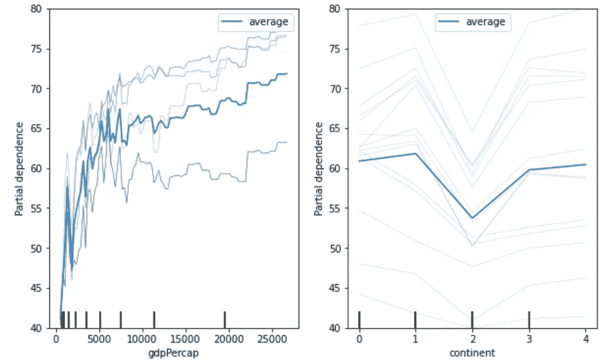

# Scikit 中的 10 个最佳新功能-了解 0.24🔎

> 原文：<https://towardsdatascience.com/the-10-best-new-features-in-scikit-learn-0-24-f45e49b6741b?source=collection_archive---------23----------------------->

## 主要变化的备忘单

sci kit-learn 0 . 24 . 0 版包含了机器学习的新功能。它刚好在新年的时候到达。来看看亮点吧！☃️


资料来源:pixabay.com

# **1。快速选择超参数的方法**

`[HalvingGridSearchCV](https://scikit-learn.org/stable/modules/generated/sklearn.model_selection.HalvingRandomSearchCV.html#sklearn.model_selection.HalvingRandomSearchCV)`和`[HalvingRandomSearchCV](https://scikit-learn.org/stable/modules/generated/sklearn.model_selection.HalvingRandomSearchCV.html)`加入了`GridSearchCV`和`RandomizedSearchCV`的行列，成为超参数调优家族中资源消耗较少的成员。

新的类使用锦标赛方法选择最佳的超参数。


锦标赛。资料来源:pixabay.com

他们在一个观察子集上训练超参数的组合。得分最高的超参数组合将进入下一轮，在下一轮中，它们将在大量观察中得分。游戏一直持续到最后一轮。

确定传递给`HalvingGridSearchCV`或`HalvingRandomSearchCV`的超参数需要一些计算。或者使用合理的默认值。😀点击阅读更多[。](https://scikit-learn.org/stable/modules/grid_search.html#successive-halving-user-guide)

`HalvingGridSearchCV`使用所有超参数组合。`RandomGridSearchCV`使用随机子集，就像`RandomizedSearchCV`一样。

## **建议**

*   当您没有太多的超参数需要调整，并且您的管道不需要很长时间运行时，请使用`GridSearchCV`。
*   对于较大的搜索空间和慢速训练模型，使用`HalvingGridSearchCV`。
*   对于具有慢速训练模型的非常大的搜索空间，使用`HalvingRandomSearchCV`。

我不知道我是否还能看到`RandomizedSearchCV`的用例。你知道吗？如果是这样的话，请通过 Twitter 上的 discdiver 或评论让我知道。

`HalvingGridSearchCV`可能是许多情况下“恰到好处”的金发女孩解决方案。


三只熊。资料来源:pixabay.com

这些类必须在使用前从实验模块导入。

```
from sklearn.experimental import enable_halving_search_cv
from sklearn.model_selection import HalvingRandomSearchCV 
from sklearn.model_selection import HalvingGridSearchCV
```

这些类被命名为`RandomizedSearchCV`和`HalvingRandomSearchCV` *有点令人困惑。*如果*随机*和*随机*术语一致就好了。实验性的 API 可能会在没有警告的情况下改变，所以这个可能会。😀

# 2.冰原

Scikit-learn 版本 0.23 引入了部分依赖图(PDP)，这对于显示平均特性重要性非常有用。版本 0.24 提供了显示单个条件期望(ICE)图的选项。


冰，冰来源:pixabay.com

像 PDP 一样，ICE 图显示了目标和输入特征之间的相关性。不同之处在于，冰图显示了每个样本的预测对某个特征的依赖性，每个样本一条线。一个特性的 ICE 图的平均值就是 PDP。

通过将关键字参数`kind='individual'`传递给`plot_partial_dependence`函数来查看 ICE 图。看偏依赖剧情和冰剧情过关`kind='both'`。



来自 scikit-learn gapminder 数据集的 PDP 和 ICE 图。请注意，洲应该打印为条形图。

在撰写本文时，`plot_partial_dependence`的使用有点棘手。scikit-learn 团队正在[研究从数据帧中推断特征名称的](https://github.com/scikit-learn/scikit-learn/issues/14969)，通过绘制条形图支持分类列，以及使用编码分类特征的列转换器处理管道的能力。ICE 图还不能居中，但是[拉动请求](https://github.com/scikit-learn/scikit-learn/pull/18310)改变打开的状态。最后，在讨论中的[是一个参数，可以很容易地用 ice 图改变 PDP 曲线的颜色。改进正在进行中！🎉](https://github.com/scikit-learn/scikit-learn/issues/18976)

要了解更多关于 ICE plots 和其他可解释的机器学习技术，请查看 Christoph Molnar 的优秀电子书<https://christophm.github.io/interpretable-ml-book/>**。🚀**

# **3.直方图提升改进**

****

**加速。资料来源:pixabay.com**

**受 [LightGBM](https://lightgbm.readthedocs.io/en/latest/) 启发的`HistGradientBoostingRegressor`和`HistGradientBoostingClassifier`现在有了一个为分类特性提供支持的`categorical_features`参数。因为基于直方图的增强器会对连续要素进行分类，所以这是一个不错的选择。与一次性编码相比，它节省了训练时间，并且性能优于其他编码选项。参见[文档](https://scikit-learn.org/stable/auto_examples/release_highlights/plot_release_highlights_0_24_0.html#native-support-for-categorical-features-in-histgradientboosting-estimators)中的对比。**

**这些模型仍然需要输入要素为数字。如果您有不属于数字数据类型的分类特征，您可以使用`OrdinalEncoder`将它们编码为数字。然后通过传递一个布尔掩码或一个整数数组来告诉 booster 哪些特性是分类的。例如:**

```
**model = HistGradientBoostingRegressor(
   categorical_features=[True, False]
)**
```

**直方图增强算法在 0.24 版本中获得了速度和内存使用方面的改进。`HistGradientBoostingClassifier`的[基准飞度](https://scikit-learn.org/scikit-learn-benchmarks/#summarylist?sort=2&dir=asc)在 2020 年末下降了近 75%！**

**此外，请注意基于直方图的估计器支持缺失值，因此如果您不想估算，则无需估算。😀**

**这些估算器仍然是实验性的，所以启用需要从`sklearn.experimental` **导入它们。☝️****

# **4.特征选择的正向选择**

**选择特征子集时，`[SequentialFeatureSelector](https://scikit-learn.org/stable/modules/generated/sklearn.feature_selection.SequentialFeatureSelector.html#sklearn.feature_selection.SequentialFeatureSelector)` 从无特征开始，首先添加最有价值的特征，然后添加第二有价值的特征，依此类推，直到到达您选择的停止点。这就是所谓的向前选择。**

**`SequentialFeatureSelector`不需要它用来暴露`coef_`或`feature_importances_`属性的底层模型，不像特征选择转换器`[RFE](https://scikit-learn.org/stable/modules/generated/sklearn.feature_selection.RFE.html#sklearn.feature_selection.RFE)`和`[SelectFromModel](https://scikit-learn.org/stable/modules/generated/sklearn.feature_selection.SelectFromModel.html#sklearn.feature_selection.SelectFromModel)`。然而，`SequentialFeatureSelector`可能比这两个选项慢，因为它使用交叉验证来评估模型。**

# **5.多项式特征展开的快速逼近**

**`PolynomialFeatures`转换器为你的特征创建交互项和高阶多项式。然而，它会使模型训练慢得令人痛苦。**

**来自`kernel_approximation`名称空间的新`PolynomialCountSketch`内核近似函数提供了一种更快的方法来训练具有预测优势的线性模型，该模型可以使用`PolynomialFeatures`进行近似。或者，您可以将`PolynomialCountSketch`视为支持向量机的更快版本，具有径向基函数内核，只是预测性能较低。深入研究[文档](https://scikit-learn.org/stable/auto_examples/kernel_approximation/plot_scalable_poly_kernels.html#sphx-glr-auto-examples-kernel-approximation-plot-scalable-poly-kernels-py)。**

****

**素描来源:pixabay.com**

**`PolynomialFeatures`返回平方特征和相互作用项(如果需要，还有高阶多项式)。相反，`PolynomialCountSketch`返回您在`n_components`参数中指定的特征数量。默认值为 100，大约是 docstring 中建议的原始功能数的 10 倍。这些特征表示多项式特征展开近似值，不能直接解释。**

**一句话:如果你有大量的观察数据，`PolynomialCountSketch`相对于`PolynomialFeatures`可以为你节省大量的训练时间，但代价是可解释性和一点点预测能力。☝️**

# **6.半监督**学习的自训练分类器****

**`[SelfTrainingClassifier](https://scikit-learn.org/stable/modules/generated/sklearn.semi_supervised.SelfTrainingClassifier.html#sklearn.semi_supervised.SelfTrainingClassifier)`是一个新的半监督学习元分类器。它允许任何可以预测样本属于目标类的概率的监督分类器充当可以从未标记的观察中学习的半监督分类器。**

**“未标记数据在与少量标记数据结合使用时，可以在学习准确性方面产生相当大的提高。”— [维基百科](https://en.wikipedia.org/wiki/Semi-supervised_learning)**

**注意 *y_train* 中未标记的值必须为 *-1* 。一个空值不能切断它。☝️**

# **7.平均绝对百分比误差(MAPE)**

**添加了`[mean_absolute_percentage_error](https://scikit-learn.org/stable/modules/generated/sklearn.metrics.mean_absolute_percentage_error.html#sklearn.metrics.mean_absolute_percentage_error)`函数作为回归问题评分标准。MAPE 很好，因为像 R 平方一样，它提供了不同回归问题的一些比较值。**

****

**猿，不是 MAPE 来源:pixabay.com**

**你可以用`np.mean(np.abs((y_test — preds)/y_test))`手工计算 MAPE，但是有这个便利功能还是不错的。🙂**

# **8.`**OneHotEncoder**`支持缺失值**

**`OneHotEncoder` 的 scikit-learn 实现现在可以处理丢失的值。它把它们当作自己的一个类别。如果在 *X_train* 中有一个空值，那么在转换后的列中将会有一个缺失值的列。🎉**

****

**热点来源:pixabay.com**

# **9.OrdinalEncoder 可以处理测试集中的新值**

**你的测试集中有没有训练集中没有的类别？如果是这样，使用带有新的`unknown_value`参数的`handle_unknown='use_encoded_value'`关键字参数。您可以将`unknown_value`参数设置为没有出现在顺序编码值中的整数或者`np.nan`。这使得`OrdinalEncoder`更加可用！🚀**

# **10.递归特征消除(RFE)接受保留一部分特征**

**向`n_features_to_select`传递一个介于 0 和 1 之间的浮点数，以控制要选择的特征的百分比。这一增加使得以编程方式消除部分特性变得更加容易。**

# **奖励:文档改进**

**这个 scikit-learn 更新包含了很多很棒的[新文档](https://scikit-learn.org/stable/auto_examples/release_highlights/plot_release_highlights_0_24_0.html#new-documentation-improvements)，包括方便的用户指南。👍**

**关于所有这些变化和更多的细节，请参见[变更日志](https://scikit-learn.org/stable/whats_new/v0.24.html#changes-0-24)。**

# **升级**

**你是怎么得到这些好东西的？🤔**

**要升级，如果您的虚拟环境中安装了 scikit-learn 的 pypi 版本，请执行`pip install -U scikit-learn`。**

**否则，如果你正在使用 conda 并且目前已经安装了 conda-forge 版本，请使用`conda install -c conda-forge scikit-learn`。**

**在撰写本文时，默认的 conda 通道的版本是 0.23.2，所以我建议不要使用它。你可能想从 conda 频道卸载这个版本，如果你有的话。**

**或者，你可以创建一个新的 conda 环境(见我的指南[这里](/13-conda-commands-for-data-scientists-e443d275eb89))或者创建一些其他的虚拟环境。**

# **包装**

**Scikit-learn 是使用 Python 的数据科学从业者不可或缺的工具。非常感谢所有维护和贡献它的人们！**

**下一个预定的 scikit-learn 版本是 1.0！🎉跟我来，确保你不会错过真相。**

**我写关于数据科学、 [Python](https://memorablepython.com/) 、 [SQL](https://memorablesql.com/) 和其他技术主题的文章。如果你对这些感兴趣，请注册我的[邮件列表，那里有很棒的数据科学资源](https://dataawesome.com/)，点击这里阅读更多帮助你提高技能的内容。😀**

****

**资料来源:pixabay.com**

**快乐 scikit-学习！⭐️**