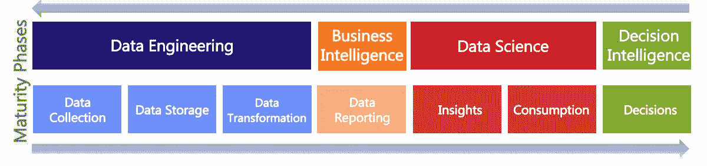

# 你需要知道的 26 个最重要的数据术语

> 原文：<https://towardsdatascience.com/the-26-most-important-data-terms-you-need-to-know-38f939b62ebb?source=collection_archive---------3----------------------->

布雷特·乔丹在 [Unsplash](https://unsplash.com/?utm_source=unsplash&utm_medium=referral&utm_content=creditCopyText) 上的照片

## *用简单英语揭秘最常用的*数据科学*行话*

你如何定义*‘数据科学*’?*大数据*、 *AI* ，或者*数据文化*怎么样？这些只是数据语言中常见的许多术语中的几个。你可能想知道当人们使用这些很酷的流行语时，他们真正的意思是什么。

正如数据成为主流，术语的密集词汇也成为主流。理解和认同这些数据术语的定义是一个真正的挑战。也许，这是一个比从数据中获取商业价值更难的障碍！

本文将揭开数据空间中 26 个最常用术语的神秘面纱。

我们将这些短语分为四大类:**数据工程、商业智能、数据科学和决策智能**。这些与组织通常从数据中获取[商业价值所遵循的逻辑顺序相同。](https://blog.gramener.com/data-maturity-model-stages/)

帮助你从数据中获取价值的 4 个原则，[格拉米纳](https://blog.gramener.com/big-data-terms-glossary/)

# 大数据术语表

# 一.数据工程术语

**1。数据工程**是一门专注于诸如数据源识别、数据收集、管理和存储等方面的学科。这是所有其他帮助从数据中获取价值的学科的先驱。

**2。数据治理是一个框架和一组实践，帮助组织中的所有利益相关者识别和满足他们的信息需求。(参考:[数据治理研究所](https://datagovernance.com/))**

**3。数据仓库是一个中央信息库，可用于分析和做出更明智的决策。(参考:[亚马逊](https://aws.amazon.com/data-warehouse/))**

**4。Data Fabric** 是一种架构和一组数据服务，可提供一致的功能，集成跨云和内部的数据管理，以加速数字化转型。Gartner 表示，数据结构可以在分布式数据环境中实现无摩擦的数据访问和共享。(参考: [NetApp](https://www.netapp.com/data-fabric/what-is-data-fabric/)) ， [Gartner](https://www.gartner.com/doc/3990236) )

# 二。商业智能术语

**5。商业智能**是分析和转换数据以提取有价值的商业见解来制定决策的学科。如今，BI 通常用于描述性分析和报告。

**6。数据挖掘**是在大型数据集中提取和发现模式的过程，涉及机器学习、统计学和数据库系统的交叉方法。这个词是在 1990 年左右创造的，并很快成为一个流行语。(引用:[维基百科](https://en.wikipedia.org/wiki/Data_mining))

**7。MIS 报告**(管理信息系统)是提供基本信息以运行日常业务活动和监控组织进展的过程。这通常指描述性和操作性报告。

# 三。数据科学相关术语

**8。数据科学**是应用高级分析技术从数据中提取有价值的信息以进行业务决策和战略规划的学科。它汇集了数据挖掘、统计学、数学、机器学习、数据可视化和软件编程等领域。

**9。人工智能(AI)** 指机器模仿人类思维能力的能力，例如从例子和经验中学习、识别物体、理解和响应语言、做出决策和解决问题。(编号: [IBM](https://www.ibm.com/cloud/learn/what-is-artificial-intelligence) )

从水下视频中检测鲑鱼，来源:[案例研究](https://youtu.be/8dD1FMDePTo)

10。机器学习是人工智能(AI)学科的一个子集，它为系统提供了自动学习和根据经验改进的能力，而无需显式编程。(参考:[专家艾](https://www.expert.ai/blog/machine-learning-definition/))

**11。深度学习**是一种属于机器学习学科的技术。它基于受人脑结构启发的人工神经网络。它从大量数据中学习，尤其擅长从文本和图像等非结构化数据中发现模式。

</decoding-deep-learning-a-big-lie-or-the-next-big-thing-b924298f26d4>  

**12。增强智能**指的是以人为中心的合作伙伴关系，将人和人工智能结合在一起，以增强认知性能，包括学习、决策和新体验。(参考文献:[高德纳](https://www.gartner.com/en/information-technology/glossary/augmented-intelligence)，[福布斯](https://www.forbes.com/sites/ganeskesari/2020/10/19/go-beyond-artificial-intelligence-why-your-business-needs-augmented-intelligence/))

**13。集体智慧是指一个群体执行各种任务和解决各种问题的综合能力。企业可以通过协作、集体努力和许多个人在共识决策中的竞争来实现这一点。(引用:[维基百科](https://en.wikipedia.org/wiki/Collective_intelligence))**

<https://www.forbes.com/sites/ganeskesari/2021/04/28/collective-intelligence-is-about-to-disrupt-your-strategy-are-you-ready/>  

**14。描述性分析**是对数据或内容的检查，以回答问题“发生了什么？”它的典型特征是传统的商业智能(BI)和数据可视化。(参考:[高德纳公司](https://www.gartner.com/en/glossary))

**15。诊断分析**是一种高级分析形式，它检查数据以回答“为什么会发生”的问题你可以借助数据挖掘、统计学和机器学习等技术来实现。(参考:[高德纳](https://www.gartner.com/en/glossary))

16。预测分析是一种高级分析形式，它检查数据以回答“可能会发生什么”的问题你可以在机器学习和人工智能(AI)等技术的帮助下实现。(参考:[高德纳公司](https://www.gartner.com/en/glossary))

**17。信息设计**是以一种促进对信息的有效理解的方式呈现信息的实践。(参考:[维基百科](https://en.wikipedia.org/wiki/Information_design))

**18。数据可视化**属于信息设计领域。它是指使用图表、图形和地图等视觉元素对信息进行图形化表示。这样做的目的是使决策能够恰当地表达洞察力。

<https://blog.gramener.com/types-of-data-visualization-for-data-stories/>  

19。数据消费是指以有助于理解和行动的形式呈现见解。这通常是通过采用分析技术来识别见解和数据可视化技术来呈现见解来实现的。

**20。数据叙事**是围绕数据及其伴随的可视化构建叙事的实践，有助于以强有力和引人注目的方式传达上下文和数据的含义。(编号: [TDWI](https://tdwi.org/portals/what-is-data-storytelling-definition.aspx#:~:text=Data%20storytelling%20is%20the%20practice,a%20powerful%20and%20compelling%20fashion.) )

</how-ai-can-transform-you-into-a-master-storyteller-a6e8a3c55dcb>  

# 四。决策智能术语

**21。决策智能**是将信息大规模转化为组织决策的学科。组织和个人可以通过将管理科学和社会科学学科结合起来，在业务问题的背景下应用数据科学来实现这一目标。(参考:[企业家项目](https://enterprisersproject.com/article/2020/11/decision-intelligence-key-better-business-decisions))

**22。管理科学**是对人类组织中解决问题和决策的广泛的跨学科研究。它与管理学、经济学、商业和管理咨询等领域有着紧密的联系。(参考:[维基百科](https://en.wikipedia.org/wiki/Management_science))

**23。社会科学是科学的一个分支，致力于研究社会和社会中个人之间的关系。这一领域在数据领域越来越重要，因为它有助于深入了解人们的行为。(参考:[维基百科](https://en.wikipedia.org/wiki/Social_science))**

</data-science-wont-improve-your-business-decisions-here-s-what-will-c2745e67c350>  

**24。决策支持系统(DSS)** 是支持组织决策活动的信息系统。这个领域在 20 世纪 70 年代有很多研究，在接下来的几十年里发展迅速。(引用:[维基百科](https://en.wikipedia.org/wiki/Decision_support_system))

**25。数据素养**是在上下文中读写和交流数据的能力。它包括对数据源、分析技术、业务应用和最终价值的理解。(参考:[高德纳](https://www.gartner.com/en/information-technology/glossary/data-literacy))

**26。数据文化**指的是一个组织内大多数人在数据相关问题上共享的价值观、行为和规范。广义而言，它指的是一个组织利用数据做出明智决策的能力。(引用:[维基百科](https://en.wikipedia.org/wiki/Data_culture))

如何建立数据驱动的决策文化， [Gramener 白板系列](https://bit.ly/datasciencewhiteboards)

# 总结:掌握语义知识树

与任何大数据术语一样，请记住，准确的定义没有理解它的广泛含义或如何从应用程序上下文中解释它重要。

如你所见，几个学科需要联合起来从数据中获取价值。例如，它需要机器学习等技术领域，管理科学等组织学科，以及社会科学等艺术学科。

一个人应该如何掌握如此不同的专业领域？

我们可以从 Elon Musk 那里得到启发，他说将知识视为语义树是很重要的。确保你理解了基本原则，这就好比是树干。然后你掌握不同领域的专业知识，你可以把它们等同于分支。

最后，您必须了解下一级的概念和应用程序，它们就像树叶一样。否则，树叶就没有东西可以依附了。

*本文原载于 Gramener* [*博客*](https://blog.gramener.com/big-data-terms-glossary/) *。*