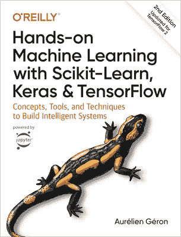
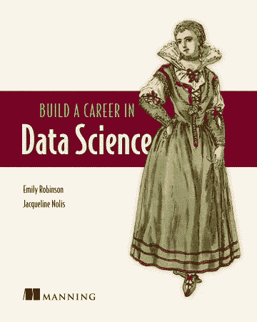

# 绝对初学者必读的 3 本数据科学书籍

> 原文：<https://towardsdatascience.com/the-3-must-read-data-science-books-for-absolute-beginners-9391d05ab3f5?source=collection_archive---------2----------------------->

## “我被所有可用的资源淹没了；我该怎么办？”

Freepik 上的宏向量图像

“有的是资源，我很困惑自己走的路对不对。你能帮我吗？”她忧心忡忡地告知。

当我从我的一位学员那里听到这些话时，事情发生了急转直下，这位学员到目前为止表现得非常好。我不敢相信连她都怀疑自己。

给你一个背景，我是一名高级数据科学家，在空闲时间，我指导数据爱好者进入数据科学领域。我期待着这些互动，因为它们让我了解初学者面临的问题以及我如何才能更好地提供帮助。

我一直在写关于[的知识供你](/5-lessons-i-wish-id-known-when-i-started-learning-data-science-1a90a4d2a7e7)复制，关于[的错误供你](/3-beginner-mistakes-ive-made-in-my-data-science-career-a177f1cf751b)避免，关于[的广泛指南供你](/this-21-step-guide-will-help-implement-your-machine-learning-project-idea-ef5c085a9620)遵循——但是我错过了关注数据科学入门的最简单的元素。

现在是教育工作者和像我这样的导师承认这一点的时候了——我们的工作是让它变得简单和容易。减少信息过载并帮助您采取行动是我们的职责。

如果你不知所措，最终过度思考，什么都不做，52 周的路线图，25 份资源表，7 份备忘单，101 页的 pdf 文档能有什么用？

有鉴于此，我正在简化这个过程，以便让你开始学习数据科学和机器学习。在线课程和书籍才是真正的基石。

在前面的中，我已经介绍了必读在线课程的[简化版，在本文中，我将向您介绍在数据科学领域取得进步所必须阅读和学习的书籍。](/the-4-must-learn-data-science-courses-for-absolute-beginners-9268fd11054c)

最后，我将揭示数据科学中不可否认的成功关键。(剧透:你可能已经知道了，但我想为你重复一遍。)

我们开始吧，好吗？

# 1.乔尔·格鲁什的《从零开始的数据科学》

来源:奥雷利([图书链接](https://amzn.to/3HmUF1v))

我很高兴在我年轻的时候找到了这本书。我不认为其他任何人会像 Joel 那样以最简单的方式向您介绍数据科学的所有基本步骤。

Joel 采用了一种有趣的方法，在一个名为 DataSciencester 的假想社交网络中，你被聘为首席数据科学家。在整本书中，他会帮你解决工作中遇到的所有问题。我喜欢这种非传统的方法。我能说什么呢？

这本书有你作为数据科学家需要的所有概念，从编程到统计到概率到大数据，并附有代码示例。如果你是一个数据科学家初学者，这是你需要拥有和阅读的书。

我强烈推荐你**把这本书** **作为你早期的 l** [**赚钱指南。**](https://amzn.to/3HmUF1v)

# 2.使用 Scikit-Learn、Keras 和 TensorFlow 进行机器学习

来源:奥雷利([图书链接](https://amzn.to/3XM4BqJ))

一旦你掌握了数据科学的基础知识，你最受益的第二本书是奥雷连恩的杰作。是最受欢迎的机器学习书籍，大家推荐。它没有让我失望。

过去两年我一直在读这本书，但至今仍未读完。不，不是因为我读得慢。我在日常工作中直接使用这本书的内容。

在做项目时，你不可避免地会听到像随机森林和支持向量机这样的算法。您可以从 scikit 中找到代码片段——也可以学习。与其盲目地将它们复制到你的项目中，不如打开这本书，翻到解释你将要使用的算法的那一章。

这本书涵盖了每个机器学习算法背后的理论和用法。你现在会感到更加自信，因为你了解了你的模型背后的一切。甚至还有像自动编码器、强化学习等高级内容。

不要急着看完这本书；**把它作为你将要从事的每个项目的参考资料。**

# 3.Emily Robinson 和 Jacqueline Nolis 撰写的《在数据科学领域开创职业生涯》

来源:曼宁([图书链接](https://amzn.to/3kBZ8o8))

这本书与我们之前讨论的其他两本书有很大不同，主要关注与学习数据科学相关的技术内容。这本书于 2020 年出版，教你数据科学产业如何运作。这就是为什么它是必读的。

Emily 和 Jacqueline 带我们经历了一次旅程，从决定数据科学职业是否适合我们开始，到市场上不同类型的数据科学工作，以及获得工作的端到端流程。

例如，[60%法则可以帮助你决定哪些工作你符合](/the-ideal-data-scientist-doesnt-exist-and-hiring-managers-know-this-d507723a9804)的条件，应该申请哪些工作。没错，这本书涵盖了成为数据科学家所需的一切。

我最喜欢的是它不会就此停止。对于像我这样已经找到工作并在数据科学岗位上成长的人来说，有很多建议。

到目前为止，我已经根据我在数据科学旅程中的水平重读了这本书多次。我可以告诉你，作者为了写这本书，与多个领域和公司的专家进行了广泛的研究。 [**把这本书作为你的职业指南。**](https://amzn.to/3kBZ8o8)

所以，就这样了。你知道你需要的书。

还有最后一个关键步骤，我将为您详细介绍。

# 数据科学成功的不可否认的关键是你已经知道的东西

花点时间想想这个。这是什么？

它不是讨论 Python 与 R 的争论，也不是在 YouTube 上狂看数据科学视频，或者一个接一个地报名参加课程。

关键是要持之以恒地采取行动。

不，老实说，想想吧。肯定还有其他关于数据科学的好书和课程，你不知所措的原因是这些选项带给你的信息过载。

你会花更多的时间*思考*和*计划*获取技能，还是选择我推荐的其中一个然后开始？

你知道答案；我只是重复给你听。每当有人试图迷惑你时，请记住这一点:在数据科学中有多条成功的道路，你选择的道路应该足够简单，以帮助你采取行动。

这个肯定会。

所以让我们从今天开始。如果你遇到困难，请随时联系我，我非常乐意帮助你。

*作为披露的提示，本文可能会有一些附属链接来分享我使用过的最好的资源，而不会给你带来额外的费用。感谢您的支持！*

*要获得更多关于进入数据科学、真实体验和学习的有用见解，请考虑* [***加入我的电子邮件好友私人列表*** *。*](https://friends.arunnthevapalan.com/)

*如果你看重这样的文章，想支持我这个作家，可以考虑* [*报名成为中等会员*](https://arunnthevapalan.medium.com/membership) *。每月 5 美元，你可以无限制地阅读媒体上的故事。*

 [## 通过我的推荐链接加入 Medium—Arunn the vapalan

### 作为一个媒体会员，你的会员费的一部分会给你阅读的作家，你可以完全接触到每一个故事…

arunnthevapalan.medium.com](https://arunnthevapalan.medium.com/membership)