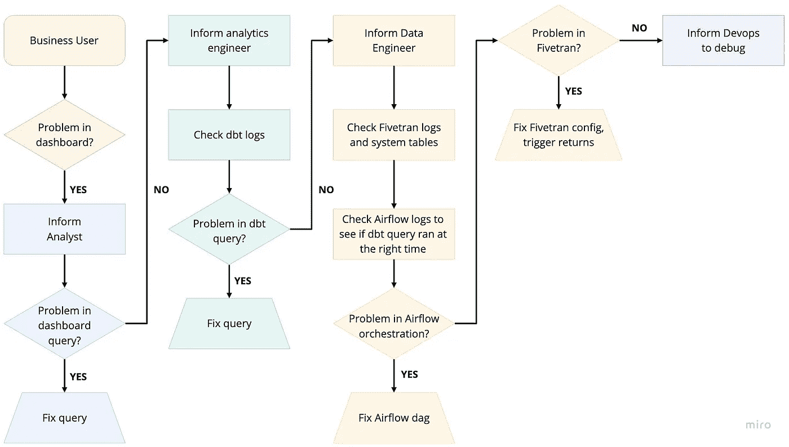
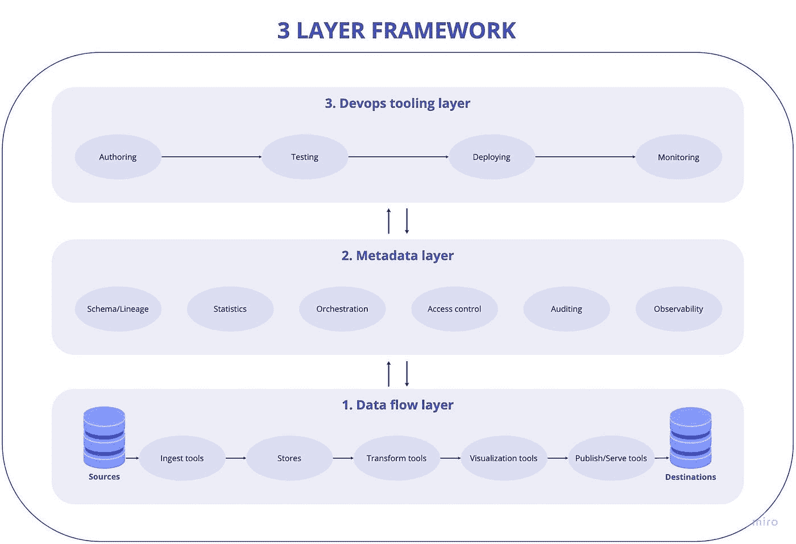
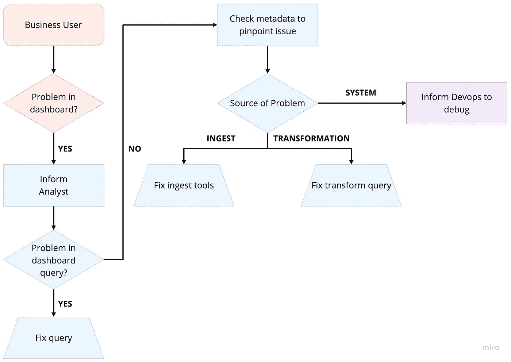

# 构建现代数据堆栈时要记住的 3 件事

> 原文：<https://towardsdatascience.com/the-3-things-to-keep-in-mind-while-building-the-modern-data-stack-5d076743b33a?source=collection_archive---------10----------------------->

## 构建数据堆栈令人困惑。不一定非要这样。

**简介**

您如何看待您的数据堆栈？

如果您的工作需要分析数据，或者支持分析您的数据的团队，您可能会发现自己在某个时候从事数据管道工作，并随着工作的进行了解它们的复杂性。虽然数据管道比 20 年前超前了好几光年，但数据团队今天面临的日常挑战基本相同。我们是如何走了这么远，却还停留在原地？

我们已经看到了为促进现代数据堆栈所做的大量深思熟虑的工作。[安德森·霍洛维茨关于新兴建筑的开创性思想文章](https://a16z.com/2020/10/15/the-emerging-architectures-for-modern-data-infrastructure/)；[马特图尔克的穷举数据景观](https://mattturck.com/data2020/)；Tristan Handy 的[现代数据堆栈:过去、现在和未来](https://blog.getdbt.com/future-of-the-modern-data-stack/)都是当前数据从业者的必读之作。(特里斯坦的[配套视频](https://www.youtube.com/watch?v=1Zj8gTLdf5s)讲述了数据基础设施的未来，也是必看的。)

然而，根据我们在过去 5 年中与互联网公司的大规模数据堆栈合作以及采访数百家公司的数据团队的经验，我们仍然感觉现代数据堆栈的复杂性并没有以最明显的方式真正降低，因此它们被认为是不可避免的。例如，尽管在简化数据堆栈方面取得了巨大的进步，尤其是在过去的五年中，数据团队构建和调试数据管道的认知负荷仍然大致相同。现在有更多功能重叠的工具可供选择。工具选择的真正含义并不明显，直到把它们放在一起并使用一段时间之后。没有简单、易于理解的框架可以帮助团队理解如何为他们独特的需求构建最佳的数据堆栈。

本文的目标是提出一个简化的框架并开始对话。我们不会试图提供所有工具的综合术语表以及如何适应它们(为此，我们强烈建议看一看 [Matt Turck 的 landscape pdf](https://mattturck.com/wp-content/uploads/2020/09/2020-Data-and-AI-Landscape-Matt-Turck-at-FirstMark-v1.pdf) )。但是我们将为您提供一个概念模型，帮助您在选择工具时考虑其中的含义。

我们将提供一个简化的框架，说明您应该如何考虑构建您的数据堆栈。更重要的是，我们希望不要单纯从目前可用或流行的工具的角度来考虑您的数据堆栈——这会让您受到工具及其发展方式的支配——您应该重新控制自己如何考虑您的数据堆栈，并插入满足您需求所需的工具。这并不意味着您不必做集成工具的艰苦工作，但是，至少，它应该帮助您合理地解释为什么您要做这项艰苦的工作！

我们在 Datacoral 的团队积极使用这种模式来构建我们的产品，并建议我们的客户和合作伙伴选择合适的工具来满足他们的需求。

通过分享这个模型，我们希望为数据团队提供一种更好的方式来理解他们如何将不同的工具融入他们的数据堆栈。最终，我们希望开始对话，以实现这个概念模型来构建一个更好、更具可伸缩性的现代数据堆栈。

**谁应该关心？**

无论您是 A 轮公司的首席技术官，还是刚刚开始重视数据(即，您没有在生产数据库上运行分析！)或者是一家老牌公司的数据主管，担心数据治理和数据管理成本，您可能希望升级您的数据堆栈，使数据变得更加复杂，同时还能:

*   更具可扩展性
*   更易于管理
*   比较便宜的

最重要的是，你们的目标很可能是一致的。构建一个系统来集成、转换、加载和分析您的数据对于您的成功至关重要。为了满足您的需求，市场上出现了数百种工具和技术来帮助公司移动、存储、操作、管理和治理他们的数据。这包括:

*   来自公共云的 PaaS 工具
*   开源工具
*   新的云原生 SaaS 工具
*   从 20 世纪 90 年代末到 21 世纪初，在职人员的数量很大，但正在减少

此外，数据堆栈的每个方面都有几个选项，如数据集成、查询引擎、ETL、数据治理、机器学习和数据可视化。

公司在升级他们的数据堆栈时面临的最大问题是理解选择什么样的工具组合。可供选择的工具太多了，而且不清楚一个工具的功能在哪里结束，另一个工具的功能在哪里开始。再加上不断出现的新工具，你永远不知道自己是否做出了正确的选择。但有一点是清楚的，无论你做出什么样的选择，你都必须花时间整合它们，解决所有不可避免的问题。此外，您的选择还会告知(或约束)您应该如何操作您的堆栈——基本上是决定您的数据堆栈的人员、流程和技术三位一体。

因为很难替换工具，所以问题是，“在接下来的两到三年里，什么样的分析堆栈能够很好地服务于我的组织？”

我们建议这样的栈应该是“元数据优先和元数据驱动的”一旦我们将元数据确立为不仅仅是信息性的，而且是整个数据堆栈的主要驱动力，我们最终会得到一个简单的三层框架，元数据层位于中间:

*   数据流层
*   元数据层
*   DevOps 工具层

有了这些层，我们可以遵循[关注点分离的原则，](https://en.wikipedia.org/wiki/Separation_of_concerns)阐明我们如何考虑数据堆栈的每个部分，并理解不同的工具是如何嵌入的。

使用这样的框架，我们发现，当新的工具和系统变得可用或基于规模和复杂性需求变得必要时，很容易替换或适应新的工具和系统。

**当前比赛状态**

首先，让我们看看什么是最先进的现代数据堆栈。(我们提到的任何特定工具都只是为了说明一个现实的堆栈，以表明我们在端到端架构中使用不同工具的观点，而不是对特定工具进行评论。实际上，我们很钦佩这些工具提供的功能，并欣赏它们如何极大地改善了公司处理数据的方式。)

对于分析，Fivetran、dbt、Airflow 和 Looker on Snowflake 的组合目前非常流行(这篇文章很好地展示了其他[常见设置](/some-common-data-science-stacks-7525477c0dd0))。虽然建立这样的数据堆栈比以前容易得多，但数据团队仍然面临着日常的挑战。例如，让我们以虚构的为医疗实践提供 SaaS 计费软件的 Acme 公司为例。他们的客户成功领导者 Alice 使用了一个 Looker 仪表板，该仪表板总结了他们所有的客户活动，包括哪些因素导致客户对产品不满意。

这款外形仪表盘是由他们的数据分析师 Bob 制作的，他是一名外形专家。他在 LookML 中构建了一些模型，但主要是向 dbt 发展，因为这样他可以更好地控制数据仓库 Snowflake 中直接可用的数据模型。

他们的数据工程师 Raj 建立了管道，使用 Fivetran 将 Salesforce、Zendesk 和 MySQL 产品数据库中的数据提取到雪花中。他还在 Airflow 中编写了几个小脚本来插入 Fivetran 没有提供的服务。他是一名有抱负的数据分析师，希望推动整个组织使用 dbt。他帮助 Bob 利用 dbt 将源表中的原始数据从 Fivetran 转换为派生表中的汇总数据。他通过气流精心策划了 dbt。这种设置在大多数时候都运行良好。

现在，Alice 注意到 Looker 仪表盘中的流失率与她对业务的理解不符，并认为数据有缺陷。接下来会发生什么？

在我们对数百家公司的采访中，我们发现了以下典型的工作流程来调试这一缺陷:

*图片由 Datacoral 提供*

1.  Alice 试图通过点击 Looker 仪表盘来深入了解，然后向构建仪表盘的数据分析师 Bob 提出问题。
2.  Bob 验证报告的查询是否准确，然后将接力棒交给负责数据管道的工程师(数据工程师、分析工程师或兼职数据工程师)Raj。
3.  Raj 然后查看从下游到上游任务的管道的每个部分:

*   标识报表中使用的仓库中的所有表。
*   找出这些表格的所有来源。有时它们是通过多重转换(通过 dbt)计算的**派生表**；其他时候，它们是直接来自摄取管道的**源表**(通过 Fivetran)。
*   在 dbt 控制台中导航到每个派生表的每个日志，查看是否有任何问题。当转换后的表被更新时，Raj 必须记下时间戳。
*   检查 Fivetran 的控制台和系统表中的日志，这些日志详细说明了每个表是如何被修改的。Raj 必须密切注意源表更新时的时间戳。然后，他必须将来自 Fivetran 的上下文与来自 dbt 的上下文缝合在一起，以获得数据流的全貌。在大多数情况下，他发现在 Fivetran 跨 Salesforce、Zendesk 和 MySQL 的不同连接器更新所有源表之前，运行 dbt 中的转换会出现数据问题。所以他必须确保当派生表被更新时 dbt 的时间戳运行。他必须登录到 Fivetran 控制台或查看雪花中的 Fivetran 系统表，以确定数据集成是否出了问题。如果 Fivetran 日志中没有任何问题，他仍然不能确定，因为数据集成工具没有提供数据质量保证。
*   最后，Raj 必须查看数据源系统中的潜在问题。如果 DevOps 不能调试这个问题，并且团队中没有人能够找到问题的根源，那么对于分析师 Bob 来说，这突然变成了一个高优先级的行动项目。在这种情况下，Bob 必须从头开始构建管道，以便与现有数据进行比较，从而确保 Alice 的需求能够得到支持。

对于真正复杂的问题，整个工作需要几个小时、几天，有时甚至几周。

现在想象一下，有另一个团队想要在相同的数据上建立机器学习模型。最重要的是，Acme 的 CISO 有一项任务，根据他们是否拥有 PII，对所有数据进行严格的访问控制。随着新系统的出现，您可以看到调试问题的复杂性呈指数级增长。Acme 最终得到了一个看起来像图[的架构，其中每个系统都必须与其他系统进行对话。不同系统之间存在阻抗不匹配，导致集成变得困难和难以管理。](https://a16z.com/2020/10/15/the-emerging-architectures-for-modern-data-infrastructure/#section--8)

我们已经看到了参考架构图，如 Andreessen Horowitz 的思想文章中的“[统一数据基础架构](https://a16z.com/2020/10/15/the-emerging-architectures-for-modern-data-infrastructure/)”，它试图将更多的工具和功能整合到他们所谓的新兴数据架构中。这些尝试显示了考虑整个数据堆栈所涉及的复杂性。他们似乎将正交的概念投射到一个更线性的数据流模型中，一些离群值并不真正适合该模型。在不同的盒子中有重叠功能的工具，加上多个集成点，导致几乎每对盒子之间都有箭头。这使得很难弄清楚现在和以后需要哪个工具子集，以及这些选择之间的权衡。此外，集成特定工具组合的复杂性留给了公司作为练习！数据和数据堆栈中的许多问题都可以归因于这种试图解决不同工具集成的粘合剂。

**简化的三层框架**

我们相信，如果我们首先考虑**元数据**，就有办法理清数据堆栈。一旦我们将元数据层建立为不仅仅是信息层，而是整个数据堆栈的主要驱动者，我们就可以遵循关注点分离的原则，并简化我们对数据堆栈每个部分的思考。

一旦我们确定了元数据层中的内容，我们就可以围绕它构建数据堆栈，并使元数据成为数据堆栈的驱动力。

然后我们得到一个概念模型，它有三层，很容易消除歧义。虽然不是所有当前的工具都遵循这种模式，但我们受到普遍提高元数据重要性的运动的鼓舞，我们认为它可以走得更远。也就是说，这三层看起来像这样:

*图片由 Datacoral* 提供

让我们看看每一层都有什么，然后我们可以考虑这些层如何相互作用。

**第一层:数据流**

这一层由存储、移动、转换或可视化数据的工具和系统组成。通常，大多数关于创建数据栈的文章都集中在这一层，因为这是实际数据流发生的地方。但是每个工具目前都在围绕元数据和 DevOps 工具做出自己的选择，这就是为什么整个数据堆栈会变得复杂。数据流层还包括不属于数据堆栈的系统，即:

1.  源—数据所在的系统。例如，数据库、文件系统或 SaaS 系统。
2.  目标—发布工具将数据推入的系统和应用程序。

数据流层包括使数据从数据源流向数据堆栈中的目的地的工具和系统。

1.  接收工具—将不同来源的数据集中到数据存储中的工具。
2.  商店——数据湖和数据仓库，尽管现在湖屋的流行概念正在出现。我们在这里做英语教学的固有假设。
3.  转换工具-帮助清理、聚合和反规范化数据以进行分析的工具。我们还包括机器学习的构建功能和转换类别中的 ML 模型构建。
4.  可视化工具—可视化已清理或聚合的数据以生成见解的工具。
5.  发布/服务工具—发布报表、聚合或模型的工具，以便应用程序可以使用它们。

以上五个类别都有选项，我们将在下一篇文章中深入探讨为每个类别选择工具的注意事项。

**第二层:元数据**

元数据是很多东西！元数据包括数据的结构、创建数据的管道的配置、不同数据之间的关系以及其他属性(新鲜度、谁可以访问等等。).我们认为元数据驱动意味着控制数据的其他方面(访问控制、审计等。)或数据流(编排)也在元数据层。

元数据层由正在运行的系统所使用和生成的数据和数据流的几个方面组成。此外，我们认为编排逻辑也属于元数据层，因为它驱动数据流。因此，我们建议元数据层由以下内容组成:

1.  模式/沿袭——任何数据系统的核心元数据。在最简单的层次上，模式是表和列的定义。表之间也可以有像外键这样的关系。沿袭是一种捕捉不同数据如何相互关联并理解一条数据是如何生成的方法？
2.  统计数据—运行时元数据。这些是关于不同数据和数据流的指标，如不同的表大小、计算答案所需的时间、将数据从一个系统传输到另一个系统所需的时间等。这些统计数据可以优化数据流，了解系统中的瓶颈，了解数据量如何随时间变化，等等。收集的关键统计数据之一是**数据质量指标**，它提供了关于是否对完整和准确的数据进行分析的信息。
3.  编排——元数据层的**最关键的部分**。虽然其他人已经探索了[编排的重要性](https://medium.com/memory-leak/data-orchestration-a-primer-56f3ddbb1700)，但我们认为它非常重要，应该包含在元数据层中，因为编排必须是元数据驱动的。元数据的洞察力对于数据流本身变得至关重要，而不仅仅是收集和显示元数据。这有六个主要优点:

*   元数据总是干净的——如果元数据坏了，系统就坏了，必须有人来修复它。
*   现成的可观察性/可审计性—不需要特殊的工具，因为元数据总是最新的。
*   数据质量检查可以直接集成到编排中，无需额外的集成。
*   易于调试——沿袭和统计驱动数据流，因此可以自动捕获。这使得通过以易于使用的方式显示元数据的单一控制台来调试数据流中的问题变得容易。
*   像重新处理或完全刷新(历史同步)这样应该在整个数据流中传播的普通操作变得更容易管理。
*   创作工具可以访问静态和动态元数据，以帮助数据团队找出如何在不破坏数据管道的情况下对其业务逻辑进行更改。

4.访问控制——使用上面的#1，可以在粒度级别指定谁可以访问什么模式和表。基于角色和基于策略的访问控制都依赖于模式/沿袭来提供灵活性。

5.审核—跟踪任何数据或数据流发生了什么变化。如果编排是元数据驱动的，那么编排日志提供了一种自动审核这些更改的方法。来自访问控制的日志将提供对谁在系统上执行了什么操作的审计。

6.可观察性—使用元数据来观察数据如何在不同的系统中流动。

**第三层:DevOps 工装**

DevOps 工具层是数据团队用来构建和管理数据流以及管理其整体数据堆栈的实际接口。如前所述，数据层的大多数现有工具都有自己的 DevOps 工作流，因此团队在处理数据流的不同部分时必须在工具之间切换。这些团队使用的工具类型包括:

1.  创作工具

*   不同的类型包括带有拖放框和箭头的画布、基于 web 的表单或用 SQL、Python 等编写的代码。，并在源代码版本控制系统中进行管理。
*   创作工具可以(在实际运行任何更改之前，即静态地或在编译时)提供对数据流的一部分所做更改的可见性。拥有健壮或可查询的血统将允许这一点。(这是它与元数据层的联系方式。)
*   创作工具可以使用元数据统计数据来确定更改的代价有多大，或者将处理多少数据，以帮助用户确定要构建什么。

2.测试

*   团队应该能够在将变更推向生产之前对其进行测试。
*   测试不应干扰生产。

3.部署

*   变革必须容易推动。
*   更改管道的时间对于保持数据流平稳运行至关重要。开发运维团队依靠部署自动化(嵌入到元数据中)在正确的时间将变更推送到管道中。这确保了团队不会在不知情或没有人工干预的情况下意外破坏数据。例如，如果您要对下游也有每日转换的数据管道中的每小时转换进行更改，您需要确保在一天结束之前不会将更改应用于每小时转换，这样每日转换就不会以每小时转换的一半旧版本和一半新版本结束。

4.监视

*   有了正确的运行时元数据，调试问题就容易了。
*   自动捕获的沿袭允许您轻松跟踪数据管道中的问题。
*   当上游发生变化时，弄清楚哪个下游处理可能会受到影响也很简单。

包含这三层的框架使您能够考虑数据堆栈的人员、流程和技术选择。虽然当前的系统和工具通常对每一层都有默认的方法，但是您可以通过采用我们的思维方式来做出自己的数据堆栈设计选择。鉴于许多工具具有重叠或冗余的功能，使用现有工具构建数据堆栈的关键是理解这些工具为每个不同的图层做出的默认选择。在此基础上，您可以选择满足三层需求的合适组合。

下面，我们提供了一个示例，说明如何使用三层框架来理解当今创建数据堆栈时常用的工具和服务:

**Fivetran**

*   **数据层** —卓越的摄取能力，有限的转换能力
*   **元数据层** —模式、表、运行时日志、连接器如何更改的审计日志、获取数据的所有连接器调用的日志、关于同步的行数但不是数据质量指标的一些统计数据、通过与元数据无关的时间表的编排
*   **DevOps 工具层**——基于表单的 web UI，没有版本控制，可能使用连接器管理 API 编写程序，不太涉及测试

**DBT**

*   **数据层**—SQL 中出色的转换能力，其他语言没有
*   **元数据层** —模式、表格、沿袭、变更审计、运行可观察性、无访问控制、无编排
*   **DevOps 工具层**—Git repo 中的 SQL 文件，用于监控、部署的 web UI，无流程编排

**气流**

*   **数据层** —无功能
*   **元数据层** —运行的编排和可观察性，无模式、无沿袭、无访问控制
*   **DevOps 工具层**—Git repo 中的 Python 代码，用于测试和监控的 web UI

**雪花**

*   **数据层** —使用 SQL 进行存储、转换，并使用 Javascript 和 python 限制转换能力
*   **元数据层** —模式、表、访问控制、用于查询规划的统计，但是没有数据质量指标，没有沿袭
*   **DevOps 工具层** — Web 工作台或 JDBC

**旁观者**

*   **数据层** —通过 lookml 进行转换，可视化
*   **元数据层** —模式、表、访问控制、某种传承
*   **DevOps 工具层**——UI 上的 lookml 以及 git 集成，一些测试

希望上面的例子解释了如何使用框架来理解您从每个系统或工具中得到什么，无论是通过设计还是作为您选择的系统做出的选择的工件。

一旦您有了从工具组合的每一层中得到什么的清晰地图，您就可以开始考虑人员、流程和操作您的数据堆栈的技术的三元组的人员和流程部分。根据 DevOps 工具的复杂程度或手工程度，您可以决定雇佣数据工程师或数据操作人员。当有一个以上的系统需要处理时，您可以弄清楚应该采用什么样的流程来简化如何进行变更和调试问题。

正如你所想象的，以这种方式将每一个工具详尽地映射到三层是一项艰巨的工作，不是我们计划要做的事情。我们希望这个框架能引发这样的对话，这样，作为一个行业，我们可以帮助公司为他们做出正确的决定。

正如我们前面提到的，有了这个框架，有希望让你有意识地选择你的工具，而不是为你的数据流需求的特定部分挑选一些工具；然后才惊讶于它们如何与其他工具相适应，或者包含它们如何改变您的数据堆栈的人员和流程。

# 我们在 Datacoral 做了什么？

在 [Datacoral](http://www.datacoral.com) ，我们使用该框架来通知我们基于云的数据集成和数据管道的实施。我们从集中式元数据和元数据驱动的编排的核心实现开始。我们对在数据和开发运维层构建的所有组件的数据和元数据接口进行了标准化。不再只是收集和显示元数据，**元数据现在是实际数据流本身的一部分**，同样的 Alice/Bob/Raj 解决问题的工作流程变得简单了许多。

图片由 Datacoral 提供

通常，Bob(分析师)或 Raj(数据工程师)拥有相同的界面，能够快速查明任何问题，因为我们的中心元数据层驱动着编排。Bob 可以专注于业务，而 Raj 可以花更多时间建模数据，而不是调试管道中的数据质量问题。

# 结论

在本文中，我们与您分享了:

*   我们如何选择工具的框架
*   一种思考数据堆栈以及为什么应该首先考虑元数据的方式
*   一瞥元数据优先实现如何简化过程

在 Datacoral，虽然我们从这些原则开始，但我们知道，在处理公司面临的所有数据堆栈问题时，我们甚至还没有触及表面。我们希望阅读本文的任何人都能够对如何开发自己的数据堆栈有一个清晰的框架。

此外，我们希望这篇文章引发一场关于我们数据行业如何降低公司必须考虑其数据堆栈的复杂性的对话。如果你对我们的元数据优先的论文有任何想法，请给我们发邮件到 hello@datacoral.co 的。