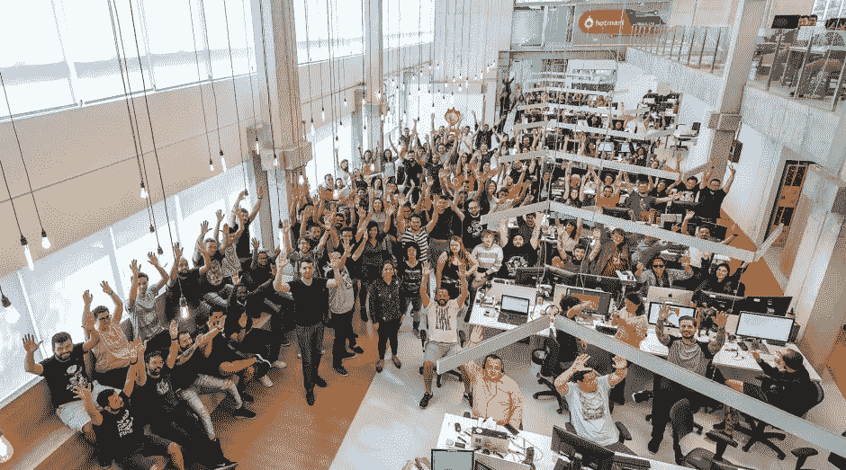

# 数据科学求职者的 4 大错误

> 原文：<https://towardsdatascience.com/the-4-biggest-mistakes-of-data-science-job-applicants-20e67fdd0d0a?source=collection_archive---------5----------------------->

## [办公时间](https://towardsdatascience.com/tagged/office-hours)

## 我已经面试了 90 多名数据工作职位的候选人。以下是那些不成功人士最常见的错误

[Clem Onojeghuo](https://unsplash.com/@clemono?utm_source=medium&utm_medium=referral) 在 [Unsplash](https://unsplash.com?utm_source=medium&utm_medium=referral) 上的照片

在过去的 12 个月里，**我们为 Hotmart 的数据科学团队**雇佣了大约 10 名新的数据专业人员。从实习生到高层，你可以想象各种不同的简历申请数据分析师和数据科学家的工作。我从这些候选人身上学到了很多东西，我希望能教给他们每个人一些新的东西。**在此期间，我发现了那些不幸在招聘过程中失败的候选人的一些共同点**。

# 马斯洛的锤子

当我对候选人进行技术评估时，我从不定义她必须用来解决问题的单一工具或编程语言。我认为，通过开放选项，候选人将能够利用创造力和实验来测试不同的方法。大多数时候它是有效的，但在某些情况下却是相反的。

照片由[莫里茨·门格斯](https://unsplash.com/@mphotographym?utm_source=medium&utm_medium=referral)在 [Unsplash](https://unsplash.com?utm_source=medium&utm_medium=referral) 上拍摄

很多时候，候选人试图用一个单一的解决方案来解决所有的问题。当他失败时，他说他没有办法解决那种情况。这种情况的一个例子是当一个人认为每一个聚类问题都是用 K-means 解决的；或者说，如果你不能用脸书的先知来创建一个模型，你就不能预测一个时间序列；或者简单地认为每个问题都可以用机器学习来解决。

如何解决这个问题:你需要把注意力放在问题上，而不是你正在使用的工具上。每天，人们都会向你寻求“一个人工智能来解决这个问题”和“一个模型来预测这个问题”；但是你的第一个问题不应该是“我应该用什么算法？”，而是“他们想解决什么问题？”。

# 杰出的编码技能，糟糕的沟通

有时候——实际上是大多数时候——我们需要将一个技术概念翻译给一个非技术人员，这并不容易。不管我们是在解释一个指标是如何计算的，或者为什么模型做出了一个预测，**我们的大部分工作都是在沟通中进行的**。

有时候，利益相关者看起来像外星人。我们需要找到“物种”之间的共同交流

**在一些候选人中，我注意到他们有很好的技术能力，但是他们没能交流结果**。当我们就他们的解决方案提出问题时——这是一个业务人员通常会问的问题——他们没有抓住要点，没有解释为什么他们选择了一种特定的方法。

**如何解决这个问题**:你必须有一个很好的理由来选择你提出的解决方案，这个理由可以是基准、以前的经验或实验——例如，你可以说“在测试过的解决方案中，这个更好是因为 ABC 的原因”。此外，您必须知道您的解决方案的缺陷，它的缺点是什么，以及如何改进它。

# 机关枪片段

这个题目基本上是上面那个问题的延伸。人们沟通失败的原因之一是把讲故事放在一边，专注于在解决方案中吐出尽可能多的代码。在极端的情况下，我收到的评论代码混合了`camelCase`和`snake_case`；带有混合不同语言的注释，等等。这不足以淘汰一名候选人，但这显示出缺乏严谨性。

在大多数情况下，缺乏讲故事:候选人在交替使用代码时没有机会解释他们的方法。在像 Hotmart 这样的公司中，技术测试先于与团队的初始对话，这可能是进入下一阶段或被淘汰的区别。

**如何解决这个问题**:从 StackOverflow 复制一个代码片段没有问题。我必须自己一天做几次。但是，一定要有眼光，提醒自己要讲好故事。对于“好的代码不需要注释”的想法，我有自己的保留意见，当我们谈论数据科学家和数据分析师的工作时，像 Jupyter Notebook 这样的工具——广泛用于招聘过程——为我们提供了一些非凡的东西:将故事与代码合并的可能性。

# 他们不知道公司是做什么的

这是候选人可能犯的最大错误，尤其是申请数据科学职位的人。**我不是说你需要了解 Hotmart 的一切，** **但是你至少要知道，公司是做什么的**。但是，为什么这很重要呢？

巴西贝洛奥里藏特的 Hotmart 总部

几个月前，我用巴西葡萄牙语写了一篇关于 Hotmart 招聘数据科学职位的文章。我强调的一点是，我们的技术测试模拟了我们团队中这个专业人员的日常生活。我们创造一些需要回答的商业问题，你对 Hotmart 的商业模式了解得越多越好。

不只是 Hotmart 有这个问题，很多公司都有同样的问题。**你将在一个与业务非常相关的职位上工作，知道公司如何赚钱，它的主要竞争对手是谁，以及它的商业模式是什么，这是你最起码需要的**来拥有相对于其他候选人的竞争优势。