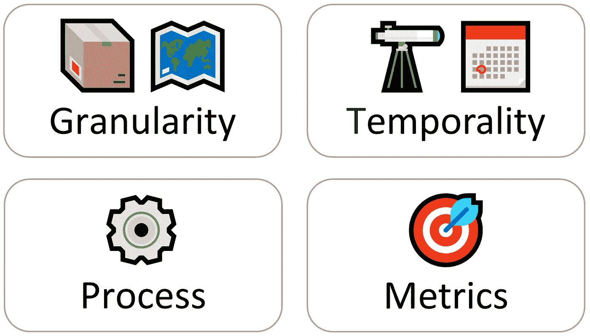

# 找到正确的预测汇总级别

> 原文：<https://towardsdatascience.com/the-4-dimensions-forecasting-framework-f7884ec1472?source=collection_archive---------15----------------------->

## 要建立一个完美的需求预测流程，您需要做好四件事:粒度、时间性、指标和流程。

西奥多·加勒·纳奇·范·德·斯特雷特(Stradanus)，约 1589 年至约 1593 年

谈到需求预测，大多数供应链依赖于用月度时段填充 18 个月的预测。这应该被认为是一个最佳实践，还是仅仅是一个默认的、被忽略的选择？我见过无数供应链在不相关的汇总层面预测需求——无论是物质层面、地理层面还是时间层面。在本文中，我提出了一个新颖的四维预测框架，它将使您能够为您的供应链建立一个量身定制的预测流程。我喜欢用这个框架来启动任何预测项目。

> 准确的预测是不够的。
> 
> 你需要一个有用的。

# 四维预测框架

## 支持决策的需求预测

供应链是每天做出数百个——如果不是数千个——决策的生命体。为了做出最好的决定，你需要正确的信息。大多数供应链的决策依赖于需求估计。因此，你的需求预测是做出正确决策的关键信息。一个*有用的** 预测应该可以让你的供应链提高服务水平，更好地计划，减少浪费和总体成本。由于需求预测用于触发具体行动，因此应在正确的汇总级别完成，使用相关指标进行跟踪，并由高效的审核流程提供支持。
**我故意用‘有用’这个词，而不是‘准确’。预测可能是准确的，但与采取适当的决策无关。*

简而言之，预测需求永远是达到目的的一种手段，而不是目的本身。

当建立一个预测过程时，你将不得不跨越四个维度来设置它:**粒度**、**时间性**、**度量**和**过程**(我称之为*四维预测框架*)。

我们将逐一讨论这些方面，并根据您需要做出的决策建立我们的需求预测流程。一旦你知道你需要做什么样的决定(例如，生产多少，在哪里部署库存，是开还是关工厂)，根据这个框架建立你的预测过程应该很容易。

四维预测框架(版权所有:Nicolas Vandeput)

## 1.粒度

您应该首先为您的预测确定正确的地理和材料粒度。

*   🗺️ **地理。**您是否应该按国家、地区、市场、渠道、客户群、仓库、商店进行预测？
*   📦**材料。**您是否应该预测所需的每种产品、细分市场、品牌、价值、重量和原材料类型？

要回答这些问题，你必须考虑你的供应链基于这一预测所采取的决策。请记住，只有当预测有助于供应链采取行动时，它才是有意义的。

让我们讨论几个例子:

*   让我们假设您需要决定将哪些产品从您的工厂运送到您的区域仓库。在这种情况下，按仓库区域汇总需求并直接在此地理级别预测需求可能是个好主意。
    ⚠️注意到，根据该仓库完成的历史订单预测仓库需求是一种不好的做法，因为物流约束可能会影响历史发货(有时，一个仓库服务于另一个仓库通常区域的客户)。
    ✅相反，您应该预测仓库应该服务的地理区域的需求，而不考虑实际服务这些订单的仓库。换句话说，您应该根据在没有约束的情况下仓库应该满足的**来预测仓库需求。**
*   另一方面，这里有一个不好的例子:许多供应链仍然预测每个国家的需求，即使他们有多个仓库服务于同一个国家的不同地区。在这种情况下，需要做出的决定(*我们应该在哪个仓库发货*)和用于做出这些决定的信息(*我们将在这个国家卖那么多*)之间存在明显的差异。这种差异通常会导致仓库之间的库存分配不当。
*   我们可以想象许多其他的用例:如果你的生产过程需要生产各种特定包装的产品，你应该预测每个包装。在回顾您的预测时，您应该讨论是什么影响了每种包装类型的比率:商业活动、促销等等。
*   如果不同的仓库(或流程)服务于不同的销售渠道，您应该分别进行预测。另一方面，如果你只有一个仓库，你应该问自己是否真的需要对每个地区进行预测，或者在全球范围内进行一次预测是不够的。

## 2.暂时性

一旦您知道您将在哪个粒度级别上工作，您就应该选择正确的预测范围和时间聚合(时段)。许多供应链坚持预测未来 18 或 24 个月的需求，尽管需求规划者和任何其他从事预测工作的人的时间都是有限的。你需要选择一个有限的视野来关注。

*   **🗓️颞聚合。**您应该使用什么时间聚合时段(每日、每周、每月、每季度或每年)
*   **🔭地平线。**你需要预测多少期(一个月、半年、两年)？

同样，你应该通过思考你的供应链试图优化/实现什么以及这些决策所涉及的提前期来回答这些问题。

让我们举两个例子:

*   你的供应商需要提前三个月收到月度订单。您应该使用月度时段和 3 个月的时间跨度(M+1/+2/+3)。任何超出 M+3 的预测都不应该是你关注的重点。
*   如果您需要一个预测来了解将哪些货物从您的中心仓库运送到您的本地仓库，您应该关注一个相当于您的内部提前期(通常是几天或几周)的展望期。

 [## 预测范围应该有多长？

### 预测只能帮助你做出正确的供应链决策

towardsdatascience.com](/how-long-should-the-forecast-horizon-be-2f24a6005b89) 

❗ **模型和预测视野。**统计模型可以轻松地对无限长的时间范围进行预测。机器学习模型就不是这样了。因此，你可能不得不坚持使用统计模型进行长期预测。

## 3.韵律学🎯

通常，实践者会忽略预测指标的问题。实际上，为预测过程/模型选择正确的指标非常简单，而且它将对最终的预测产生深远的影响。根据所选的指标，你可能会过分重视异常值(RMSE 弱点)，或者冒预测有偏差的风险(美国市场弱势)。关于预测 KPI 的详细讨论，请参见我的文章*预测 KPI:RMSE、梅伊、MAPE &偏差*、[这里](/forecast-kpi-rmse-mae-mape-bias-cdc5703d242d)。[1]

以下是选择正确预测指标的一些建议:

*   ❌ **避开 MAPE。许多从业者仍然使用 MAPE 作为预测指标。这是一个高度扭曲的指标，会加剧预测不足。避免它。**
*   ✅ **联合关键绩效指标。**通常，查看 KPI 的组合(如 MAE & Bias)将是一个很好的折衷方案，使您能够跟踪准确性和偏差，同时避免大多数陷阱和陷阱。
*   ✅ **跟踪一致偏差。**如果您观察到特定项目的持续偏差(超出/低于预测)，这是模型/预测流程出现问题的重要线索。
*   💡**加权关键绩效指标。**在我的书 [*供应链预测的数据科学*](https://www.amazon.com/Data-Science-Supply-Chain-Forecasting/dp/3110671107/ref=pd_lpo_1?pd_rd_i=3110671107&psc=1) 的第二版中，我建议在整体指标计算中根据其盈利能力、成本或整体供应链影响对每个产品(或 SKU)进行加权。这个想法是，你想更多地关注最重要的 SKU。这一点尤其重要，因为我们希望找到一个支持您的供应链的指标:您的预测指标的高分应该与业务价值一致。

除了数学之外，将预测 KPI 与所需的材料和时间粒度保持一致也很重要。例如，假设您有兴趣从海外供应商处订购提前期为 3 个月的货物。在这种情况下，您应该测量+1、+2 和+3 个月的预测范围内的准确性，或者更好的是，计算三个月的累积误差，而不是只查看+1 个月达到的准确性。

## 4.加工⚙️

现在您已经知道了您的材料和时间聚合、范围和度量，您可以设置一个过程。这个过程应该用三个具体方面来定义。

**1。** **利益相关。** **谁**来审核预测？
提出不同的观点——利用各种信息来源——将有助于做出更准确的预测。但这只有在审查过程彻底完成的情况下才能正确完成(否则，准备好面对影响之战)。

**2。** **周期性。****你什么时候回顾预测？经常更新你的预测可能会提高它的准确性(因为你手头有更新的数据)。然而，过于更新它*可能经常会造成混乱，因为你对需求变化反应过度，为有限的附加值消耗太多资源。***

****3。** **回顾过程。****你如何回顾预测？
任何预测流程的核心都应该是对**预测附加值**的衡量。跟踪每个团队成员的增值将使您能够提高预测过程的效率(并细化相关的预测周期和利益相关者)。****

> ****📖**预测增值框架。**一个预测流程框架，它跟踪每个团队/流程步骤相对于基准(或前一个团队的输入)的附加值。它是由迈克尔·吉利兰在 21 世纪 10 年代设想和推广的(见他的书[这里](https://www.amazon.com/Business-Forecasting-Deal-Eliminating-Practices/dp/0470574437))。[2]****

# ****概述****

****让我们用三个例子来概括一下:****

*   ******短期预测**。让我们想象一下，你需要每周决定向你的商店运送什么。预测可以每周更新，展望未来几周。粒度将是每个商店的 SKU。由于您需要每周填写预测，因此查看预测的时间有限。从今以后，只有少数需求计划者应该验证它。这里通常应该首选黑盒机器学习模型。****
*   ******中期预测**。你要评估未来几个月要生产什么。这是典型的 S & OP 预测，您需要从许多利益相关方(销售、财务、营销、计划者、客户、供应商)那里收集信息。预测可以在全球范围内按 SKU 生成(并测量其准确性),每月一次。****
*   ******长期预测**。你需要为来年制定预算。这是一个非常综合的长期预测(最有可能在每个品牌/细分市场的价值/收入水平上进行)。要创建各种场景(基于定价、营销、新产品介绍)，您将需要使用一个因果模型，在该模型中可以设置和讨论输入的权重。应该避免机器学习模型，因为它们是一个黑箱，并且由于缺乏数据而难以进行长期预测。****

## ****👉[我们在 LinkedIn 上连线吧！](https://www.linkedin.com/in/vandeputnicolas/)****

# ****来源****

****[1]范德普特，N. (2019)。预测关键绩效指标:RMSE，梅，MAPE 和偏见，走向数据科学。[https://towards data science . com/forecast-KPI-RMSE-Mae-mape-bias-CDC 5703d 242d](/forecast-kpi-rmse-mae-mape-bias-cdc5703d242d)****

****[2]吉利兰，M. (2010 年)。*商业预测交易:揭露神话，消除不良行为，提供切实可行的解决方案。新泽西州霍博肯的约翰·威利父子公司*****

# ****关于作者****

****icolas Vandeput 是一名供应链数据科学家，擅长需求预测和库存优化。他在 2016 年创立了自己的咨询公司 [SupChains](http://www.supchains.com/) ，并在 2018 年共同创立了 [SKU 科学](https://bit.ly/3ozydFN)——一个快速、简单、实惠的需求预测平台。尼古拉斯对教育充满热情，他既是一个狂热的学习者，也喜欢在大学教学:自 2014 年以来，他一直在比利时布鲁塞尔为硕士学生教授预测和库存优化。自 2020 年以来，他还在法国巴黎的 CentraleSupelec 教授这两个科目。他于 2018 年出版了 [*供应链预测的数据科学*](https://www.amazon.com/Data-Science-Supply-Chain-Forecasting/dp/3110671107)(2021 年第 2 版)和 2020 年出版了 [*库存优化:模型与模拟*](https://www.amazon.com/Inventory-Optimization-Simulations-Nicolas-Vandeput/dp/3110673916) 。****

********