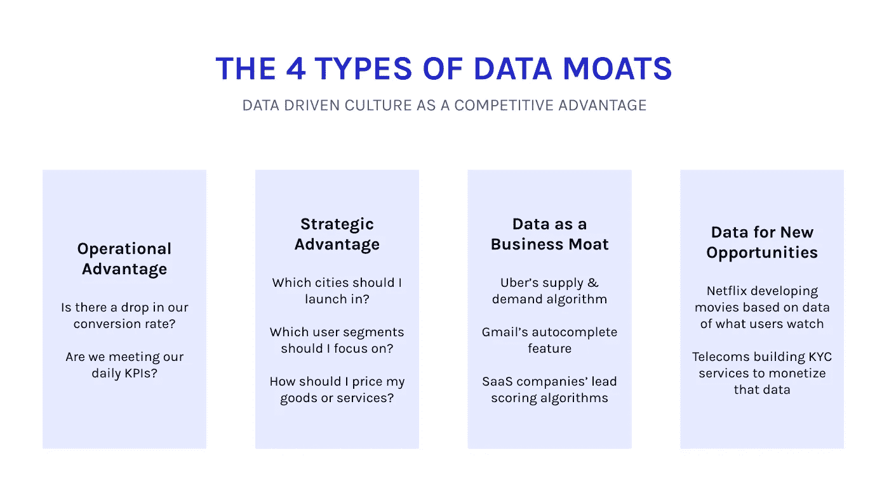
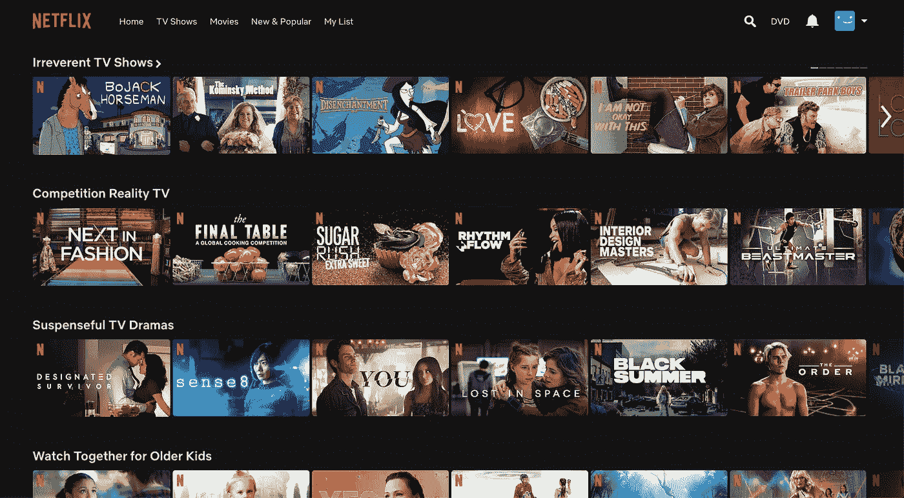

# 你的公司可以建立的 4 种“数据护城河”

> 原文：<https://towardsdatascience.com/the-4-kinds-of-data-moats-that-your-company-can-build-c68f691b435c?source=collection_archive---------20----------------------->

## 公司如何利用数据创造竞争优势，实现更大的增长

Joran Quinten 在 [Unsplash](https://unsplash.com/) 上拍摄的照片。

2019 年 10 月，耐克[宣布](https://www.geekwire.com/2019/former-ebay-ceo-john-donahoe-will-become-nikes-new-ceo-shoe-giant-moves-tech/)将由约翰·多纳霍取代其 13 年的首席执行官马克·帕克。多纳霍不是来自体育界，而是一名资深的科技高管，曾在易贝、贝宝和云计算公司 ServiceNow 高调任职。

耐克聘请了一位技术领袖担任首席执行官，标志着该公司向电子商务、技术和数据驱动型业务的重大转变。正如达伦·罗维尔所说，耐克希望成为“一家碰巧销售鞋子和服装的科技公司。”哈佛商学院网站上的一篇文章甚至问道:“耐克会是下一个科技巨头吗？”

对于一家运动服装公司来说，这一举动可能看起来很奇怪，但耐克并不是第一家让科技领导者掌舵的非科技公司。

2021 年 6 月，法拉利[宣布](https://www.hotcars.com/this-is-why-ferrari-has-hired-a-technology-expert-to-be-its-new-ceo/)其新任首席执行官 Benedetto Vigna(一位在微芯片行业拥有 26 年和 200 项专利的技术老手)作为从豪华跑车转向电动引擎等更新创新的努力的一部分。同样，2020 年 3 月，西门子[任命](https://economictimes.indiatimes.com/news/international/business/siemens-ag-elevates-cto-roland-busch-as-ceo-with-aim-to-push-digital-business/articleshow/74722561.cms) Roland Busch(领导西门子数字化进程的前首席技术官)为新任首席执行官。西门子以在第一次工业革命中创造设备和硬件而闻名，现在它将基于云的软件视为自己的未来。

这些公司对科技的拥抱反映了 2020 年代的一个新标签——数据十年。随着各行各业的首席执行官们纷纷投资下一代机器学习、人工智能、自动化和硬件马力，数据分析正成为每家公司商业模式的核心。正如[福布斯](https://www.forbes.com/sites/forbestechcouncil/2020/02/14/why-every-company-is-a-data-company/?sh=57f7e85a17a4)所说，现在“每家公司都是数据和分析公司”。

作为 [Atlan](https://atlan.com/) 的创始人，我有幸花了大量时间与 CEO 和 CDO 谈论他们的数据战略。随着时间的推移，我意识到，在各个行业中，公司可以通过四种主要方式利用数据为自己创造优势，实现更大的增长。

图片由 Atlan 提供。

# 1.数据作为运营优势

红杉资本(Sequoia)的 Shailendra Singh 曾经讲述了 Gojek 的第一任首席执行官 Nadiem Makarim 的故事，这个故事现在已经成为一个传奇，他痴迷于超级应用的增长数据。

传说中，Gojek 的董事会成员不是每月一次，而是每天*更新超级应用测量的关键指标和过去一天的运动。Makarim 使用这些工具几乎每小时跟踪一次指标，并对可能出现的问题形成直观的认识。这种对使用数据来建立运营优势的狂热关注推动了 Gojek 成为一名[青年](https://www.thejakartapost.com/news/2019/04/05/go-jek-becomes-indonesias-first-decacorn.html)和《财富》杂志“改变世界的 [50 家公司之一](https://www.thejakartapost.com/adv/2019/08/27/gojek-once-again-in-fortunes-top-20-list-of-companies-changing-the-world.html)”的旅程。*

Gojek 的故事是一个将数据作为运营优势的故事。这是世界上每个公司都可以建立的数据护城河。它是关于理解推动您业务的关键杠杆和指标，然后使用它们来显著改善运营。

> *运营优势意味着首席执行官和首席债务官能够近乎实时地回答关键业务问题，比如“我们是否达到了日常的关键绩效指标？”或者“我们的转化率有下降吗？”*

使用数据建立运营优势的一个关键方面是让日常决策者能够获得和理解数据。这包括技术用户和非技术用户，从数据分析师和工程师到营销人员和产品经理。

更进一步，像优步这样的大公司已经找到了使数据民主化的方法——人们不仅可以找到数据，还可以分析和使用数据。优步使公司中的每个用户都可以在特定的、动态的基础上查询数据。据估计，优步的基础设施每天运行超过 40 万次查询。

其他公司甚至通过推广数字扫盲走得更远。例如，Airbnb 创建了[数据大学](https://medium.com/airbnb-engineering/how-airbnb-democratizes-data-science-with-data-university-3eccc71e073a)和后来的[数据密集型](https://medium.com/airbnb-engineering/how-airbnb-is-boosting-data-literacy-with-data-u-intensive-training-a6399dd741a2)，为 Airbnb 的任何人提供数据教育，根据角色和团队进行扩展。在 800 多门数据课程和数千个“[座位](https://blog.getcensus.com/how-airbnb-achieves-data-democratization-to-empower-5k-employees/)”之后，Airbnb 的日常 SQL 用户比例从 7%飙升至 62%，对数据团队的临时请求减少了 50%。

# 2.数据作为战略优势

每个季度，你的公司都会做出一些非常关键的战略决策。如果你是一家产品公司，这可能是在回答这样一个问题，“我应该关注哪些用户群？”如果你是一家超本地化的物流公司，你可能会问，“我应该扩展到哪些城市？”

这些决策可以使用不同级别的数据成熟度来做出，但这些决策背后的数据越精细、越真实，新战略就越有可能帮助超越竞争对手。

例如，在我过去的生活中，我有机会与前三大石油公司和印度政府合作，开设 [10，000 个新的液化石油气中心](https://socialcops.com/case-studies/finding-the-best-locations-for-10000-new-lpg-centers/)。

获得清洁的烹饪燃料在印度是一个巨大的问题，因此石油和天然气部希望将液化石油气炉灶带给 8000 万生活在贫困线以下的妇女。这一计划的一部分是开设 10，000 个新的液化石油气配送中心——不仅仅是在任何地方，而是选择能够接触到最有需要的人并产生最大影响的地点。

我们从 3 家石油公司关于 17，000 个现有液化石油气中心的销售、位置和客户的数据开始。然后，我们将这些数据与来自 600 多个来源的关于人口、富裕程度、基础设施、液化石油气渗透率等外部数据进行合并。有了这些数据，我们可以根据哪些村庄附近没有液化石油气中心，以及哪些村庄有足够的市场潜力来支持新中心，来确定每个新中心的最佳位置。

# 3.推动核心产品优势的数据

第三种优势是公司利用数据推动核心产品优势。

这方面最好的例子是网飞。十年前，你可以说网飞的竞争优势是它的视频软件。现在，情况肯定不是这样。虽然视频流媒体服务很常见，但网飞在一定程度上是因为它的数据而向前迈进的。

凭借多年的用户数据，网飞了解我们每个人的品味、喜好和厌恶。其中一部分来自其不太基础的用户数据，例如，跟踪完成率、停止和开始时间、一天中的时间以及观看行为(例如，暂停、快进、倒带等)。)对于我们流式传输的所有内容。

此外，网飞的数据来自其对不同类型内容的微观分类——甚至早在 2014 年就有超过 [76，000](https://www.theatlantic.com/technology/archive/2014/01/how-netflix-reverse-engineered-hollywood/282679/) 种微观类型。网飞使用 1000 多种标签类型，根据时间段、情节、情绪等对内容进行分类。不要看喜剧或恐怖片，想想“对抗体制的情感纪录片”或“基于现实生活的关于皇室的时代片”。

所有这些来自数百万用户的用户数据意味着网飞可以个性化其推荐，以保持每个人不断着迷和疯狂观看最新的节目。例如，网飞推荐引擎可以预测你会喜欢节目 X，因为喜欢你最喜欢的节目 Y 的人也喜欢节目 X，这由你观看相关微流派节目的模式来支持。

这个庞大的数据护城河——基于超过 [2 亿客户](https://www.theverge.com/2021/4/20/22394425/netflix-subscriber-growth-stalls-2021)14 年的流媒体数据——使得拥有更好流媒体服务的新创公司很难超越网飞。

数据作为基本商业护城河的其他例子包括优步的[供需匹配算法](https://learn.g2.com/uber-supply-demand)和 Gmail 的“[智能撰写](https://ai.googleblog.com/2018/05/smart-compose-using-neural-networks-to.html)”自动完成功能——这两个功能都是由这些巨头长期收集的专有数据提供支持的。

网飞原创音乐的几个流派。(图片由作者提供。)

# 4.数据货币化:数据驱动新机遇

最后一种商业护城河是将你公司的数据本身转化为商业机会。虽然古老的例子包括像脸书和谷歌这样的广告网络，它们利用用户数据来提供高度有针对性的广告，但还有大量数据驱动的业务的独特应用。

以网飞为例，今天网飞正在利用人们观看的数据来创作非常适合观众的新电视节目和电影(称为网飞原创)。网飞可以获得的这个独特的数据宝库意味着，它可以让好莱坞最好的制片人物有所值。

> “我们总是利用我们对会员喜欢看什么的深入了解(也就是分析和数据)来决定网飞上有什么节目……如果您继续观看，我们会继续添加更多您喜欢的内容。”
> 
> –[珍妮·麦凯布](https://www.youtube.com/watch?v=VvpoUh9gx58)，网飞全球媒体关系总监

以网飞制作的第一部电视剧《T4》《纸牌屋》《T5》为例。这对网飞来说是一项巨大的投资。它击败了 HBO 和 AMC 等主要电视频道，获得了《纸牌屋》美国版的版权，预计两季的价格超过 1 亿美元。

为什么网飞要进行一场当时看来似乎是巨大的赌博？答案很简单。网飞不认为这是一场赌博，因为[它的数据显示](https://www.salon.com/2013/02/01/how_netflix_is_turning_viewers_into_puppets/)认为*纸牌屋*会成功。

网飞知道喜欢英国原版《纸牌屋》的人也喜欢凯文·史派西和大卫·芬奇的电影，它最受欢迎的电影之一(《社交网络》)也是由大卫·芬奇执导的。由大卫·芬奇和凯文·史派西执导的《纸牌屋》的重拍似乎是显而易见的。

网飞还利用其数据做出决定，比如应该取消或重启哪些节目，或者应该关注哪些类型的节目。

例如，网飞从其数据中意识到，浪漫电影中存在一个缺口，好莱坞多年来一直在回避这个缺口。从几年前开始，网飞开始制作一系列浪漫喜剧——不仅仅是为情人节，而是全年。这些包括从青少年电影像《亚历克斯·奇爱》*和《接吻亭》*到更成人化的选择像《设置它》*和《像父亲一样》。结果很明显——网飞的爱情电影在媒体上爆红，[超过三分之二的订户](https://qz.com/1309442/romance-is-wilting-in-theaters-but-abloom-on-netflix/)在 2017 年 3 月至 2018 年 3 月期间观看了一部爱情电影。*

*附言:我强烈推荐阅读[道格拉斯·兰尼](https://www.linkedin.com/in/douglaney/)的<https://www.gartner.com/en/publications/infonomics>*信息经济学，这是一本很棒的书，详细介绍了将你的数据作为一种资产进行估值以及将数据作为一种新的商业机会进行货币化的所有渠道。**

**那么，如何开始围绕数据构建“数据护城河”或竞争优势呢？在我的下一篇文章中，我将解开一个四步优先化框架，它可以帮助每个人——从初出茅庐的初创公司创始人到财富 500 强的首席执行官——优先化您的数据投资，并创造最大的投资回报。**

**注册我的 [Substack 简讯](https://humansofdata.substack.com/)，在你的收件箱里收到下一篇文章！**

****觉得这个内容有帮助？在我的时事通讯《元数据周刊》上，我每周都写关于活动元数据、数据操作、数据文化和我们的学习建设的文章。** [**在此订阅。**](https://metadataweekly.substack.com/)**