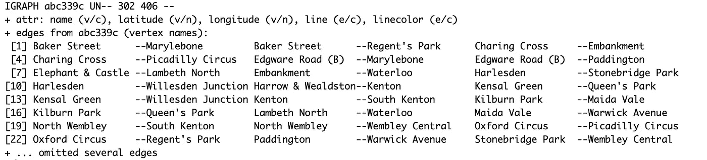
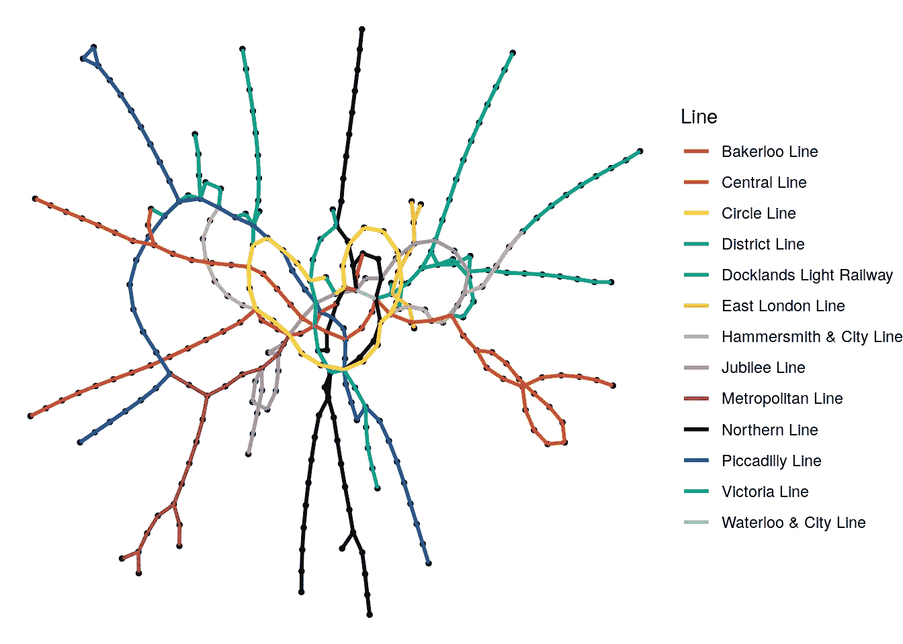
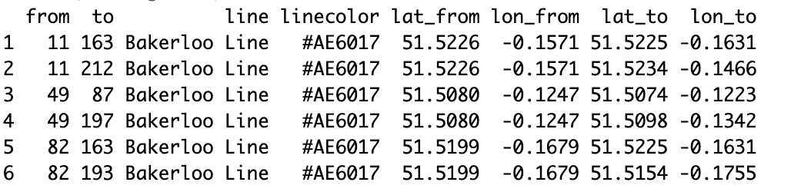
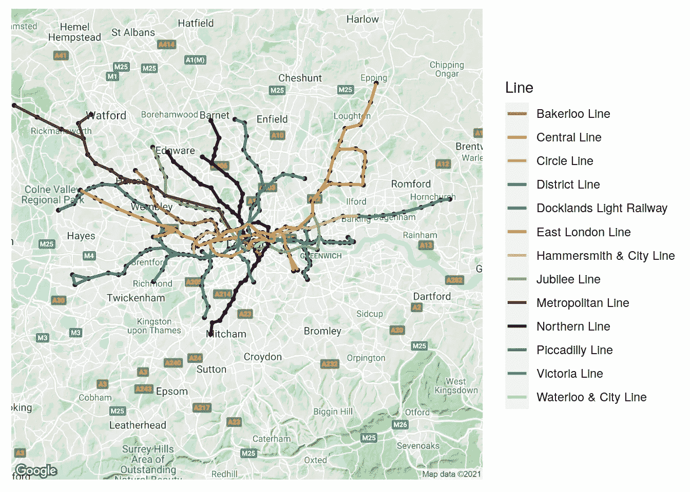

# 5 分钟学习:用 R 语言创建漂亮的、地理上精确的交通地图

> 原文：<https://towardsdatascience.com/the-5-minute-learn-create-pretty-and-geographically-accurate-transport-maps-in-r-63f2cb77c227?source=collection_archive---------24----------------------->

## 学会准确绘制伦敦地铁网络

我正在尝试一篇名为“5 分钟学习”的临时文章，我试图在 5 分钟或更短的阅读时间内教授一种有用的技巧。在第一次尝试中，我们将看看如何创建一个地理上准确的伦敦地铁网络图(不像我们经常看到的那样)。如果你有正确的数据，你应该能够很容易地将这项技术应用到其他交通网络。

要做到这一点，我们需要一个数据集，我们可以用它来构建一个以站点为顶点的图。我在 Github 上找到了一个 JSON 数据集，我把它转换成顶点和边的`csv`并把它放在 Github 上。我添加了来自 OpenStreetMap 的每个车站的坐标，以及来自伦敦交通时尚指南的地铁线路和每条线路的官方颜色。让我们下载这些套件:

```
londontube_vertices <- [read.csv](https://rdrr.io/r/utils/read.table.html)("[https://raw.githubusercontent.com/keithmcnulty/ona_book/main/docs/data/londontube_vertices.csv](https://raw.githubusercontent.com/keithmcnulty/ona_book/main/docs/data/londontube_edgelist.csv)")head(londontube_vertices)##   id         name latitude longitude
## 1  1   Acton Town  51.5028   -0.2801
## 2  2      Aldgate  51.5143   -0.0755
## 3  3 Aldgate East  51.5154   -0.0726
## 4  4   All Saints  51.5107   -0.0130
## 5  5     Alperton  51.5407   -0.2997
## 6  7        Angel  51.5322   -0.1058londontube_edgelist <- [read.csv](https://rdrr.io/r/utils/read.table.html)("[https://raw.githubusercontent.com/keithmcnulty/ona_book/main/docs/data/londontube_edgelist.csv](https://raw.githubusercontent.com/keithmcnulty/ona_book/main/docs/data/londontube_edgelist.csv)")head(londontube_edgelist)##   from  to          line linecolor
## 1   11 163 Bakerloo Line   #AE6017
## 2   11 212 Bakerloo Line   #AE6017
## 3   49  87 Bakerloo Line   #AE6017
## 4   49 197 Bakerloo Line   #AE6017
## 5   82 163 Bakerloo Line   #AE6017
## 6   82 193 Bakerloo Line   #AE6017
```

现在我们将使用 R 中的`igraph`包从这两个数据帧中创建一个 graph 对象:

```
library(igraph)# create graph object
(tubegraph <- igraph::[graph_from_data_frame](https://rdrr.io/pkg/igraph/man/graph_from_data_frame.html)(
  d = londontube_edgelist,
  vertices = londontube_vertices,
  directed = FALSE
))
```



看起来不错。我们还可以使用我们的 edgelist 来创建不同管线和管线颜色的参考，以便在任何可视化中使用:

```
# create a set of distinct line names and linecolors
lines <- londontube_edgelist |> 
  dplyr::[distinct](https://dplyr.tidyverse.org/reference/distinct.html)(line, linecolor)head(lines)##                      line linecolor
## 1           Bakerloo Line   #AE6017
## 2            Central Line   #F15B2E
## 3             Circle Line   #FFE02B
## 4           District Line   #00A166
## 5 Docklands Light Railway   #00A77E
## 6        East London Line   #FBAE34
```

现在，让我们暂时忽略地理定位，让我们用`ggraph()`绘制这个网络的图，使用它的默认布局。

```
library(ggraph)# visualize tube graph using linecolors for edge color
[set.seed](https://rdrr.io/r/base/Random.html)(123)
[ggraph](https://ggraph.data-imaginist.com/reference/ggraph.html)(tubegraph) +
  [geom_node_point](https://ggraph.data-imaginist.com/reference/geom_node_point.html)(color = "black", size = 1) +
  [geom_edge_link](https://ggraph.data-imaginist.com/reference/geom_edge_link.html)([aes](https://ggplot2.tidyverse.org/reference/aes.html)(color = line), width = 1) +
  [scale_edge_color_manual](https://ggraph.data-imaginist.com/reference/scale_edge_colour.html)(name = "Line",
                          values = lines$linecolor) +
  [theme_void](https://ggplot2.tidyverse.org/reference/ggtheme.html)()
```



随机布局的伦敦地铁网络(作者生成)

现在，我们能如此容易地制作这个很好，但是对于任何了解伦敦的人来说，这没有任何地理意义。因此，我们需要改变布局和比例，以便我们可以根据地理坐标绘制顶点。

要做到这一点，我们需要通过连接到顶点数据帧来转换我们的边列表，使其具有“从”和“到”地理坐标:

```
# reorganize the edgelist 
new_edgelist <- londontube_edgelist |> 
  dplyr::[inner_join](https://dplyr.tidyverse.org/reference/mutate-joins.html)(londontube_vertices |> 
                      dplyr::[select](https://dplyr.tidyverse.org/reference/select.html)(id, latitude, longitude), 
                    by = [c](https://rdrr.io/r/base/c.html)("from" = "id")) |> 
  dplyr::[rename](https://dplyr.tidyverse.org/reference/rename.html)(lat_from = latitude, lon_from = longitude) |> 
  dplyr::[inner_join](https://dplyr.tidyverse.org/reference/mutate-joins.html)(londontube_vertices |> 
                      dplyr::[select](https://dplyr.tidyverse.org/reference/select.html)(id, latitude, longitude), 
                    by = [c](https://rdrr.io/r/base/c.html)("to" = "id")) |> 
  dplyr::[rename](https://dplyr.tidyverse.org/reference/rename.html)(lat_to = latitude, lon_to = longitude)

# view
[head](https://rdrr.io/r/utils/head.html)(new_edgelist)
```



这看起来不错。现在，我们将重新创建图形对象，以确保存储新的边数据:

```
# recreate graph object to capture additional edge data
tubegraph <- igraph::[graph_from_data_frame](https://rdrr.io/pkg/igraph/man/graph_from_data_frame.html)(
d = new_edgelist, 
vertices = londontube_vertices,
directed = FALSE
)
```

现在，我们可以使用`ggmap`在我们的网络上铺设一张谷歌地图，并使用我们刚刚创建的“起点”和“终点”坐标来绘制车站。请注意，如果你从未使用过`ggmap`，你需要先用谷歌地图 API 设置它——参见这里的[获取说明。](https://cran.r-project.org/web/packages/ggmap/readme/README.html)

```
[library](https://rdrr.io/r/base/library.html)([ggmap](https://github.com/dkahle/ggmap))
londonmap <- [get_map](https://rdrr.io/pkg/ggmap/man/get_map.html)(location = "London, UK", source = "google")# layer a London map
[ggmap](https://rdrr.io/pkg/ggmap/man/ggmap.html)(londonmap, base_layer = [ggraph](https://ggraph.data-imaginist.com/reference/ggraph.html)(tubegraph)) +
  [geom_node_point](https://ggraph.data-imaginist.com/reference/geom_node_point.html)([aes](https://ggplot2.tidyverse.org/reference/aes.html)(x = longitude, y = latitude), color = "black", size = 1) +
  [geom_edge_link](https://ggraph.data-imaginist.com/reference/geom_edge_link.html)([aes](https://ggplot2.tidyverse.org/reference/aes.html)(x = lon_from, y = lat_from,
                     xend = lon_to, yend = lat_to,
                     color = line), width = 1) +
  [scale_edge_color_manual](https://ggraph.data-imaginist.com/reference/scale_edge_colour.html)(name = "Line",
                          values = lines$linecolor)
```



地理精确的伦敦地铁地图(作者生成)

很可爱。如果你能得到正确的数据，我很想看看你能否为其他城市或交通网络重现这一点。

最初我是一名纯粹的数学家，后来我成为了一名心理计量学家和数据科学家。我热衷于将所有这些学科的严谨性应用到复杂的人的问题上。我也是一个编码极客和日本 RPG 的超级粉丝。在 [*LinkedIn*](https://www.linkedin.com/in/keith-mcnulty/) *或*[*Twitter*](https://twitter.com/dr_keithmcnulty)*上找我。也可以看看我在*[*drkeithmcnulty.com*](http://drkeithmcnulty.com/)*上的博客或者我即将发布的* [*关于人物分析的教科书*](https://www.routledge.com/Handbook-of-Regression-Modeling-in-People-Analytics-With-Examples-in-R/McNulty/p/book/9781032041742) *。*