# 数据可视化的 5 个最重要的原则

> 原文：<https://towardsdatascience.com/the-5-most-important-principles-of-data-visualization-455225a6c4b3?source=collection_archive---------4----------------------->

## 数据可视化

## ***高于一切，显示数据。***——

**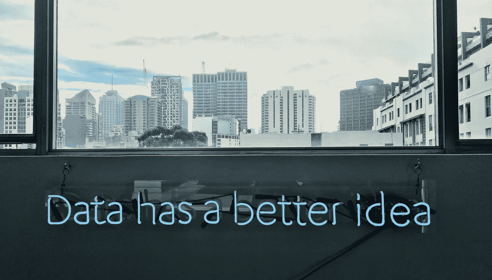**

**照片由[弗兰基·查马基](https://unsplash.com/@franki?utm_source=unsplash&utm_medium=referral&utm_content=creditCopyText)在 [Unsplash](https://unsplash.com/?utm_source=unsplash&utm_medium=referral&utm_content=creditCopyText) 上拍摄**

**用最简单的话来说，数据可视化是数据的图形化表示，用于理解模式和交流见解。**

**我想我们现在都意识到了 dataviz 在当前时代的重要性。但是，我们仍然需要关注创建有效和真实的可视化的基本原则。误导、混乱和不切实际的可视化很常见，甚至是由我们当中著名的 dataviz 设计师和记者创建的。**

> **"展示数据有两个目标:传达你的故事和建立可信度."——**爱德华·塔夫特****

****遵循这五个原则来创建引人注目的和胜任的可视化:****

********

****作者图片****

# ****1.说实话****

****我知道这听起来很明显，但不幸的是，它需要说。有太多的图表通过展示扭曲的数据和投射虚假的叙述误导了读者。****

> ****主持人的工作是通知观众，而不是影响他们。****

****避免这三种误导的方法，以确保你的图表是清晰和诚实的。****

## ****A.省略基线****

****通常，除非另有说明，否则图表的基线应该从零开始。通过从不同的数字开始基线，它可以使数据的感知产生偏差。这种技术用于使数据点之间的差异看起来比实际更大。****

****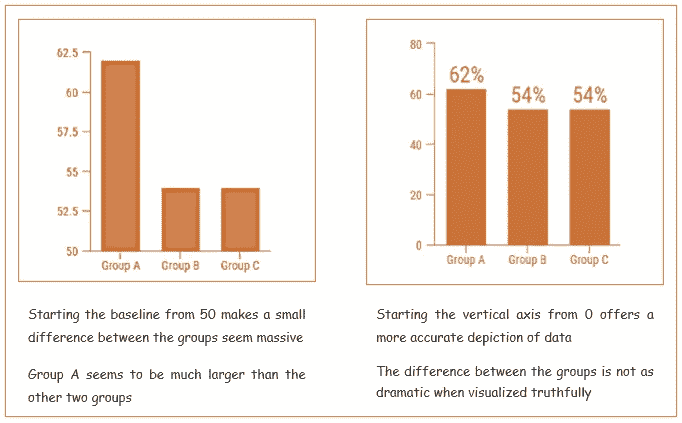****

****图片来自[venengage](https://venngage.com/blog/misleading-graphs/)并附有作者的说明。****

## ****B.违背传统****

****绘制数据时有一定的惯例。较大的条形表示较大的数量，较大的面积表示较大的数值。通过违背常规，观众不知不觉地被引向一个错误的推论。****

****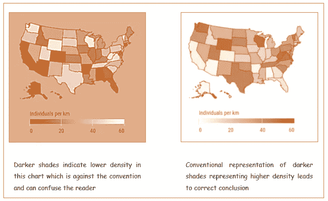****

****图片来自[venengage](https://venngage.com/blog/misleading-graphs/)并附有作者说明。****

## ****C.精选数据****

****当只有几个数据点被绘制成一个误导性的趋势时，就是精选。这是用来误导或欺骗观众的最常见的策略之一。****

****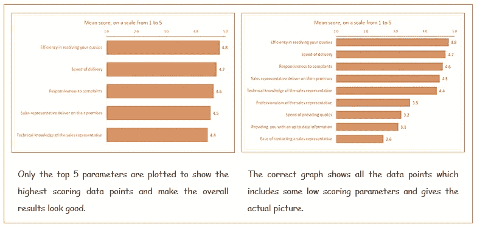****

****图片来自 [Aspect 博客](https://aspectmr.com/cherry-picking-data/)和作者的说明文字。****

# ****2.了解你的受众****

****通常情况下，您会创建数据可视化来与受众交流信息。如果信息没有被传达，那么创建 viz 的全部意义就失去了。****

> ****用他们想看到的方式展示你所拥有的。****

****一个好的数据可视化应该与受众产生共鸣，为了确保这一点，请遵循以下指导原则****

*   ****根据工作角色显示数据。****
*   ****考虑与 dataviz 主题相关的受众的教育和专业知识。****
*   ****对种族和文化价值观保持敏感。****
*   ****关注听众在专业术语、统计数据、语言方面的素养。****

> ****“数据是强大的。但是一个好的故事，是令人难忘的”——丹尼尔·韦斯伯格****

****在这里，我谈四种情况，你应该选择你的数据，即根据你的观众。****

## ****A.基于工作角色****

****您应该向高层管理人员提供高层次的数据，但不要有太多的细节，同时应该向各个部门展示一个总体情况，其中包含他们特定部门的更多细节。****

****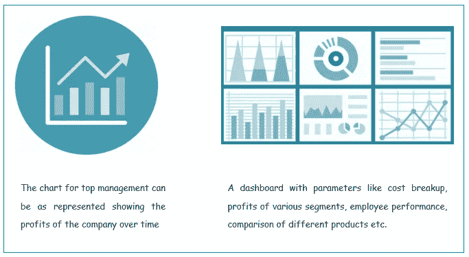****

****来自 [Flaticon](https://www.flaticon.com/free-icon/statistics_432796) 和 [Propmodo](https://www.propmodo.com/wp-content/uploads/2019/03/building-analytics-770x513.jpg) 的图像。作者的说明。****

## ****B.基于技术素养****

****根据受众的统计和可视化知识使用图表和数字。您可以根据最终用户显示或多或少复杂的信息和图表。****

****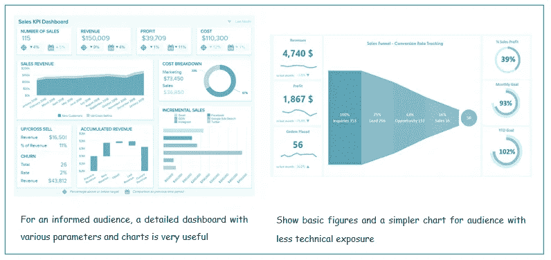****

****图像来自[数据面板](https://www.datapine.com/dashboard-examples-and-templates/sales)和[excel dashboard school](https://exceldashboardschool.com/sales-tracking-templates/)。作者的说明。****

## ****C.基于背景知识****

****如果听众对某个问题没有预先的认知，你必须把重点放在事实和数字上。当观众需要更多关于他们已经知道的问题的知识时，展示更多细节和外围信息。****

****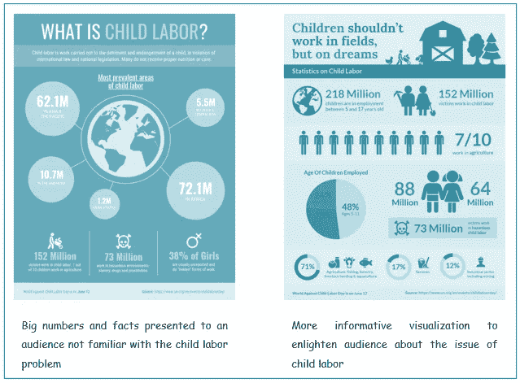****

****图片来自[venengage](https://ua.venngage.com/templates/infographics/simple-agriculture-child-labor-statistics-d0c892c8-a291-4431-93d9-6511bfd93f7a)[模板](https://venngage.com/templates/infographics/dark-child-labor-statistics-00dea20d-ad15-48cc-be28-a7e52ea3637e)和作者的说明文字。****

## ****D.基于情感倾向****

****这是一个好主意，对喜怒无常的观众使用情感诉求，而对务实的观众更注重事实陈述。****

****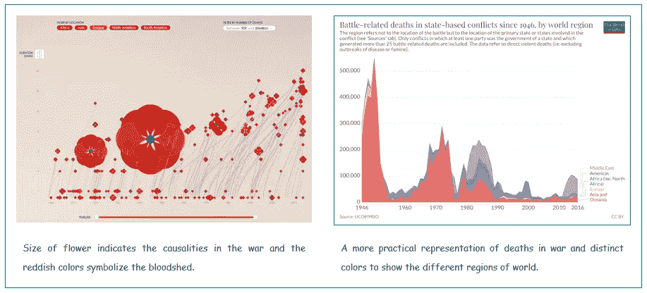****

****来自[罂粟田的图像，即](http://poppyfield.org/)和[我们的世界数据](https://ourworldindata.org/war-and-peace)。作者的说明。****

# ****3.选择正确的图表****

****使用错误的图表就像有良好的意图，但执行不力。****

*   ****根据数据类型和要传达的信息选择图表。****
*   ****不要为了变化而使用不同的图表，因为特定的图表比其他图表更有效地传达特定类型的信息。****
*   ****如果不需要，不要使用任何图表，只显示数字。****

> ****正确的图表增强了信息，错误的图表隐藏了洞察力。****

****下面，我就分享一些例子。要了解更多细节，请查看参考资料和类似的文章:****

**** [## 数据可视化 101:如何选择图表类型

### 如何选择最能描述数据的图表类型

towardsdatascience.com](/data-visualization-101-how-to-choose-a-chart-type-9b8830e558d6) 

## A.条形图而不是饼图

在显示比较时，条形图通常比饼图更好。区分条形的长度比区分扇形的大小更容易。

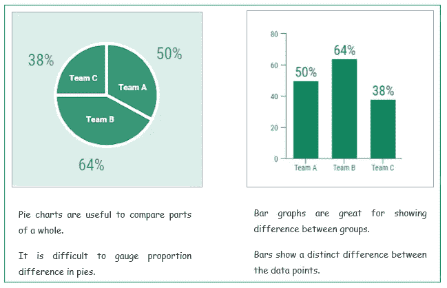

图片来自[venengage](https://venngage.com/blog/misleading-graphs/)并附有作者说明。

## B.当饼状图真正有用的时候

饼图非常适合显示整体的一部分，但只有当部分数量很少并且部分之间的差异很明显时。

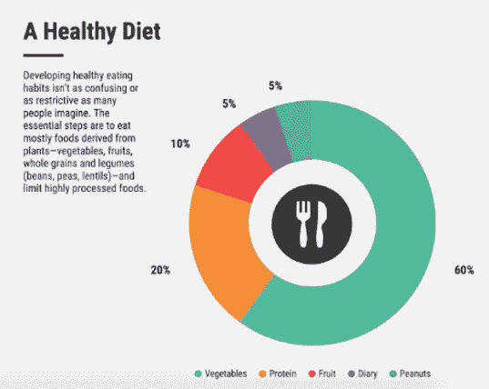

图片来自[venengage](https://venngage.com/blog/how-to-choose-the-best-charts-for-your-infographic/)

## C.线形图而不是条形图

折线图通常比条形图更适合显示一段时间内的对比情况。此外，折线图对于显示趋势或模式非常有用。

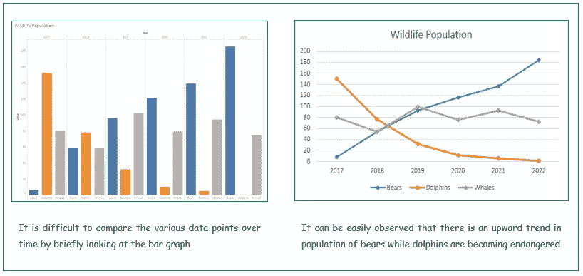

图片来自 [Excel Easy](https://www.excel-easy.com/data-analysis/charts.html) 并附有作者说明。

## D.只有数字而不是任何图形

当需要突出显示某个具体数字时，只使用数字而不使用图表可能会很有效。一两个数字很容易掌握，可以产生很大的影响。

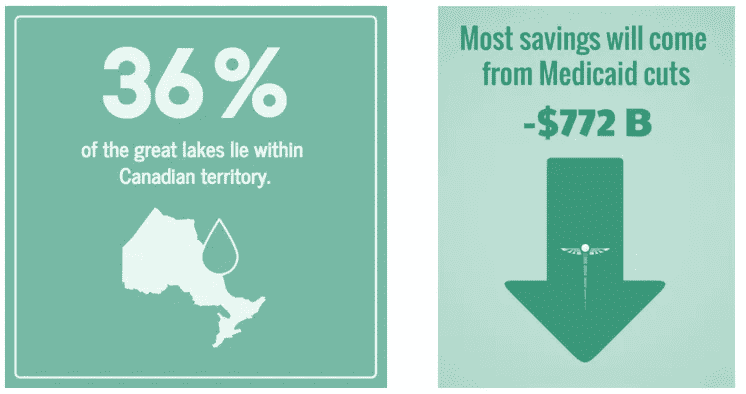

来自[venengage](https://venngage.com/templates/infographics/lake-stat-1aa2f5ee-72ea-4489-aecf-a1ec14321460)模板[的图像](https://venngage.com/templates/social-media/mobile-story-3-e926d4ec-9a2a-4cbe-b54c-2ffb1243fc80)**** 

# ****4.强调最重要的事实****

****数据可视化可以对许多数据点进行编码，因此要突出最重要的事实，以便更快、更有影响力地传达信息。****

> ****省略无关紧要的来突出本质！****

****通过去除噪音，例如不必要的网格线、轴和标签，你可以将注意力集中在最重要的事实上。使用颜色、大小和图案来强调特定的数据点或重点区域。****

> ****“没有信息过载这回事。只有糟糕的设计。”—爱德华·塔夫特****

****以下三个案例说明了如何强调你想传达给观众的信息。****

## ****A.排除杂念****

****除了使用正确的图表，战略性地使用颜色和文字也很重要。此外，如果有一个结论性的结果，你应该在可视化中增强它。****

****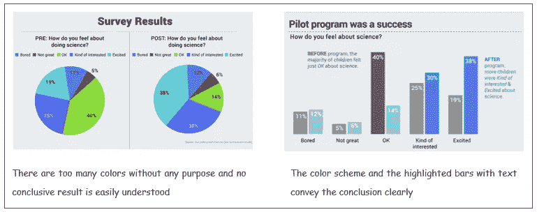****

****来自 [Visme](https://visme.co/blog/data-storytelling-tips/) 的图片和作者的说明文字。****

## ****B.增强本质****

****用标题来传达 viz 的症结，去掉任何不相关的网格、标签和亮色，是很有帮助的。您还可以使用参考线和文本来引起对特定点的注意。****

****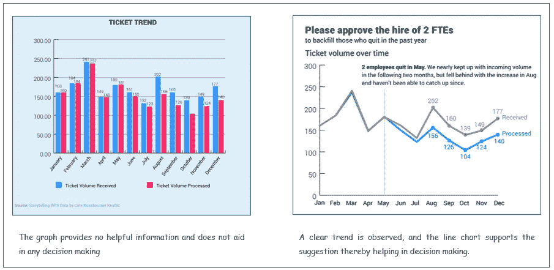****

****图片来自[故事用数据说话，走向数据科学文章](https://visme.co/blog/data-storytelling-tips/)。作者的说明。****

## ****C.突出重要的****

****可以使用不同的颜色甚至不同的色调/阴影来强调重要的数据点并突出需要注意的区域。****

****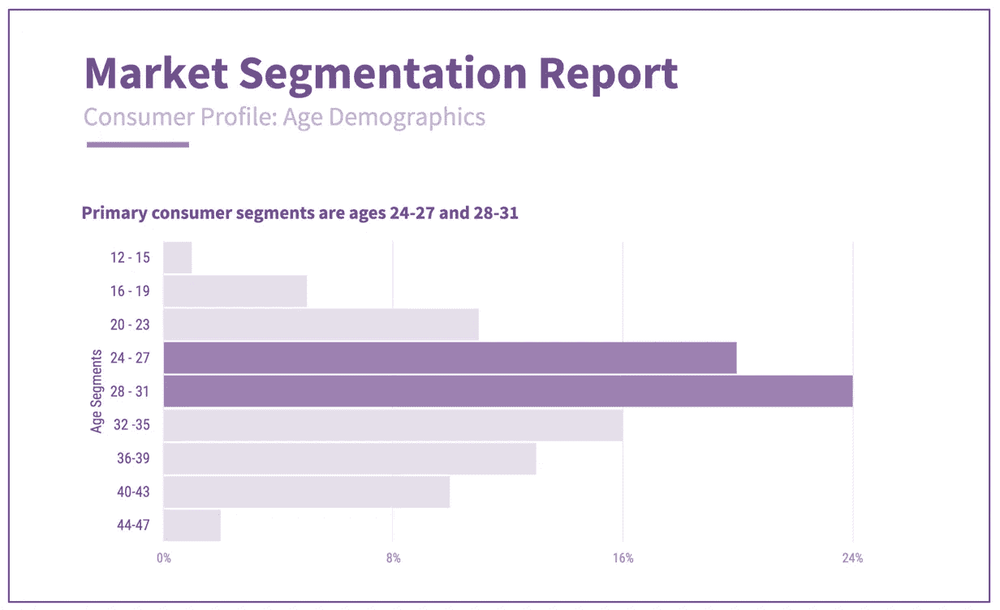****

****图片来自 [Vennage](https://venngage.com/templates/charts/market-segmentation-05430d89-1a08-4711-944d-f68748b74b50)****

# ****5.形式应该服从功能****

****美学是重要的，但不应该以失去重点为代价。清晰地传达信息比没有价值的赏心悦目的图表更重要。****

> ****数据可视化的目的是洞察，而不是图片。****

****直观的设计比吸引人的图表更重要，图表应该以易于理解的方式传达数据的含义。****

> ****"混乱和杂乱是设计的失败，而不是信息的属性."—爱德华·塔夫特****

****有很多这样的图表——这里有两个看起来很有趣也很漂亮，但并没有成功地向观众传递价值。****

****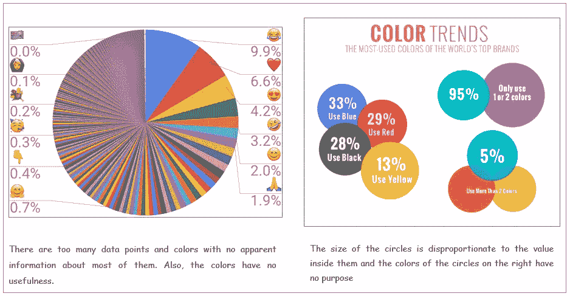****

****来自 [Unicode](https://home.unicode.org/emoji/emoji-frequency/) 和[analytic al](https://analythical.com/blog/examples-of-awful-data-visualization)的图像。作者的说明。****

> ****“如果我们有数据，让我们看看数据。如果我们只有意见，那就用我的吧。”—吉姆·巴克斯代尔****

****数据是一种无价的资源，数据可视化是分析和交流数据中有趣的想法和见解的最有效的工具之一。但是构思糟糕、创建错误或完全不真实的可视化错过了可视化数据的全部要点。记住这些基本原则，让你的可视化效果更有影响力，更丰富！****