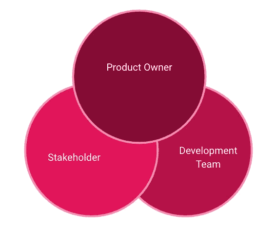
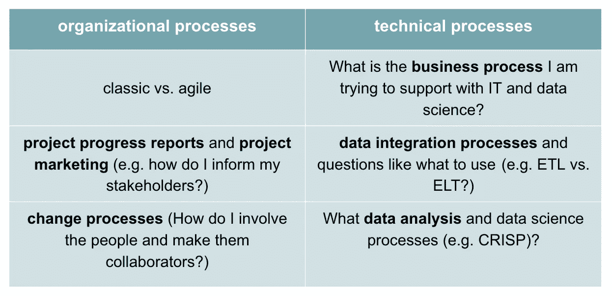

# 数据科学项目的 5 P

> 原文：<https://towardsdatascience.com/the-5-ps-of-data-science-projects-e1d2c4e66583?source=collection_archive---------25----------------------->

## 关于如何成功管理数据科学项目的动力和见解

汤米·阮在 [Unsplash](https://unsplash.com/s/photos/oregon?utm_source=unsplash&utm_medium=referral&utm_content=creditCopyText) 上的照片

管理数据科学项目需要几个因素和部分。本文将为您提供五个关键要素:目的、人员、过程、平台和可编程性[1]，以及您如何在项目中从这些要素中获益。

## P 1:目的

就像在项目管理的经典方法中一样，目标或目的应该总是明确的。可能的例子有:

*   更好的商业洞察力
*   欺诈预防/检测
*   预言；预测；预告
*   最大化问题等。

大数据或数据科学领域的项目必须有特定的目的或目标。**你永远不应该因为每个人都在做一个项目而漫无目的地工作，因为这对你或你的公司都没用。**

## P 2:人

拥有不同技能的各类人员在数据科学项目中扮演着重要角色。为了成功地处理数据，开发人员、测试人员、数据科学家和领域专家是必不可少的。

敏捷数据科学团队—作者图片

此外，**利益相关者/项目发起人**和**项目经理/产品负责人**参与数据项目。在这种关系中，前一组人必须被告知项目的进展，而后一组人的任务是在涉众和开发团队之间进行协调。更多关于如何具体组建团队的信息可以在[这里](/how-to-build-up-your-data-analytics-team-6c6967ff5114)【2】阅读。

## P 3:流程

数据科学项目中有两种主要类型的流程:**组织流程与技术流程**。下表列出了两种流程方法的问题:

你必须考虑两种不同类型的过程。一方面**组织流程**和主题如:

组织流程与技术流程——作者图片

## 第 4 页:平台

除了上述因素，与您将使用什么平台进行分析和产品有关的基本和战略性问题对于成功管理数据科学项目也至关重要。可能的提问示例如下:

*   我的 IT 治理在中指定了什么？
*   我追求哪些(IT)策略？
*   以前的(IT)架构？
*   一两个速度呢？
*   我的法规遵从性/安全性要求什么？

因此，这些问题会导致更多的疑问，例如:

*   数据集成应该如何实现？(通过 Java 手动操作，而不是使用 talend、Dataflow 等工具。)
*   应该使用哪种云？(AWS 对 Google 对 Azure 以及
    公有对私有对混合)
*   我的技术要求是什么？
*   什么 SLA 最适合我的需求？(服务提供商和客户之间的合同)

如果您想了解更多关于如何构建数据分析平台的信息，[这篇文章](/how-to-set-up-an-flexible-and-scalable-data-analytics-platform-quickn-easy-5fb3a4c83745)可能会让您感兴趣。

## P 5:可编程性

最后，你要想好你要用哪些工具和编程语言？这一点当然也是由 IT 治理和战略以及对上述问题的回答所决定和影响的。

工具和编程语言的例子有:

*   编程语言:SQL，Python，R
*   大数据工具:Hadoop、谷歌的云存储&大查询、AWS 红移和 S3
*   流媒体软件:Kafka，Spark，talend
*   BI 工具:Tableau、Qlik、Google Data Studio

## 结论

当在数据科学项目中工作甚至管理它们时，您会认识到应该考虑各种因素。上述五个 P 将为您提供成功管理数据科学项目所需的最重要信息。此外，他们会问你一些你在项目中可能会问自己的问题。要了解更多信息，您可以点击下面的链接。

## 资料来源和进一步阅读

[1] Kaggle ( [Ravi Chaubey](https://www.kaggle.com/ravichaubey1506) )，[什么是数据科学？？5 P 的！！](https://www.kaggle.com/getting-started/164960) (2020)

[2]克里斯蒂安·劳尔，[如何建立一个现代数据分析平台](/how-to-set-up-an-flexible-and-scalable-data-analytics-platform-quickn-easy-5fb3a4c83745) (2020)