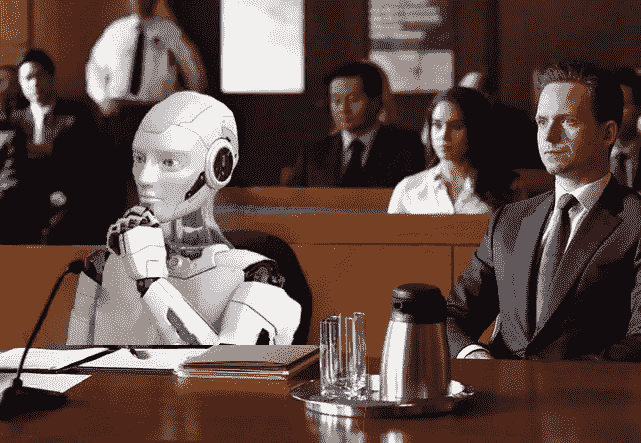
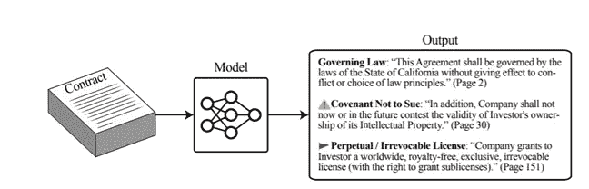
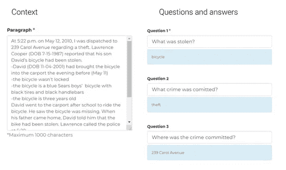
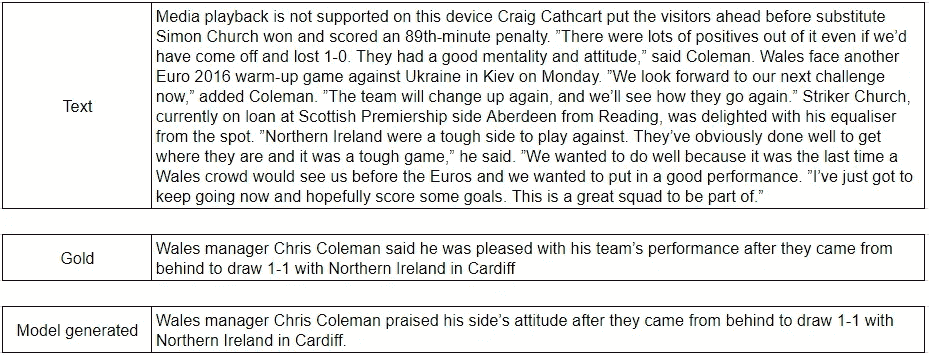

# 人工智能将改变法律行业的 5 种方式

> 原文：<https://towardsdatascience.com/the-5-ways-artificial-intelligence-will-change-the-legal-industry-23b1eaacd754?source=collection_archive---------27----------------------->

回到 2016 年，在我攻读(税法)硕士学位期间，我们被告知，五年内 40%的律师将被电脑取代。对我来说，这是从事数据科学职业的原因之一。现在，五年过去了，事实证明法律行业的自动化程度比预期的要高。法律实践与技术有很大不同，法律流程需要大量的领域知识。尽管如此，在法律人工智能的科学领域还是取得了很大的进步。这项研究的目标不是自动化，而是提高法律专业人员工作的质量、知识和速度。在这篇文章中，将讨论法律人工智能的 5 个发展，它们将帮助未来的法律专业人士。

来源:西装自带 photoshop +场景

# **合同风险分析和尽职调查**

去年，开源项目发布了两个独特的法律数据集。法律学生和志愿者标记了数千份尽职调查报告和法律合同。他们标记了必须审阅的重要部分，而不是不需要人工审阅的大部分文本。如今，律师和并购专家花大量时间阅读厚厚的合同和报告。这被认为是工作中比较无聊的部分。有了这两个新的数据集，改进的模型被训练以提取需要审查的部分。模型不仅被训练来提取重要的部分，而且被训练来按类别对它们进行分类，如下图所示:

来自:【https://arxiv.org/pdf/2103.06268.pdf 

对于管辖法律和到期日期标签，模型提取**和**预测 95%的正确标签。但是对于“不起诉契约”的标签，这个数字只有 15%。总体提取精度目前还不足以帮助律师使用该模型，但随着更多的数据和更好的模型，这种情况有望很快改变。

# 合法元素检测

在人工智能研究领域，自然语言处理是一个主要的子领域。通过在维基百科的所有文章，甚至互联网的所有可用文本(普通爬行)上训练模型，这些模型在某种程度上理解语言和信息是如何构造的。BERT 模型能够根据上下文回答问题。法律工作的一部分是检查(案例)法的某些条件是否得到满足。例如，要成为盗窃，必须满足三个条件。1)必须在未经物主同意的情况下将物品从他人的占有中取走，2)必须将物品带走，3)必须有偷窃的意图。BERT 模型可用于部分分析法律文档，并检查是否满足某些条件。当 BERT 模型以警方报告为背景时，它可以正确地回答关于犯罪的问题:

截图自 Pragnakalp.com

如果你想用你自己的文本和问题来试试，你可以在这个网站上查看一个演示:

<https://www.pragnakalp.com/demos/BERT-NLP-QnA-Demo/>  

下一步是用法典编纂和判例法本身代替问题，以检查是否符合法律条件。这将需要(大量)具体的研究，因此这种解决方案可能需要一段时间才能投入商业使用。

# 字母生成

一种已经在使用的解决方案是字母生成。一些小的法律问题，比如吸引人的停车罚单，通常是大批量的工作。给市政府或法院的信通常是相同的，只有个人信息需要调整。法律费用很少，所以这是自动化的理想选择。在美国和英国，不付钱是存在的。这是一个帮助你解决各种小的、标准的法律问题的应用程序:

# 摘要

法学院的学生必须熟记大量的判例法。判例法的摘要可以广泛地用来学习法律规范。一旦这些学生获得学位，他们必须跟上每周发布的新判例法。法律专业人士还必须阅读大量其他文件。缺少总结导致律所自己总结。这消耗了相关法律专业人员的大量时间，他们无法为客户工作。

摘要有两种方法:提取和抽象。摘要是选择文档中最重要的句子，并将这些句子作为摘要。抽象概括是生成概括了文档核心的新文本。摘要是一项困难的任务，大多数人可能会对同一个文档产生不同的摘要。

2020 年，谷歌发布了所谓的 Pegasus 模型。在一些数据集上，该模型实现了类似人类的性能，这意味着一个测试组的大部分人更喜欢 Pegasus 生成的摘要而不是人类生成的摘要。在下面的例子中，首先显示原始文本，然后是人工摘要(标签)，最后是 Pegasus 生成的摘要:

飞马座的例子

Pegasus 模型也在 BigPatent 数据集上进行了训练。这是一个包含专利和人类专利摘要的数据集。Pegasus 获得了迄今为止所有模型中最好的 Rouge-score(语言模型的性能测量指标)，得分为 53%，这意味着生成的摘要中有 53%的单词与人类摘要中的相同。

我测试了 Pegasus 的案例法总结。这不是很有效。一个特定的判例法摘要数据集将解决这个问题。飞马座的好处是只需要 1，000 个概要就可以得到最新的结果。

# **法律判决预测**

法律人工智能中比较炒作的一个部分是法律判决预测。这个领域的目标是在已知案件事实的情况下，预测法庭案件的结果。2019 年，[本文](https://www.aclweb.org/anthology/P19-1424.pdf)使用欧洲人权法院的英文法律预测数据集显示了有希望的结果。经过训练的模型能够以超过 90%的精确度预测一个法庭案件是否违反了人权条款。预测哪一条被违反的任务显然更难。该模型仍然能够正确预测超过 65%的病例。

目前有可能预测一个潜在的法院案件上诉是否有机会赢得欧洲人权法院。下一步是向数据中添加更多的司法领域，这样就可以预测更多的法庭案件。附加价值将是为客户快速检查一个案例是否有希望。

本文评述了法律人工智能的五个主要发展。我选择这 5 项技术是因为它们每年都被大量研究和改进。按照这种速度，从现在到 10 年，这 5 项技术将在法律行业实现商业化和应用。