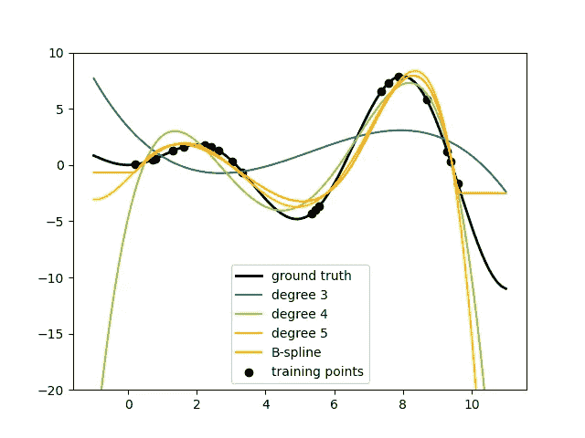
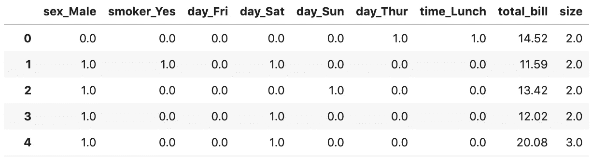
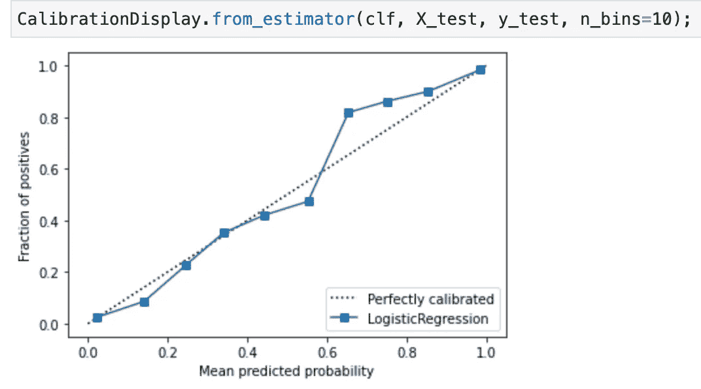

# sci kit-learn 1.0 版的 6 分钟指南有所变化😎

> 原文：<https://towardsdatascience.com/the-6-minute-guide-to-scikit-learns-version-1-0-changes-91b739d99f71?source=collection_archive---------11----------------------->

## 最热门歌曲的快速浏览🎸

Scikit-learn 多年来一直是主要的 Python 机器学习库。迁移到 1.0 版本并没有带来很多重大的突破性变化，但它确实包含了一些 bug 修复、一些新特性、一些加速和一大堆 API 清理。🧹

一个更加一致的 API 对新老用户来说都是极好的。在本文中，我将深入探讨这些变化，以便您知道如何利用 1.0 版本。🎉


这只柯基很兴奋！资料来源:pixabay.com

## 新功能

现在 scikit-learn 让你用`preprocessing.SplineTransformer`创建 B 样条。我认为样条类似于更细粒度的多项式变换。如下图所示，样条可以更容易地避免高次多项式的荒谬外推。



来源: [scikit-learn 文档](https://scikit-learn.org/dev/auto_examples/linear_model/plot_polynomial_interpolation.html)

詹姆斯等人在他们最近更新的机器学习试金石 [*统计学习介绍，第二版*](https://www.statlearning.com/) 中都是关于样条的。

## OneHot 编码器改进🎉

我最喜欢的 1.0 改动是对`OneHotEncoder`。现在，您可以删除编码产生的第一个类别，转换步骤可以接受它以前没有见过的值。具体来说，`Feature preprocessing.OneHotEncoder`现在支持`handle_unknown='ignore'`和`drop='first'`。如果您想对您的模型进行推理，这种增强特别有用。


资料来源:https://www.peacocktv.com/

## 熊猫爱🐼❤️

最近的 scikit-learn 版本增加了与熊猫一起工作的其他改进。版本 1.0 带来了更好地跟踪进出 scikit 的列名的能力-学习转换器和估计器。以下更改将使在 scikit-learn 中使用数据框架变得更好。

现在，当您将数据帧传递给估算器并调用 fit 时，估算器会将特性名称存储在`feature_names_in_`属性中。同时，`get_feature_names_out`已经被添加到 transformer API 中，以返回输出特性的名称。注意`get_feature_names`已经被弃用。

`get_feature_names_out`并不适用于所有的变形金刚，但它适用于`ColumnTransformer`。例如，以下是如何对来自 [tips 数据集](https://raw.githubusercontent.com/mwaskom/seaborn-data/master/tips.csv)的分类列进行一次编码，并返回到具有有意义的列名的数据帧:

```
# ... read in tips dataset and split into train and test setsfrom sklearn.compose import make_column_transformer
from sklearn.preprocessing import OneHotEncoderohe = OneHotEncoder(
    sparse=False, 
    drop='if_binary', 
    handle_unknown='ignore', 
)tfd = make_column_transformer(
    (ohe, ['sex', 'smoker', 'day', 'time']),   
    remainder='passthrough',
)X_train_encoded = tfd.fit_transform(X_train)X_train_encoded = pd.DataFrame(
    X_train_encoded, 
    columns=tfd.get_feature_names_out()
)
```



数据帧 post-one-hot 编码和重组。来源:杰夫的代码

我希望 scikit-learn 的 OneHotEncoder 能够提供一个选项，当您传递给它一个数据帧时，它会返回一个数据帧。我希望您也可以轻松地指定想要编码的列的子集。[类别编码器包](https://github.com/scikit-learn-contrib/category_encoders)有一个 OneHotEncoder 类，具有这两个优点，但是在撰写本文时这个库还没有被维护。😢

## 一致性

为损失或标准参数指定`squared_error`,过去您可能已经用另一个名称指定了相同的内容。

同样适用于通过`absolute_error`。过去你可能用过`mae`或类似的东西，但现在你只需要通过`absolute_error`。


一些不错的 API 清理。资料来源:pixabay.com

## 分离

诸如`LinearRegression`、`Lasso`和`Ridge`等`linear_model`算法中的`normalize`选项现已被弃用。为了获得相同的行为，在将转换后的数据传递给线性模型之前，首先将您的特征输入到`StandardScaler(with_mean=False)`中。这种变化将预处理和建模问题分开。

## 灵活性💪

我教我的学生使用`metrics.plot_confusion_matrix`和`metrics.plot_precision_recall_curve`快速绘制混淆矩阵或精确回忆曲线。在旧版本中，您必须传递 scikit-learn 分类器和数据。这通常会导致重复的模型拟合。

使用 1.0，您仍然可以拟合模型并一步绘制结果，或者您可以只传递模型输出并获得您的图。

具体来说，`metrics.ConfusionMatrixDisplay`现在有两个类方法:`from_estimator`和`from_predictions`，可以选择是拟合和绘图还是只绘图。同样，`metrics.PrecisionRecallDisplay`有`from_estimator`和`from_predictions`方法来创建精确召回曲线。

与上述绘图功能的增强一样，Scikit-learn 的`calibration.CalibrationDisplay`现在可以使用`from_estimator`或`from_predictions`方法绘制校准曲线。

如果你已经从`predict_proba`中得到预测的概率，使用`from_predictions`。


来源:杰夫的代码

否则，将 fit 分类器的一个实例以及 X 和 y 数据传递给`from_estimator`。



来源:杰夫的代码

另外两个 API 改进可以为您的工作流提供更大的灵活性。

递归特征消除通过迭代地移除最没有价值的特征来减少特征的数量，这由指定的算法来确定。在过去，你不能轻易地将参数传递给 RFE 所使用的估计量。现在有了`feature_selection.RFE.fit`你就可以了。🚀

我喜欢预先处理我丢失的值，但是如果你不这样做，`preprocessing.OrdinalEncoder`可以接受丢失的值。多方便啊。🙂

## 毕业🎓

`HistGradientBoostingClassifier`和`HistGradientBoostingRegressor`已经不是实验性的了，不需要特意导入。


不再是实验性的。资料来源:pixabay.com

## 速度提升🚀

我只想说有一些速度上的改进。我最兴奋的是`preprocessing.PolynomialFeatures.`的提升

## 需要关键字…有时

最后，但同样重要的是，为了提高清晰度，许多参数现在需要关键字参数而不是位置参数。这一变化对新用户来说尤其有益。我继续寻找一些没有强制关键字参数的地方，但是寻找这种远离位置参数的趋势继续下去。

# 包装

以上是我在 1.0 版本中最成功的作品。总之，1.0 版本有一些不错的变化，但我认为 0.24 版本中的新增内容更加丰富。点击这里查看我的变化指南——我打赌你会学到一些新东西。😀

## 尝试一下

使用`pip install -U scikit-learn`升级到最新稳定的 scikit-learn 版本。

非常感谢项目维护人员和所有为发布做出贡献的人！点击这里查看完整的变更日志[。](https://scikit-learn.org/dev/whats_new/v1.0.html#changes-1-0)

我希望这篇 scikit-learn 1.0 中的基本变化指南对您有所帮助。如果你有，请分享到你最喜欢的社交媒体上。😀

我写关于数据科学、机器学习、 [Python](https://memorablepython.com) 和其他有趣的话题。如果你对此感兴趣，请在此处阅读更多并订阅我的 [Data Awesome 时事通讯](https://dataawesome.com/)，获取有用数据资源的不定期更新。


资料来源:pixabay.com

sklearning 快乐！👍