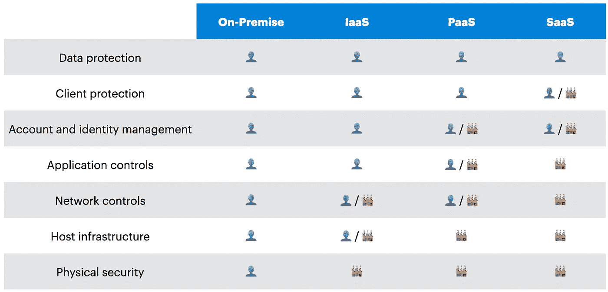

# 你在云中负责的 6 件事

> 原文：<https://towardsdatascience.com/the-6-things-you-are-responsible-for-in-the-cloud-c513ac07905e?source=collection_archive---------17----------------------->

## 了解云模型以及与服务提供商的共同责任

[Cytonn 摄影](https://unsplash.com/@cytonn_photography?utm_source=medium&utm_medium=referral)在 [Unsplash](https://unsplash.com?utm_source=medium&utm_medium=referral) 上拍照

在关于云系列中的数据的第二篇文章中，我们将探讨一个在云中出现的有趣概念:共享责任模型。当考虑迁移到云时，您应该首先了解不同的云选项，以及这将如何影响您的组织。根据您选择的部署模型，您将拥有更高或更低的责任。

如果您错过了《云的数据》系列的第一篇文章，我建议您首先阅读《云将如何帮助(或不帮助)您的业务》一文，因为我们将使用其中解释的几个概念。

# 了解不同的部署模型

现在，我们准备开始了。首先，您必须了解不同的云模型，因为根据不同的模型，您的责任程度会有所不同。不同的部署模型如下:

*   **☁️公共云**:当你使用公共云时，你是在订阅的基础上使用计算资源。这些资源可以是硬件，如存储或 CPU，也可以是软件，如数据库或应用服务器。当谈到云时，我们通常关注公共云。
*   **🔐私有云**:顾名思义，私有云是由你的公司拥有和管理的。这种类型的云违背了我们在本系列第一篇文章中看到的原则，因为它有很高的前期成本(CapEx)。然而，私有模型能够更好地解决当今组织的安全和隐私问题。
*   **🧬混合云**:这就像一个拥有超能力的私有云。这是前面解释的两种部署模型的混合。许多公司使用这种部署模式，借助公共云的力量快速扩展其私有资源。
*   **👥社区云**:这不太为人所知，因为它并不常见。当属于一个社区的几个组织共享相同的资源时，就会用到它。大学或政府都是这种部署模式的用例。

# 现在，让我们来探索服务模型

好的，我们有几种类型的服务模型，但是我们能在它们上面找到什么样的服务呢？

*   **🏗基础设施即服务(IaaS)** :在这种服务模式中，您通过互联网获取计算资源，如计算、存储或网络。正如我们在该系列的第一篇文章中所评论的那样，基于现收现付的定价模式，您将根据所需的容量和使用时间付费。
*   **🏭平台即服务(Paas)** :在这里，您可以访问多种资源，在这些资源中，您可以构建应用并将其交付给最终用户，而无需管理底层基础架构。这种服务模式的主要缺点是，与其他两种选择相比，它的成本更高。
*   **🏠软件即服务(Saas)** :这是最高层次的抽象。在 SaaS，您将获得最终用户解决方案。当谈到云时，我们经常提到 SaaS，因为作为用户，你可以访问的服务类型。SaaS 的例子有 Google Drive、Office 365 或 Salesforce。

# 云中的共同责任

我相信此时您已经知道了不同的云部署模型和服务类型，所以现在，让我们深入到本文的主题:共同责任。

这个概念的出现是为了更好地理解作为云客户你必须关注哪些方面，以及云提供商负责哪些方面。该模型分为 7 个要点:

*   **📄数据分类和责任**:管理、分类或满足任何合规义务的责任总是在客户方。云提供商为您提供了一套工具来帮助您完成这项任务，如数据加密、数据丢失预防、审计等。
*   **🛡客户端保护**:指最终用户用来访问云的设备(移动或 PC)。这也完全是客户的责任。
*   **🔑身份和访问管理**:这对于任何组织来说都很重要，因为它提供了访问云资源的能力。身份是指谁(特定用户)正在访问您的云，访问控制该用户可以使用哪些特定服务。在平台即服务和 SaaS，这是客户和云提供商的共同责任。此外，云提供商将为您提供一个工具集来管理身份验证和授权的安全性，如多因素身份验证(MFA)、基于角色的访问控制(RBAC)或审计。
*   **🗃应用程序控制**:使用托管应用程序是一种减少管理应用层(如补丁管理、反恶意软件或底层平台配置)的责任的方式。在 IaaS 中，客户有完全的责任，但是在 PaaS 中，客户只需要配置它，云提供商将负责其他方面。在 SaaS，这个点完全由你的服务提供商管理。
*   **📡网络控制**:包括网络层的配置、管理和保护，如 DNS、网关、负载平衡或虚拟网络。在 IaaS 和 PaaS 中，这一点在客户和服务提供商之间是相同的，但也有所不同。在 PaaS 中，大部分配置和管理都在服务提供商一方，但是客户只承担很少的责任。在 SaaS，大部分责任由服务提供商承担。
*   **🏗主机基础设施**:包括计算(如容器或虚拟主机)、存储(如 CDN 或对象存储)和平台服务的配置、管理和保护。在 IaaS 中，这是一项共同的责任。虽然客户对基础设施有更多的控制权，但云提供商必须确保底层元素能够通信并得到正确配置。在更高的抽象层次上(PaaS 和 SaaS)，服务提供商负责这一点。
*   **🏢物理安全**:由于不会发生在内部部署方案中，服务提供商始终负责(在所有 3 种模式中)物理安全，如维护和保护建筑、服务器机房、服务器电源和冷却，或更换有缺陷或旧的组件，如硬盘或处理器。

👤代表客户，以及🏭代表服务提供商

# 摘要

在不断变化的世界中，缩短上市时间和使您的 IT 能力适应需求是可以转化为竞争优势的两个关键点。像你我一样，每个人都需要不断调整自己的业务以适应新的市场需求。此外，重要的是要明白，在当今世界，每个人都期望技术能够完美地工作，此外，一个不能正常工作或表现不佳的产品可能会成为改变竞争对手的动力。

正如我们在上一篇文章中所讨论的，云有很多优点，但是，我们不能忽视某些方面。在这篇文章中，我们详细介绍了我们关注的要点。根据服务模式，云提供商将承担一些责任，另一方面，我们作为客户，必须采取行动。

感谢阅读云系列数据第二贴。在下一篇文章中，我们将重点关注云安全，并将其与本地解决方案进行比较。