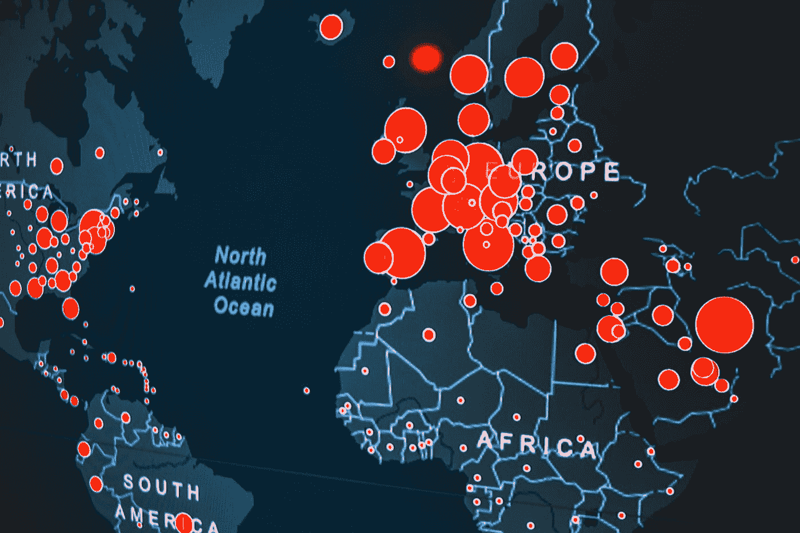
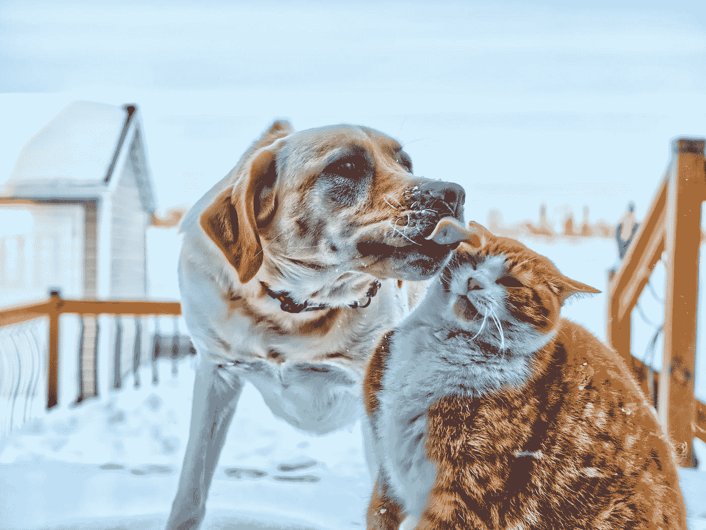
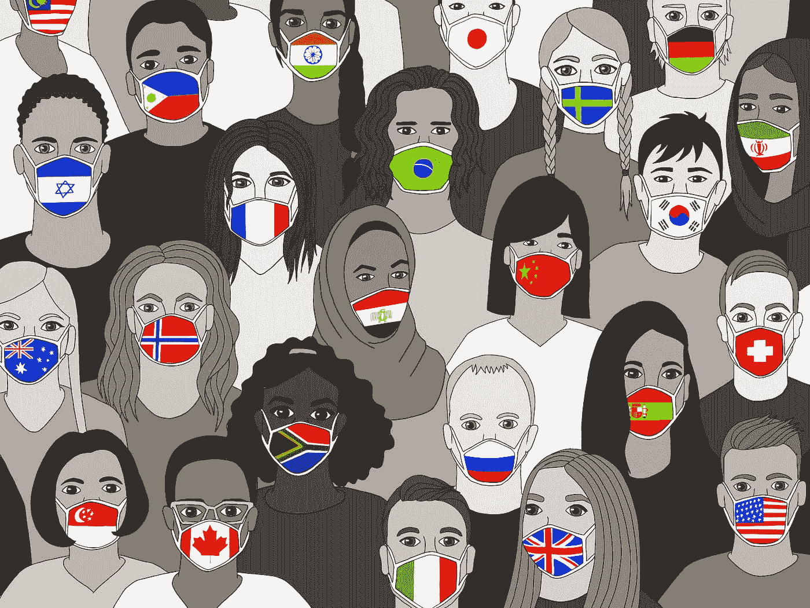

# 我计划在 2021 年完成的 7 个数据科学项目

> 原文：<https://towardsdatascience.com/the-7-data-science-projects-i-plan-on-completing-in-2021-5f7dd5cda72f?source=collection_archive---------15----------------------->

## 我计划如何在年底前利用这些项目来提高我的数据科学技能。

凯尔·汉森在 [Unsplash](https://unsplash.com?utm_source=medium&utm_medium=referral) 上的照片

2020 年底，就在所有人都在制定新年计划的时候，我决定 2021 年的目标是开始学习数据科学。

我开发的[学习课程的一部分](/the-step-by-step-curriculum-im-using-to-teach-myself-data-science-in-2021-c8eab834a87c)聚焦于完成项目的重要性，这是一种加深我的知识并开始应用我所学技能的方式。

</the-step-by-step-curriculum-im-using-to-teach-myself-data-science-in-2021-c8eab834a87c>  

这就引出了这篇文章:列出我计划在今年完成的 7 个数据科学项目，以及这些项目将如何增强我在特定领域的技能。我想选择专注于我感兴趣的主题的项目，我也选择附带源代码的项目，如果我遇到困难，我可以参考这些源代码。此外，我还想挑选一些比那些经常分享的项目更独特的项目。所以，事不宜迟，让我们直接开始吧！

# 项目#1:可视化传播的病毒

埃里克·麦克林在 [Unsplash](https://unsplash.com?utm_source=medium&utm_medium=referral) 上的照片

*   语言:Python
*   难度:初学者
*   数据集:[小说电晕病毒 2019 数据集](https://www.kaggle.com/sudalairajkumar/novel-corona-virus-2019-dataset)
*   源代码:[如何用 Choropleth 图谱可视化冠状病毒疫情](/visualizing-the-coronavirus-pandemic-with-choropleth-maps-7f30fccaecf5)

无论你把它归因于病态的好奇心还是理解数据可视化的需要，这个项目看起来都是显而易见的。疫情给了我们大量的数据来指导和可视化。此外，我一直着迷于人们能够构建的美丽的可视化地图。因此，将这个简单的项目作为我对数据科学的第一次尝试是有意义的。

## 使用的技能:

*   Python 库(NumPy，pandas，Plotly)
*   使用 choropleth 图的数据可视化

# 项目#2:猫和狗的分类

照片由[阎](https://unsplash.com/@majomaya?utm_source=medium&utm_medium=referral)在 [Unsplash](https://unsplash.com?utm_source=medium&utm_medium=referral) 上拍摄

*   **语言:** Python
*   **难度:**初学者
*   **数据集:** [猫狗数据集](https://www.kaggle.com/c/dogs-vs-cats/data)
*   **源代码:** [猫 vs 狗分类](https://data-flair.training/blogs/cats-dogs-classification-deep-learning-project-beginners/)

无论你是喜欢猫的人还是喜欢狗的人，这个项目都有适合每个人的东西。老实说，我只是想做这个项目，这样我就可以看看可爱的动物图片。我想我也想提高我的神经网络和深度学习技能。

## 使用的技能:

*   Python 库(NumPy、pandas、Keras、scikit-learn、MatPlotLib)
*   神经网络
*   深度学习
*   数据可视化

# 项目#3:实时面具检测

照片由[联合国新冠肺炎回应](https://unsplash.com/@unitednations?utm_source=medium&utm_medium=referral)于 [Unsplash](https://unsplash.com?utm_source=medium&utm_medium=referral)

*   **语言:**巨蟒
*   **难度:**初学者
*   **数据集:**人脸[面具数据集](https://data-flair.training/blogs/download-face-mask-data/)
*   **源代码:** [实时人脸面具检测](https://data-flair.training/blogs/face-mask-detection-with-python/)

由于口罩不会很快消失，为什么不充分利用糟糕的情况，从事一项机器学习项目，检测你是否戴着口罩？面部识别一直让我感兴趣，所以这个项目的想法是显而易见的。

## 使用的技能:

*   Python 库(Keras、OpenCV、NumPy、scikit-learn)
*   机器学习
*   神经网络

# 项目#4:音乐流派分类

照片由[阿列克谢·鲁班](https://unsplash.com/@intelligenciya?utm_source=medium&utm_medium=referral)在 [Unsplash](https://unsplash.com?utm_source=medium&utm_medium=referral) 上拍摄

*   **语言:** Python
*   **难度:**中级
*   **数据集:** [GTZAN 数据集](http://marsyas.info/downloads/datasets.html)
*   **源代码:** [音乐流派分类](https://data-flair.training/blogs/python-project-music-genre-classification/)

由于过去十年中制作的所有音乐听起来完全一样，一个按流派对音乐进行分类的程序对于避免混淆非常有用。音乐不是我真正喜欢的东西，但这是一个如此独特的项目，我不得不把它添加到我的列表中。机器学习可以使用音乐文件的频域和时域对其进行分类。一旦经过分析，这些歌曲将被分为十种不同的音乐类型。

## 使用的技能:

*   Python 库(NumPy)
*   机器学习
*   深度学习
*   k-最近邻

# 项目#5:道路车道线检测

Jaromír Kavan 在 [Unsplash](https://unsplash.com?utm_source=medium&utm_medium=referral) 上拍摄的照片

*   **语言:** Python
*   **难度:**中级
*   **源代码:** [车道线检测](https://data-flair.training/blogs/download-lane-line-detection-project-source-code/)

自动驾驶汽车已经走过了漫长的道路，毫无疑问，它们将在我们的未来发挥重要作用。如果你仔细想想，这有点令人毛骨悚然，仅仅几行代码就能阻止一辆汽车越过白色实线进入迎面而来的车流。像许多人一样，我对这项技术很警惕，所以我认为亲自动手看看它实际上是如何工作的是个好主意。

## 使用的技能:

*   Python 库(Numpy、MatPlotLib、OpenCV)
*   深度学习
*   机器学习
*   计算机视觉

# 项目#6:假新闻检测

照片由[奥比·奥尼耶多尔](https://unsplash.com/@thenewmalcolm?utm_source=medium&utm_medium=referral)在 [Unsplash](https://unsplash.com?utm_source=medium&utm_medium=referral) 上拍摄

*   **语言:** Python
*   **难度:**进阶
*   **数据集:** [news.csv](https://drive.google.com/file/d/1er9NJTLUA3qnRuyhfzuN0XUsoIC4a-_q/view)
*   **源代码:** [用 Python 检测假新闻](https://data-flair.training/blogs/advanced-python-project-detecting-fake-news/)

这个项目在过去四年的任何时候都会非常有用。然而，仅仅因为邪恶的女巫死了，并不意味着假新闻会很快停止。因此，为什么不构建一些东西来扩展我的数据科学技能，并且在需要说出一些难以接受的事实时也很有用呢？

## 使用的技能:

*   Python 库(NumPy、pandas、scikit-learn)
*   机器学习
*   模型建立和拟合

# 项目#7:股票市场价格预测

在 [Unsplash](https://unsplash.com?utm_source=medium&utm_medium=referral) 上由 [Austin Distel](https://unsplash.com/@austindistel?utm_source=medium&utm_medium=referral) 拍摄的照片

*   **语言:** Python
*   **难度:**进阶
*   **数据集:** [标准普尔 500 强公司列表&](https://en.wikipedia.org/wiki/List_of_S%26P_500_companies)
*   **源代码:** [股票市场价格预测](https://blog.edugrad.com/stock-price-prediction-using-machine-learning-deep-learning-techniques-with-python-code/)

由于其不确定性因素，股票市场价格预测经常被认为是初学者数据科学项目的圣杯，它将是测试我的数据科学技能在过去一年中如何增长和提高的一种很好的方式。虽然这个项目可能希望渺茫，但我还是把它放在这里，当我有雄心壮志的时候。因为这个项目非常密集，所以我包含了一些额外的资源，如果我遇到困难，这些资源可能会派上用场。

## 其他资源:

</predicting-stock-prices-with-python-ec1d0c9bece1>  </simple-stock-price-prediction-with-ml-in-python-learners-guide-to-ml-76896910e2ba>  </stock-prediction-in-python-b66555171a2>  

## 使用的技能:

*   Python 库(pandas、NumPy、scikit-learn)
*   机器学习
*   深度学习
*   线性回归
*   递归神经网络体系结构

# 最后的想法。

感谢互联网上的大量可用资源，我能够选择各种各样的项目，这些项目侧重于我希望改进的数据科学的不同领域。每个项目都将帮助我实践和发展我在课程的每个部分(编程、数学和统计、数据分析和可视化以及机器学习)中学到的技能。我选择的项目的美妙之处在于它们都是可扩展的，因此在未来，我可以构建类似的项目来分析不同的数据集或完成不同的任务。

随着新的一年带来一个新的开始，这是一个绝佳的时机，让你一头扎进去，努力完成一个新的目标。感谢热情的数据科学社区，一旦我分享了我的成果，我期待着对我的项目提出建设性的批评。为新的一年和完成大目标干杯！