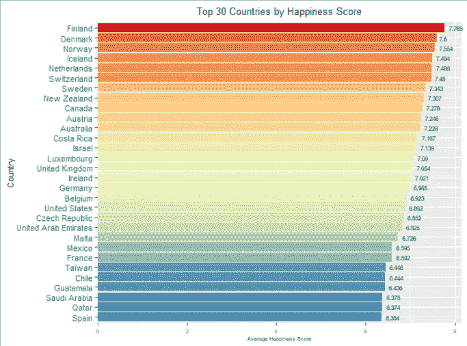
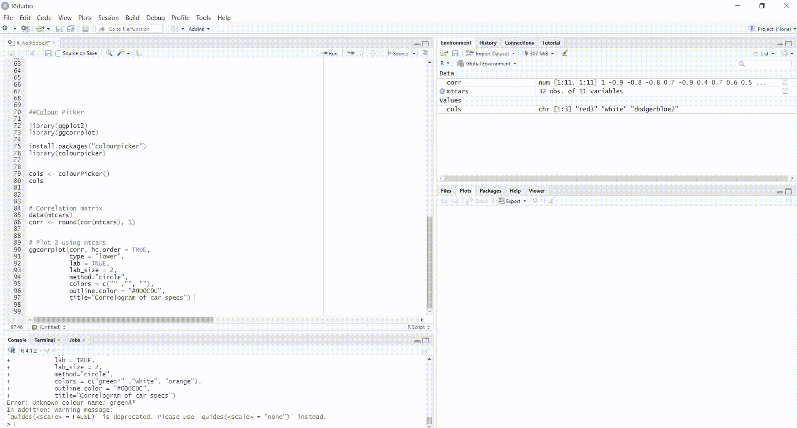
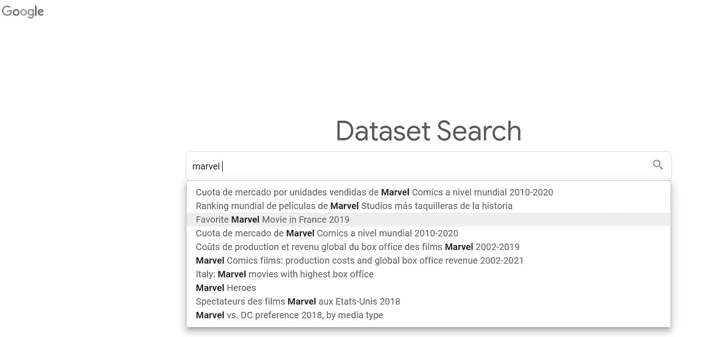
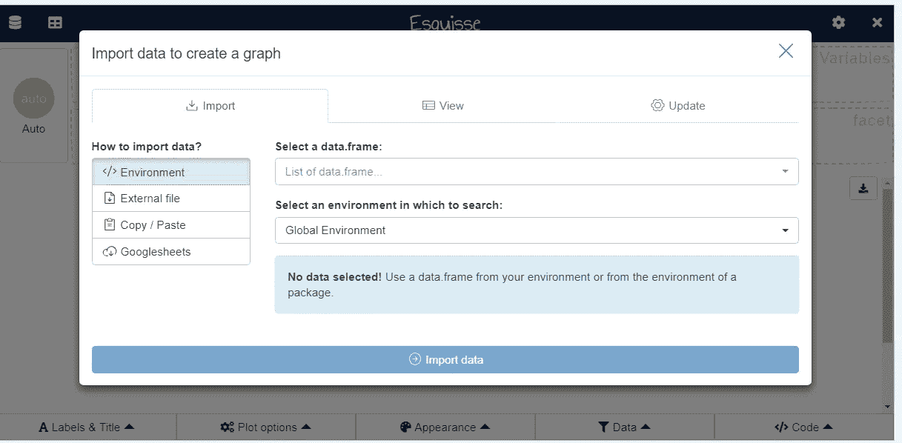
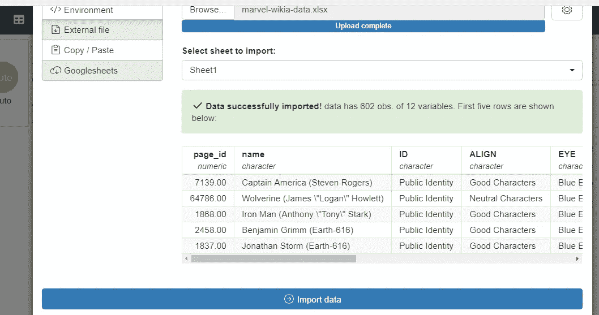
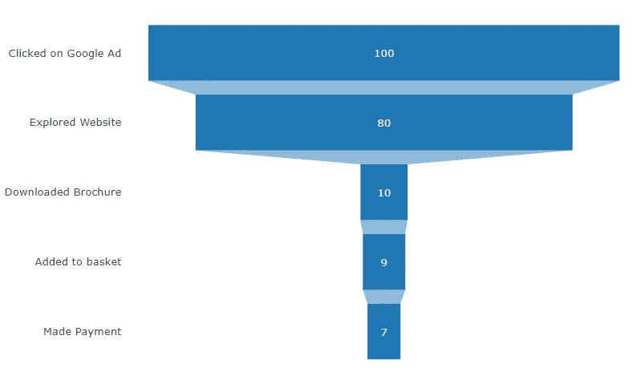
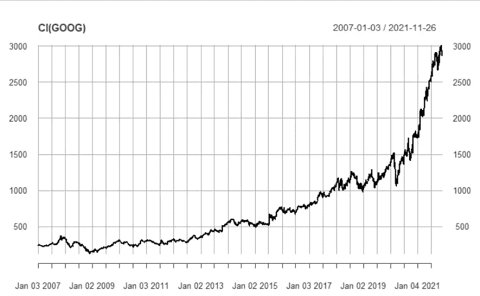
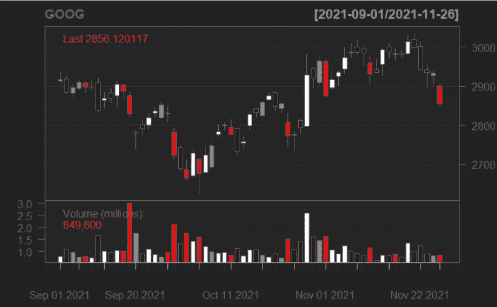
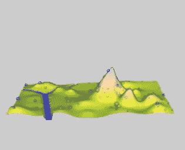
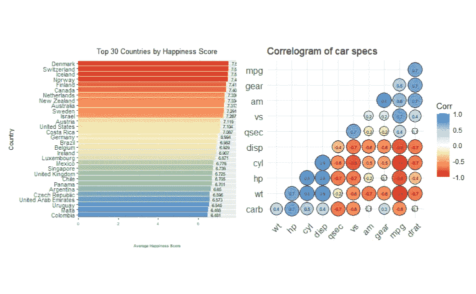

# 数据可视化应该使用的 7 R 软件包

> 原文：<https://towardsdatascience.com/the-7-r-packages-you-should-be-using-for-data-visualisation-e29010cefe51?source=collection_archive---------2----------------------->

## 带有示例代码和免费数据集


乌萨马·阿扎姆在 [Unsplash](https://unsplash.com?utm_source=medium&utm_medium=referral) 上的照片

# 介绍

> “不是你做什么，而是你怎么做。”―切里·胡贝尔[痛苦是可有可无的:自由和快乐的三把钥匙](https://www.goodreads.com/work/quotes/28250)

拥有数据却不知道如何将它可视化，这就是我所说的自我折磨。所以，就像 Cheri 说的，自由和快乐有三把钥匙——我的理解是——***数据+ R +这 7 R 包。***

# 数据

您可以使用我选择的数据集来遵循我的代码，也可以使用您自己的数据集。这里有一些寻找免费开源数据集的好资源:

1.  [*在哪里可以找到免费数据集&如何知道它们的质量好不好马特·大卫(2021)*](https://chartio.com/learn/data-analytics/where-to-find-free-datasets/) 。
2.  r 的内置[数据](https://stat.ethz.ch/R-manual/R-devel/library/datasets/html/00Index.html)集。r 允许你在 [GNU 通用公共许可证](https://www.gnu.org/licenses/old-licenses/gpl-2.0.html)下将这些数据集用于商业用途。
3.  [*Hiren Patel(2019)*](https://www.freecodecamp.org/news/https-medium-freecodecamp-org-best-free-open-data-sources-anyone-can-use-a65b514b0f2d/)*这些是任何人都可以使用的最好的免费开放数据源。*

# 7r(非致命)包装

## 1.GGPLOT2

让我们从使 R 成为可视化最佳语言的原始库开始— **ggplot2** 。我正在使用来自 Kaggle 的数据集，你可以在这里找到(可持续发展解决方案网络，2019，[许可证 CC0:公共领域](https://creativecommons.org/publicdomain/zero/1.0/))。该数据着眼于全球幸福状况:



作者来源

## 密码

```
**### GGPLOT2 EXAMPLE CODE
### LOAD KAGGLE DATA *(****Sustainable Development Solutions Network, 2019,* [*License CC0: Public Domain*](https://creativecommons.org/publicdomain/zero/1.0/)*)***#Load packages**library(openxlsx)
library(ggplot2)
library(RColorBrewer)**#Read in the first worksheet from the Excel workbook HappinessAlcoholConsumption.xlsx**library(dplyr)
data("happy", package = "ggplot2")
happy <- read.xlsx("2019_happiness.xlsx", sheet = '2019_happiness')***#Top 30 countries***happy %>%
  group_by(Country) %>% 
  summarise(HappinessScore_Avg = mean(Score)) %>%
  top_n(30) %>%***#The average happiness score for each country in the Top 30***ggplot(aes(x=reorder(factor(Country), HappinessScore_Avg), y=HappinessScore_Avg, fill = HappinessScore_Avg)) + 
  geom_bar(stat = "identity") + 
  xlab("Country") + 
  ylab("Average Happiness Score") +***# Make sure axes start at 0***scale_y_continuous(expand = expansion(mult = c(0, 0.05))) +***# Choose a theme, axis title sizes and labelling***theme(legend.position ='none',axis.title.y = element_text(size=8), axis.text.y = element_text(size = 8), axis.title.x = element_text(size=5),axis.text.x = element_text(size = 5), plot.title = element_text(size=10, hjust = 0.5)) +
  scale_fill_gradientn(name = '',colours = rev(brewer.pal(5,'Spectral'))) +
  geom_text(aes(label = HappinessScore_Avg), hjust = -0.3, size = 2) + ggtitle("Top 30 Countries by Happiness Score") +
  coord_flip()
```

对 **ggplot2** 的一个扩展库叫做 **ggforce，**是由[Thomas Pedersen](https://github.com/thomasp85/) 开发的。它具有在数据中高亮显示不同组及其特定要素的附加功能，可帮助您更有效地讲述您的故事。这里可以看到一些 **ggforce** 的例子[。](https://rviews.rstudio.com/2019/09/19/intro-to-ggforce/#:~:text=The%20ggforce%20package%20is%20an,facets%20%2C%20and%20other%20ggplot%20functions.)

## 2.颜色选择器

不要浪费时间在谷歌上搜索你想要使用的颜色的十六进制代码，而是使用**颜色选择器**！如果你需要坚持一个定制的调色板，这是特别有用的。请参见下面的演示:



作者来源

以下是我在演示中使用的代码:

```
**##Colour Picker using R's built-in dataset called** [**mtcars**](https://stat.ethz.ch/R-manual/R-devel/library/datasets/html/mtcars.html)**(mtcars s*ource:Henderson and Velleman (1981), Building multiple regression models interactively. Biometrics, 37, 391–411*)
#Install necessary libraries**library(ggplot2)
library(ggcorrplot)install.packages("colourpicker")
library(colourpicker)cols <- colourPicker()  #the screen will pop up after this line 
cols  # return the names of the colours selected**# Create a correlation matrix using R's built in dataset - mtcars**data(mtcars)
corr <- round(cor(mtcars), 1)**# Plot mtcars**
ggcorrplot(corr, hc.order = TRUE, 
           type = "lower", 
           lab = TRUE, 
           lab_size = 2, 
           method="circle", 
           colors = c("red2" ,"white", "dodgerblue2"),
           outline.color = "#0D0C0C",
           title="Correlogram of car specs")
```

如果你想了解更多关于创建自定义调色板的内容，请点击这里查看我写的文章[。](https://medium.com/analytics-vidhya/tableau-custom-colour-palettes-544e8801c4da)

# 3.埃斯奎塞

拥有数据但不确定如何可视化？或者，不确定如何用 R 写代码？我向你介绍——**埃斯奎塞**。esquisse 包是 Zeno Rocha 在 2018 年创建的开源软件。这里的是 GitHub 库的链接。

在这个演示中，我将使用 [Google dataset search](https://toolbox.google.com/datasetsearch) 来搜索一个开源数据集，本质上是免费提供的数据集的 Google:



作者来源

它指引我到了 Kaggle，在那里我将使用与[漫威和 DC 漫画数据](https://www.kaggle.com/danoozy44/comic-characters?select=marvel-wikia-data.csv)相关的数据。

```
**#Import the necessary packages and libraries**install.packages("esquisse")
library(esquisse)**#Run the following:**
esquisse::esquisser()
```

将出现以下屏幕:



作者来源

在这里，您可以通过上传、粘贴、连接到 Google 工作表或连接到 R 的内置数据集之一来导入您的数据。上传 marvel 数据后，我会在导入之前看到一个预览窗格:



作者来源

这里有一个关于 **esquisse** 如何工作的简短演示:


作者来源

# 4.PlotlyR

PlotlyR 是一个免费的开源图形库。你可以在这里查看 GitHub 库[。我在这里要用的例子是将*在线客户旅程*形象化，因为他们沿着你的营销漏斗移动。](https://github.com/plotly/plotly.R)

```
**# Install plotly from Github to get funnel plots
# Here I make up my own data but the functionality is the purpose of this viz**devtools::install_github("ropensci/plotly")
library(plotly)fig <- plot_ly() 
fig <- fig %>%
  add_trace(
    type = "funnel",
    y = c("Clicked on Google Ad", "Explored Website", "Downloaded Brochure", "Added to basket", "Made Payment"),
    x = c(100, 80, 10, 9, 7)) 
fig <- fig %>%
  layout(yaxis = list(categoryarray = c("Clicked on Google Ad", "Explored Website", "Downloaded Brochure", "Added to basket", "Made Payment")))fig
```



作者来源

很快你就会发现问题出在你的网站上，因为这是客户流失最多的地方，也就是说，在他们下载宣传册之前，你就已经失去了大部分客户。然而，你的宣传册看起来信息量很大，因为你抓住了几乎所有下载过的客户。

# 5.Quantmod

对于任何喜欢把分析股票作为爱好或工作的人来说，Quantmod 适合你。这与金融建模息息相关。

```
**# Install quantmod**
install.packages('quantmod')
library(quantmod)**#Select the company/share you want to visualise - I chose Google's shares provided by Yahoo Finance**getSymbols("GOOG",src="yahoo") **#Plot 1: Cumulative Interest of Google Stocks Over Time**
plot(Cl(GOOG), col = 'black') 
```



作者来源

```
**#Plot 2: Candle Chart**
candleChart(GOOG,multi.col=TRUE,theme='black', subset = 'last 3 months')
```



作者来源

# 6.RGL

[**RGL**](https://cran.r-project.org/web/packages/rgl/vignettes/rgl.html#introduction) 是如果你需要在 3D 中绘制任何东西。

```
**#Install RGL**install.packages("rgl")
library("rgl")***#The next line of code produces a demo of what RGL can visualise. Follow the prompts in your console, but after pressing enter, it will produce a number of 3D visualisations***demo(rgl)
```

以下是演示产生的一些示例:



来源:[默多克，D &阿德勒，D (2021)](https://dmurdoch.github.io/rgl/reference/rgl-package.html)


来源:[默多克，D &阿德勒，D (2021)](https://dmurdoch.github.io/rgl/reference/rgl-package.html)


来源:[默多克，D &阿德勒，D (2021)](https://dmurdoch.github.io/rgl/reference/rgl-package.html)

# 7.混杂物

最后，把你所有的观想集中在一起怎么样？ **Patchwork** 是由 [Thomas Lin Pedersen](https://github.com/thomasp85) 于 2017 年发明的，目的是让这项运动变得简单。你可以从 [CRAN](https://CRAN.R-project.org/package=patchwork) 和[下载，这里](https://github.com/thomasp85/patchwork/)是 GitHub 库。

```
**#Install packages**
devtools::install_github("thomasp85/patchwork")
library(ggplot2)
library(patchwork)**# All you need to do is assign you visualisation to a variable:****#Viz 1 - named p1****p1** <-happy %>%
  group_by(Country) %>% 
  summarise(HappinessScore_Avg = mean(Score)) %>%
  top_n(30) %>%  
  ggplot(aes(x=reorder(factor(Country), HappinessScore_Avg), y=HappinessScore_Avg, fill = HappinessScore_Avg)) + 
  geom_bar(stat = "identity") + 
  xlab("Country") + 
  ylab("Average Happiness Score") + 
 scale_y_continuous(expand = expansion(mult = c(0, 0.05))) +
  theme(legend.position ='none',axis.title.y = element_text(size=8), axis.text.y = element_text(size = 8), axis.title.x = element_text(size=5),axis.text.x = element_text(size = 5), plot.title = element_text(size=10, hjust = 0.5)) +
  scale_fill_gradientn(name = '',colours = rev(brewer.pal(5,'Spectral'))) +
  geom_text(aes(label = HappinessScore_Avg), hjust = -0.3, size = 2) +
  ggtitle("Top 30 Countries by Happiness Score") +
  coord_flip()**#Viz 2- named p2****p2** <- ggcorrplot(corr, hc.order = TRUE, 
           type = "lower", 
           lab = TRUE, 
           lab_size = 2, 
           method="circle", 
           colors = c("red2" ,"white", "dodgerblue2"),
           outline.color = "#0D0C0C",
           title="Correlogram of car specs")**#Return the saved visualisations as below:****p1** +  **p2**
```

输出将如下所示:



作者来源

此外，[这里有一个指南](https://patchwork.data-imaginist.com/articles/guides/annotation.html)告诉你如何使用各种样式和注释来整理你的图表。

# 结论


在 [Unsplash](https://unsplash.com?utm_source=medium&utm_medium=referral) 上由 [Anoop Surendran](https://unsplash.com/@dataheartist?utm_source=medium&utm_medium=referral) 拍摄的照片

您现在完全有能力探索有趣的数据集。这些 R 包中的每一个在它们自己的文档和库中都有大量的例子。我鼓励你挑选一个你感兴趣的数据集，并钻研这些库。如果你喜欢这篇文章，你可能也想看看— [***这是你应该如何可视化你的数据:10 个例子来指导你的分析***](/this-is-how-you-should-be-visualizing-your-data-4512495c007b) ***。***

> *如果你想成为一个中等会员和支持者，请考虑使用我的* [*推荐链接*](https://nikkismit10.medium.com/membership) *。你的会员费直接支持你阅读的所有作家。你也可以在媒体上看到所有的故事。*