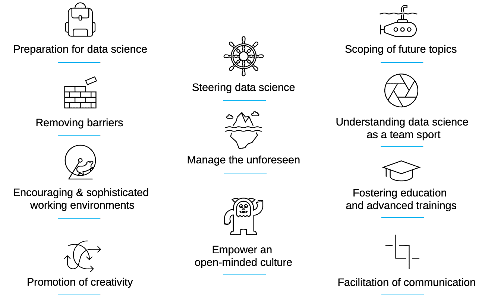
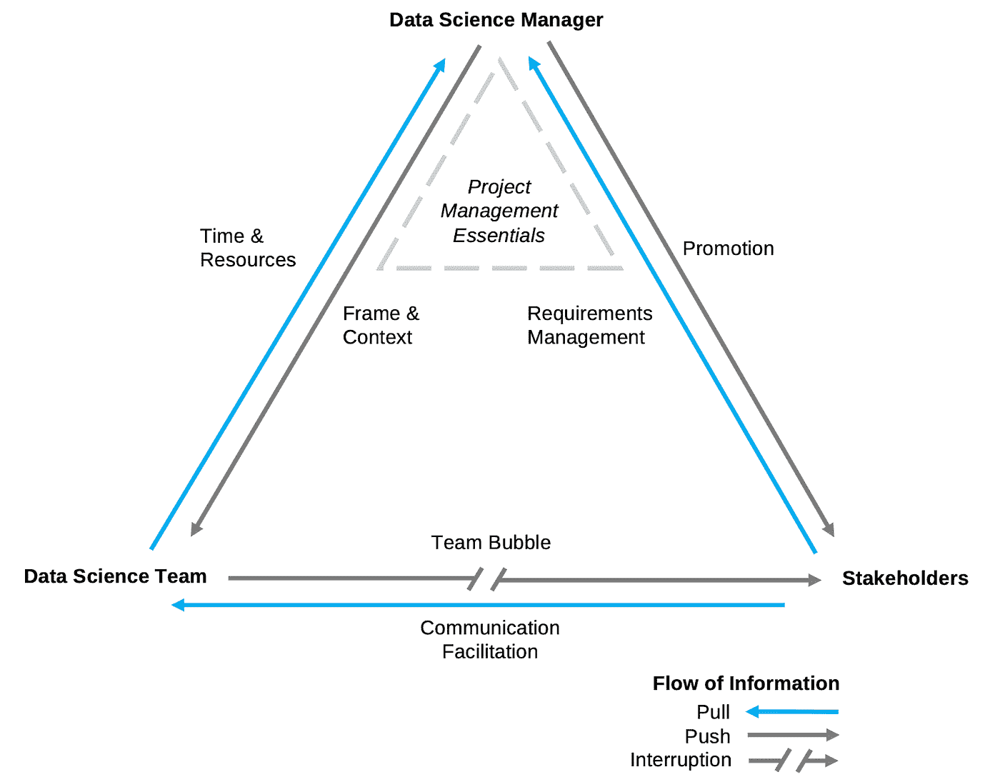
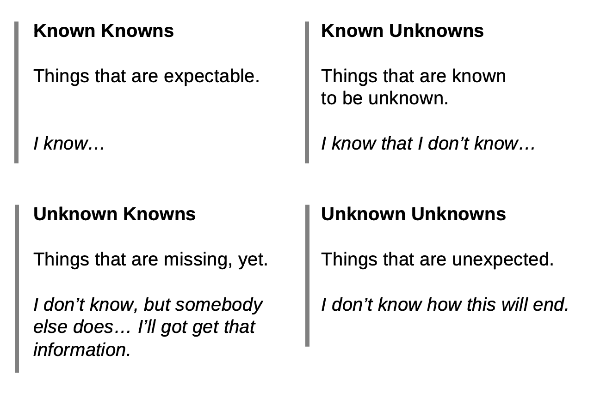

# 数据科学管理中的 7 项任务

> 原文：<https://towardsdatascience.com/the-7-tasks-in-data-science-management-b01f2a48c846?source=collection_archive---------13----------------------->

## [行业笔记](https://towardsdatascience.com/tagged/notes-from-industry)

## 如何指导您的团队并改进数据驱动的业务案例

*作者马丁·施米特和马塞尔·何冰*

在几乎每个行业的大多数公司中，数据科学的使用案例越来越多。从小型企业到大型行业，数据科学家的数量不断增加，数据科学团队的规模和复杂性也随之增加。与此同时，据报道，只有少数(22%)数据科学项目显示高收入，大数据项目大量失败(60%至 85%) [【阿特瓦尔 2020】](https://www.springer.com/de/book/9781484251034)。这就引出了一个问题:如何处理管理数据科学团队的复杂性？

在本文中，我们希望:

1.  定义什么是数据科学管理，
2.  为促进数据科学文化提出建议，
3.  描述数据科学经理的任务，
4.  概述公司对数据科学经理的需求，
5.  并简单介绍一下如何找到适合这份工作的人。

# 什么是数据科学管理？

数据科学家是训练有素的信息科学家、统计学家、自然科学家、社会科学家或数学家。有些人甚至将数据科学作为独立的学士或硕士课程来学习。他们解决问题，挑战常走的路，计算可数的事物。他们洞察复杂的过程，分析巨大的数据集，并面对以前没有解决的问题。它们有助于节省时间、自动化流程，并以多种方式构建未来。但在某些场合，他们往往太喜欢解决问题，以至于失去了注意力。这就是数据科学经理发挥作用的时候了。

数据科学管理是管理学的一个细分领域，不是数据科学。数据科学经理被任命来代表和实现公司的愿景并实现其目标。要做到这一点，管理者需要授权给人们，鼓励团队，引导和激励这些人。他们有资源来帮助他们完成上述任务(比较仆人领导[[Eva 等人 2019 年](https://www.sciencedirect.com/science/article/pii/S1048984317307774?via%3Dihub)]和 [[Chang 2019 年](https://medium.com/deliberate-data-science/so-you-want-become-a-data-science-manager-4ff9544e6827)]了解有关该主题的更多信息)。如果他们能够避免微观管理他们的团队，保持专注于更大的图景，并将项目的现实应用转化为数据科学家，并将结果转化为其他所有人，他们就会工作得最好。此外，他们至少需要对数据科学的基础、迭代项目的性质以及大多数数据科学家的学术背景有基本的了解。首先，数据科学经理需要在各个方面都是优秀的沟通者。

总之，我们对数据科学管理的理解如下:

*—数据科学管理意味着组织一个迭代过程，通过科学方法和高度自动化的软件基础设施从数据中提取洞察力，以实现业务目标。*

# 公司为什么要关心？

数字化和数字化转型冲击了很多商业模式；颠覆性技术让以前强大的商业案例变得过时。这就是为什么许多企业不得不关注成本效率，这就要求进一步优化流程。由于许多行业已经非常高效，只有自动化、优化和挖掘潜力才能省钱。随着自动化而来的是大量的数据，这对于现代数字机器也是如此。此外，来自不同背景的许多其他数据源，如社交媒体、天气预报，甚至是竞争对手生成的数据，都是可以访问的。

为了获得竞争优势，公司需要释放各种数据源的潜力，并将它们融合在一起，以获得更多更好的知识。很多时候，人们认为数据越多越好(“大数据”)，这并不完全准确。需要有与其他数据集有正确关系的正确数据。这就是通常所说的“智能数据”。智能数据专注于数据(包括大数据)的整合方式，并准备提供真正的商业价值[ [Iafrate 2015](https://onlinelibrary.wiley.com/doi/book/10.1002/9781119116189) ]。

现在很多公司都在雇佣数据科学家。雇主和雇员的关系面临着双方都幻灭的风险:在数据基础设施和设备方面，公司通常没有为高技能人才做好准备。他们面临的挑战太大，无法让数据科学家适应正确的环境，以便他们能够作为一个相当昂贵的劳动力发挥自己的潜力。另一方面，数据科学家有时在这种环境中不受挑战，并面临厌倦。当他们做低于他们技能水平的工作时，他们会感到沮丧。因此，数据科学家没有创造力，也没有揭示公司的潜力。这些条件有双重影响:公司拥有昂贵的数据科学家，他们无法意识到数据科学对业务的潜力。

# 促进数据科学文化

理想情况下，数据科学经理事先知道所有这些事情，并且能够在雇用数据科学家之前为公司做好准备，并将数据科学家置于最佳环境中。图 1 给出了一些建议，说明每天可以做些什么来实现开放的数据科学文化:

*图 1:迈向富有成效的数据科学文化:如果上述事情(以及更多)存在于一家公司的 DNA 中，则很可能存在成功的数据科学项目的正确设置。图片由作者提供(CC BY 4.0)。*

数据科学经理应该走在事情的前面:他或她必须能够关注公司即将到来的话题，这样数据科学家就需要对事情有不同和更深入的关注。它们消除了障碍(特别是在数据可访问性方面)，促进了主题领域之间的交流[ [Bhatti 2017](/what-are-the-qualities-of-a-great-data-science-manager-6c936240cbb) ]。由于数据科学是一项团队运动，数据科学经理应该鼓励人们，以加强团结意识。

最后，数据科学经理应该有一定的自由度。由于他们在一个不断发展和变化的领域工作，他们应该有参加会议和工作组会议所需的适当资源。那些东西应该被视为高级训练。公司应该认识到经理是一种工作团队，避免微观管理。数据科学经理不是数据科学的开销。数据科学经理是恰当的数据科学的大使和推动者。

# 数据科学经理的任务

当涉及到数据科学经理的日常业务时，一些任务和职责(图 2)会重复出现，需要跟踪。这些过程与典型的软件工程项目中的过程没有太大的不同；然而，有些方面很突出。

*图 2:数据科学管理的信息流三角形。蓝色箭头表示与获取信息的人的关系。灰色箭头表示信息被推向接收者。虽然数据科学经理与他/她的团队和利益相关者保持密切联系，但数据科学团队和利益相关者之间的推动关系会被中断，因为数据科学团队应该留在团队气泡中。除了管理关系，数据科学经理还有确保项目整体成功的基本项目管理职责。图片由作者提供(CC BY 4.0)。*

**任务 1)需求管理**

在大多数数据科学项目中，第一步是与利益相关者交谈，了解他们的需求。这主要是关于提取信息和理解现实世界中的商业问题(参见 [Shearer 200](https://mineracaodedados.files.wordpress.com/2012/04/the-crisp-dm-model-the-new-blueprint-for-data-mining-shearer-colin.pdf) 0 中的“商业理解”)。谈论期望是很重要的，并且应该最终得出以下问题的答案:一旦数据科学项目成功完成，风险承担者会有什么不同？

然后，记录的需求需要转化为数据科学家的分析任务[ [Provost 和 Fawcett 2013](https://www.oreilly.com/library/view/data-science-for/9781449374273/) ]。这些任务必须分成容易理解的部分。可以与数据科学家讨论技术或科学深度。这可以通过将所有项目放入待办事项列表中，以及通过编写用户故事来完成，这在软件开发中很常见[[Scrum.org](https://www.scrum.org/resources/what-is-scrum)]。

**任务 2)时间&资源**

处理复杂的问题往往意味着处理不确定性。与此同时，需要降低复杂性，以便对项目预算以及可用于支出的资金进行估计。对于涉众来说，通过估计时间和工作量，给用户故事、需求或项目阶段贴上价格标签可能会有所帮助。然而，处理复杂性意味着处理各种各样的未知。根据不确定性的程度，在估计中设置一个时间缓冲是一个好的做法。一个有用的方法是在不确定性的画布上对用户故事进行分类(见图 3 拉姆斯菲尔德矩阵),以获得第一印象。

*图 3:这个拉姆斯菲尔德的矩阵可以作为不确定性画布[*[*Fournet 2019*](https://www.thepersimmongroup.com/how-to-use-the-knowns-and-unknowns-technique-to-manage-assumptions/)*]。哪些因素是已知的(并且可以计算出来)，哪里有缺失的信息，哪些是其他人拥有的(去问)，哪些是已知的未知信息(例如，股票价格，天气)以及通常会发生多少完全意想不到的事情——一些软件经理甚至将他们的估计乘以 pi (~3.14159)，以计算出意想不到的情况。图片由作者提供(CC BY 4.0)。*

那些为项目带来合适技能的人在场是很重要的。此外，他们还必须有时间来运行它。在这件事上，重要的是不要让人们承担过多的项目。他们从事的项目越多，由于交易成本而损失的时间就越多。由于上下文切换，每个额外项目大约损失 20%的工作时间[ [Weinberg 1975](https://onlinelibrary.wiley.com/doi/abs/10.1002/bs.3830210409) ]。如果只有一个人拥有某项技能，可能会给整个项目带来风险，例如，如果这个人无法工作或离开公司。此外，需要事先明确数据的可访问性。没有什么比数据科学家和任何其他团队成员无所事事地等待他们需要的基本数据更低效的了。

为了了解时间和资源的概况，以下问题是一个很好的起点[根据 [Seiter 2019](http://www.vahlen.de/productview.aspx?product=25337909&medium=print) ]:

*   团队:需要哪些专业知识？是否有合适的人员，他们是否有足够的时间来实现项目？
*   数据:什么数据是可用的(内部的、公开的或购买的)，它能用来解决基于这些数据的分析问题吗？是否有必要进行数据收集(如调查)？
*   基础设施:每个人都适当地配备了软件、硬件和云资源吗？

上述问题有助于找到从一开始就没有想到的其他利益相关者。此外，它可能会澄清谁还需要加入(例如，it 或法律部门)。

**任务 3)促销**

项目的进展和结果需要以一种让每个人都在同一页上的方式呈现给涉众。数据科学经理需要为各种不再是一维的问题做好准备:随着产品或解决方案的发展，人们往往会更加挑剔，因为在需求集合中，他们可以使用更多的感官而不是纯粹的想象力。

因此，在 Scrum 中像 sprint 模式一样回顾初步结果有时会很有帮助【参见[Scrum.org](https://www.scrum.org/resources/what-is-scrum)】。在许多情况下，利益相关者的正确参与很重要，因为将来会有项目。如果利益相关者对结果和参与感到满意，他们将来更有可能慷慨解囊。

**任务 4)画面&背景**

让我们回到队里。每个人都需要了解项目的路线图、愿景并了解时间框架。这包括对正在发生的事情的深刻理解，以及如果事情偏离了轨道就说出来的义务。有时候很难成为扫兴的人——尤其是对于那些喜欢解决问题并随着深入挖掘而迷失方向的数据科学家。但有些问题并不总是业务范围内的问题。在这里，重要的是要表现出同理心，并解释为什么会有另一个焦点。

**任务 5)沟通促进**

只要对项目有利，促进数据科学家、利益相关者和其他潜在相关人员之间的沟通是每个数据科学经理的基本任务。最重要的是，需要支持所有相关方对过程、方法和目标的共同理解。

在图 2 中，沟通促进任务被建模为拉动关系，团队通过它从涉众那里获得所需的信息。这是该模型的一个关键方面:团队获得了它需要的信息，同时，它也受到保护，不会受到未经检查的涉众请求的影响(见下一点)。

**任务 6)团队泡泡**

问题需要尽可能远离数据科学家，以确保他们有最好的环境来开展工作。拥有编码日或者为集中工作保留早晨的时间可能会有所帮助。

然而，团队气泡可能与现实相差甚远，因为任务和需求需要与涉众一起细化。数据科学经理通常手头没有所有信息，这就是数据科学家需要参与会议的原因。

[ [Graham 2009](http://www.paulgraham.com/makersschedule.html) ]根据他们最有效率的时间表来区分决策者(团队)和管理者(数据科学管理者和大多数利益相关者)。虽然对于数据科学经理和利益相关者来说，以一个小时为间隔计划几天，从一个会议赶到另一个会议，这可能是绝对正常的，但这是团队中的决策者所能预期的最糟糕的事情。他们通常需要长时间(4 小时以上)不间断的工作。不间断意味着不被打扰——即使是看似温和的 5 分钟谈话也可能是毁灭性的，需要 20-30 分钟才能回到创造者的正轨。

**任务 7)项目管理要领**

在大多数数据科学项目中，还必须考虑管理要素。一旦确定了时间和资源(见上文)，就可以制定一个时间框架。这可能或多或少有些困难，取决于首选的项目管理方法。有些东西是必不可少的，比如:

*   跟踪目标，监测总体进展，控制财政资源；
*   保证过程和结果的质量；
*   管理文档、待办事项、公告板和会议；
*   牢记假期、病假和高级培训时间；
*   和保持团队的快乐！

# 如何找到数据科学经理

*“来自软件工程或业务部门(财务、会计等)的经理。)可能在理解数据科学家和定义他们的项目工作方面有困难【参见* [*Jee 2019*](/why-is-it-so-hard-to-find-great-data-science-managers-6fc8aac62f6e) *。*

管理数据科学不同于管理资产或资源。除了硬件和软件，最重要的是人。在数据科学领域，大多数人都有学术背景，并且经常拥有某个研究领域的博士学位。这不同于传统的软件工程或大多数其他业务部门【参见 [Jee 2019](/why-is-it-so-hard-to-find-great-data-science-managers-6fc8aac62f6e) 】。这种高水平的教育往往伴随着同样高的就业条件要求，包括意义、责任、参与，当然还有工资。数据科学经理也是如此。

尽管一些大学已经开始培训数据科学经理，但这种新的工作模式可能还需要几年时间才能广泛确立。与此同时，聘用一名数据科学经理通常意味着聘用一名在他或她的前职业生涯中高度专业化的人，希望拓宽他或她的当前关注点。实际上，这意味着雇佣一个对沟通和管理技能有特殊兴趣的书呆子——不可否认，这是一套罕见的技能。

数据科学经理应该理解分析思维、科学方法论、演绎推理和处理复杂性。此外，他或她应该是一个聪明的头脑和好奇的人。数据科学经理能够在客户或管理委员会面前进行适当的演示，同时在他或她的团队中也非常受尊重，因为他或她能够将每个计算总结为 42(如果您不熟悉这样的参考资料，您应该尽快聘请一位数据科学经理)。

# 摘要

对于希望通过数据驱动的决策改善业务的公司来说，数据科学管理非常重要。它意味着组织一个用科学方法和高度自动化的软件基础设施从数据中提取洞察力的迭代过程，以追求业务目标。数据科学项目的最佳实践方法包括需求管理、考虑时间和资源、向利益相关者推广项目以及团队的指导。此外，数据科学管理有助于沟通，为重点工作和项目管理要素构建“气泡”。

截至今天，分析思维、编程技能和数据科学理解已经是业务发展的重要组成部分。对于许多公司来说，不可避免的是，他们将开发基于数据挖掘和数据分析的数字商业模式。由于数据驱动的商业模式的演变是一个有许多障碍的复杂过程，培训或雇佣一名数据科学经理将是明智的。在不久的将来，数据科学管理将成为一项独立的工作。

[1] H. Atwal，[实用数据操作](https://www.springer.com/de/book/9781484251034) (2020)，Apress，DOI:10.1007/978–1–4842–5104–1

[2] N. Eva，M. Robin，S . send jaya，D. van Dierendonck 和 Robert C.Liden，[仆人领导力:系统回顾和对未来研究的呼吁](https://doi.org/10.1016/j.leaqua.2018.07.004) (2019)，《领导力季刊》，DOI:10.1016/j . leaqua . 2018 . 07 . 004

[3] R. Chang，[所以你想成为一名数据科学经理？](https://medium.com/deliberate-data-science/so-you-want-become-a-data-science-manager-4ff9544e6827) (2019)，刻意数据科学

[4] F. Iafrate，[从大数据到智能数据](https://onlinelibrary.wiley.com/doi/book/10.1002/9781119116189) (2015)，John Wiley & Sons，Inc .，DOI:10.1002/97819116189

[5] B. Bhatti，[一个伟大的数据科学经理具备哪些素质？](/what-are-the-qualities-of-a-great-data-science-manager-6c936240cbb) (2017)，走向数据科学

[6] C. Shearer，[CRISP-DM 模型:数据挖掘的新蓝图](https://mineracaodedados.files.wordpress.com/2012/04/the-crisp-dm-model-the-new-blueprint-for-data-mining-shearer-colin.pdf) (2000)，数据仓库杂志

[7] F. Provost 和 T. Fawcett，[商业数据科学](https://www.oreilly.com/library/view/data-science-for/9781449374273/) (2013)，奥赖利媒体公司，国际标准书号:9781449361327

[8] B. Fournet，[如何使用“已知”和“未知”技术来管理假设](https://www.thepersimmongroup.com/how-to-use-the-knowns-and-unknowns-technique-to-manage-assumptions/) (2019)，柿子集团

[9] D. Strom，[对于技术项目，乘以 Pi](https://www.baselinemag.com/c/a/IT-Management/For-Technology-Projects-Multiply-by-Pi) (2008)，基线

[10] G. M. Weinberg，[《一般系统思维介绍》](https://onlinelibrary.wiley.com/doi/abs/10.1002/bs.3830210409) (1975)，纽约:威利

[11] M. Seiter，[商业分析](http://www.vahlen.de/productview.aspx?product=25337909&medium=print) (2019)，瓦伦，ISBN 978–3–8006–5871–8

[12] K. Jee，[为什么很难找到优秀的数据科学经理？](/why-is-it-so-hard-to-find-great-data-science-managers-6fc8aac62f6e) (2019)，走向数据科学

# 作者

[**马丁·施密特**](https://www.linkedin.com/in/dr-martin-schmidt-98374a150/) 在德意志铁路公司担任数据科学经理。他是 T21 应用科技数字商业大学的讲师，也是洪堡互联网与社会研究所的副研究员。通过培训，马丁是一名农业科学家，并拥有环境建模博士学位。

[**马塞尔·何冰**](https://www.linkedin.com/in/marcel-hebing/) 是[数字商业应用科技大学](https://dbuas.de/)的数据科学教授。他是[影响力酿酒厂](https://www.impactdistillery.com/)的创始人和数据科学家，也是[洪堡互联网与社会研究所](https://www.hiig.de/en/)的副研究员。Marcel 拥有统计学、计算机科学和社会科学博士学位。