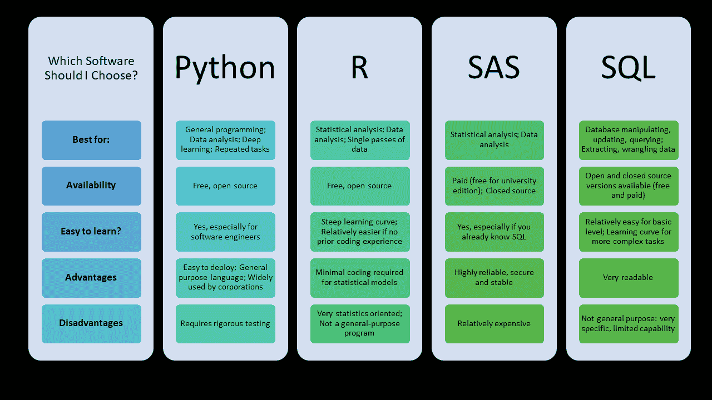

# 2021 年最流行的 8 种编码语言

> 原文：<https://towardsdatascience.com/the-8-most-popular-coding-languages-of-2021-b3dccb004635?source=collection_archive---------11----------------------->

## [入门](https://towardsdatascience.com/tagged/getting-started)

## 而且更重要的是，如何选择你应该学习的最流行的编码语言。


来自 [Pexels](https://www.pexels.com/photo/woman-in-black-tank-top-using-laptop-3861961/?utm_content=attributionCopyText&utm_medium=referral&utm_source=pexels) 的 [ThisIsEngineering](https://www.pexels.com/@thisisengineering?utm_content=attributionCopyText&utm_medium=referral&utm_source=pexels) 摄影

你如何决定最流行的编码语言是什么？这就像试图挑选最受欢迎的冰淇淋口味——每个人都有最喜欢的。事实是，不同的程序员出于不同的原因喜欢不同的编码语言，就在你认为可以说一种编码语言至高无上的时候，一种新的语言出现了，或者一种旧的语言与新的应用程序相关。

2021 年最受欢迎的编码语言将基于有问题的编码者想要完成什么，以及他们已经学过或做过什么。对于希望增加薪水的有经验的[程序员来说](https://qvault.io/2020/12/09/highest-paying-computer-science-jobs/)，最受欢迎的编程语言将不同于那些刚刚起步并希望在编码训练营后获得入门级编码工作的程序员。

有这么多不断变化的语言，很难知道从哪里开始，尤其是开源语言一直在变化，有了新的包和框架。不管你的兴趣或需求是什么，如果你想知道 2021 年最流行的编码语言是什么，你会在这个列表中找到它们。

```
[**1\. The most popular coding language for absolute beginners: Python**](#8aad)
  ∘ [Why it’s popular for this purpose](#9d57)
  ∘ [The best way to learn Python for beginners](#7414)
[**2\. The most popular coding language for people who don’t want a programming job: R**](#6124)
  ∘ [Why it’s popular for this purpose](#b23c)
  ∘ [The best way to learn R for non-programmers](#1a6a)
[**3\. The most popular coding language to increase your salary: Perl**](#91c3) **∘** [Why it’s popular for this purpose](#68fe)
  ∘ [The best way to learn Perl for coders who want a higher salary](#b78d)
[**4\. The most popular coding language for mobile app development on iOS: Swift**](#fb6b)
  ∘ [Why it’s popular for this purpose](#7ad2)
  ∘ [The best way to learn Swift for app developers](#d986)
[**5\. The most popular coding language for lateral thinkers: Ruby**](#d05f)
  ∘ [Why it’s popular for this purpose](#b876)
  ∘ [The best way to learn Ruby for lateral thinkers](#620b)
[**6\. The most popular coding language for mobile apps and web development: JavaScript**](#9739)
  ∘ [Why it’s popular for this purpose](#92f8)
  ∘ [The best way to learn JavaScript for web developers](#6a25)
[**7\. The most popular coding language to quickly increase your salary: Go.**](#428e)
  ∘ [Why it’s popular for this purpose](#14ae)
  ∘ [The best way to learn Go for coders who want to quickly increase their salary.](#f05a)
[**8\. The most popular coding language in 2022: Rust**](#38ae)
  ∘ [Why it’s popular for this purpose](#feef)
· [The best way to learn the most popular coding language of 2022](#59e7)
[**Final Thoughts**](#3c29)
```

# 1.最受绝对初学者欢迎的编码语言:Python

无论你查看什么列表，Python 几乎总是被列为最受初学者欢迎的编程语言——在 [Qvault 关于初学者最佳编程语言的帖子](https://qvault.io/2020/10/07/top-4-coding-languages-to-learn-for-beginners-2020/)， [GitHub 的排名](https://pypl.github.io/PYPL.html)， [Stack Overflow 的开发者调查](https://insights.stackoverflow.com/survey/2020#technology-most-loved-dreaded-and-wanted-languages-wanted)，甚至是[最顶尖的语言大学正在教授计算机科学专业](https://cacm.acm.org/blogs/blog-cacm/176450-python-is-now-the-most-popular-introductory-teaching-language-at-top-u-s-universities/fulltext)。


来源: [PYPL](https://pypl.github.io/PYPL.html)

不是 Rust 这样的快速成长者，也不是 JS 这样的老牌机构。但它是一种不可阻挡的语言力量。它已经存在 30 年了，在使用和受欢迎程度方面经历了稳定的增长，足以让它在任何人的排行榜上名列前茅。

## 为什么它受欢迎的目的

Python 的伟大之处在于，它的编写考虑到了开发人员的体验。实际上，这意味着它读起来像英语——对于没有编程背景的人来说尤其容易掌握。构建任何东西的基本原型也是非常快速的，这对于那些能够在几分钟内通过一个好的教程产生功能性代码的初学者来说是非常有利和值得的。最后是百搭。无论你的需求是什么——数据科学、机器学习、网络开发——你都可以用 Python 来完成。

总之，它的语法、易于发展和多功能性使 Python 成为绝对初学者最受欢迎的编码语言。

## 初学者学习 Python 的最佳方法

Python 是最受初学者欢迎的编码语言，因为它为全新的编码者提供了强大的支持网络。你可以使用面向初学者的 Python.org 免费教程开始编码。

您还应该利用 Python 用户和爱好者丰富的支持性在线社区。大多数 Python 爱好者都会记得自己学习 Python 的日子，并乐意向初学者伸出援手。查看 [Python subreddit](https://www.reddit.com/r/Python/) ，阅读并发布关于堆栈溢出的 [Python 问题，看看你是否能在 Discord 组或 Slack 频道上找到一个编码伙伴。](https://stackoverflow.com/questions/tagged/python)

# 2.对于不想做编程工作的人来说，最受欢迎的编程语言是:R

当我做客户成功经理时，我的工作完全不涉及编码。然而，我仍然发现能够在 R 中运行分析是非常有益的——查看保留率、流失率、通信量等等。r 是另一种开源编码语言，不如 Python 流行，但在数据科学社区中仍然非常活跃和受欢迎。

如果你想找一份与编程无关的工作，R 是最受欢迎的编程语言。它正在取代 SQL 和 SAS 这两种闭源的付费语言。由于企业既想降低成本，又想雇佣能够进行分析的人，不管他们的日常工作是否是编码，他们开始转向 r。



来源:[宁](https://st1.ning.com/topology/rest/1.0/file/get/3840441960?profile=original)

## 为什么它受欢迎的目的

在他们的 R 与 Python 教程中， [Datacamp 写道](https://s3.amazonaws.com/assets.datacamp.com/email/other/Python+vs+R.pdf)R 被“没有计算机编程技能的统计学家、工程师和科学家”使用。它在学术界、金融、制药、媒体和营销领域都很受欢迎。”

对于那些因为一些非常合理的原因而不在工作中编程的人来说，r 是最受欢迎的编程语言。首先，它是开源的。和 Python 一样，不需要付任何钱。它还有一个[集成开发编辑器 RStudio](https://rstudio.com/products/rstudio/download/) ，这使得它更容易使用。它有一个强大的开源软件包生态系统，使得任何人都可以非常简单地在几行代码中运行统计分析，并在几行代码中创建一个可供发布的图形。

## 非程序员学习 R 的最好方法

特别是对于那些没有或者不想要编程工作的人来说，我发现最好是[找到一个你真正关心的项目，并设定一个具体的目标](/the-fastest-way-to-learn-to-code-be-invested-in-your-numbers-ccb24d55d856)。你的工作中没有这种必要——你可以不知道如何编码，至少现在是这样。你之前没有任何编码经验，所以学习曲线会很陡。你需要你深深热爱的东西。只有这样，你才能克服每个程序员初学者都会遇到的令人沮丧的障碍、知识差距和用户错误。

# 3.增加薪水最流行的编码语言:Perl

根据 [Stack Overflow 的调查](https://insights.stackoverflow.com/survey/2020#technology-most-loved-dreaded-and-wanted-languages)，Perl 是这个名单上最矛盾的语言之一，因为它拥有最高的全球工资(7.5 万美元的平均年薪)，但也是最令人恐惧的语言(71.4%)。但是如果你想在编程工作中获得更高的薪水，没有比这更流行的编码语言了。众所周知，它是更流行的 PHP 的前身，也是一种有点像燃烧的垃圾堆的语言。

博客[某个家伙在他的博客文章“2020 年的 Perl:它还值得学习吗？](https://somedudesays.com/2020/02/perl-in-2020-is-it-still-worth-learning/)“that”，Perl 试图对太多人来说太多了。在许多项目中，可怕的代码片段四处漂浮，被毫不犹豫地拉进来。一个接一个的脚本小子拼凑了他们令人厌恶的东西，并让他们在这个世界上自由自在。他们把源代码放到网上，让全世界免费观看。书籍中也充斥着垃圾，即使它们早已过时，也会被重新出版，”

尽管被许多开发人员讨厌，但许多雇主发现它是一种有用的编码语言，既适用于新项目，也适用于维护现有的基础设施和项目。这就是为什么它仍然是最受欢迎的增加工资的编码语言。

## 为什么它受欢迎的目的

Opensource.com 列出了亚马逊、波音、BBC 和诺斯罗普·格鲁曼等许多寻找 Perl 开发人员的大公司。这是雇主们的常用语。像 R 和 Python 一样，它是开源的，这意味着它使用起来成本低、风险小。许多用户(例如，subreddit 上的[)将它描述为一种范围广泛、功能有限的语言，使它变得简单而实用。](https://www.reddit.com/r/perl/comments/5g25ak/why_should_i_learn_perl_6/)

它被讨厌的主要原因可能是上面列出的一些纨绔子弟博客的遗留因素——在这个地方，开源性质让这种语言失望，并允许它的好名声被拖进泥沼。

然而，随着 Perl 的最新版本修复了许多用户体验问题，以及 Perl 7 的即将发布，它的受欢迎程度可能会再次缓慢攀升，特别是考虑到它在雇主中的高需求性质，尽管作为编程语言它有很多缺陷，但雇主们发现 Perl 是一种值得雇佣的优秀技能，这使它在最流行的编程语言列表中赢得了一席之地。

## 想要高薪的程序员学习 Perl 的最佳途径

learn.perl.org 网站可能是开始学习 Perl 的最好地方。不像 R 和 Python，许多用户从谷歌搜索和复制粘贴代码块中学习，最好远离像堆栈溢出这样的地方，在那里坏的代码片段可能还在四处浮动。 [Modern Perl](http://onyxneon.com/books/modern_perl/modern_perl_a4.pdf) 也是一个相对较新的文档，可能会避免许多过时的固执己见的教程，而 [Perl Cookbook](http://rgonzo.us/shiny/books/perlcookbook.pdf) 则是久经考验的资源。

# 4.iOS 上移动应用开发最流行的编码语言:Swift

r、Python 和 Perl 都是上个世纪开发的。与此同时，Swift 是在 2014 年专门为成为苹果编程语言而开发的。顾名思义，它以构建 iOS 应用程序的快捷方式而闻名，[迅速超越了最初为此目的而构建的](https://buildfire.com/programming-languages-for-mobile-app-development/) Objective-C。[Apple.com 自己说](https://www.apple.com/swift/) Swift 比 Objective-C 快 2.6 倍，比 Python 快 8.4 倍。尽管它是一门年轻的语言，但在 Stack Overflow 的 2020 年开发者调查中，它是第九大最受欢迎的语言。要编写一个 iOS 应用程序，没有其他最流行的编码语言。

## 为什么它受欢迎的目的

Dummies.com 写道:“开发 iOS 应用程序可能是你多年职业生涯中最有趣的事情，只需要很少的时间和金钱投入(与开发 Windows 等平台相比)。”对于想写代码的人来说，开发应用程序是展示你的技能甚至赚点外快的好方法。

与 Android 应用程序相比，iOS 拥有更强大的开发者程序，并处理许多在商店创建和托管应用程序的棘手问题。与 Android 相比，开发一个 iOS 应用程序也更快。

出于这些原因，对于那些想为 iOS 开发移动应用的人来说，Swift 是最受欢迎的编码语言。

## 应用程序开发人员学习 Swift 的最佳方式

苹果显然在帮助开发者学习 Swift 方面有既得利益，所以它是开源的。事情发生了相当大的转变，苹果实际上开发了一款名为 [Swift Playground](https://www.apple.com/swift/playgrounds/) 的应用，旨在帮助初级程序员学习 Swift 的基础知识，同时还有[几个其他资源](https://swift.org/getting-started/)来帮助用户学习。如果你更擅长编码或者想离开赛道去学习 Swift，

之后，最好的方法就是尝试使用 Swift 设计你的第一个应用。

# 5.横向思考者最流行的编码语言:Ruby

Ruby 是初创公司最受欢迎的编码语言之一，这种语言有多种方式来做事情，语法非常简单，这使得许多初创公司的“快速行动，打破常规”的精神受到横向思考者的青睐。

Ruby on Rails 是一个运行 Ruby 的全栈 web 应用程序框架，它也非常受欢迎，因为它可以在很短的时间内轻松构建 web 应用程序。

## 为什么它受欢迎的目的

对于许多初学编程的人来说，使用像 Python 这样的语言会感觉受到限制，因为通常只有一种方法来做事情。Ruby 的简单语法允许方法的灵活性，这对于正在学习第二种编码语言的人，或者更倾向于横向思考并喜欢从不同角度研究事物的人来说是一个福音。这个另类的角度让 Ruby 登上了 2021 年最流行的编码语言的榜单。

## 横向思考者学习 Ruby 的最佳方式

由于 Ruby 的动态特性，没有单一的学习方法。虽然理解变量、数据结构和条件语句等核心编码概念很重要，但 Ruby 和 Ruby on Rails 的简单性意味着一旦掌握了基础知识，下一步应该是尝试构建自己的简单 web 应用程序。

# 6.移动应用和 web 开发最流行的编码语言:JavaScript

JavaScript 是网络上最流行的编码语言，负责交互式网站。它开发于 1995 年，是今天 95%的网站使用的主流客户端脚本语言。随着 Node.js 的开发，许多人也开始在服务器端使用 JavaScript。与 CSS 和 HTML 一起，它构建了你随时可以在万维网上看到的东西。

根据 Stack Overflow 的 2020 年开发者调查，它连续第八年成为[最常用的语言](https://insights.stackoverflow.com/survey/2020#most-popular-technologies)。只要网站存在，JavaScript 对任何程序员学习都是有用的。对于任何 web 开发人员来说，这显然是必备的。即使你不想成为一名网站开发人员，建立自己网站的能力——现在经常被用作简历和作品集——也是一项很有吸引力的展示技能。

## 为什么它受欢迎的目的

对于 web 开发和移动应用程序来说，JavaScript 是最受欢迎的编码语言这一事实是引人注目的，考虑到它作为对第一次浏览器战争的回应仅在十天内被创造出来。

它是如此受欢迎的编码语言，因为它无处不在，但是理解*为什么*它无处不在也是很好的。首先，它几乎可用于任何前端和后端 web 开发，但也有一些框架被开发来更进一步。例如，JavaScript 也适用于像 Slack 和 Skype 这样的桌面应用程序，它们使用 [Electron.js](https://www.electronjs.org/) 。 [Vue.js](https://vuejs.org/v2/guide/) 、 [Angular.js](https://angularjs.org/) 和 [React.js](https://reactjs.org/) 是独立的 JavaScript web 框架，分别用于构建由前谷歌员工尤雨溪、谷歌和脸书构建的用户界面。

它也是标准化的，这意味着新版本的更新和发布会频繁出现。无论您处于编码生涯的哪个阶段，这种语言都能为您提供一些东西。

## web 开发人员学习 JavaScript 的最佳方式

如果你搜索“学习 JavaScript”，很容易被大量的信息、教程和指南淹没。甚至很难知道自己需要哪些框架和库。这就是为什么我推荐一种分层次的方法，让你在学习最受 web 开发人员欢迎的编码语言的过程中系统地、持续地进步。一些例子包括 [JS: The Right Way](http://jstherightway.org/) 和 [Qvault 的《编码基础入门》](https://qvault.io/basic-intro-to-coding-course/)。

# 7.快速涨工资最流行的编码语言:Go。

Go 是在谷歌开发的，受到了编程语言巨头 C 的影响，但它是为了避免 C++的陷阱而构建的，而 c++被 Go 的开发者普遍鄙视。我们的目标是建立一种语言，在一个庞大的代码库的时代，这种语言是适用的。它现在被几家大公司使用——谷歌显然是其中之一，但优步、Twitch 和 Dropbox 也在名单中。

在 Stack Overflow 的开发者调查中，它在最受欢迎的语言列表中排名第三，同时也是全球工资中位数最高的 T2。

## 为什么它受欢迎的目的

有几个原因使得它成为想要快速增加工资的程序员最流行的编程语言。首先，它是一种为大型项目而构建的语言。例如，与 Ruby 不同，它可以快速构建，但难以扩展，Go 是由 Google 有意创建的，以帮助他们更快地完成真正巨大规模的项目和任务。它的目的是减少阅读和调试代码的时间，帮助完成这些任务。这使得它成为许多旨在实现这种规模项目的大公司的一种有吸引力的语言。

它也被认为比 Perl 学起来更快更容易，Perl 是薪水最高的语言之一。Perl 有着几十年的历史和观点，而 2009 年才创建的 Go 有着更小、更现代的语法。不像许多词汇臃肿的编码语言，Go 小到足以“装进你的脑袋”，套用数据工程师森姆·琼斯的话，[在用 Go](https://willowtreeapps.com/ideas/the-pros-and-cons-of-programming-in-go#:~:text=Go's%20syntax%20is%20small%20compared,of%20time%20looking%20things%20up.&text=Non%2DGo%20programmers%2C%20especially%20those,usually%20understand%20what's%20going%20on.) 构建了一个 API 后写了一篇关于 Go 的评论。这减少了在网上和参考书中搜索答案和语法的时间。

仅仅通过阅读来学习它也是可能的，因为语法足够清楚，非爱好者甚至非编码人员都可以看到它并理解发生了什么。

## 对于想快速提升工资的程序员来说，学习围棋的最好方法。

作为谷歌为互联网打造的语言，你可以想象有几个免费的基于网络的资源可以帮助你学习。首先，几个消息来源推荐你去学习如何使用围棋。它是交互式的，你可以在网站上运行自己的代码片段。它被分成几个模块，这使得它很容易跟踪你在哪里，并在必要时引用回来。

一旦你掌握了基础知识，其他一些很好的资源包括 [Go By Example](https://gobyexample.com/) 和 [Go Mastery](https://qvault.io/go-mastery-course/) ，在那里你将学会寻找典型或常见任务的代码示例。

# 8.2022 年最流行的编码语言:Rust

根据 [2020 Stack Overflow 的开发者调查](http://jstherightway.org/)，Rust 连续第五年成为最受欢迎的语言，也是第五大最受欢迎的语言(14.6%)。那么，尽管客观上它是所有编程语言中最受欢迎的，但为什么它没有名列榜首呢？因为根据同一项调查， [97%的受访者从未使用过 Rust](https://stackoverflow.blog/2020/01/20/what-is-rust-and-why-is-it-so-popular/) 。它也有一个不确定的未来。

Mozilla 在 2009 年赞助了 Rust 的开发，[在 2010 年](http://venge.net/graydon/talks/intro-talk-2.pdf)宣布了它。它被视为 C 或 C++等其他系统编程语言的替代品，根据其维基百科页面[的说法，它旨在“成为高度并发和高度安全的](https://en.wikipedia.org/wiki/Rust_(programming_language)#cite_ref-30)[系统的语言](https://en.wikipedia.org/wiki/System_programming)。这对开发人员来说意味着他们可以快速高效地编写安全的代码。

然而，由于 Covid，Mozilla [解雇了他们 Rust 团队](https://insights.dice.com/2020/08/27/rust-in-trouble-after-big-mozilla-layoffs/)的很大一部分人，以专注于商业产品。虽然他们已经宣布将会建立一个基金来掌控 Rust 的未来和成本，但是还不确定这个基金将会如何形成。

## 为什么它受欢迎的目的

假设 Rust 能够克服当前的困难，我预计它将逐年变得更受欢迎。它拥有当前开发人员的忠实粉丝群，越来越多的编码人员对学习它感兴趣。虽然它可能不会在 2021 年名列榜首，但我相信它可能会是 2022 年或以后最受欢迎的编码语言。

许多程序员认为它比 C++更容易学习。安全代码的优先级可能会让许多编码人员感到沮丧，他们输入代码只是为了得到令人讨厌的错误消息，但这可能会远离“快速移动并打破东西”的心态，并朝着更安全、结构更合理的代码库移动。它既适用于长期发展的需要，也适用于未来的努力。 [Mozilla 的页面](https://research.mozilla.org/rust)描述了这些应用，包括“游戏引擎、操作系统、文件系统、浏览器组件和虚拟现实的模拟引擎”

由于这些原因，Rust 可能是未来最流行的编码语言。

## 学习 2022 年最流行的编程语言 Rust 的最佳方式

因为 Rust 非常关注安全性和结构，所以开发人员花费了大量的时间和资源来确保错误消息是用户友好的，不像许多其他的编码语言。这对初学者来说尤其有益，因为当他们犯了错误时，很容易改正。

[Rust 网站](https://www.rust-lang.org/learn)提供了三种尝试的途径——阅读被称为[的书](https://doc.rust-lang.org/book/)、[rusting 课程](https://github.com/rust-lang/rustlings/)和小项目来帮助你启动和运行，以及 [Rust By Example](https://doc.rust-lang.org/stable/rust-by-example/) ，它阐释了支撑 Rust 的概念和库。所有这些资源都是免费的。

正如一位 Redditor 指出的那样，这是一种相对较新的语言，因为你将会遇到的许多问题的答案还没有在 Stack Overflow 这样的地方发布和回答。出于这个原因，他们建议加入 Discord 频道，作为获得指导和支持社区来学习 Rust 的一种方式。

# 最后的想法

有大量的语言可供选择，正如你从这个列表中看到的，许多是最近才出现的。虽然有些人在特定任务上客观上比其他人更好，但大多数人都有很好的目的。如果你想学习 2021 年最流行的编码语言，你首先要决定你想从学习编码语言中得到什么。

无论你坐在哪里，站在潮流的顶端并确保你处于编码游戏的顶端总是好的。超过 70%的各级专业开发人员每年至少学习一次新的编码技能。为什么不从 2021 年开始，用 2021 年最流行的编码语言之一来优先考虑你未来的技能呢？这个列表将帮助你选择你可以开始做的事情。