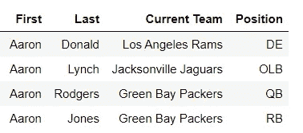
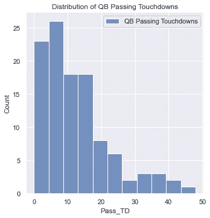
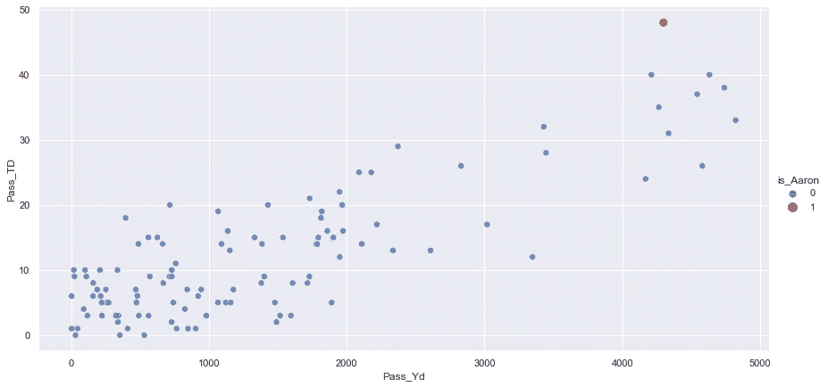

# 亚伦碗

> 原文：<https://towardsdatascience.com/the-aaron-bowl-3fd1f14831de?source=collection_archive---------69----------------------->

## NFL 分区赛的头名

TL；博士，这个博客中的图表大多使用随机创建的数据，因为我没有实际数据的权利。

1 月 16 日，在 NFL 分区季后赛的第一场比赛中，绿湾包装工队将迎战洛杉矶公羊队。这些球队代表了 NFL 排名第一的防守(公羊)和进攻(包装工)。

有趣的是，每支球队的最佳球员都被命名为**亚伦**。亚伦·罗杰斯可能是足球界最好的四分卫，他是今年最有价值球员奖的热门人选之一。艾伦·唐纳德是有史以来最好的球员之一。他是今年年度最佳防守球员的三大热门之一。加上帕克的跑锋亚伦·琼斯。不管这场比赛结果如何，其中一个亚伦将会非常有影响力。这就是为什么我称它为**亚伦碗。**


照片由[内森·希维利](https://unsplash.com/@shivelycreative?utm_source=medium&utm_medium=referral)在 [Unsplash](https://unsplash.com?utm_source=medium&utm_medium=referral) 拍摄

在这个博客中，我将展示一些图片来说明在同一个游戏中有这种水平的玩家是多么的不寻常……对于他们来说有相同的名字就更不寻常了！

## 赛后总结

**绿湾包装工队 32:洛杉矶公羊队 18**

亚伦·罗杰斯完成了 **23 次 **36 次**传球中的**29 次 **296** 码，两次传球达阵，一次冲达阵。(包括一次 **58** 码传球触地得分)****

亚伦·琼斯冲了 14 次 99 码的 T21，每次试跑 7 码就有一次触地得分。(包括 **60** 码的一次运行)

艾伦·唐纳德上场时间有限，仍在处理上一场比赛的伤病。

两个艾伦确实主宰了这场比赛——都来自绿湾。阿伦-唐纳德的受伤(以及来自绿湾进攻线的强劲表现)意味着我们没有看到预期中的阿伦 vs(阿伦+阿伦)之战。

## 获取数据

与其他运动相比，你更难获得 NFL 的数据，例如棒球和篮球。随着 NFL 向 Kaggle 提供大数据碗的数据，这种情况可能会发生变化。一些对你自己的研究有帮助的来源是 [NFL 网站](https://www.nfl.com/stats/player-stats/)，去年的 [Kaggle NFL 大数据碗](https://www.kaggle.com/c/nfl-big-data-bowl-2020)(去年的比赛比今年的有更多的最近数据)，以及职业足球[参考文献](https://www.pro-football-reference.com/)。不幸的是，这些数据源都不是完全开源的。

Kaggle 只允许“竞赛使用、非商业和学术使用”NFL.com 数据“仅用于您个人的非商业和信息目的”Pro Football Reference 拥有最开放的数据，“我们鼓励共享和重复使用我们的用户在我们的网站上找到的数据和统计数据”，但警告**不要**“复制我们数据的重要部分”——所以不要刮擦。

还有一些额外的数据来源，通过汇编公开可用的详细数据来创建数据库。然而，由于这些是二手资料，我不能直接访问原始数据，所以我选择不在公共博客中使用它们。

我要看看最可测量的统计数据的领导者:传球码，传球达阵，冲码和麻袋。然后，我会将这些数据与随机生成的虚拟统计数据集进行比较，以说明 Aarons 有多不寻常。

我知道这种方法看起来有点奇怪——主要使用虚构的数据。体育统计数据通常被报道，处于公共领域，并被视为不受版权保护的事实(对最近一起涉及棒球数据的法庭案件的评论[此处](https://harvardlawreview.org/wp-content/uploads/pdfs/CBC_v_MLBAM.pdf))。但是，这些统计数据(数据库)的集合是受保护的。公众对谁是最佳球员很感兴趣，因此很容易找到关于公共领域领导者的统计数据。然而，人们对识别所有玩家的兴趣并不相同——因此，没有数据源，我无法构建数据集。

NFL 中有四个 Aarons 的位置可以影响这些统计数据。艾伦·唐纳德，艾伦·罗杰斯，艾伦·琼斯，艾伦·林奇。



亚历山大·席默克在 [Unsplash](https://unsplash.com?utm_source=medium&utm_medium=referral) 上拍摄的照片

## 虚拟数据

在 Python 中创建虚拟数据有几种选择。传球码和达阵高度相关。我使用 NumPy 的 random.multivariate _ normal 从多元正态分布中创建相关随机样本。这里参考一下官方[文档](https://numpy.org/doc/stable/reference/random/generated/numpy.random.multivariate_normal.html)。

所需的参数是平均值、cov 和大小。均值是数据各维度的均值。Cov 是分布的协方差矩阵。尺寸是样品的尺寸和/或形状。

构建协方差矩阵有点棘手。我在一条对角线上使用了码数和触地得分的方差，在另一条对角线上使用了标准差 x 相关性。

```
corr = 0.8  # estimating passing yards and TDs are 80% correlated         #            (it's probably higher than 80% in reality)covs = [[yd_std**2, yd_std*td_std*corr], 
       [yd_std*td_std*corr, td_std**2]]# std**2 is the variance
# use std / 3, so that most of the data generated (3 standard deviations worth) is within the range I want.
```

我使用了一个平均值为零的范围。我将样本大小增加了一倍，所以我可以毫无问题地去掉一半的值。这会给我留下半个钟形曲线，峰值在零。

```
data = np.random.multivariate_normal(means, covs, 200).T
```

这些数据当然不是完美的，但对下一个例子很有用。

## 四分卫可视化

```
# Plot distribution of QB rating
sns.set(color_codes=True)
sns.set(rc={'figure.figsize':(10,8)})
sns.displot(df['QB_TD'], label='QB Passing Touchdowns')
plt.title('Distribution of QB Passinh Touchdowns')
plt.legend()
plt.show();
```



基于虚拟数据的触地得分

```
# scatter chart of QB Rating by Pass Yards
sns.relplot(x="Pass_Yd", y="QB_rating", hue="Aaron", 
            size="Aaron", sizes=(100,50), palette=["b", "r"], alpha=.8, height=6, aspect=2, data=df);
```



Aaron Rodgers 与顶级 QBs 和虚拟数据

亚伦罗杰斯没有最多的传球码，但他绝对是一个异数。

## 参考

职业足球参考:【https://www.pro-football-reference.com/ 

NFL 网站:【https://www.nfl.com/stats/player-stats/ 

Kaggle NFL 大数据碗:[https://www.kaggle.com/c/nfl-big-data-bowl-2020](https://www.kaggle.com/c/nfl-big-data-bowl-2020)

numpy . random . multivariate _ normal 上有帮助的 stackoverflow 回答:[https://stack overflow . com/questions/18683821/generating-random-correlated-x-and-y-points-using-numpy](https://stackoverflow.com/questions/18683821/generating-random-correlated-x-and-y-points-using-numpy)