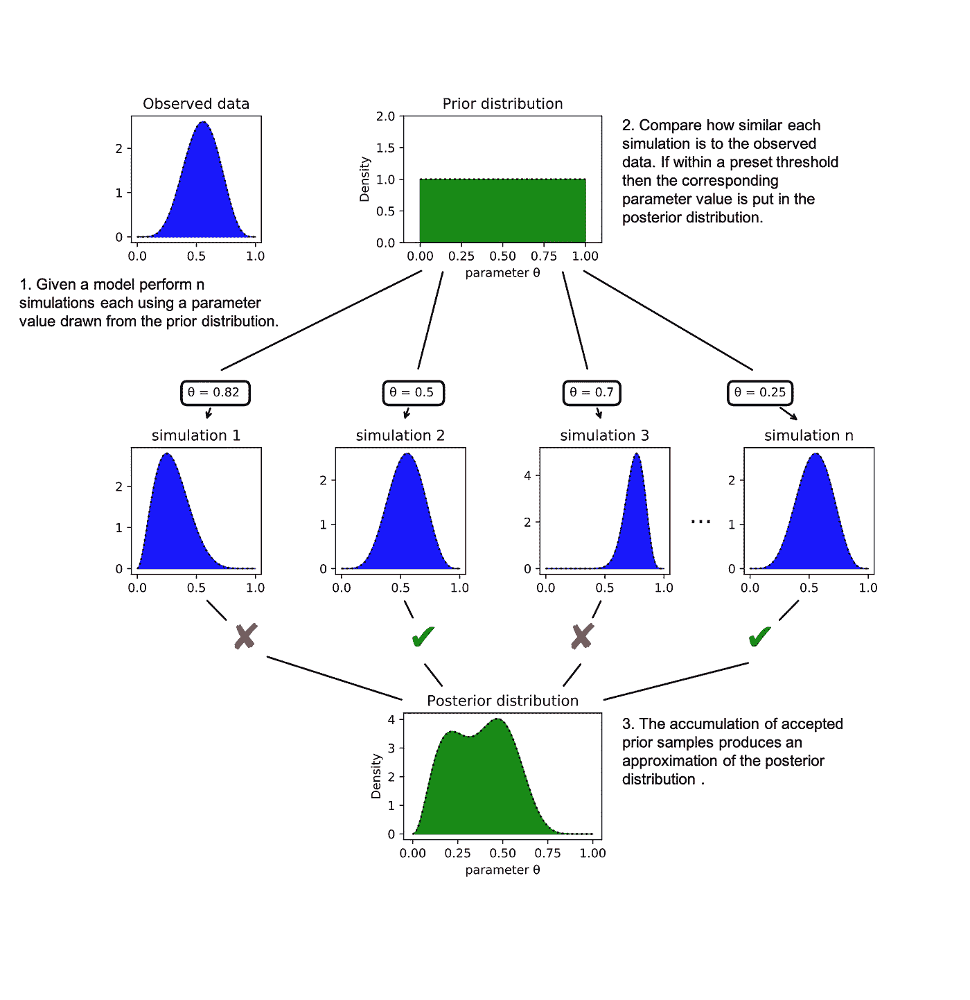
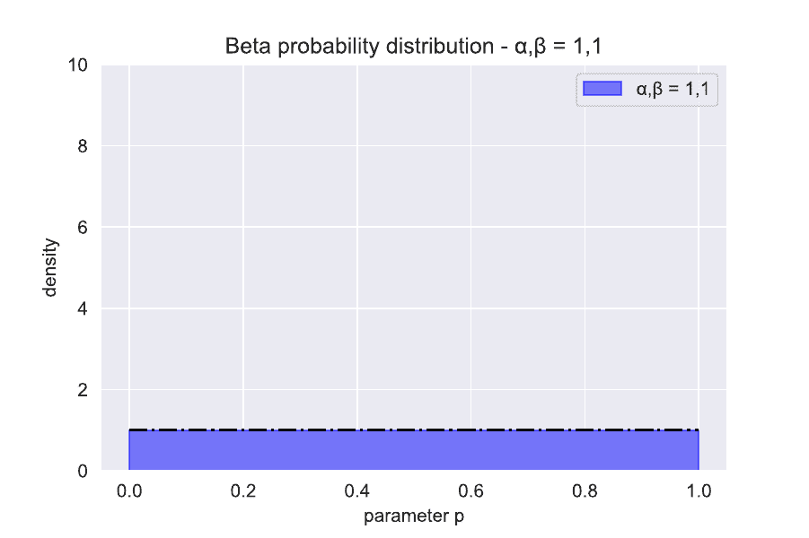

# 近似贝叶斯计算的基础知识

> 原文：<https://towardsdatascience.com/the-abcs-of-approximate-bayesian-computation-bfe11b8ca341?source=collection_archive---------7----------------------->

图片作者。

## [入门](https://towardsdatascience.com/tagged/getting-started)

## 使用近似贝叶斯计算方法的参数推断导论。

## **什么是贝叶斯统计？**

贝叶斯统计是允许在**新数据**【1】的证据中**信念**的**系统更新**的方法。这些方法所基于的基本定理被称为**贝叶斯定理**。这就是说，给定两个事件 A 和 B，A 给定 B 为真的条件概率表示为

。其中 *P(A|B)* 表示给定 *B* 发生 *A* 的概率， *P(B|A)* 表示给定 A 发生 B 的概率， *P(A)* 和 *P(B)* 分别是不考虑其他情况下 *A* 和 *B* 发生的概率。

## 什么是推论？

在证据和推理的基础上得出的结论。如果我们推断出一个给定参数的值，我们就可以利用现有的信息来推断该参数最有可能的值。

## **什么是贝叶斯推理？**

科学家用概率来量化他们推论中的不确定性。比如“我 99%确定 X 的值是 Y”。假设我们有一个模型可以预测某个事件是否会发生。该模型需要一个单一的输入，其值我们并不完全确定。然而，我们可以指定它可能取值的分布，以及它取每个值的概率，这就是所谓的概率分布。我们进行了一项实验，观察到了一些新数据。贝叶斯推理然后使用贝叶斯统计(等式 1)来更新给定新数据的参数的概率分布。贝叶斯推理是非常强大的，因为它允许我们量化，并纳入，一个给定的参数应该是什么分布的先验信念的变化水平。

## **贝叶斯术语:**

如果 *A* 代表先前的信念，而 *B* 代表新的证据，则:

*   *P(A)* 被称为**先验概率。**先验概率可以是**信息性的**意味着我们有很强的先验信念，或者是**非信息性的**意味着我们对参数的真实值有更不确定的先验理解。
*   *P(B|A)* 被称为**似然函数**。给定 A 为真的最近数据/证据的概率。这让我们能够量化证据与我们先前的信念相符的程度。
*   *P(A|B)* 被称为**后验概率。**考虑到证据后的概率 A。

等式 1 告诉我们后验概率与我们的先验概率和似然函数的乘积成比例，

。在简单的情况下，似然函数是已知的，因此后验分布的表达式可以直接从似然和先验中导出[3]。在这种情况下，参数的概率分布可以随着新数据的出现而不断推断出来，没有问题！

然而，在大多数现实世界的问题中，似然函数通常非常复杂或者根本不可能推导出来！在这些情况下，后验分布的表达式不容易确定。这就是**近似贝叶斯计算**可以用来代替似然函数计算的地方。

## **使用近似贝叶斯计算(ABC)方法估计后验概率**

**ABC 算法**通过模拟模型来估计参数的后验概率，从而使用取自先验分布的样本参数产生人工数据集 *X* 。通过计算距离𝜌 *(X，Y)* 来比较由先前的样本参数产生的人工数据集与观察到的真实数据集 *Y* 有多相似。产生与真实数据集 *Y* 非常接近的人工数据集的参数样本作为样本从后验分布中收集。“非常接近”的接近程度由一个预定义的超参数确定，该参数称为**容差** (𝜀)，产生的人工数据比𝜀更接近被接受为后验数据的一部分的观测数据。

一般 ABC 方法:

图 1:估计模型参数后验分布的 ABC 过程示意图。这里我们从一个未知的均匀先验分布(中上)开始。我们从先验分布中采样 n 次，并使用我们的模型产生模拟数据(中间一行)。产生类似于观察数据的模拟数据的先前样本(左上)被保留作为构成模型参数的后验分布的样本(中下)。这就是所谓的 ABC 剔除抽样。图片作者。

**距离函数𝜌*【x，y】***

距离函数通常被选择为**最简单的汇总统计量**，它可以精确地比较观察数据(X)和模拟数据(Y)。热门选择:

*   **绝对差值**

*   **平方差之和**

*   **库尔贝克-莱布勒散度(KL)**

**公差的选择(𝜀):**

容差(𝜀)定义了先验样本和后验样本之间的边界阈值。该值可以根据任务的要求严格或宽松。通常也可以使用自适应阈值。这开始时相对较大，随着采样的进行而慢慢减小(这类似于模拟退火的方法)。因此，就像统计学习中的许多超参数一样，最佳容差值仍有待讨论！

**python 中的 ABC 拒绝采样方法**

## **一个真实世界的例子；抛可疑硬币的概率。**

一个狡猾的朋友给了我们一枚硬币，并和我们打赌说我们无法告诉他抛正面的真实概率是多少。硬币既可以正面落地，也可以反面落地，所以这是一个二项式问题。我们的朋友是个疯子，我们一点也不相信他的硬币。我们通过使用一个**无信息先验**将这种不信任传递到我们的先验信念中，这是一个翻转头**概率的**均匀分布**。**这意味着我们认为从 0 到 1 的 *p* 的所有可能值都是等概率的。在贝叶斯推断中，贝塔分布经常被用作二项式概率的无信息先验[1]。贝塔分布由下式给出

图 2:不同参数下的贝塔分布(𝜶,𝜷).贝塔分布提供了各种各样的分布类型，因此在贝叶斯推断中是一个有用的先验。图片作者。

贝塔分布的超参数可以被认为是观察到的成功次数(𝜶)和失败次数(𝜷)。无信息的贝塔分布先验具有 hyper-parameters(𝜶,𝜷) =(1，1)。这代表了对之前每个结果的观察。图 2 显示了β分布如何随着不同的𝜶,𝜷).值而变化

## **分析后验分布**

贝塔分布有一个简单的特性，即使用它作为二项式可能性的先验分布，将产生一个更新了𝜶和𝜷.的贝塔后验分布这个性质被称为**共轭**。模型的后验概率由下式给出

现在可以使用这个 *p* 的后验分布来评估关于翻转头部的真实概率的假设。如果我们考虑 *n = 10* 、 *n= 100* 和 *n = 1000* 掷硬币的试验观察，后验概率可以通过分析得出，图 3 绘出了这些后验概率。

图 3:n 次抛硬币试验的分析后验分布图，n=10，n=100 和 n = 1000。图片作者。

## **ABC 估计后验分布**

所以让我们假设我们的二项式例子有一个可怕的似然函数，因此我们必须使用 ABC 方法估计后验分布。

我们用最简单的 ABC 算法: **ABC 拒绝抽样**。我们选择的距离函数是观察到的和模拟的人头数的比例之间的**绝对差**。

使用𝜀= 0 的**公差**。这意味着我们只接受头尾比例与**完全相同的样本作为我们的观察数据。图 4 显示了本例中 ABC 流程的动画。与真实参数值相似的样本更有可能产生相同的观察数据，因此更经常被后验分布接受。在终止 ABC 算法之前，我们需要 N=10，000 个样本。在图 4 中，观察到的数据在 *n=10* 次试验中产生了 7 个正面和 3 个反面。当模拟数据产生 7 个头部和 3 个尾部时，参数样本被后验分布接受。**

图 4:估计后验概率的 ABC 过程动画。图片作者。

考虑到与上述相同的试验观察值 *n = 10* 、 *n=100* 和*n = 1000*，下面的图 5 给出了具有 *10，000* 个样本的 ABC 估计后验概率。

图 5:n = 10、n=100 和 n = 1000 时模型参数 p 的 ABC 估计后验分布。图片作者。

可以看出，在图 5 中使用 ABC 得到的后验估计值非常精确，几乎完全等于真实后验值(红线)。这个二项式例子的简单性允许我们以可以忽略的成本进行采样。然而，在大多数情况下，后验分布必须通过 MCMC 技术在数字上找到**(使用**斯坦**、**温巴哥**、 **OpenBUGS** 、 **JAGS** 、 **PyMC** 或一些其他程序)。**

## 结论

这个简单的教程展示了 ABC 技术提供参数后验分布精确推断的能力。这种方法在所讨论的模型具有可怕或难以处理的似然函数时特别有用，这通常是真实世界的复杂模型的情况。如此处所示，ABC 方法非常易于使用，并且通过可靠的数据可以产生非常准确的结果。虽然 ABC 方法允许我们避免处理复杂的似然函数，但是相对于给定问题的解析解，它们被认为计算量很大。然而，当面对不合理的复杂模型时，ABC 方法提供了执行参数推断的手段。

[1]m .埃文斯、n .黑斯廷斯和 b .皮科克，2001 年。统计分布。

[2]编辑史蒂文森，安格斯。牛津英语词典，牛津大学出版社，2010 年。

[3]特纳，B.M .和范赞特，t .，2012 年。近似贝叶斯计算教程。*数学心理学杂志*， *56* (2)，第 69–85 页。