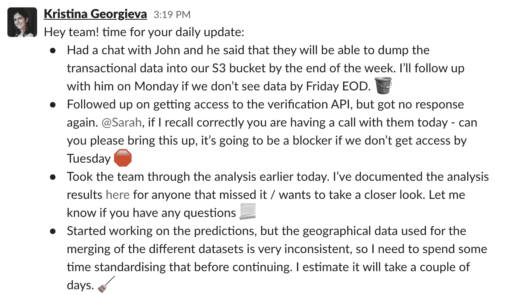
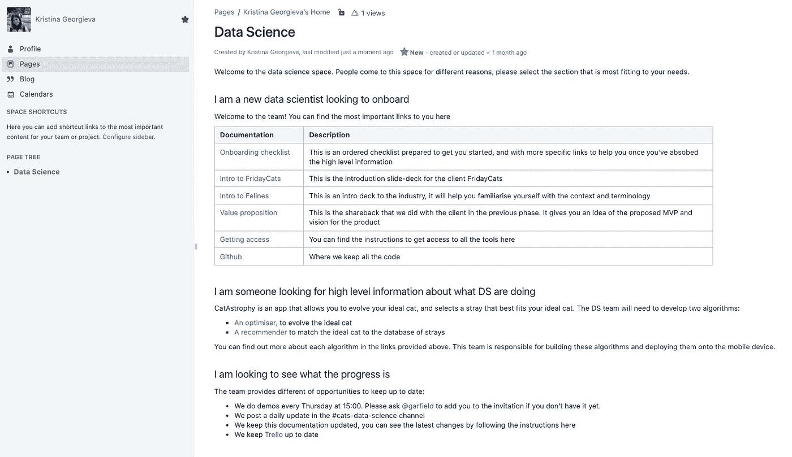
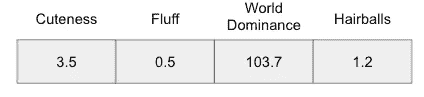
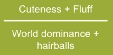

# 数据科学洞穴的废除

> 原文：<https://towardsdatascience.com/the-abolition-of-the-data-science-cave-d92a21532813?source=collection_archive---------26----------------------->

## [行业笔记](https://towardsdatascience.com/tagged/notes-from-industry)

## 在跨学科团队中交流数据科学

由 [Clarisse Meyer](https://unsplash.com/@clarissemeyer) 在 [Unsplash](https://unsplash.com/?utm_source=medium&utm_medium=referral) 上拍摄

当谈到理解我们的数据科学模型做出的决策时，我们听说过可解释性。但是开发过程中的可解释性呢？

作为数据科学家，我们经常在跨学科团队中工作，在这个团队中，并非每个人都熟悉我们的专业，就像我们不熟悉他们的专业一样。这些环境允许我们为我们的用户构建最好的产品，但是它们需要一个关键的组成部分:**沟通**。本文旨在收集我在一路上学到的关于让跨学科团队围绕产品构建的数据科学组件保持一致的知识。

## 为什么

在我们开始讨论如何做之前，让我们先来看看为什么。在整个开发过程中成功沟通数据科学工作非常重要，主要原因如下:

*   **为团队和利益相关者提供信心:**你不需要教利益相关者数据科学，但你需要对进度、风险、方法和需求保持透明。当事情出错时，引起恐慌的第一个原因往往不可避免地集中在产品中最不为人所知的部分。这种恐慌会导致花费更多的时间来修复通信损坏，而不是一开始就通知团队。
*   **向依赖于您的输出的团队成员提供透明度:**团队中的某个人可能会将您创建的模型集成到 web/mobile/backend 应用程序中。如果是这样，他们将需要清楚地了解输入需要是什么，输出意味着什么，以及他们需要记住哪些考虑因素才能使模型工作。通过了解您在做什么，他们可以正确地集成您的模型，并提出可能与您的实施相关的限制(例如，“我们的目标移动设备没有您用作模型输入的传感器”)
*   **向您所依赖的团队成员提供透明度:**无论您负责管道的哪个部分，都可能有人在为您提供数据，无论是数据管道还是前端应用程序。向负责这些早期过程的团队成员提供透明性，允许他们理解并在必要时适应您的需求，以及提出可能影响您的实现的限制。
*   **向更广泛的团队提供透明度:**更广泛的团队可能不一定参与实施细节，但他们确实有你可能缺少的背景和经验。了解您正在做的事情有助于进行讨论，这可以带来实现中的改进或关键点。

现在我们知道了为什么，让我们看看我在这几年里学到了什么。

## 给出清晰和频繁的更新

这似乎是一个显而易见的事情，但是“仍然在模型上工作”对团队的其他成员没有帮助。提供频繁和清晰的更新使团队能够:

*   了解进展，因此提前计划
*   理解局限性，从而适应
*   发现拦截器并帮助您解决它们
*   挑选他们应该参与的讨论

单口相声是做这件事的好地方。就我个人而言，除此之外，我还喜欢使用书面交流，因为如果人们没有站起来、分心或者他们以书面形式更好地处理信息，它可以让人们回到过去。我的首选方法是为数据科学更新创建一个 Slack(或等效)渠道，在那里我根据团队和项目进度发布每日或两周一次的总结。

好的更新是上下文和长度的平衡。你需要让你的交流适应你的听众，并为他们提供必要的背景来理解你所指的内容。该上下文可以在更新本身中提供，也可以作为链接提供给对该信息感兴趣的人。同时，如果你的更新太长，它们会成为一种负担，很可能会被放在“以后再看”的文件堆里或者被忽略。

这里有一个更新的例子，我试图给出各种事情的状态信息，解释延迟，给出延迟的估计，提供在会议中分享的信息，并请求某人帮助阻止。我还使用表情符号来呈现一些主题，这些主题只有在人们看到一些更新后才会变得有用(例如，红点总是意味着阻止)。

伪造更新示例—作者图片

根据我收到的反馈，这些类型的更新(在标准会议之上)在我们的团队中运行良好。也就是说，这并不意味着这是您团队的正确方法。你需要进行实验，看看你的团队如何应对各种方法。

一些最后的建议:

*   保持你的更新简短，但要有足够的内容
*   标记你向其寻求帮助的人(人们会遗漏一些事情)
*   不要在奇怪的时间发送更新
*   利用链接了解任何详细信息
*   添加可视组件/模式

## 编写文档

这是我最初开始做的事情，帮助我完成日常任务。我天生是一个健忘的人，如果我试图把一堆事情记在脑子里，我会很难集中注意力。编写文档帮助了我:

*   记得事情🐠
*   组织我的想法，找出联系/缺失的部分
*   专注于手头的任务，而不必担心我会忘记我努力记住的 10 件事

过了一段时间后，我注意到对我有帮助的东西，实际上对团队也有帮助，因为它让他们对通常是黑盒的流程变得透明。这就是我如何意识到文档是多么重要。它允许团队拥有描述决策、以前的讨论、限制、数据结构、研究等的真实来源。它有助于新团队成员快速加入，老团队成员跟上内容，记住某些决策背后的推理，并理解不同的流程。

你可以有不同形式的文档。一般来说，与代码相关的文档保持接近代码，而围绕决策、讨论、研究等的更高层次的文档将在内容管理系统中，如 Confluence、conception、Coda 等。作为一名数据科学家，你将拥有大量关于数据结构、含义、管道、架构、分析、考虑因素、限制等的信息。所有这些信息需要存在于数据科学家头脑之外的其他地方，因为它会影响其他流和决策。

一方面，你会有团队成员需要微小的细节，因为他们将构建模型。另一方面，你也将有团队成员和利益相关者需要高层次的信息。您需要以一种双方都可以访问的方式来组织您的文档。

我通常为数据科学创建一个根页面，根据为每个受众定义的部分提供摘要和相关子页面的链接。例如，您可以拥有以下部分:

*   数据科学家入职
*   非数据科学家入职
*   寻求更新的利益相关方

除此之外，我还在每页的顶部添加了一个摘要，以帮助那些浏览文档的人。您的分析笔记本和存储库阅读材料也可以作为您的数据科学家同事的文档，但请记住将任何可能对团队其他成员有用的高级信息提取为可访问的摘要格式。

虚假登录页面示例—作者图片

## 演示和想象

就像其他类型的工程一样，通过更频繁地展示仍在开发中的工作，可以更好地展示进展。利用团队的演示，自信地展示正在进行的工作。你总是可以用一些免责声明来开始演示，以避免误解。它不需要很漂亮，它只需要表明一些事情正在发生，其余的来自你的解释。

出于某种原因，我们倾向于将数据科学视为只有在“准备就绪”时才能展示的软件作品。事实不应该是这样，因为通过共享正在进行的工作，可以学习和交流很多有价值的东西。这里有一些你可以一路演示的东西:

*   分析结果
*   实验笔记本
*   您收到的数据以及对其应用的清理过程
*   API 调用
*   触发管道
*   建筑图
*   分析事件触发
*   分析仪表板

还有一些工具，比如 Jupiter 笔记本，可以帮助你使你的演示更加直观。Streamlit 是我的最爱之一。它是一个工具，旨在帮助数据科学家通过 web 应用程序展示数据科学工作，而不必实际构建 web 应用程序。它可以在本地用于演示，但也可以进行部署。部署 Streamlit 应用程序可以让整个团队有机会探索和测试正在构建的算法，并可以作为交流进展和让团队参与数据科学流的一种好方法。

和任何事情一样，在演示和观想时，有几件事你应该记住:

*   确保适应受众:太少的语境会引起恐慌和误解，太多的语境会让人迷失和分心。
*   理解演示的目的:一些演示是向客户展示东西，另一些是团队内部的。根据您可能需要调整声音的类型，或者展示更完美的输出。
*   Streamlit 是一个很棒的工具。然而，非技术利益相关者很容易陷入 it 是实际前端的陷阱。这可能会导致未满足的期望，并要求 Streamlit 不支持的视觉调整。

## 调整你的沟通方式

虽然这与已经提出的许多观点重叠，但它有自己的一节是足够重要的。你会发现自己不得不与不同类型的观众交谈，有些人会有不同的知识和背景。为了有效地沟通，你需要考虑你在和谁说话，以及他们如何吸收信息。你可能会犯几次错误，我当然也犯过，因为如果你没有和这些人谈过话，没有和他们一起工作过，你不可能总是确定你需要什么来适应。

一些经验法则:

*   对高管讲话时:总结一下，**很多**。这些观众想知道关键点，以及是否有任何问题需要为您解决。你需要提供足够的背景来阐述你的观点，但同时要保持简短。对我来说，这不是自然而然的事，所以，如果你也是这样，请确保你在会议前有足够的时间准备正确的信息。
*   当与日常工作无关的人交谈时:高层次地交谈，尽可能使用图表来支持信息，并为更深入的提问和请求提供机会。
*   与你的直接团队交谈时:考虑到他们已经知道的背景，从高层次进行交谈，在有意义的地方展示你的工作/文档，并为提问、反馈和更深入的探讨提供充足的机会。记住，你的团队很可能不关心数学，他们相信你。他们只需要最终理解工作对产品和团队不同部分的影响。
*   与其他数据科学家交谈时:确保提供背景信息，并明确你要问/分享的内容。你对这项工作的深入程度将取决于你所讨论的内容。不要假设每个人都用公式说话，即使是公式也需要语境。

交流不仅仅是语言。以下是一些超出信息本身的提示:

*   视觉化:使用图表和视觉化来帮助表达你的观点。我发现线性图对于解释规模或时间非常有用(例如，当前状态- > mvp - >有史以来最好的产品)，并讨论每个部分。这使得观众在了解当前焦点信息的同时能够看到更大的画面。
*   **利用空白**:当有人面前有幻灯片时，他们自然会被吸引去阅读里面的内容。当我希望观众真正专注于关键要点时，我会停止分享我的屏幕(如果我是远程的)，或者有一个空幻灯片。我也建议利用停顿的力量来获得一个点，它给人们机会去吸收它。
*   **以多种形式提供信息**:有些人是视觉化的，有些人更喜欢通过电话/亲自查看，有些人更喜欢书面交流。我是一个非常喜欢书面交流的人，但是我适应任何我需要传达信息的人。如果你在演示中谈论一些东西，展示一些视觉效果，然后发送一个文档链接，你就满足了大多数人的需求。
*   简单的幻灯片:如果你使用幻灯片来传达一些信息(这在某些情况下可能是必要的)，确保你有简单的幻灯片。不要添加大段大段的文字，坚持简单的视觉化。这有助于人们专注于你所说的，而不是被输入淹没。

有些情况下，你会有一大群不同类型的观众。在这些情况下，让某人感到困惑的可能性增加了，因为找到一条符合每个人需求的信息变得更加复杂。你不可能总是抓住他们，因此我的两个建议是:

*   向需要小组中最高级别信息的观众展示您会采用的方法
*   确保为人们提供提问的机会，并在演示结束后伸出手

## 使用隐喻

这听起来可能很傻，但是隐喻可以帮助人们理解你与他们分享的内容。让他们变得有趣也能帮助你吸引观众。

以下是我过去用来解释数据科学工作的两个隐喻示例:

*   **为了解释为什么使用神经网络的用例非常重要:**我用了一个孩子学习识别水果和非水果的例子。你给孩子看一个草莓，告诉他们这是一种水果，给孩子看一个苹果，告诉他们这也是一种水果。如果你再给孩子看一个苹果或草莓，他们把它们标为水果，你不会有很深的印象。然而，如果你给他们看一个桃子，他们说这是一种水果，现在我们有了概括。如果你给他们看一根香蕉，他们说它是水果，他们在技术上是错误的(取决于你问谁)，因为它是一种药草，但最大的问题是“这有关系吗？”。这就是用例变得重要的地方:如果你在水果沙拉中加入香蕉，你仍然可以得到美味的水果沙拉，但是如果你给对草药过敏的人吃同样的水果沙拉，那么影响可能是致命的。
*   **为了解释优化**:我举了优化一只猫的例子。为了创造你理想的猫，你可能想最大限度地增加可爱和绒毛，同时尽量减少世界主导地位和毛球。你可以把你的猫描述成这四种属性的集合。然后你可以用下面的函数来表示你想要优化的东西。属性由算法改变，并根据优化函数进行测量。具有导致函数最大输出的属性的猫是你理想的猫。你可以看看我在柏林的 [Meet.ai meetup 上尝试使用这个比喻。](https://www.youtube.com/watch?v=nlu-4ylqyiM)

## 获得反馈

偶尔的误解是不可避免的，不管你在这方面有多擅长。以下任何一种或更多情况都可能导致这种情况:

*   人们分心了
*   他们没有他们需要的背景
*   他们对这个问题的看法不同
*   有语言障碍
*   存在文化差异
*   你错误地判断了观众，没有做出相应的调整
*   你没有使用他们喜欢的交流方式

不管沟通不畅的原因是什么，你只能通过试图理解对方的解释，并寻求可行的反馈来找出原因。

## 结论

您可以使用多种方法让团队了解并参与数据科学流中发生的事情。找到对你的团队有用的东西，并使用它。你第一次不会做对。事实上，即使你已经做了一段时间，你也不会总是做对，因为每个团队都是不同的，你需要适应。无论你做什么，请，请，请，不要消失在一个数据科学的洞穴中 3 个月，从来没有和团队的其他人说过话，并带着一个模型出现在围栏外面。