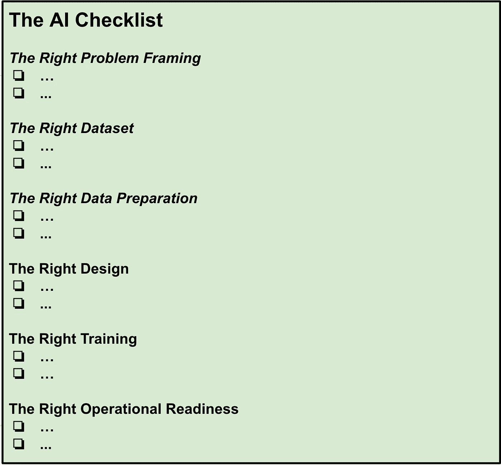

# 使人工智能民主化的护栏

> 原文：<https://towardsdatascience.com/the-ai-checklist-fe2d76907673?source=collection_archive---------13----------------------->

## 创建一个人工智能清单，将想法转化为生产

图片来源: [Unsplash](https://unsplash.com/photos/RLw-UC03Gwc)

[85%](https://www.pacteraedge.com/pactera-white-paper-reveals-85-percent-ai-projects-ultimately-fail-0) 的人工智能项目从未得到部署！在已经部署的项目中，只有 [60%](https://appen.com/whitepapers/driving-roi-through-ai/) 实现了他们承诺的影响！在今天一个典型的人工智能团队中，并不是每个人都具有构建成功的人工智能产品所需的相同水平的经验。团队成员在统计、模型基础、数据争论、操作、部署和产品设计思维方面的经验各不相同。

> 在构建[几十个](https://www.amazon.com/Self-Service-Data-Roadmap-Democratize-Insight/dp/1492075256/)数据+人工智能产品的过程中，有[个常见模式](/51-things-that-can-go-wrong-in-a-real-world-ml-project-c36678065a75)我在失败的产品中见过。所犯的错误不是因为不称职，而是因为团队已经知道但没有应用的东西使用不当。

为了填补这个空白，我一直在探索其他复杂任务中的技术，如进行手术、建造铲运机、驾驶飞机等。，把事情做好，交付一致的结果。在畅销书 [*【清单宣言*](https://www.amazon.com/Checklist-Manifesto-How-Things-Right/dp/0312430000) 中，作者 Atul Gawande 涵盖了他在多个领域对清单在复杂活动中的作用的研究。

> 这个博客是创建一个我们可以作为一个社区使用的人工智能清单的起点。我创建这份清单的灵感来自于与旨在利用数据+人工智能的非营利组织合作，但由于经验有限而陷入困境。我相信，为我们的社区建立一个人工智能清单将在改善所有行业人工智能项目的死亡率方面发挥关键作用。此外，它将使人工智能更容易为每个人特别是非营利组织所用，并为创新创造一个公平的竞争环境。

# 人工智能清单

清单中有六个部分:

人工智能清单的结构(图片由作者提供)

*   **正确的问题框架**:定义范围、价值定义、时间表、治理、与可交付成果相关的资源的形成阶段。
*   **正确的数据集**:这个阶段可能需要[几个小时或几个月](https://medium.com/wrong-ml/challenges-with-clickstream-datasets-in-the-real-world-4b0798572215?source=friends_link&sk=bc98b511f12607873c91bf19632346dc)，这取决于整体数据平台[的成熟度和健康程度](https://medium.com/wrong-ml/the-secret-ingredient-in-successful-ml-projects-data-culture-347829b51f03?source=friends_link&sk=52663e6152877ab612eac303ac71f9b5)。数据是 ML 的生命线，所以获得正确可靠的数据集是非常重要的。
*   **正确的数据准备**:现实世界的数据是杂乱的。理解数据属性和[适当的准备](https://medium.com/wrong-ml/why-data-wrangling-is-difficult-to-estimate-f6a54ec3f73c?source=friends_link&sk=ad348030415fcc8d884bb4c35e1b1d0c)可以在调试中节省无数的时间。
*   **正确的设计**:这一阶段涉及[特征选择](https://medium.com/wrong-ml/why-creating-ml-model-features-is-challenging-in-the-real-world-79c8e6cd91d9?source=friends_link&sk=2d4eb7a9961e021c8e2564044209ab87)，推理算法，分解问题，以及制定正确的模型算法。
*   **正确的培训**:建立模型，用坚持的例子评估，在线实验。
*   **正确的操作准备**:这是后期部署阶段，涉及模型和 ML [管道](https://medium.com/wrong-ml/re-think-your-data-pipelines-in-the-decoupled-era-5b032bc8b779?source=friends_link&sk=577cf9c5ceb0b3da0d34b7317f7f53ec)的[可观察性](https://medium.com/wrong-ml/observability-data-pipelines-99eda62b1704?source=friends_link&sk=994fc87e78cc2fcdb28fbdae1f53ebcb)，用新数据刷新模型，以及[跟踪原始问题上下文中的](https://medium.com/wrong-ml/taming-data-quality-with-circuit-breakers-dbe550d3ca78?source=friends_link&sk=5aff64c334b54728eb363db2fd26d4b0)成功指标。

# **右派问题诬陷**

***(详细版*** [***此处***](https://modern-cdo.medium.com/c9d145913310?sk=bb97e5eadd3543c9d5971ec3bf752c77)***)***

1。验证解决问题有可量化的商业价值

2。证实更简单的替代方案(如手工制作的试探法)不足以解决问题。

3。确保问题已经分解到尽可能小的单元。

4。明确如何应用人工智能输出来实现预期的业务成果。

5。明确衡量解决方案成功的可衡量指标

6。清楚了解精确度与召回率之间的权衡问题

7。逻辑分类预测不正确时的验证影响

8。确保项目成本包括管理相应数据管道的成本

# **右侧数据集**

9。验证了数据集属性的含义

10。验证了项目中使用的衍生指标是标准化的

11。由于数据管道错误，来自仓库或湖泊的验证数据没有过时

12。验证数据集的模式符合性

13。验证数据集是否符合数据权利法规(如 GDPR、CCPA 等)

14。确保数据集方案变更有明确的变更管理流程

15。验证数据集没有偏差

16 岁。验证正在使用的数据集不是孤立的，即没有数据管理员

# **正确的数据准备**

17。验证数据是否为 IID(独立同分布)

18。验证未使用过期数据，即可能不相关的历史数据值

19。验证数据收集中没有系统错误

20。验证是否监控数据集的突然分布变化

21。验证数据中的季节性(如果适用)是否被正确考虑

22。在分成训练和测试数据之前，验证数据是随机的

23。验证测试和训练示例之间没有重复

24。确保采样数据在统计上代表整个数据集

25。验证标准化和规范化对缩放特征值的正确使用

26。验证异常值已被正确处理

27。验证从大型数据集中选择样本的适当采样

# **正确的设计**

28。确保在跳到非线性模型(如适用)之前试验特征交叉

29。验证没有特征泄漏

三十。验证模型中添加了新功能，并记录了它们如何提高模型质量的理由

31。验证特征是否正确缩放

32。验证在使用深度学习之前尝试了更简单的传统 ML 模型

33。确保散列法应用于稀疏特征(如适用)

34。验证模型降维实验

35。验证分类阈值调整(在逻辑回归中)考虑了业务影响

36。验证逻辑回归中正则化或提前停止的应用(如适用)

37。应用嵌入将大型稀疏向量转换到低维空间(同时保留语义关系)

38。根据问题要求验证模型新鲜度要求

39。验证因仅适用于一小部分数据而被丢弃的特性的影响

40。检查特征计数是否与可用于模型训练的数据量成比例

# **正确的训练**

41。在模型开发的早期阶段，确保可解释性不会过早地影响性能

42。验证模型调整是否遵循科学方法(而非临时方法)

43。验证学习率不要太高

44。如果损失时间图没有收敛，验证根本原因是否得到分析和记录

45。分析了模型准确性的特异性与稀疏性之间的权衡

46。验证减少损失值是否会影响提高召回率/精确度

47。为开始在线实验(即金丝雀部署)定义明确的标准

48。验证多类分类中每类的准确性

49。验证为培训分配的基础设施容量或云预算

50。确保使用相同的数据集验证模型排列(用于比较)

51。验证了模型的准确性，不仅针对整个数据集，还针对单个细分市场/群组

52。验证训练结果是可重复的，即拍摄代码(算法)、数据、配置和参数值

53。已验证特征的训练服务偏斜中没有不一致

54。验证模型预测中的反馈回路已被分析

55。确认如果在线实验不按预期进行，是否有备用计划

56。验证模型已经校准

57。利用自动化超参数调整(如适用)

58。验证预测偏差已被分析

59。验证针对类别不平衡分析的数据集

60。验证用正则化λ试验的模型，以平衡简单性和训练数据拟合。

61。验证相同的测试样品没有被反复用于测试和验证

62。验证批量超参数不要太小

63。验证神经网络中的初始值

64。验证失败实验的详细信息已被捕获

65。在投资修复标签之前，验证错误标签的影响

66。验证是否使用了一致的指标来分析在线实验的结果

67。验证多个超参数没有同时调整

# **正确的战备状态**

68。验证用于生成时间相关特征的数据管道的低延迟性能

69。验证数据管道是否存在验证测试

70。验证单个数据切片的模型性能

71。避免在培训和服务之间使用两种不同的编程语言

72。确保适当的模型缩放，以使推理阈值在阈值范围内

73。验证在源头、湖泊摄入和 ETL 处理中检查数据质量的不一致性

74。验证与人工智能产品相关的云支出在预算范围内。

75。确保优化阶段平衡质量与模型深度和宽度

76。验证数据和概念漂移的监控

77。验证不必要的校准层已被移除

78。验证是否有监测来检测由于间歇性错误造成的模型慢性中毒

> 总而言之，在我的项目中应用人工智能清单极大地提高了成功率和交付速度！

**加入 AI 清单** [**任务**](https://github.com/sandeepu/AIChecklist) **和** [**订阅**](https://modern-cdo.medium.com/subscribe) **保持更新。**

***结帐*** [***解开数据***](https://www.unraveldata.com/)***——人工智能支持的现代数据平台内部和云的可观察性。***