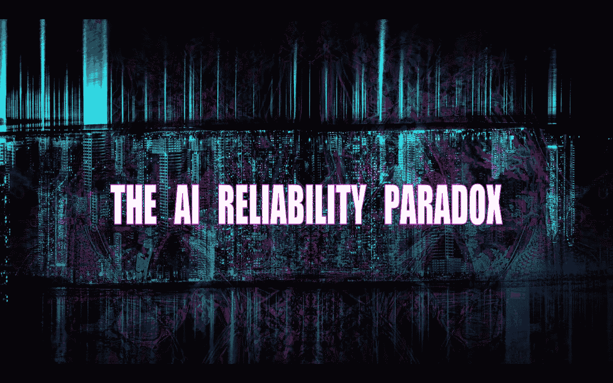
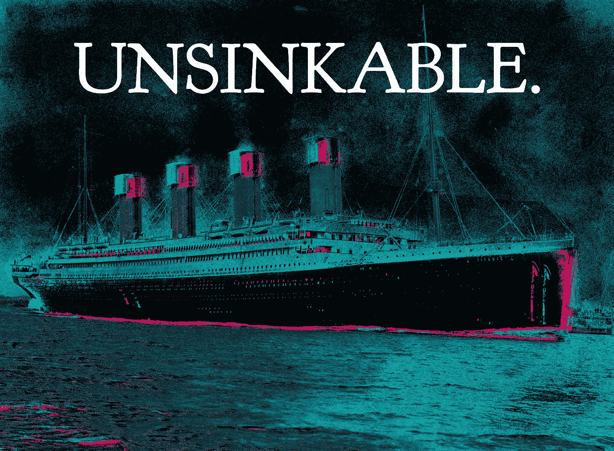

# 人工智能可靠性悖论

> 原文：<https://towardsdatascience.com/the-ai-reliability-paradox-ac8d1739206b?source=collection_archive---------6----------------------->

## 好到不能倒？一个高性能的系统会以令人惊讶的方式伤害你

想象两个(人类)工人:

*   克里斯粗心大意总是让你失望，他在 70%的时间里出色地完成了任务，而在其余的时间里却表现得畏首畏尾。看着克里斯尝试 10 次就足以激起你的*【哦，亲爱的】*反应。
*   **罗尼可靠**则是另一个故事。你已经看过罗尼一百多次了，你一直印象深刻。

百万美元的问题来了。哪个工人对你的企业更危险？

在一个高风险的任务中，答案可能是罗尼可靠…但可能不是第一个想到的原因。

# 这不是关于糟糕的项目

在[的另一篇文章](http://bit.ly/quaesita_genie)中，我已经指出，当决策者精神错乱时，极度可靠的员工可能是危险的。他们“只是服从命令”，即使那些命令很糟糕，所以他们可以放大无能(或恶意)。但这不是我在这里展示的逻辑，因为你已经听过我做的那个论证。让我们从另一个角度来看这个问题。

假设这个项目是一个好主意，如果做得好，会让世界变得更好，那么 Ronnie 可靠吗？

# 当你知道不该相信

问题是，你知道你不应该相信克里斯粗心。对你来说很明显。你预计会失败…这就是为什么你不会把房子押在克里斯身上。(对吧？)你不会让无能让你措手不及，所以你会围绕它进行设计。你会明智地为不可避免的失误设置故障保险。

图片:[来源](https://pixabay.com/photos/slip-up-danger-careless-slippery-709045/)。

你也要确保你一直在关注着一些事情，所以你要彻底地监视克里斯·马大哈。但是罗尼呢？你*相信*罗尼可靠。为什么要检查或建立安全网？罗尼完美无瑕，对吧？

# 当心可靠的工人

罗尼并不完美。你只是还没有看到失败——需要更多的[数据](http://bit.ly/quaesita_hist)来观察断裂点。事实是，你还没有机会正确评估可靠罗尼的崩溃会有多灾难性。

> 过于信任是个问题。当一个系统有明显的缺陷时，你可以围绕它的错误进行计划。你不依赖完美的执行。

由于未能理解 ***好*** 和 ***完美*** 之间的关键区别，领导者可能会将好员工的祝福变成高水平执行者的诅咒。

# 在规模上，没有什么是完美的

问题是你认为你已经彻底测试了罗尼，但你没有。尝试 100 次以上才能看出什么是一团糟。扩大经营规模，你将面临一种令人厌恶的待遇。

虽然这篇文章中的建议适用于人类工作者，但它对于人工智能系统和其他可扩展的解决方案来说更为紧迫。关于基于[数学](https://medium.com/hackernoon/ai-bias-and-what-you-can-do-about-it-4a6ae48b338e)和[数据](http://bit.ly/quaesita_hist)的解决方案，最危险的事情之一就是非专家[过于信任他们](http://bit.ly/quaesita_donttrust)。不要做那种坐以待毙的人，在复杂的任务上相信完美。

> *当你增加规模的时候，你会遇到长尾。*

最好假设没有什么是完美的。即使是最安全的系统也可能失败……尤其是当你给它们足够多的机会时。

图片:[来源](https://pixabay.com/photos/hand-world-ball-keep-child-earth-644145/)。

正如[现场可靠性工程师](http://bit.ly/quaesita_dmguide)爱说的那样，*“当你增加规模时，你会遇到长长的* [*尾巴*](http://bit.ly/quaesita_lemur) *”*

# 围捕长尾

即使你的系统已经过全面测试，99.99%都是好的，那也不意味着它是完美的。不幸的是，如果你不小心的话，你可能会在头脑中把它四舍五入到 100%。换句话说，你会忽略错误的*可能性*，因为它们的*概率*很低。这是高性能系统可能比低性能系统更危险的另一种方式…除非你做点什么。

> 当错误的概率很低时，不要忽视错误的可能性。

“永不沉没”的泰坦尼克号是心理围捕的一个例子。据 NBC 报道，这个短语最初是“[实际上是不沉的](https://www.nbcnews.com/id/wbna46916279)”，来自一本不知名的工程杂志，但过了一段时间，它就不重要了。最重要的是，有人声称听到船长爱德华·约翰·史密斯说“即使上帝自己也不能击沉这艘船。”图片:[来源](https://en.wikipedia.org/wiki/Titanic#/media/File:RMS_Titanic_3.jpg)。

# 保持安全

在这里，让罗尼变得可靠而危险的并不是最出色的表现。威胁在于过度信任。

那么，有什么解决办法呢？你如何在不冒风险的情况下获得卓越的所有好处？简单！为罗尼建立安全网，就像你对付克里斯一样粗心。那么你就得到所有世界中最好的。

> 仅仅因为你还没有看到一个错误，并不意味着你的系统是完美的。为失败做准备，建立安全网！

无论这项任务是由人类还是机器来完成，永远不要低估安全网的重要性。允许自己被看似完美的表现所迷惑，产生一种虚假的安全感，这是糟糕的领导方式。

> 相信完美是危险的。把完美当成一个不错的奖励，但永远不要依赖它。

相反，问自己一些令人不快的*假设*问题。如果你的顶级外科医生生病了怎么办？如果监测病人生命体征的机器出现故障怎么办？司机太累没注意路况怎么办？如果自动边境控制系统的面部识别系统错误地识别了某人，该怎么办？如果检查护照的*人*出错了怎么办？接下来会发生什么？

# “接下来会发生什么？”

每当我看到令人反胃的命运多舛的人工智能应用时，让我毛骨悚然的部分很少是自动化本身。这是建造者对错误的幸福无知。偶尔这种无知近乎犯罪。

> 错误* *会** 发生。

关于错误，要问的问题不是，“它们会发生吗？”他们会的。相反，你应该问:

*   有什么安全网来保护人们免受这些错误的后果？
*   如果整个系统——安全网等等——都失灵了，有什么计划让事情恢复正常？

如果没有预防和补救伤害的计划，那就为灾难做好准备。不管是谁负责这样一个项目，他都是无能的。他们是社会的威胁。不要成为那样的人。

# 人类对抗机器

如果一个错误是灾难性的，以至于失败是不可容忍的，那么就不要自动化任务，也不要让人类工人来做。或者，如果你的伦理中有一些东西说，故障来自人类工人比来自机器工人更好(这是许多自动驾驶汽车辩论的症结)，那么就使用人在回路中的方法。

> 更好并不等同于完美。

但是无论你做什么，记住错误是可能的。人类会犯错，人工智能系统也会犯错。即使你部署的人工智能系统会比人类系统犯更少的错误，但请记住，少犯*并不等于不犯*。更好并不等同于完美。**

> **每当任务复杂或输入变化时，错误*就会*发生。**

**相信完美的神话会有可怕的后果，所以不要让数学的神奇思维妨碍了常识。每当任务复杂或输入变化时，错误*就会*发生。**

# **概括起来**

**如果没有处理错误的计划，结果可能是灾难性的！它对你的打击可能比表现不佳的人犯的错误更大，因为你忘记了为此做计划。**

**所以，如果你聪明，你会选择最好的系统，但是[建立安全网](http://bit.ly/quaesita_policy)就好像它是最差的系统。**

**<http://bit.ly/quaesita_policy>  

# 感谢阅读！人工智能课程怎么样？

如果你在这里玩得开心，并且你正在寻找一个为初学者和专家设计的有趣的应用人工智能课程，这里有一个我为你制作的娱乐课程:

在这里欣赏整个课程播放列表:[bit.ly/machinefriend](http://bit.ly/machinefriend)

# 与凯西·科兹尔科夫联系

让我们做朋友吧！你可以在 [Twitter](https://twitter.com/quaesita) 、 [YouTube](https://www.youtube.com/channel/UCbOX--VOebPe-MMRkatFRxw) 、 [Substack](http://decision.substack.com) 和 [LinkedIn](https://www.linkedin.com/in/kozyrkov/) 上找到我。有兴趣让我在你的活动上发言吗？使用[这种形式](http://bit.ly/makecassietalk)取得联系。**