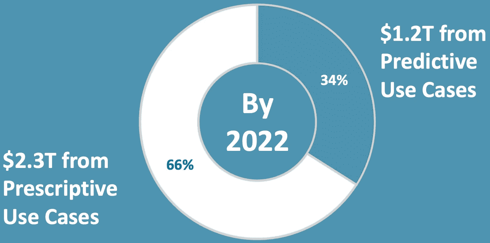

# 人工智能价值差距:第 1 部分

> 原文：<https://towardsdatascience.com/the-ai-value-gap-36463bcace6f?source=collection_archive---------40----------------------->

## 它将在分析能力方面迈出另一步，以实现与人工智能相关的数万亿美元的价值

大多数对人工智能价值产生的分析都想当然地认为人工智能将跨越一个相当大的鸿沟。几年后，技术有了进步，但使用技术仍然缺乏。图片由 [Riette Salzmann](https://pixabay.com/users/hesalzmanngmailcom-458151/?utm_source=link-attribution&utm_medium=referral&utm_campaign=image&utm_content=456100) 从 [Pixabay](https://pixabay.com/?utm_source=link-attribution&utm_medium=referral&utm_campaign=image&utm_content=456100) 拍摄

# AI 价值从何而来？

最近，麦肯锡全球研究所预测，通过评估 12 个行业的 120 个人工智能用例，[人工智能到 2022 年](https://www.mckinsey.com/featured-insights/artificial-intelligence/notes-from-the-ai-frontier-applications-and-value-of-deep-learning#part2)将产生至少 3.5 万亿美元的经济影响。根据我的分析，这些用例主要关注需要规范分析的问题，在这些问题上，人工智能必须就如何做提出建议。规范分析是从描述性分析到诊断性分析再到预测性分析的发展过程，其中每一种分析都综合了先前形式的许多实例来解决更困难的问题。

## 使用 Cynefin 框架对问题进行分类

图片来源:[维基媒体](https://en.wikipedia.org/wiki/Cynefin_framework#/media/File:Cynefin_as_of_1st_June_2014.png)

在 Pariveda，我们经常使用 [Cynefin 框架](https://en.wikipedia.org/wiki/Cynefin_framework)来讨论如何处理不同类型的问题。它是一个有用的工具，可以根据我们追踪原因和结果的难易程度，对如何解决问题进行分类:

1.  *简单*因果关系清晰，几乎任何人都可以遵循已知的最佳实践。
2.  *复杂的*，已知影响因果的未知因素，专家可以选择最佳的前进路径。
3.  *复杂*，其中的因果关系不能事先知道。

## 分析学简史

从描述性分析到规定性分析的进展。作者图片

我们从传统的 BI 开始，将业务数据存储在数据库中，并使用 SQL 构建报告。由于这不足以真正推动真正的价值，我们想出了一套工具来构建可以不断重新加载的实时仪表盘，并实现了对下一层信息的钻取。这些工具足以解决简单的问题。在幕后，Tableau 和 QlikSense 等仪表板工具为用户提供了快速循环许多不同角度的描述性分析的能力，以便找到结果或趋势的原因。

同样的事情随着 21 世纪初预测分析的兴起而重演。使用更先进的统计建模算法，我们可以处理以前已经显示在仪表板上的大量信息。这些机器学习算法提取了所有数据背后的模式，这些数据过去由人类显示和诊断，以预测未来将发生什么。随着这些进步，分析工具本身能够解决一些复杂的问题。

在过去的 4-5 年中，规范分析逐渐兴起，这种分析建立模型来推荐应该做什么。他们考虑到，基于大量的输入，未来可能会有许多不同的潜在方式。然而，这些输入中只有一部分是在您的控制范围之内的。这就产生了一个优化问题，在这个问题上，规范模型会根据对预测模型的优化来推荐最佳行动，只改变您控制范围内的输入。规范性分析能够帮助新技术解决几乎任何复杂的问题，在这些问题中，一个人或一个团队可能无法独自处理更多的输入，以做出最佳决策。

在过去 3 年左右的时间里，一种叫做强化学习的技术的进步使得规范的建模技术开始解决复杂问题的一个非常小的子集(主要是棋盘和视频游戏)，其中问题的整个背景的模拟是可能的。像 AlphaGo 在世界上最复杂的棋盘游戏中击败世界上最好的棋手，以及 OpenAI Five 在复杂的视频游戏中合作击败职业球队等系统的结果都令人印象深刻。但是，能够完全模拟依赖强化学习的现实问题相对较少。

## 人工智能的预计价值依赖于规定性分析

记住这个背景，让我们来谈谈行业分析师如何看待人工智能对世界的影响。这些数字令人震惊:据麦肯锡全球研究所(McKinsey Global Institute)称，在未来 4 年里，我们应该会达到这样一个点，即人工智能每年将对世界经济产生近 3.5 万亿美元的影响。为了更好地理解他们是如何得出这个结论的，我通读了早期报告的[附录，其中他们详细描述了推动这个数字的 120 个用例。我手动将每个用例标记为预测性的或规范性的。](https://www.mckinsey.com/~/media/McKinsey/Business%20Functions/McKinsey%20Analytics/Our%20Insights/The%20age%20of%20analytics%20Competing%20in%20a%20data%20driven%20world/MGI-The-Age-of-Analytics-Full-report.ashx)

数据来源于[麦肯锡全球研究院](https://www.mckinsey.com/featured-insights/artificial-intelligence/notes-from-the-ai-frontier-applications-and-value-of-deep-learning)。作者分析&图表

根据我的分析，66%的价值是由规范性分析产生的，我们根据一系列潜在的未来向一个人推荐行动，并说这是最好的？其中只有 34%(仍然是 1.2 万亿美元，所以不是小钱)只需要预测分析。对于那些对细节感兴趣的人，你可以查看我对用例的详细分析。

基于此，我们真的需要专注于理解那些规定的问题，所以我从规定的用例中构建了一个词云(见下文)。推动这 2.6T 美元价值的主要因素显然是优化，您也可以看到 reduce 占据了突出位置。你开始发现很多价值的其他东西是跨行业的个人或个性化模型。此外，很明显，您会看到这都是通过优化预测生成的，而预测是由数据生成的。

使用[Wordle(WordArt.com)](https://wordart.com)从[麦肯锡全球分析](https://www.mckinsey.com/featured-insights/artificial-intelligence/notes-from-the-ai-frontier-applications-and-value-of-deep-learning)说明性用例文本生成的词云

去掉最突出的一层，我们可以更具体地看到我们在做什么。很可能我们正在优化营销分配、多种形式的战略、重资产的维护和定价。在个人方面，针对性(针对患者的治疗和针对个人消费者的广告)和个性化服务非常突出。这一分析突出的一点是，价值与优化和个性化核心业务流程密切相关。这些类型的问题肯定属于复杂空间，在广阔的生态系统中因果关系不清。

同一个词云，去掉了最大的词，让我们把注意力集中在下一层

## 人工智能的价值差距——规范不会让我们达到这个目标

当我们查看今天关于规定性分析的指南时，有许多指南侧重于技术建议(这里有[一个](/top-5-issues-with-prescriptive-analytics-and-how-to-overcome-them-6f5cada83aa4) [少数](https://www.riverlogic.com/technology/prescriptive-analytics/) [好的](http://analytics-magazine.org/executive-edge-five-pillars-of-prescriptive-analytics-success/) [例子](https://go.forrester.com/blogs/17-02-20-what_exactly_the_heck_are_prescriptive_analytics/)，但[大多数](https://www.techradar.com/news/the-path-from-predictive-to-prescriptive-analytics) [文章](https://www.dataversity.net/putting-focus-action-prescriptive-analytics/) [都是](https://www.bcg.com/publications/2016/using-advanced-analytics-improve-operational-decisions.aspx) [只是](https://datafloq.com/read/what-is-prescriptive-analytics-why-should-you-care/5460) [定义](https://www.forbes.com/sites/blakemorgan/2019/02/21/descriptive-analytics-prescriptive-analytics-and-predictive-analytics-for-customer-experience/#70111e6d69e0) [或](https://www.cio.com/article/2860386/5-things-cios-should-know-about-prescriptive-analytics.html) [营销](https://searchbusinessanalytics.techtarget.com/feature/Prescriptive-analytics-takes-analytics-maturity-model-to-a-new-level) [绒毛](https://www.computerweekly.com/news/2240177801/Gartner-analytics-will-be-more-transparent-real-time-and-automated))。有了今天的最佳建议，您将专注于寻找最佳的优化或可满足性求解器，并构建数据集成来满足它们，以便您可以将大量不同的输入纳入您的预测模型并提出建议。然而，这就是你所得到的一切:提出建议，然后呢？

事实上，最终发生的是这些复杂的问题，而这些问题正是很多价值所在。如果我是 Gap，Inc .，我想在我的【4000 多家商店和 [7 个品牌](http://www.gapinc.com/content/gapinc/html/aboutus/ourbrands.html)中优化我的产品组合(麦肯锡确定的[最高价值用例之一)，这不是一个静态问题，我今天可以提出一个建议，说“好的，我现在将从那笔交易中获得 1–2%的收入增长。”我真正需要做的是随着时间的推移不断优化条件，这样我就不只是建议现在应该做什么，而是建立一个系统，随着时间的推移适应建议在过程的每个阶段应该做什么。](https://parivedasolutions.box.com/s/chyueupx9bx8r3u8psli5hcvlzdezunm)

最重要的是，对问题空间的看法通常也非常有限。如果你考虑一个供应链优化用例:我如何管理仓库中的库存？这只是优化问题中的一个。在现实世界中，有库存、将货物运送到仓库的供应链，以及将货物从仓库运送到车间的物流。麦肯锡认为，当他们设计这种机制时，这些协同工作的东西将得到优化。回顾麦肯锡的使用案例，只有 12 个可以通过优化单个关注点来实现。这些主要包括许多不同行业的规定维护，但也包括一些后台办公自动化。

我对麦肯锡人工智能用例的分析表明，几乎所有的指令性用例都关注复杂的问题。您可以[在这里](https://parivedasolutions.box.com/s/chyueupx9bx8r3u8psli5hcvlzdezunm)找到用于分析的源数据。

# 迈向适应性分析

我想介绍的是一个新概念，我称之为自适应分析。实现自适应分析需要重复我们在从描述性到规定性的道路上看到的相同的分析演变。因此，自适应分析意味着思考一系列建议，并建立一个系统来确保这些建议随着时间的推移而变得更好，从而产生更好的结果。

自适应分析的发展遵循了我们在之前的分析转变中看到的相同模式。图片作者。

在定义自适应分析时，我引入了术语*共同创造*，我认为这可能是与规范分析最重要的区别。共同创作实际上已经在设计思维社区存在很长时间了。如果你想了解更多关于这个概念的知识，有大量的材料([模板](https://yourstory.com/2019/02/co-creation-canvas-customer-engagement)、[幻灯片](https://www.slideshare.net/SalesCubes/sales-cocreation-35336385)、[书籍](https://issuu.com/bis_publishers/docs/from_selling_to_co-creating)、[课程](https://www.designthinkersacademy.com/course-catalogue/2-day-course-co-creation-and-design-thinking-in-sales-april2019/))可以很好地提供深入的建议。组织长期以来一直在使用这些技术，并通过让客户参与设计过程并在他们购买后继续支持他们来实现真正的价值(这导致了许多公司的[客户成功部门](https://www.gainsight.com/event/customer-success-customer-outcomes-customer-experience/)的兴起)。通过人工智能共同创造，我们将开始使用数据&人工智能方法，在您使用自适应分析驱动的产品或服务时，实时应用在设计思维研讨会中获得的一些概念。

以下是我对人工智能共同创造的定义:

> 当人工智能代理与人类合作者交互时，人工智能共同创造发生，人类合作者逐渐向代理提供更多信息。这两者一起工作来发现和优化人类的目标。

让我们分析一下这个定义。一个希望采用自适应分析的组织首先必须将客户视为合作者。这种思维模式的转变非常重要。通过把你的客户想象成将与你一起工作的人，不仅你的人工智能需要继续帮助他们，而且你可以要求他们帮助你。

这就引出了第二部分:*世卫组织逐步提供更多信息。*这可以通过应用程序内的数据收集来实现，也可以通过下面提到的其他反馈回路来实现。

最后一句话强调需要理解你正在优化的目标，以便随着时间的推移取得成功，并承认这些目标通常很难预先阐明，所以它们也必须随着时间的推移而被发现。这对于掌握着人工智能大部分价值的复杂问题尤其重要。

# 自适应分析领域的创新者

让我们看几个例子来帮助澄清概念:

## Gong.io:销售支持

Gong.io 通过使用高级自然语言处理解决 B2B 销售的复杂问题而闻名。他们吸收销售过程中的所有数据:电子邮件、电话交谈、视频通话、面对面会议的录音。使用这些数据，他们可以确定一些事情，比如谁在什么时间发言，整个时间内的谈话主题是什么，(例如，你是在演示、做介绍、闲聊等等。)然后，他们将这些数据与该组织现有 CRM 系统所取得的结果(销售结果、获得下一次会议、销售周期长度等)进行比较。然后他们所做的是在视频或电话，或电子邮件期间实时提出建议，你可以通过该系统。这些建议是他们的人工智能代理“认为”你可以优化你现在正在做的事情。到目前为止，他们使用的是规定性分析。

让我们看看他们如何开始转向自适应分析:

1.  他们基于大量的数据提出这些建议，因为他们需要你的 CRM 结果，给他们关于你是否达到目标的详细数据。这里，协作方面就出来了。
2.  他们实时提供建议，试图帮助你适应这种情况。
3.  如果你忽略这些建议，只做你认为最好的事情，那么他们会跟进并获取关于为什么会发生这种情况的信息，随着时间的推移，每个使用龚的销售人员都开始获得更个性化的代理，以一种他们实际上会听而不是说的方式来帮助他们

使用这些技术，他们建立了一个系统，使那些按照他们的方式成功销售的人能够从他们整个组织(实际上是整个龚用户群)的广泛经验中学习。然而，他们不仅在学习更好的实践，他们还在实时应用这些实践，使之具有可操作性，并适应激励你接受建议。

## AutoCad:创成式设计

AutoCad 是计算机辅助设计软件的领先供应商。他们的[生成设计](https://www.autodesk.com/solutions/generative-design)软件将软件从简单记录设计师的工作转变为通过生成设计与设计师合作。它通过要求规格，然后生成数百个符合规格的设计，同时优化设计的特定方面，循环进行。然后，设计师选择最符合其规格的设计，并可以(通常会)添加更多约束。

## 亚马逊 Alexa 产品订购

我们都想在用完之前补充家用物品。因为我的房子里到处都有 Alexa 设备，所以当我意识到我缺少一些东西时，我可以很容易地完成我的目标。

如果我告诉 Alexa 订购更多的垃圾袋，她会说，“我看到你过去订购过 Glad ForceFlex 垃圾袋。他们将在两天后到达这里。你想再点一次吗？”这给了我做订单所需的所有信息，整个过程花了 30 秒左右。当我与 Alexa 交互时，亚马逊使用大量上下文信息来为我在这种情况下想要的产品建立订单。

如果我在 Alexa 建议订购时告诉她“不”,那么我会根据像我一样的购物者在网站上的受欢迎程度获得一系列其他潜在产品，Alexa 会记住我下次订购的产品，同时也会将这些信息考虑在内，以便向像我一样的其他客户推荐。

## 自适应分析—未来工作

有几种技术可以帮助拥有强大技术基础的组织增强其数据科学能力(通常是那些积极部署规范分析应用程序的组织)。我将在以后的文章中充实这些内容，但下面会介绍一些概念。

让您的组织为自适应分析做好准备的第一步是开始将您的客户视为将与您合作的合作者。这需要对合作者的目标有深刻的理解，并由一系列人工智能驱动的反馈回路提供支持，这些反馈回路由无缝技术平台实现。为了开始理解客户的目标，人们可以从利用[许多来自设计社区的移情技术](https://www.interaction-design.org/literature/article/stage-1-in-the-design-thinking-process-empathise-with-your-users)开始。然而，在人工智能将产生最大价值的复杂场景中，你的合作者通常不会从一开始就知道他们的真正目标。你必须让他们逐渐表达他们的目标(这是自适应分析的自适应部分)。我认为必须建立 4 层反馈回路:

反馈循环是实现自适应分析的关键之一。图片作者。

1.  交互式循环，实现接近实时的反复往复
2.  使用新数据快速改进和个性化模型的自动循环
3.  引入额外信息并改变 UX 的分析循环
4.  开发整个产品下一版本的扩展循环

我期待着在未来的帖子中扩展这些概念。

本系列文章的更多内容:

*   [缩小人工智能价值差距第二部分:人工智能与自适应分析的共同创造](/closing-the-ai-value-gap-part-2-ai-co-creation-with-adaptive-analytics-3f144b42028f)
*   [缩小人工智能价值差距第三部分:自适应分析路线图](/closing-the-ai-value-gap-part-3-the-roadmap-to-build-adaptive-analytics-e70eaf076ce0)

一如既往，感谢阅读到这一点！我写这些文章是为了激发讨论，所以请不要犹豫，通过 Medium 或 LinkedIn 回复。