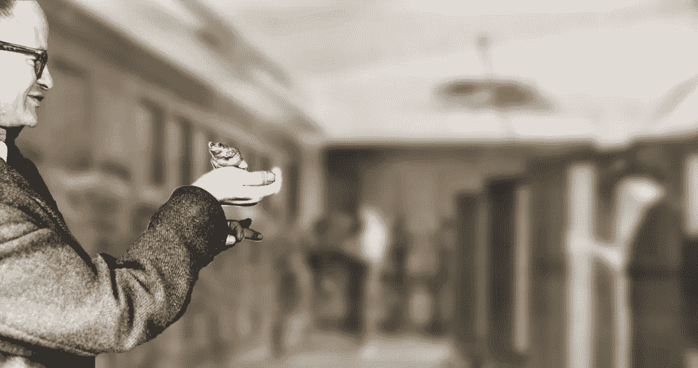

# 人工智能战争:从瘫痪领域的冲突中吸取教训

> 原文：<https://towardsdatascience.com/the-ai-wars-lessons-from-the-conflict-that-paralyzed-the-field-7344666c7875?source=collection_archive---------25----------------------->

## 塑造了人工智能领域的发展和研究的冲突背后的故事。

年轻的弗兰克·罗森布拉特(Frank Rosenblatt)正处于心理学家职业生涯的巅峰，他创造了一个可以学习技能的人工大脑，这在历史上还是第一次，甚至《纽约时报》都报道了他的故事。但他童年的一个朋友出版了一本批评他工作的书，引发了一场智力战争，使对人工智能的研究瘫痪了多年。

**弗兰克·罗森布拉特(左)和马文·明斯基(右)。**维基共享资源和*本·格雷/Flickr 提供的原始照片。*

这位朋友是马文·明斯基，他从青春期就认识罗森布拉特，他的书是符号人工智能的支持者传播神经网络不起作用这一观点的完美借口。

许多工程师和科学家认为他们不应该担心他们周围的政治或社会事件，因为他们与科学无关。我们将了解到，在上个世纪的很长一段时间里，利益、政治和金钱的冲突让人类在人工智能领域失去了希望，不可避免地开始了众所周知的**人工智能冬天**。

这不是一个关于数学、人工智能或科学的故事。这是一个关于贪婪、无知和人类好奇心胜利的故事。

这是人工智能战争背后的故事。

# 神经元

一个 11 岁的西班牙男孩因众所周知的叛逆行为制造了一个自制的大炮，他开枪摧毁了邻居的门，为此他被逮捕并入狱。

同样是这个孩子，圣地亚哥·拉蒙·卡哈尔，在 40 年后获得了诺贝尔奖。

他是一名外科医生的儿子，这一职业迫使他的家人不断旅行。圣地亚哥是一个非常优秀的画家和体操运动员，但他的父亲从不鼓励这些能力。这些才能将有助于他日后的成功。他在萨拉戈萨学医，职业生涯结束后被西班牙军队招募并被送往古巴，在那里他染上了疟疾和肺结核。在西班牙康复并担任了几年教授后，他开始使用一种新的方法来观察脑组织，由此他绘制了大脑主要区域的大量细节图。

在 20 世纪之前，科学家认为大脑是一个单一的连续网络，中间没有任何间隙。

圣地亚哥用新技术证明了神经细胞之间的关系不是连续的。德国解剖学家海因里希·瓦尔德耶(Heinrich Waldeyer)学习西班牙语研究圣地亚哥的发现，并将观察结果总结成他所谓的:**神经元理论**(“神经元”概念在此之前并不存在)。

**大脑皮层的锥体神经元(1904)，由圣地亚哥绘制。**图片由卡哈尔研究所(CSIC)提供。

> 神经元在成人体内生长的能力以及它们创造新连接的能力可以解释学习。
> **圣地亚哥·拉蒙·卡哈尔，1894 年**

因为最后一句话，圣地亚哥被认为是历史上第一位神经科学家。这些发现永远改变了我们对大脑的理解。

圣地亚哥·拉蒙和卡哈尔·⁴.

多亏了这项新知识，心理学家弗兰克·罗森布拉特几年后可以在他所谓的感知机中复制人类神经元。

# 第一个人工神经元

1935 年的一个下午，一个名叫沃尔特·皮茨的孩子被几个恶霸追赶，他迅速躲进了当地的图书馆。图书馆是他躲避外面残酷世界的避难所。

皮茨在图书馆呆了三天，不仅是因为那些恶霸，还因为他的注意力被一本试图将所有数学简化为纯逻辑的书所吸引。皮茨坐下来，开始阅读这本书的近 2000 页。在那些日子里，他发现了一些错误，并给作者伯特兰·罗素写了一封信，罗素很惊讶，因为**沃尔特只有 12 岁。**

15 岁时，他离家出走，从那时起，他拒绝谈论自己的家庭。从那时起，他开始了他的人生旅程，在芝加哥大学听几位数学家的讲座。他在那里遇到了物理学家尼古拉斯·拉舍夫斯基，数学生物物理学的创始人，并被他的工作所吸引。

这些新的知识启发了沃尔特用计算机复制大脑的功能。几年后，他发表了一篇论文，作者是帮助他摆脱流浪生活的人(他已经无家可归好几年了)，沃伦麦卡洛克。他们提出了第一个神经网络的数学模型。这个模型，一个简单的形式化神经元，仍然是神经网络领域的参考标准。当他们展示这幅作品时，皮特只有 20 岁，他们正处于第二次世界大战的中期。两位科学家都受到被认为是计算机科学之父的英国数学家艾伦·图灵的启发，他们使用最近发表的图灵机概念来复制大脑。

沃尔特·皮茨正在用一只青蛙做实验。Iapx86 在⁵.维基共享资源上的原始图片

# 感知器

正如 Santiago Ramón y Cajal 所说，当我们的神经元创建新的连接时，人类就会学习。如果狗咬了我们，负责识别狗的神经元和识别疼痛的神经元**同时触发信号**、**，并在它们之间建立联系**。随着我们收集到更多对我们无害的狗的经历，两组神经元之间的联系被削弱，我们不再将疼痛与狗联系在一起。

这个故事的主角弗兰克·罗森布拉特 1928 年出生于美国，他学习心理学，但他的研究兴趣广泛:从神经生物学到计算机科学。这些不同的领域让他创造了他最著名的人工制品:T4 感知器 T5、T6，这是一种根据生物学原理构建的电子设备 T7，T8 显示出学习 T9 的能力。

许多科学家对大脑如何工作的研究和计算机的发明正在汇聚成一个具有学习能力的人造大脑。Frank Rosenblatt 设计了感知器，这是一种模拟神经元学习过程的数学结构。

感知器是一个具有三个元素的结构:**神经元、链接**和一个名为**权重**的参数，用来模拟神经元之间连接的强度。这是一种人工神经网络。

每个神经元都存储一个数字，这个数字是其他神经元的“信号”。在下一个动画中，您可以看到**如果连接很强(权重)，第一个神经元的变化将如何影响下一个神经元**，如果连接很弱，则不会影响它。就像人脑一样。

权重如何影响神经元交互的示例。**我**作者*法师。*

感知器的完整结构由**三层**和**权重**组成:

**我**作者*法师。*

输入-神经网络中的第一层(蓝色)。它接受输入值，并将它们传递给下一层。

隐藏层(灰色)-帮助数据处理的一组神经元。

输出层(绿色)-用于在操作后获得结果的层。

**一般来说，感知器只是一个有输入和输出的函数，权值只是函数的内部工作。**

这个网络可以像婴儿一样被训练，我们将输入大量的例子到网络，我们将在输出层看到结果，每次我们得到一个不好的答案，**一个算法将改变权重的值。**

关于更详细的解释，你可以阅读我的文章[一篇关于人工智能和机器学习的有趣且超级简单的介绍](https://becominghuman.ai/a-fun-and-super-easy-introduction-to-artificial-intelligence-and-machine-learning-de2ab0f1942e?sk=1b5bb45047ca4cae62975bb3cbdf7873)

# 男性对女性实验

罗森布拉特领导设计了一台计算机来实现这一想法，并试图训练它识别照片中男性和女性的差异。

> “[海军]期望的电子计算机胚胎将能够行走、说话、看、写、自我复制并意识到它的存在。”
> 
> ***纽约时报*** 关于感知器的报道。

虽然感知器最初看起来很有前途，但很快证明，感知器不能被训练成识别许多类型的模式。这个系统无法理解男性和女性之间的区别。

这是人工智能崩溃的开始。

# 这本书

研究人员在研究这个问题时不知道的是，人工智能社区后来发现:**为了识别复杂的模式，我们需要不止一层隐藏的神经元**，这是我们今天所知的**深度学习**的关键概念。

马文·明斯基和西蒙·派珀特于 1969 年出版的《感知机》一书给出了数学证明，承认了感知机的一些优势，同时也展示了它的主要局限性。最重要的一个与 CPU 通常执行的最简单操作之一的计算有关:XOR 函数。

简单来说，XOR 是一个逻辑函数，如果**只有一个**输入为真，则返回真。一般来说，XOR 是一个逻辑门，如果真输入的数量**是奇数**，则返回真。这本书展示的是，只有一个隐藏层的感知器无法映射异或函数，**这也意味着它无法复制几个复杂的函数**。为了处理复杂的功能，我们需要更多的层，但是社区忽略了这个事实。

马文·明斯基和西蒙·派珀特。⁶ ⁷.维基共享资源的原始图片

罗森布拉特和明斯基成为人工智能研究社区内部一场辩论的核心人物，并以在会议上大声讨论而闻名，但仍保持友好。

这本书的结论被错误地解读为神经网络不可能有进一步的发展，这种人工智能的方法不得不被放弃。

马文·明斯基一生都持怀疑态度，甚至在他生命的最后几年，他也不相信人工智能的进步。即使作为 field⁶.的专家，他也做出了很多糟糕的预测

# 人工智能战争

这种炒作在许多新兴技术中很常见，比如铁路热、网络泡沫以及最近比特币的兴起。

在其整个历史上，对人工智能的研究经历了几个炒作周期，随后是失望和批评，随后是资金削减，随后是几年或几十年后的重新关注。“人工智能冬天”这个术语是通过类比核冬天的概念而创造出来的。

当感知器被研究时，新的方法，包括符号人工智能出现了。引发这场“人工智能战争”的核心问题是，不同的群体发现自己在争夺资金和人才，他们对计算能力的需求远远超过了⁴.的供应

与神经网络相反，符号人工智能更容易理解，其结果也更容易解释。为了使用符号人工智能，我们需要**向计算机描述问题的整体**，指定它们的对象和规则，然后**计算机将基于这些规则做出假设**。一般来说，支持这种方法的科学家反对使用神经网络。

几年后，研究人员发现神经网络在处理不确定性问题时更有用，例如对⁵.进行预测但是在《感知器》一书出版后，研究经费站在了象征性人工智能的一边。

1973 年，英国议会要求詹姆斯·莱特希尔爵士教授评估人工智能研究的状况。他的报告，现在被称为**莱特希尔报告**，批评了人工智能未能实现其“宏伟目标”。他的结论是，在人工智能领域做的事情，在其他科学领域都做不到。

该报告导致了英格兰未来 10 年人工智能研究的彻底瓦解。

詹姆斯·莱特希尔爵士。⁸.维基共享资源的原始图片

弗兰克·罗森布拉特于 1971 年 7 月在他 43 岁生日时死于切萨皮克湾的一次划船事故。

# 死灰复燃

尽管国防高级研究计划局(DARPA)不再相信 AI 的可能性，但一个名为动态分析和重新规划工具(DART)的新项目改变了这项研究的命运。这个工具被美国军方用来优化和安排物资或人员的运输**被证明是如此成功，以至于它在 4 年内获得的资金超过了 DARPA 在过去 30 年里投入人工智能研究的所有资金** ⁷.多亏了 DART，1990-91 年的沙漠盾牌/风暴行动成为了战争史上规模最大、速度最快、距离最远的一次海上运输。

虽然 DART 不是我们现在所知的 AI，但它当时被称为人工智能程序，**帮助保持了调查的火焰**。

但即使在 2000 年代中期，人工智能领域的研究人员也有意用其他名称来称呼他们的工作:信息学、机器学习、分析学等。该领域的声誉受损。

在接下来的几年里，由于炒作和失望的持续循环，出现了其他的小 AI 冬天，但最终，**人类的好奇心沿着罗森布拉特建议的路径**，在神经网络中发现了一个圣杯。最终，微小的变化导致了**缓慢的常态**，现在人工智能无处不在:在我们的手机里，在你上下班乘坐的公交车上，在 Instagram 为你提供的那些无尽的推荐中。

但是，象征性的人工智能最终幸存下来了吗？

例如，象征性人工智能不允许预测下个月的黄金价格。虽然神经网络可以做到这一点，但它无法解释中间的过程。就像一个黑匣子。人工智能的下一个重大进展可能是创造出融合了两种模式优点的混血儿 ⁸.

# 人工智能的春天和下一场战争

人工智能的冬天被认为已经结束，因为由机器学习驱动的解决方案取得了巨大成功。谷歌翻译、AlphaGo、沃森和 GPT 3 是这些天来推动人工智能进步的一些摇滚明星。由于这些技术，我们目前正生活在自 2010 年以来的人工智能春天。

但是，不仅由于这些公司创造的高期望，另一个人工智能冬天可能会到来，而且我们可能会在这两个激烈竞争最新人工智能趋势的项目之间爆发另一场人工智能战争: **Deepmind(谷歌)**和 **Open AI(由埃隆·马斯克和其他人创立)** ⁹.

当研究人员专注于拥有最佳网络模型来解决现实生活中的问题时，关于人工智能伦理的讨论变得越来越难。几个月前，谷歌解雇了一名计算机科学家，该科学家警告说，当前的人工智能模型⁰.存在种族主义和性别歧视

最终，我们是人类，我们天生具有竞争性和冲突性，唯一能拯救科学的是我们的好奇心和毅力。

参考资料:

[1]对感知者争论的官方历史的社会学研究(1996)。[https://journals.sagepub.com/doi/10.1177/030631296026003005](https://journals.sagepub.com/doi/10.1177/030631296026003005)

【2】试图用逻辑救赎世界的人(2015)。[https://nautil . us/issue/21/information/the-man-who-that-to-redempt-the-world-with-logic](https://nautil.us/issue/21/information/the-man-who-tried-to-redeem-the-world-with-logic)

[3]神经质神经元。【https://ncase.me/neurons/ 

[4]计算能力和人工智能的社会影响(2018)。[https://arxiv.org/abs/1803.08971v1](https://arxiv.org/abs/1803.08971v1)

[5]符号人工智能和数字人工神经网络:走向二分法的解决(1995)。[https://link . springer . com/chapter/10.1007% 2f 978-0-585-29599-2 _ 11](https://link.springer.com/chapter/10.1007%2F978-0-585-29599-2_11)

[6]马文·明斯基的人工智能预测有多准确？(2020).[https://www . bright work research . com/how-accurate-was-Marvin-Minsky-in-his-ai-predictions/](https://www.brightworkresearch.com/how-accurate-was-marvin-minsky-in-his-ai-predictions/)

[7] DART:革新物流规划(2002)。[https://ieeexplore.ieee.org/document/1005635](https://ieeexplore.ieee.org/document/1005635)

[8] AI 的下一个大飞跃(2020)。[https://knowable magazine . org/article/technology/2020/what-is-neuro symbolic-ai](https://knowablemagazine.org/article/technology/2020/what-is-neurosymbolic-ai)

【9】open ai 已经超越 DeepMind 了吗？(2020).[https://analyticsindiamag . com/has-open ai-supered-deep mind/](https://analyticsindiamag.com/has-openai-surpassed-deepmind/)

[10]我们读到了迫使蒂姆尼特·格布鲁离开谷歌的那篇论文。这是它说的(2020)。[https://www . technology review . com/2020/12/04/1013294/Google-ai-ethics-research-paper-forced-out-Tim nit-gebru/](https://www.technologyreview.com/2020/12/04/1013294/google-ai-ethics-research-paper-forced-out-timnit-gebru/)

[11][https://triple ampersand . org/kernelled-connections-perceptron-diagram/](https://tripleampersand.org/kernelled-connections-perceptron-diagram/)

[12][https://www . Flickr . com/photos/Ben _ grey/376233032/in/photo list-jkwdf-jkwfe-jkwse-jkwkw 8n-jkgdz-jkgl 6-jkwbn-jkw 5t-jkgbr-jkl 8y-jkwwo-jkwuu-2pd 4 wy-obju-oah 3e-6t 4 DMP-7 mnzze-laize-7](https://www.flickr.com/photos/ben_grey/3762533032/in/photolist-JKwDf-JKwxN-JKwFE-JKwsE-JKW8n-JKGDz-JKGL6-JKwBN-JKW5T-JKGBR-JKL8y-JKwwo-JKwuu-2pD4wY-oBjuU-oAH3E-6T4dMP-7MNzCE-LaiZe-7MNzew-3geHX-fSxyn-3geHJ-KFUHy-cDgQZ9-7MHDG9-f6Beos-nYGAAi-5SkoDN-pX1Y6W-3jYgMC-8GNpR6-6JtXZb-6JpSax-D4hs5j-5xZMpk-qFfQE-djjEfG-6xd63G-2ytq2s-f6Bewm-6kED1e-7RC8iR-4fabEm-5X1J6W-6EbXho-7ytJb2-9RfCFD-9Riu8q-6soSwd)

[13]T2]https://www . national geographic . com . es/science/current/una-sample-con-drawings-Santiago-Ramon-Cajal-recur-USA-Canada _ 11187

[14]【第 4 季】http://DBE . rah . es/biologies/10967/Santiago-Ramon-y-Cajal

[15][https://es . Wikipedia . org/wiki/Walter _ Pitts #/media/file:lettvin _ Pitts . jpg](https://es.wikipedia.org/wiki/Walter_Pitts#/media/Archivo:Lettvin_Pitts.jpg)

[16][https://en . Wikipedia . org/wiki/Marvin _ Minsky #/media/file:Marvin _ Minsky _ at _ olpcb . jpg](https://en.wikipedia.org/wiki/Marvin_Minsky#/media/File:Marvin_Minsky_at_OLPCb.jpg)

[17][https://es . Wikipedia . org/wiki/Seymour _ paper rt #/media/file:paper rt . jpg](https://es.wikipedia.org/wiki/Seymour_Papert#/media/Archivo:Papert.jpg)

[18][https://es . Wikipedia . org/wiki/James _ light hill #/media/file:James _ light hill . jpg](https://es.wikipedia.org/wiki/James_Lighthill#/media/Archivo:James_Lighthill.jpg)