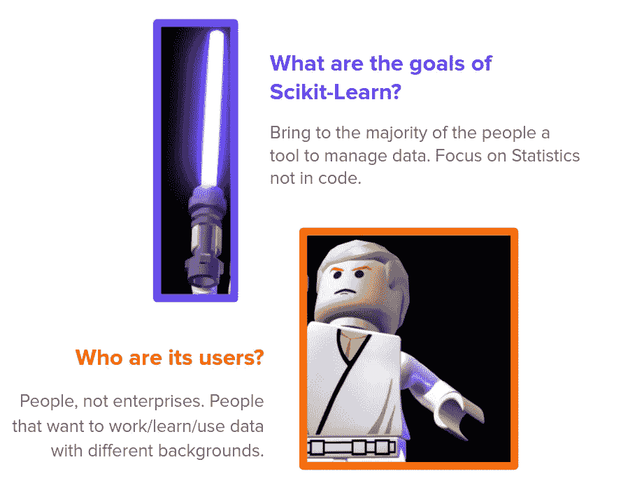
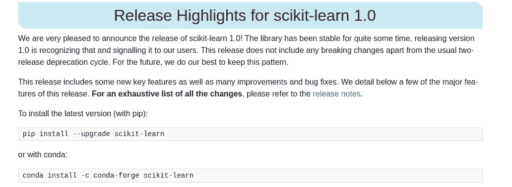
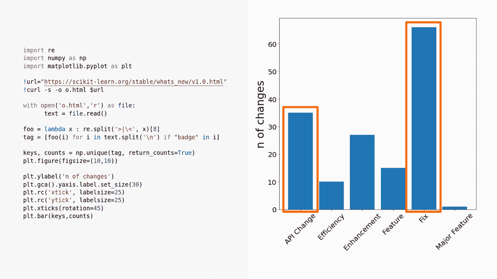
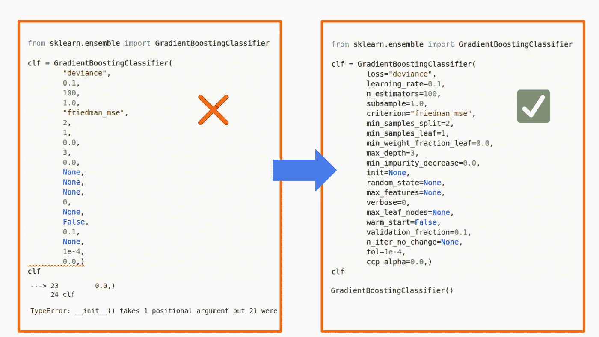
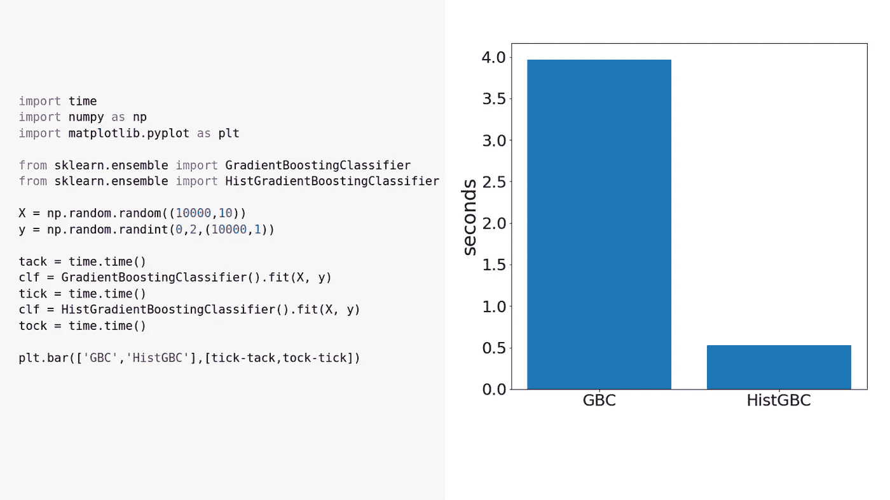
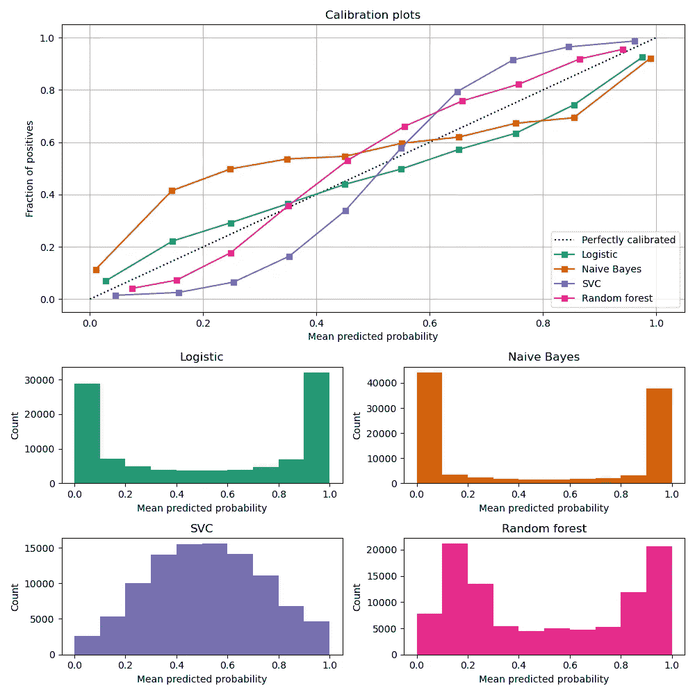

# Scikit-Learn 1.0 的目标

> 原文：<https://towardsdatascience.com/the-aim-of-scikit-learn-1-0-985642811f27?source=collection_archive---------9----------------------->

## 有哪些新特性，为什么它们对第一个主要版本如此重要？

图片来自 Unsplash (Mae Mu)

从 Scikit-Learn 开始到现在已经过去了 14 年，发布了 24 个测试版，现在终于到了 1.0 版。这听起来可能有点奇怪，因为 Scikit-Learn 已经被数千家公司、数据科学家、研究人员使用了很长时间，每个人都认为它是通用机器学习最广泛的框架。

在本文中，我不想像许多其他文章那样对新特性进行分析，而是想**了解 Scikit-Learn 这个版本的目的**以及它未来的发展策略是什么

# 1.一些历史

Scikit-Learn 诞生于 2007 年，最初是谷歌的代码之夏项目，并在 T2 的研究环境中继续开发。它的目标是作为一种工具进行数据分析，而不必关注任何特定的技术或代码。由于这个原因，它基于 Python，一种开源语言，易于使用，通用，并且能够嵌入 C 代码

**图片由作者提供**:sci kit-学习作为一种力量，卑微的数据 Jedis 需要用可靠和高效的库工具来对抗帝国公司。

处理数据时的另一个大问题是内存和处理方面的计算资源，因此 Scikit-Learn 一直在努力提高算法效率，以允许即使是计算资源较少的**用户**处理数据。Scikit-Learn 通过使用统计近似值和低级代码(Cython)来实现这一点。

此外，Scikit-Learn 超越效率和简单性的关键点是文档。很多数据科学家(我自己)都是通过阅读 Scikit-Learn 的文档来学习机器学习的。它不仅仅是代码文档，还是数据科学的学习途径。

# 2.1.0 版

如果我们看到这次发布的亮点，我们可以看到 API 的变化，甚至一些很酷的新功能

图片:来自 scikit-learn.org 的说明

然而，通过查看 [**changelog**](https://scikit-learn.org/stable/whats_new/v1.0.html) 页面并绘制通过处理 HTML 页面提取的标签，我们可以看出大多数标签是修复和 API 更改。

**作者图片**:每个标签的特征数量和生成它的代码。

在下一节中，我们将深入探讨三个主要主题，它们可以总结该版本的所有变化。

# 3.发布亮点

## 3.1.API 标准化

库接口中的一个重要模式是所有的**模块都可以互换**。这意味着，例如，如果您试图构建一个监督模型，拟合、测试、预测和测量该模型准确性的函数和方法独立于您正在构建的监督模型的风格(线性回归、决策树、k-means……)。

> 具有相同功能的对象之间的标准接口和签名。

然而，在不同的模块和版本之间，模块的签名是相同的，但是预期的值不是(例如，“X 应该是 np.matrix 还是 np.array？”，“loss='ls '还是 loss='mse '？…").解决这一问题的一些亮点是:

*   **签名**:现在他们强制使用只有关键字的参数。
*   **数据类型**:新特性正在与熊猫一起工作(例如，估算器存储了熊猫的特性名称。训练时的数据帧)。同时，不推荐使用 np.matrix 类型。
*   **参数值**:一些函数和模块有相同的参数(loss、scaler、criterion 等)，但它预期的值不同，这已经改变。一些编码器现在可以接受缺失值和未知值。

**图片作者**:现在参数值需要和参数名一起传递。这是一个很好的限制，可以避免遗留的设计不良代码的问题。

## 3.2.计算性能

当你创建一个以数据思维工作的库来为每个人服务时，你还必须考虑到大多数人并没有很高的计算资源，而只是**简陋的家用笔记本电脑**。这就是为什么 Scikit-Learn 总是试图使用低级嵌入式语言(Cython)来提高性能(如 SVM 和 GBDT 算法)。

> Scikit-Learn 允许在资源不足的简陋笔记本电脑上使用机器学习。

在此版本中，许多功能和模块的效率得到了提高，例如:

*   **预处理器:**(标准缩放器、KBinsDiscretizer、多项式特性)
*   **估计器:**(逻辑回归、邻居、聚类……算法)
*   **降维算法**

此外，不是性能增强的新功能，而是利用统计属性的新模型，其性能比原始模型更快:

*   **在线单类 SVM:** 使用具有随机梯度下降和核近似的单类 SVM，以将复杂度从二次降低到线性。
*   **histgradientsboostingclassifier:**梯度增强实现，其中特征的值被分割成样条。树学习样条值而不是值本身，从而减少基数。

图片由作者提供:梯度提升分类器和直方图梯度提升分类器的计算时间比较以及生成图的代码。

## 3.3.尺寸

将 Scikit-Learn 仅仅视为一个机器学习框架是一个常见的错误，但事实是它走得更远。它提供了一套工具，不仅可以开发模型，还可以测量和理解已训练模型的预测。

> 当您不仅想要创建一个预测模型，而且想要从它所学到的东西中提取洞察力时，这一点尤其重要

此版本带来了一些简化指标计算的新特性和一些新指标:

*   **增加了方法:**用于度量和图表 from_estimator 和 from_predictions。
*   **新指标:** pinball_loss 和 tweedie_score。
*   **显示结果校准显示的新图**。

图片来自 Scikit-Learn 文档

## 3.4.社区

最后但同样重要的是，其他种类的变化与任何技术原因都无关，只是为了解决社区的关注和需求。Scikit-Learn 一直试图不仅仅是一个图书馆，而是一个完整的环境，将机器学习知识带给人们，并定义一些标准。一个证据是以下事实:

来自 [Scikit-Learn GitHub 问题的说明](https://github.com/scikit-learn/scikit-learn/issues/16155)

> 在 2100 多个合并的拉请求中，大约 800 个是对我们的**文档**的改进。

文档中的这些更新主要是为了提高用户资源的质量，并满足他们更多的需求。这种需求也可能是出于伦理原因，例如删除波士顿数据集

# 4.结论

在本文中，我们介绍了 Scikit-Learn 1.0 版的主要特性，并试图从库的历史背景来解释它们的重要性。

听起来可能有点奇怪，第一个主要版本主要是修复和 API 变化，而不是新特性，但是，理解 Scikit-Learn 的目的，我们已经看到它的目的一直是

> 定义一个机器学习的标准，独立地将工具带给大多数人，如果他们是研究人员、雇主、学生或者只是作为一种爱好。

这正是他们在此次发布中所取得的成就。