# 美国国家选举研究分析(ANES)

> 原文：<https://towardsdatascience.com/the-analysis-on-american-national-election-studies-anes-8096799b72d4?source=collection_archive---------20----------------------->


图片来源:Pixabay

## 统计数据、调查、投票意向、民意、乔·拜登、唐纳德·特朗普

最近对政治学研究分析数据很感兴趣。幸运的是，很容易找到政治学数据、百科全书以及关于定量和定性研究方法的信息。

# 数据

ANES 收集高质量、无党派的投票和民意调查数据。

创建用户帐户和密码后，您将能够从其[数据中心](https://electionstudies.org/data-center/)下载数据。

我下载了[ANES 2020 探索性测试调查数据](https://electionstudies.org/data-center/2020-exploratory-testing-survey/)，其目的是评估考虑纳入 ANES 2020 时间序列研究的新问题，特别是与选举年出现的新问题、问题措辞效果以及冗长问题集的缩放属性相关的问题。该数据集包括 3，080 个案例，其收集是在 2020 年 4 月 10 日至 2020 年 4 月 18 日之间进行的。你可以在这里找到问卷规格[。](https://electionstudies.org/wp-content/uploads/2020/07/anes_pilot_2020ets_qnnaire.pdf)

anes_data.py

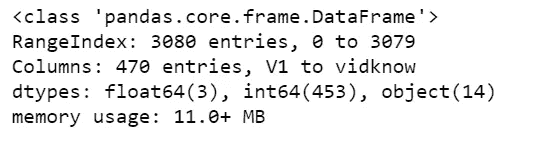

图 1

数据集包含 470 个变量(即调查问题)，我将只选择我感兴趣的。同时，我将根据[调查问卷规范](https://electionstudies.org/wp-content/uploads/2020/07/anes_pilot_2020ets_qnnaire.pdf)重新命名一些列，使其更加用户友好，并重新编码所有分类变量。缺少的值将被替换为“NaN”。

anes_data_prep.py

# 投票选择

vote_choice.py

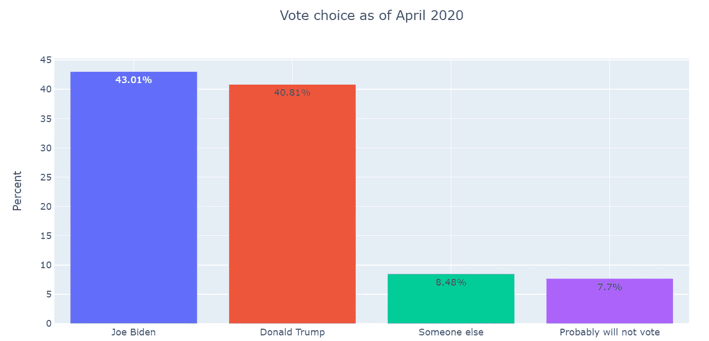

图 2

数据显示，截至 2020 年 4 月，唐纳德·特朗普和乔·拜登在投票意向方面不分上下。

vote_choice_by_party.py

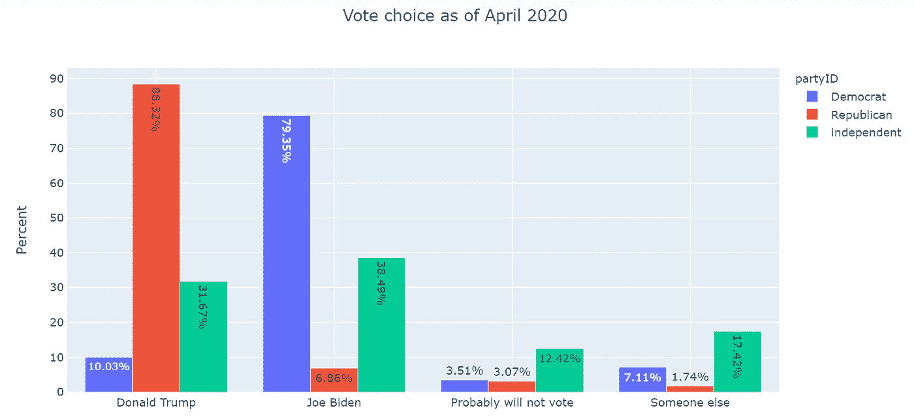

图 3

当你按党派来看这些数字时，这并不奇怪。

```
df_clean.query("vote == 'Donald Trump' & fttrump1 < 5")
```

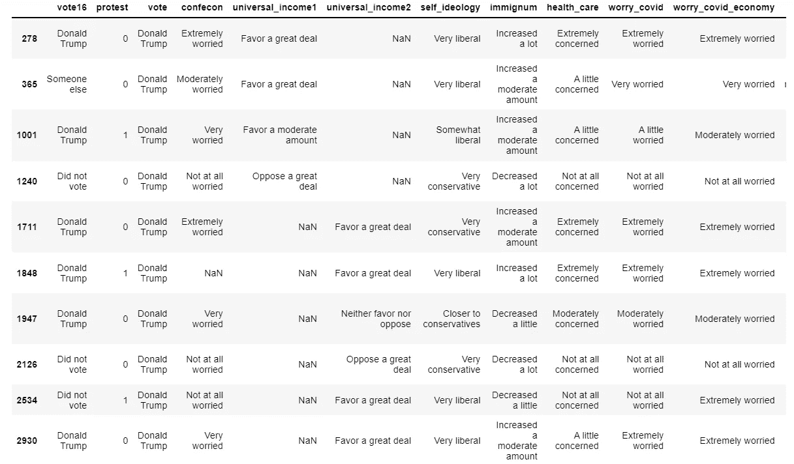

表 1

上述 10 名选民给特朗普的温度计评分< 5，但表示他们将投票给他。看起来他们同样不喜欢拜登。

```
df_clean.query("vote == 'Joe Biden' & ftbiden1 < 5")
```

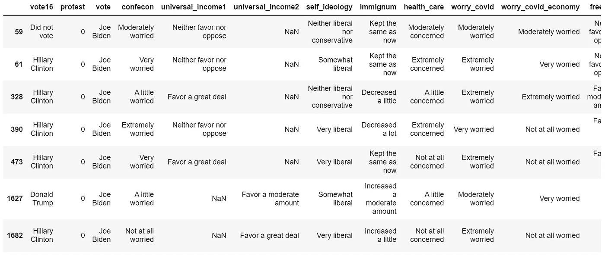

表 2

上述 15 名选民给拜登的温度计评分< 5，但表示他们仍将投票给他。他们大多是民主党人，喜欢奥巴马。

```
df_clean.query("ftbiden1 == 100 & fttrump1 == 100")
```

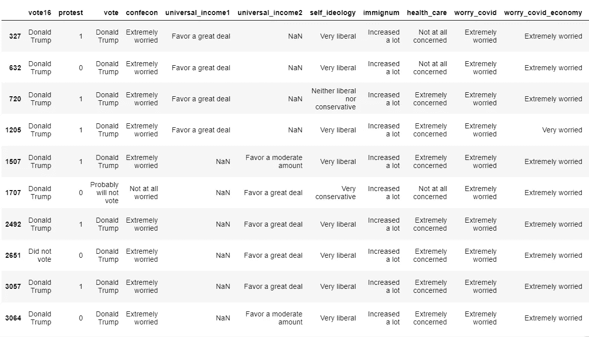

表 3

上述 10 位选民同时给乔·拜登打了 100 分，给特朗普打了 100 分，而几乎所有人都表示会投票给特朗普。

# 可爱

拜登 _like.py

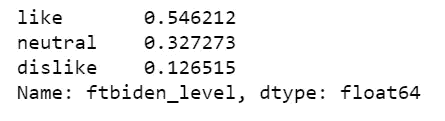

图 4

在将投票给拜登的选民中，54%的人喜欢他，大约 13%的人不喜欢他。

trump_like.py

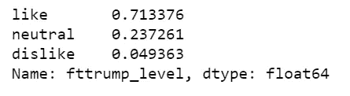

图 5

在将投票给特朗普的选民中，71%的人喜欢他，大约 5%的人不喜欢他。事实上，特朗普能够激起共和党内部的大量冷漠。

# 选民的年龄

age_dist.py

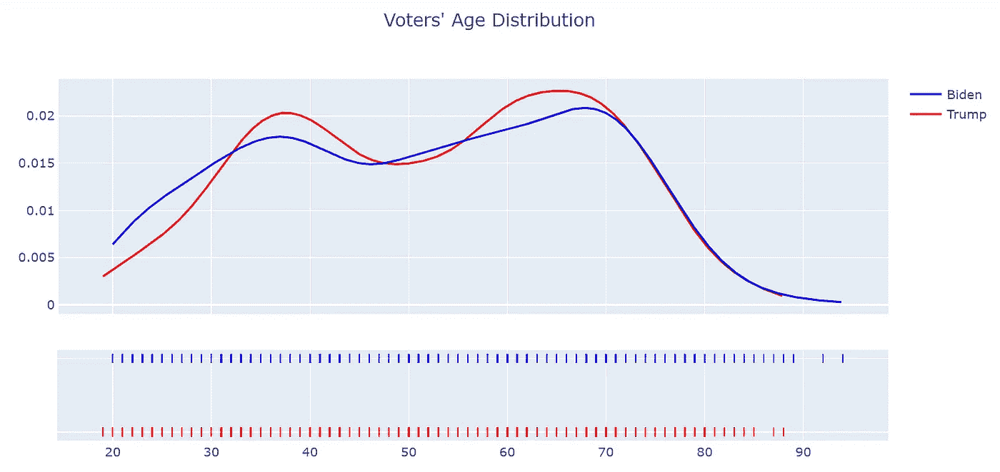

图 6

根据数据，截至 2020 年 4 月，更多 30 至 45 岁的选民，以及 55 至 70 岁的选民将投票给特朗普。

年龄 _ 性别 _ 小提琴. py

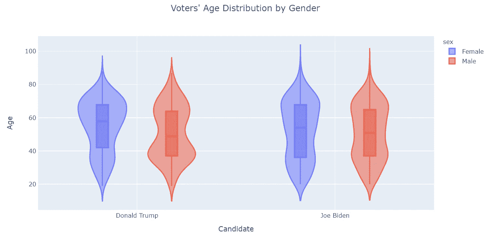

图 7

有趣的是，特朗普更受资深女性和年轻(40 岁左右)男性的青睐。

# 经济

拜登 _eco.py


图 8

在拜登的选民中，超过 86%的人担心当前的经济状况。14%的人不担心当前的经济状况。

trump_eco.py

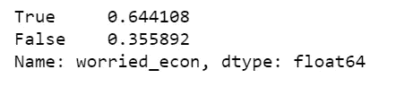

图 9

在特朗普的选民中，超过 64%的人担心当前的经济状况。36%的人不担心当前的经济状况。

confecon.py

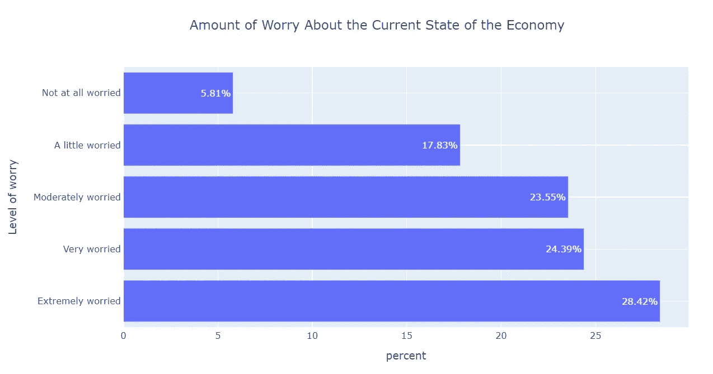

图 10

绝大多数选民担心当前的经济状况，53%的人非常或非常担心当前的经济状况。

confecon_by_party.py

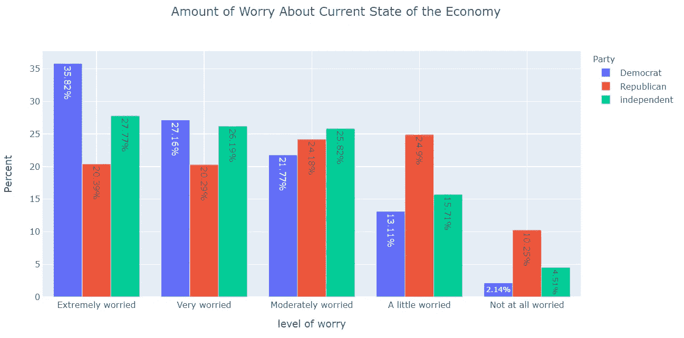

图 11

85%的民主党人担心当前的经济状况，63%的人非常或非常担心当前的经济状况。而 65%的共和党人担心当前的经济状况，41%的人非常或非常担心当前的经济状况。

confecon_party_gender.py

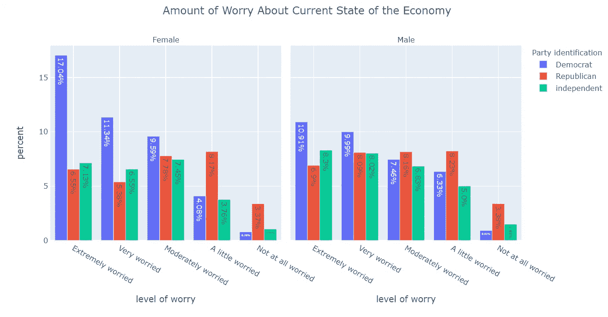

图 12

女性民主党人最担心当前的经济状况，在极度和非常担心当前经济状况的人中，比女性共和党人多 18%。而在极度和非常担心当前经济状况的人中，男性民主党人只比男性共和党人多 6%。

confecon_age.py

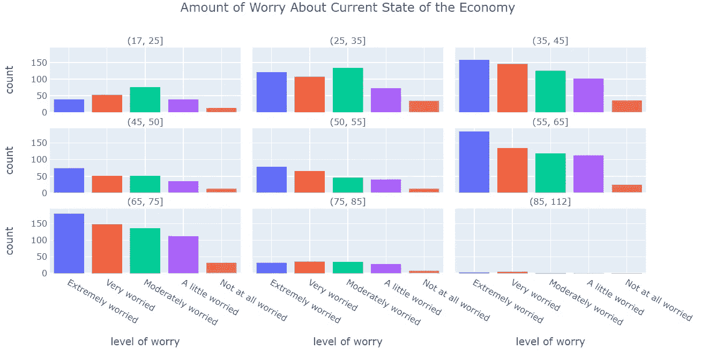

图 13

35-45 岁和 55-75 岁年龄段的人最担心当前的经济状况。

# 普遍基本收入

大学收入

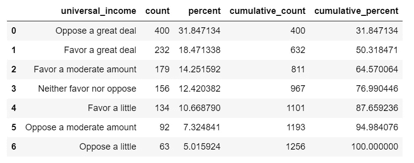

表 4

32%的特朗普选民非常反对普遍基本收入，而 18%的人非常支持。

大学收入 b.py

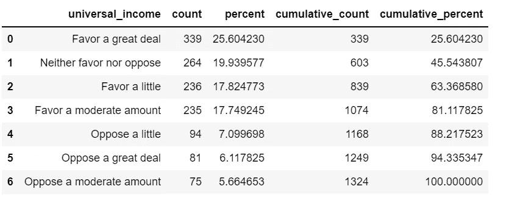

表 5

6%的拜登选民非常反对普遍基本收入，而 26%的人非常支持。

# 普遍基本收入与政治意识形态

uni_ideo.py

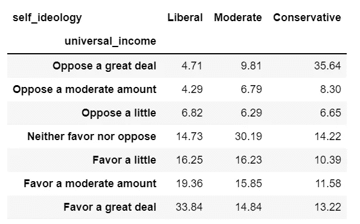

表 6

超过 50%的保守党人反对普遍基本收入，36%的人反对很多。几乎 70%的自由派支持普遍的基本收入，34%支持大量的基本收入。

# 普遍基本收入和免费大学

uni_col_b.py

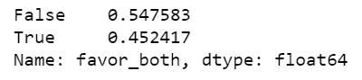

图 14

在拜登的选民中，45%支持普遍基本收入和免费大学，55%反对两者。

uni_col_t.py

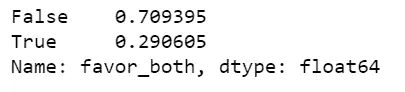

图 15

在特朗普的选民中，29%的人支持普遍基本收入和免费大学，71%的人反对两者。

# MeToo vs .女权主义者

metoo_fem.py

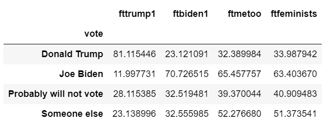

表 7

支持特朗普的选民在#MeToo &女权主义者上的支持率最低，支持拜登的选民在这两个运动上的支持率最高。

# 温度计额定值

ther_corr.py

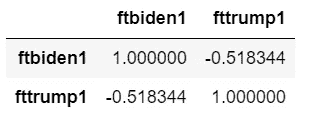

表 8

拜登和特朗普的温度计评分之间的相关性是负的，这是应该的。

ther _ by _ 党. py

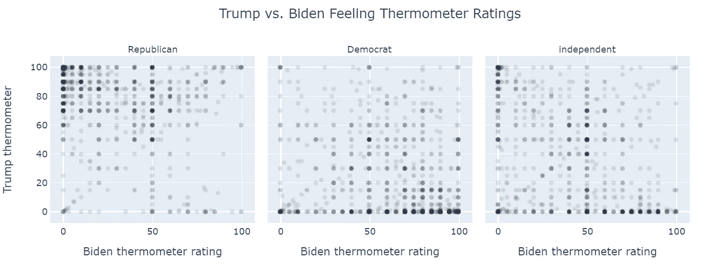

图 16

民主党人大多一致认为特朗普非常低，但他们对拜登有各种各样的复杂感情。共和党人一致认为拜登的评分很低，他们更倾向于特朗普的较高评分。无党派人士分散在各处。

ther_by_gender.py

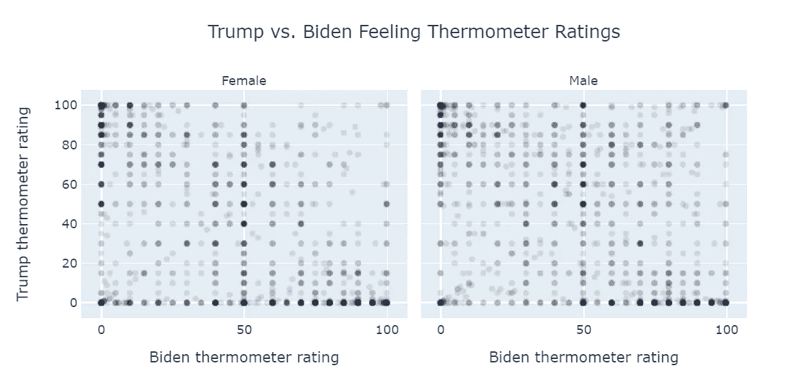

图 17

男性和女性对两位候选人的评价没有明显差异。

按年龄

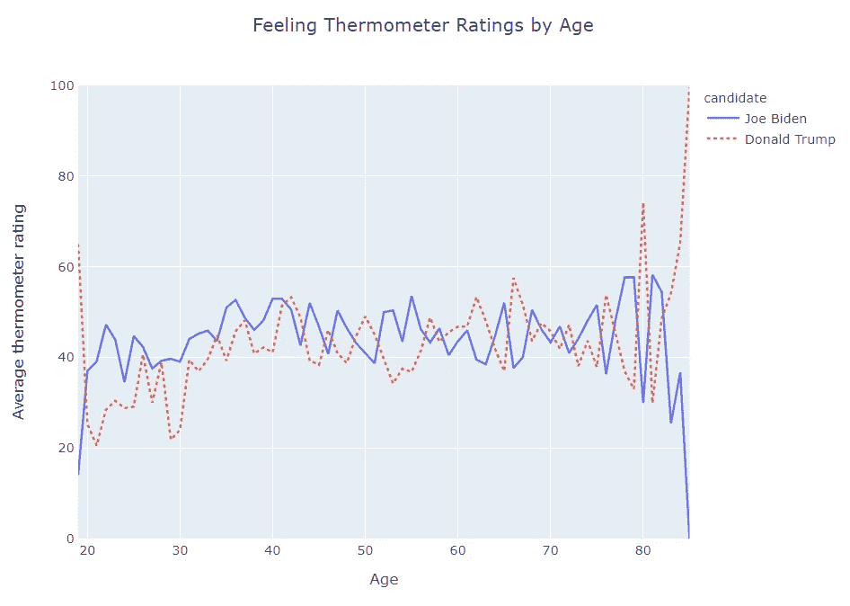

图 18

显然，拜登在年轻选民中的平均温度计评分更高，拜登和特朗普在老年选民中的平均温度计评分相似。

ther_dist.py

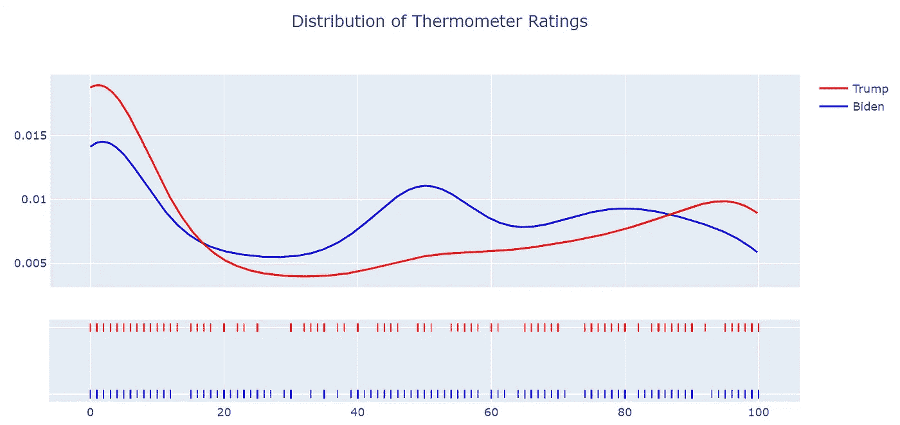

图 18

更多的人对特朗普有极端的看法，更多的人对拜登有平庸的看法。

# 统计分析

分位数. py

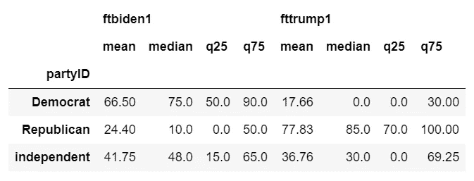

表 9

党派关系和候选人的温度计评分之间有明显的关系。

游击队. py


表 10

极度担心冠状病毒经济影响的自由派人士对拜登的评分平均比特朗普高 40.57 分，而完全不担心冠状病毒经济影响的保守派人士对特朗普的评分平均比拜登高 60.71 分。

## 假设检验

男性和女性对特朗普和拜登的评价是否有显著差异。

ttest_ind_t.py

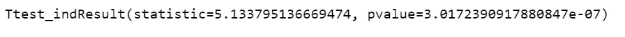

我们可以拒绝零假设，并得出结论，就平均而言，男性和女性对特朗普的评价在统计上存在显著差异。

ttest_ind_b.py

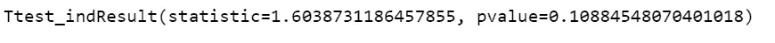

我们未能拒绝零假设，女性和男性的平均体温计评分与拜登相同。

## 比较特朗普和拜登的平均支持率

compare.py

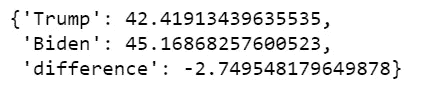

ttest_rel.py

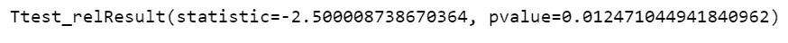

我们拒绝零假设，并得出结论，平均而言，选民对特朗普和拜登的支持率存在统计学上的显著差异。

## 多重比较检验

民主党、无党派和共和党选民的平均年龄是否有显著差异。

按党派年龄

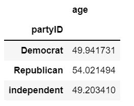

f_oneway.py

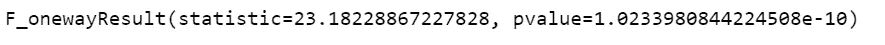

p 值远小于 0 . 05，因此我们拒绝零假设，并得出结论:就选民的平均年龄而言，这三个政党之间存在统计学上的显著差异。

## 关联测试

测试 _ass.py

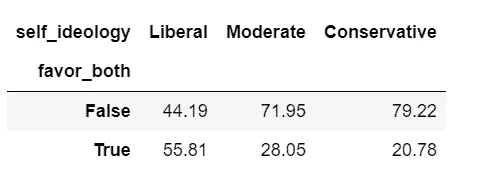

保守派压倒性地反对普遍基本收入和免费大学，79%的保守派表示反对。相比之下，只有 44%的自由派反对普遍基本收入和免费大学。

这些差异是否强大到足以让我们得出结论，在支持普遍基本收入和免费大学方面存在意识形态差异。

chi2_contingency.py


3.56e-73 处的 p 值远小于 0.05。因此，我们拒绝零假设，并得出结论，在意识形态和对普遍基本收入和免费大学的支持之间存在统计上的显著关系。

## 主成分分析

pca.py

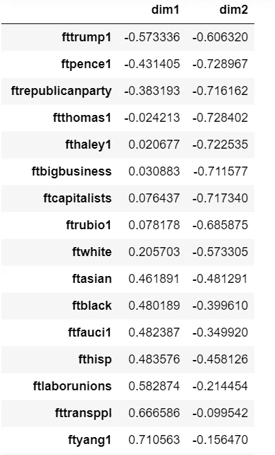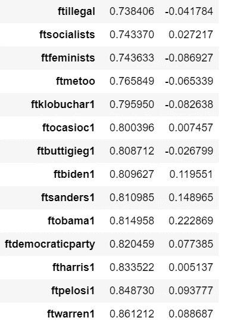

表 11

第一个特征(dim1)似乎代表了传统的左右意识形态光谱。共和党、特朗普、彭斯、哈利、卢比奥，以及大企业、资本家和白人在这一指数的一边负载最强，而沃伦、佩洛西、哈里斯、民主党在另一边负载最强。

```
loadings.sort_values('dim2')
```

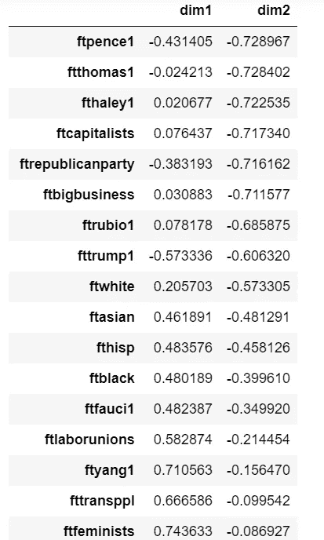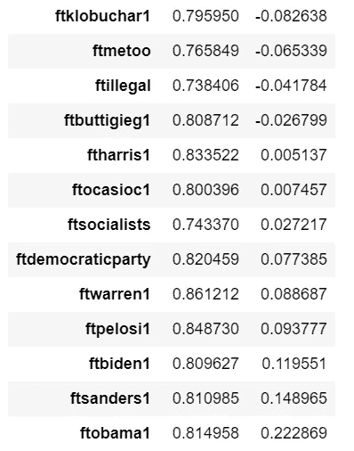

表 12

第二个特征(dim2)似乎也与左右政治意识形态有关。

## 多重对应分析

类似于 PCA，但是 MCA 处理分类特征而不是连续值特征。

mca.py

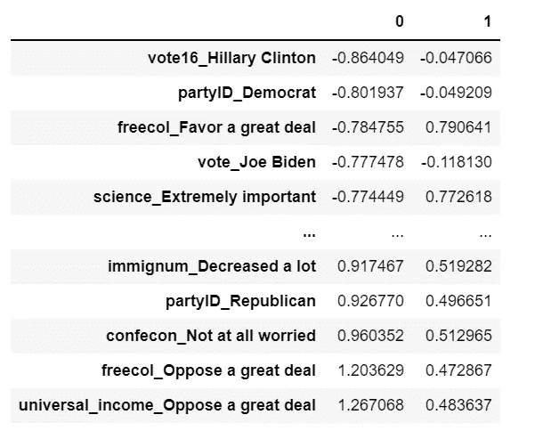

表 13

第一个潜在特征(0)从顶部开始，它代表自由主义意识形态的类别，例如:2016 年投票给希拉里·克林顿，认同为民主党人，2020 年投票给乔·拜登，非常支持免费大学，相信科学极其重要。在另一端，我们有保守意识形态的类别，例如:反对普遍基本收入和免费大学，认同共和党，根本不担心经济。这第一个潜在特征似乎是左右意识形态维度。

```
mca.column_coordinates(df_cat).sort_values(1)
```

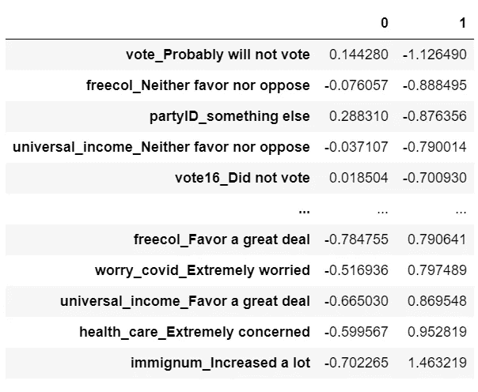

表 14

对于第二个潜在特征，我们有不采取立场的立场:2016 年没有投票，大概 2020 年也不会投票，不赞成也不反对普遍基本收入，免费大学。这似乎可以衡量选民的冷漠。

[Jupyter 笔记本](https://github.com/susanli2016/Machine-Learning-with-Python/blob/master/Anes_2020.ipynb)可在 [Github](https://github.com/susanli2016/Machine-Learning-with-Python/blob/master/Anes_2020.ipynb) 上找到，享受漫长的周末！

参考:

[https://JKR opko . github . io/surfing-the-data-pipeline/ch12 . html](https://jkropko.github.io/surfing-the-data-pipeline/ch12.html)