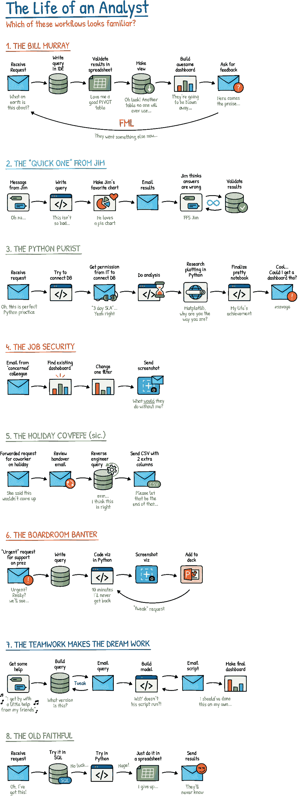
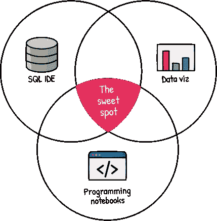

# 分析师的工作流程中断

> 原文：<https://towardsdatascience.com/the-analysts-workflow-is-broken-dccbe72398b7?source=collection_archive---------8----------------------->

分析师今天使用的工具都是在特定时间为特定目的而构建的。但是这些工具也在阻碍我们。现在是后退一步，看看我们带走了哪些传统工具，留下了哪些工具的理想时机。

# 分析师的生活

鉴于对分析见解的需求空前高涨，分析师的工作流程十多年来几乎没有变化，这令人惊讶。

虽然在使个人任务变得更容易方面确实取得了进展，但工作流程通常仍然是由陈旧的软件与 CSV 文件和电子邮件拼凑而成的。

为了说明分析师工作流程有多痛苦，我们收集了一些我们最喜欢的例子…

一个长期受苦的数据分析师的生活。([链接](https://twitter.com/counthq/status/1362436300503154700?s=20))来源:count.co

虽然这个图表的设计至少有点幽默，但它强调了一个严肃的问题:我们当前的数据工具没有一个能提供我们满足今天的分析需求所需的一切。

但公平地说，它们从未被设计成…

# 毕的历史:悬崖笔记版

那么我们是怎么到这里的呢？我们将快速回顾一下历史，找出…

虽然 BI(商业智能)是在 19 世纪晚期首次被提及的，我鼓励你[阅读](https://www.toptal.com/project-managers/it/history-of-business-intelligence)更多关于它的内容，我们将快进并关注我们今天仍在使用的 BI 工具的历史。

## SQL ide(20 世纪 70 年代末):

SQL IDEs(集成开发环境)是为**数据库管理员**设计的，用于查询和管理他们新的关系数据库中的数据。这些朴实无华的界面让少数训练有素的技术用户能够做任何事情，从创建表格到运行查询。

## 电子表格(1980 年代):

我们心爱的电子表格被设计成使**会计师**能够数字化纸质会计工作表。他们基于单元的界面提供了格式化和计算的灵活性。用户可以建立高度熟练的金融模型，但任何实际的分析仅限于小数据集。

## 数据可视化工具(1990 年代):

数据可视化工具最终将数据带到了会议室。凭借友好的界面和高质量的数据可视化功能，**业务用户**可以开始在决策中使用数据，但仅限于简单的查询。

## 计算笔记本(2010 年代):

虽然像 Mathematica 这样的计算笔记本在 80 年代首次出现，但它们直到 2010 年代的数据科学时代才出现在数据领域。这些笔记本帮助数据科学家使用 R 和 Python 等编程语言构建和部署复杂的模型和分析。虽然非常强大和灵活，但它们的学习曲线非常陡峭。

# 一个勇敢的新世界

自从这些工具首次出现以来，分析师的前景无疑已经发生了变化。

**分析师的作用持续增长。**现在，分析师需要管理从数据库到会议室演示的整个数据之旅——这个过程过去由许多角色和部门共享。

**数据更大更快。**我们已经从几个关系表发展到今天的大数据时代，在这个时代，我们通常以兆字节而不是兆字节来衡量数据。数据库也变得更快、更有效。对于我们这些花了太长时间优化查询的人来说，这是一个受欢迎的变化，它让我们第一次可以直接从数据库中分析数据。

**我们对数据的胃口非常大。**我们不再满足于生产数据库中的一两个仪表盘。为了在竞争中保持领先，我们的问题越来越频繁，也越来越微妙。我们不再生活在一个只有几个大型查询的世界里；我们生活在一个不断提问以保持领先的世界。

## 新的希望

在这种新环境下，为现代分析师的挑战设计工具是一个巨大的机遇。

尽管有许多潜在的候选工具，但大多数都是上述工具类型的扩展。但是正如工作流程所示，我们不需要旧工具的新版本。我们需要一种混合方法:**BI 笔记本电脑。**

BI 笔记本提供 SQL IDE 的*功能*，数据科学笔记本的*灵活性*，但是具有数据可视化工具的*洞察力生成*。

BI 笔记本借用了我们当前工具箱中最喜欢的功能来创造一些新的东西，尽管有些熟悉。

*   由于是基于 SQL 的，它提供了 SQL IDE 的所有功能，并利用了高效分析数据库(如 BigQuery 和 Snowflake)的处理速度。它也有助于查询抽象，例如快速和可访问的拖放查询。
*   基于单元的结构鼓励您将分析分成更小的部分，这有助于您重用复杂的逻辑并在以后解释它。
*   有了正确的内置数据可视化特性，输出仍然可以是交互式的和高质量的，因此洞察力仍然可以得到很好的解释和实际的上下文化。

这不是一刀切。对于特定的用例(即数据科学模型)，更专业的工具总是更受青睐。但是对于绝大多数分析师的工作来说，BI 笔记本可以极大地提高工作效率以及他们的工作对组织其他部门的影响。

在过去的几年里，我们一直在 Count 制作自己的 BI 笔记本电脑。如果你想亲自体验一下，你可以在这里获得一个免费账户[。](https://count.co/?utm_source=medium&utm_medium=content)

*这是我们“呼唤更好的分析师工具”系列的第二篇文章。该系列的其他文章包括:*

*   [*仪表盘已死*](/dashboards-are-dead-b9f12eeb2ad2) *—为什么仪表盘已经不够用了。*
*   *语境为王——为什么我们需要比图表更多的东西来改变世界。(报名我们的* [*简讯*](https://count.co/join-newsletter) *获取未来帖子)*