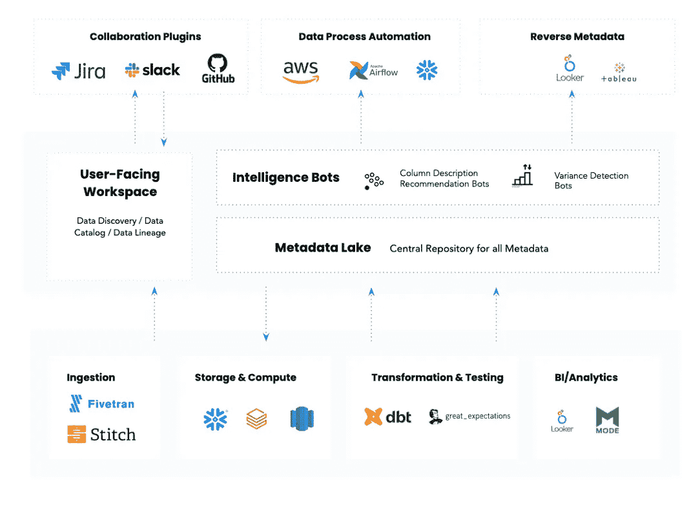
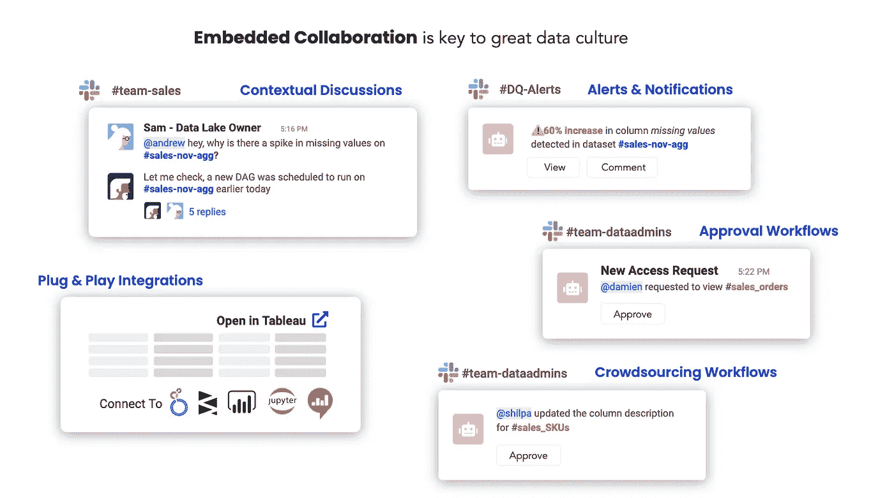
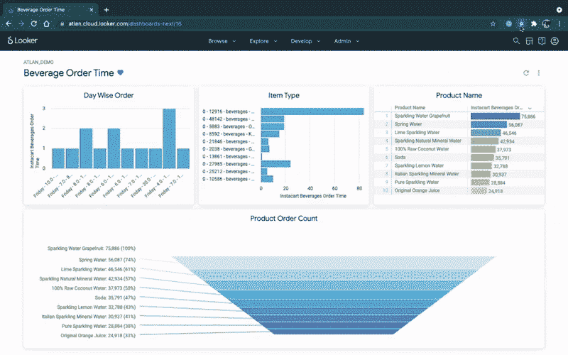

# 主动元数据平台的剖析

> 原文：<https://towardsdatascience.com/the-anatomy-of-an-active-metadata-platform-13473091ad0d?source=collection_archive---------13----------------------->

## 活动元数据是来自 Gartner 的最新类别，它是对当今扩充数据目录的一次转型飞跃

马克斯·兰格洛特在 [Unsplash](https://unsplash.com/?utm_source=unsplash&utm_medium=referral&utm_content=creditCopyText) 上拍摄的照片

随着 Gartner [放弃](/the-gartner-magic-quadrant-for-metadata-management-was-just-scrapped-d84b2543f989)其元数据管理解决方案的魔力象限，代之以活动元数据的市场指南，元数据管理刚刚发生了动摇。看出区别了吗？随着这一变化，Gartner 刚刚推出了活动元数据，作为未来的一个新类别。

与数据生态系统中的任何新类别一样，这一宣布带来了大量的兴奋，一些有益的怀疑和大量的问题。

*   活跃元数据到底是什么？
*   它与我们以前见过的扩充数据目录和其他技术有什么不同？
*   一个活跃的元数据平台是什么样子的？

我曾经在中写过[什么是活跃的元数据平台及其关键特征。今天，我想在这个抽象讨论的基础上更进一步，描绘一幅活动元数据平台的图景，分解关键组件，并给出一些活动元数据的真实用例。](/5-meta-takeaways-from-the-gartner-data-and-analytics-summit-2021-2cc6cdf037b2)

# TL；DR:一个活跃的元数据平台是什么样子的？

主动元数据平台的体系结构。(图片来自 [Atlan](https://atlan.com/) 。)

在我看来，一个活跃的元数据平台有 5 个关键组成部分:

*   **元数据湖:**一个统一的存储库，以原始和处理过的形式存储各种元数据，构建于开放 API 之上，由知识图提供支持。
*   **可编程智能机器人:**一个框架，允许团队创建可定制的 ML 或数据科学算法来驱动智能。
*   **嵌入式协作插件:**由公共元数据层统一的一组集成，将数据工具与每个数据团队的日常工作流程无缝集成。
*   **数据流程自动化:**一种构建、部署和管理工作流自动化机器人的简单方法，这些机器人将模拟人类决策流程来管理数据生态系统。
*   **反向元数据:**编排以使相关元数据在最终用户需要时随时随地可用，而不是在独立的目录中。

# 1.元数据湖:元数据的单一中央存储

几个季度前，我写了一篇关于 [**元数据湖**](/the-rise-of-the-metadata-lake-1e95127594de) 的概念:一个统一的存储库，以原始和进一步处理的形式存储各种元数据，这些元数据可用于驱动我们今天和明天已知的用例。

主动元数据建立在主动寻找、丰富、清点和使用所有这些元数据的前提下，采用传统的“被动”技术，使其真正面向行动。

作为任何活动元数据平台的基石，元数据湖有两个关键特征:

*   **开放 API 和接口**:元数据湖需要易于访问，不仅仅是作为数据存储，而是通过开放 API。这使得在现代数据堆栈的每个阶段利用单个元数据存储来驱动各种用例变得非常容易，例如发现、可观察性和沿袭。
*   **由知识图提供支持:**当数据资产之间的所有连接都活跃起来时，元数据的真正潜力就被释放出来了。为谷歌、脸书和优步等世界上最大的互联网公司提供支持的[知识图架构](https://humansofdata.atlan.com/2019/08/reconciling-your-data-and-the-world-with-knowledge-graphs/)是最有希望实现这些元数据连接的候选方案。

# 2.可编程智能机器人

我们正在快速进入一个元数据本身正在成为大数据的世界，理解这些元数据是创建现代数据管理生态系统的关键。

元数据智能有可能影响数据生命周期的方方面面。它可以解析 SQL 查询日志来自动创建列级沿袭。它可以自动识别 PII(个人身份信息)数据，以保护私人信息。通过自动检测数据异常值和异常值，它可以在发现我们之前发现坏数据。在过去的几年里，元数据在这方面有了一些创新，“扩充的”数据目录变得越来越流行。

然而，在所有的宣传中，我认为，到目前为止，关于智能如何应用于数据管理，有一件事我们搞错了— **一种尺寸不适合所有人。**

每个公司都是独一无二的。每个行业都是独一无二的。每个团队的数据都是独一无二的。

在最近与一位数据领导者的通话中，他批评了他的检测数据质量异常的工具:有时该工具会向我们发送关于模式更改和质量问题的有用警报。其他时候，它尖叫着不该尖叫的东西，真的让我们的数据工程团队感到沮丧。"

我不怪工具。现实情况是，每个机器学习算法的输出都是输入的训练数据的函数。没有一种算法能够神奇地创建上下文、识别异常并实现智能数据管理梦想，并且在每个行业、每个公司和每个用例中都 100%成功。尽管我很希望有，但没有灵丹妙药。

> 这就是为什么我相信主动元数据平台的智能未来不是一个能够神奇地解决我们所有问题的单一算法。相反，它是一个允许团队创建可编程智能机器人的框架，这些机器人可以很容易地根据不同的上下文和用例进行定制。

这里有几个可编程智能机器人的例子:

*   随着安全性和合规性要求成为主流，公司将不得不遵循更多规则——例如针对医疗保健数据的 [HIPAA](https://en.wikipedia.org/wiki/Health_Insurance_Portability_and_Accountability_Act) 和针对银行业务的 [BCBS 239](https://en.wikipedia.org/wiki/BCBS_239) 等行业特定规则，或者针对地区特定的规则，例如欧洲的 [GDPR](https://en.wikipedia.org/wiki/General_Data_Protection_Regulation) 和加州的 [CCPA](https://en.wikipedia.org/wiki/California_Consumer_Privacy_Act) 。根据适用于每家公司的法规，机器人可以用来识别和标记敏感列。
*   对数据集有特定命名约定的公司可以创建机器人，根据预设规则自动组织、分类和标记他们的数据生态系统。
*   公司可以采用现成的可观察性和数据质量算法，并根据他们的数据生态系统和用例进行定制。

可编程智能的用例是无穷无尽的，我对未来充满期待！

# 3.嵌入式协作插件

如今，数据团队比以往更加多样化。他们由数据工程师、分析师、分析工程师、数据科学家、产品经理、业务分析师、公民数据科学家等组成。

这些多样化的数据团队使用同样多样化的数据工具，从 SQL、Looker 和 Jupyter 到 Python、Tableau、dbt 和 r，再加上一大堆协作工具(如 Slack、JIRA 和电子邮件)，你已经让数据专业人员的生活变成了一场噩梦。

> *由于数据团队的基本多样性，数据工具需要设计为与每个团队的日常工作流程无缝集成。*

这就是嵌入式协作的想法的来源。嵌入式协作不是从一个工具跳到另一个工具，而是让工作发生在每个数据团队成员居住的任何地方，减少摩擦和上下文切换。

嵌入式协作会是什么样子。(图片由 [Atlan](https://atlan.com/) 提供)。)

以下是嵌入式协作的几个例子:

*   如果您可以在获得链接时请求访问数据资产，就像使用 Google Docs 一样，而所有者可以在 Slack 上获得请求，并在那里批准或拒绝它，会怎么样？
*   如果当您检查数据资产并需要报告问题时，您可以触发与您的工程团队的 JIRA 工作流完美集成的支持请求，该怎么办？

活动元数据平台中的动作层将使嵌入式协作最终活跃起来。我将这一层视为现代数据堆栈的[Zapier](https://zapier.com/)——由公共元数据层统一，允许团队为自己独特的工作流定制应用。

# 4.数据处理自动化

几年前，一种叫做**机器人流程自动化** (RPA)的新型工具席卷了企业界。从 [UiPath](https://www.uipath.com/rpa/robotic-process-automation) 开始，RPA 是“一种软件技术，它使构建、部署和管理软件机器人变得容易，这些软件机器人模拟人类与数字系统和软件交互的动作”。

随着数据结构、数据网格和数据操作等概念成为我们思考数据平台的主流方式，它们将产生对**数据流程自动化** (DPA)的需求，这是一种构建、部署和管理工作流自动化机器人的简单方法，这些机器人将模拟人类决策流程或操作来管理您的数据生态系统。

> *您是否曾在周一早上因仪表盘的加载速度而感到沮丧？或者更糟的是，对 AWS 在月底开出的高额账单感到惊讶？*

有了活跃的元数据平台，不难想象这两种情况不会再次发生的世界。一个真正的主动元数据平台可以向相邻的数据管理工具推荐参数化指令，用于资源分配和作业管理等操作。

例如，通过利用来自各种来源的元数据，例如顶级 BI 控制面板以及 BI 工具的峰值使用时间、来自数据管道工具的过去数据管道运行统计数据以及来自仓库的过去计算性能，您可以想象活动元数据平台不仅推荐用于纵向扩展雪花型仓库的参数，而且实际上利用 DPA 来分配仓库资源。

# 5.反向元数据

我认为，过去几年最伟大的事情之一是真正的“现代数据堆栈”公司和企业家的崛起，他们认为惊人的用户体验胜过一切。

旧时代的一切都是关于“价值捕捉”，而新一代的企业家专注于“价值创造”——最终用户体验是第一位的。现代数据堆栈公司越来越有兴趣真正相互合作，整合他们的产品路线图，创造更好的用户体验。

主动元数据是真正打开这些合作关系的钥匙，我认为“**反向元数据**”将改变游戏。

> *逆向元数据是指“独立数据目录”中没有的元数据。相反，它是让最终用户可以随时随地获得相关的元数据，以帮助他们更好地完成工作。*

例如，在 Atlan，我们与 Looker 的反向元数据集成直接在 Looker 中显示“上下文”(如谁拥有仪表板、指标定义和文档等)。

在 Looker 中反转元数据。(GIF 来自 [Atlan](https://atlan.com/) 。)

主动元数据平台有助于在现代数据堆栈中编排有用的元数据，使堆栈中的各种工具更加有用，而无需投资于每个工具之间的定制集成。

# 总结

在我看来，Gartner 报告中最具预言性的一句话是，“独立的元数据管理平台将从扩充的数据目录重新聚焦到元数据‘随处’编排平台。”

我们刚刚开始使用活动元数据，因为我们正在共同努力找出它在今天和明天的数据生态系统中可能扮演的角色。我希望这篇文章能揭示未来的样子，让它从抽象走向更真实的东西。

**觉得这个内容有帮助？在我的时事通讯《元数据周刊》上，我每周都写关于活动元数据、数据操作、数据文化和我们的学习建设的文章。** [**在此订阅。**](https://metadataweekly.substack.com/)