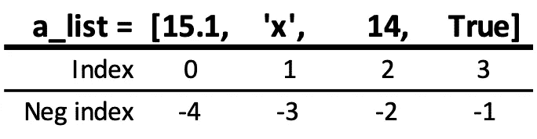
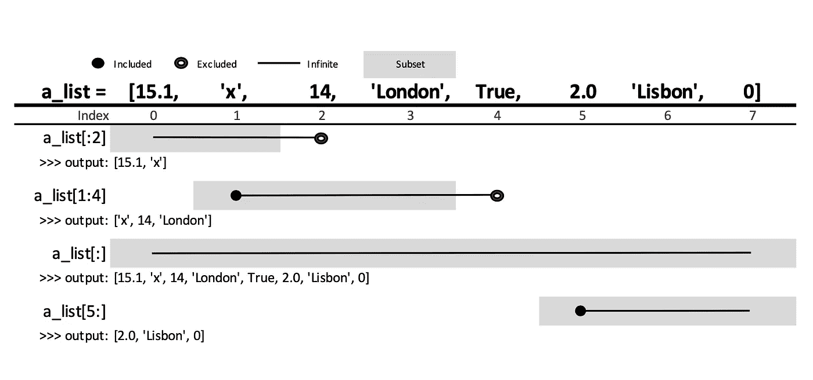
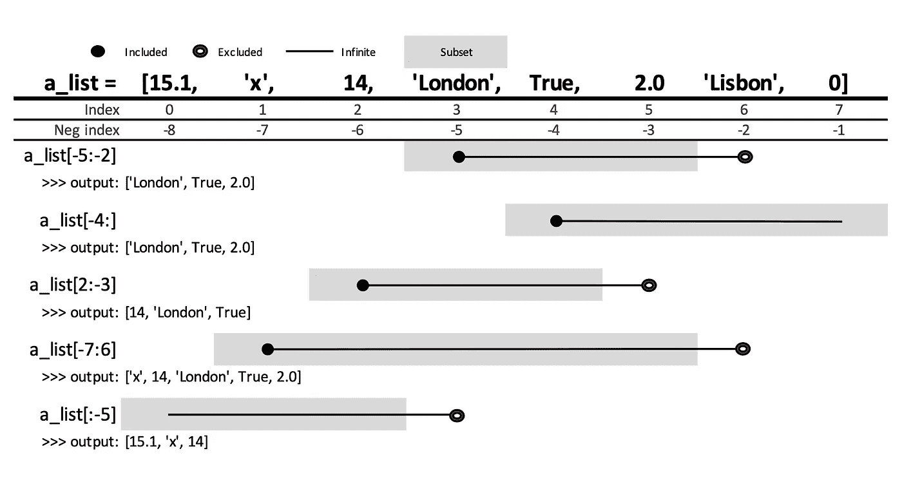
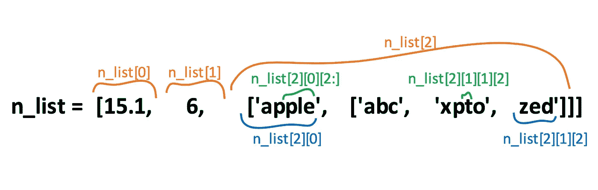

# Python 列表的剖析

> 原文：<https://towardsdatascience.com/the-anatomy-of-python-lists-1439b310256c?source=collection_archive---------34----------------------->

## 这是一个简单的指南，总结了 Python 中关于列表操作的最常见的方法和操作。


照片由[德米特里·拉图什尼](https://unsplash.com/@ratushny?utm_source=medium&utm_medium=referral)在 [Unsplash](https://unsplash.com?utm_source=medium&utm_medium=referral) 上拍摄

Python 列表是一种内置的数据类型，用于将任何数据类型(如字符串、整数、布尔或任何类型的对象)的项目存储到单个变量中。

列表是通过将一个或多个任意逗号分隔的对象括在方括号中创建的。

## **列表可能包含不同数据类型的元素**

列表中的项目可以是相同或不同的数据类型。

```
**a_list = [15.1, 'x', 14, True]**# The assigned variable ‘a_list’ contains a float, a string, an int, and a bool
```

## **列表项目遵循有序或特定的顺序**

元素被处理的顺序是在列表被写入时设置的，如果没有改变，它将保持不变。

```
a_list = [15.1, 'x', 14, True]
b_list = [6.6, 2.0, 125, 0, 63]
c_list = ['London', 'Lisbon', 'New York', 'Sidney']
```

## **按索引访问值**

像访问字符串中的字符一样，列表中的每一项都有一个指定的索引，可以使用方括号来访问。请记住，列表索引是从零开始的，这意味着第一项位于索引 0 处。

```
# Defining a list
a_list = [15.1, 'x', 14, True]# Accessing the first value at index 0
a_list[0]>>> output: 
15.1---# Accessing the second value at index 1
a_list[1]>>> output: 
'x' 
```

访问值也可以通过负索引来执行，即从列表末尾开始计数。当您需要访问最后一项而不知道列表的长度时，这可能非常方便。



指数与负指数。作者图片

```
# Accessing the last value at index -1
a_list[-1]>>> output:
True---# Accessing the first value at index -4
a_list[-4]>>> output:
15.1 
```

## 切片列表

切片是获取列表子集的好方法。例如，`a_list[m:n]`返回从索引`[m]`到索引`[n]`的`a_list`的子集，不包含。如果索引为零(0)或者将切片扩展到无穷大，可以省略索引。让我们在接下来的例子中实现它。



使用索引切片访问列表。作者图片

理解:

```
# Defining a list
**a_list = [15.1, 'x', 14, 'London', True, 2.0, 'Lisbon', 0]**# You can omit the index in case of:
# a) index zero (0)# Starts at the first character (index 0) and ends at the third (index 2), not included
a_list[:2]>>> output:
[15.1, 'x']# Starts at the second character (index 1) and ends at the fifth (index 4), not included
a_list[1:4]>>> output:
['x', 14, 'London']# Starts at the sixth character (index 5) and extends to the end of the list
a_list[5:]>>> output:
[2.0, 'Lisbon', 0]---# You can also omit the index in case of:
# b) extending the slice to the infinite# Extending to the infinite on both ends returns the whole list
a_list[:]>>> output:
[15.1, 'x', 14, 'London', True, 2.0, 'Lisbon', 0]
```

工作的几个例子切片列表结合积极和消极的指标。



使用负索引切片访问列表。作者图片

理解:

```
# The list
**a_list = [15.1, 'x', 14, 'London', True, 2.0, 'Lisbon', 0]**# Returns the list counting every two characters
a_list[-5:-2]>>> output:
['London', True, 2.0]---# Starts at index -4 and until the end of the list
a_list[-4:]>>> output:
[True, 2.0, 'Lisbon', 0]---# Starts at index 2 and ends at index -3 (same as index 5, excluded)
a_list[2:-3]>>> output:
[14, 'London', True]---# Starts at index -7 (same as index 1) and ends at index 6, excluded
a_list[-7:6]>>> output:
['x', 14, 'London', True, 2.0]---# Returns the list from the beginning to index -5 (same as index 3, not included)
a_list[:-5]>>> output:
[15.1, 'x', 14]
```

我们可以定义一个步骤，在这个步骤中，它将“跳转”第三个参数中指定的字符数。

```
# The list
**a_list = [15.1, 'x', 14, 'London', True, 2.0, 'Lisbon', 0]**# Returns the whole list every two characters
​a_list[::2]>>> output:
[15.1, 14, True, 'Lisbon']
```

步长可以是正的，也可以是负的。

```
# Goes to the infinite on both ends and returns the list on backwards every 3 characters
a_list[::-3]>>> output:
[0, True, 'x']
```

让我们用几个例子让它工作吧，切片列表结合了正的和负的索引和步骤。

```
# The list
**a_list = [15.1, 'x', 14, 'London', True, 2.0, 'Lisbon', 0]**# Starts at index 0, ends at index -3 (same as index 5) every two characters
a_list[:-3:2]>>> output:
[15.1, 14, True]---# Starts at index -2 (same as index 6), ends at index 2 (same as index -6) and returns the list on backwards
a_list[-2:2:-1]>>> output:
['Lisbon', 2.0, True, 'London']---# Returns the whole list
a_list[::]>>> output:
[15.1, 'x', 14, 'London', True, 2.0, 'Lisbon', 0]---# Returns the list on backwards every two characters
a_list[::-2]>>> output:
[0, 2.0, 'London', 'x']
```

尽管在上面的例子中，我们的列表总是被赋值给一个变量(a_list)，但是也可以对列表文字进行操作。

```
[15.1, 'x', 14, 'London', True, 2.0, 'Lisbon', 0]**[3]**>>> output:
'London'---[15.1, 'x', 14, 'London', True, 2.0, 'Lisbon', 0]**[::-2]**>>> output:
[0, 2.0, 'London', 'x']---**'Lisbon' in** [15.1, 'x', 14, 'London', True, 2.0, 'Lisbon', 0]>>> output:
True---**len(**[15.1, 'x', 14, 'London', True, 2.0, 'Lisbon', 0]**)**>>> output:
8
```

## 嵌套列表

我们意识到一个列表可以包含任何类型的数据集合。这也包括另一个列表，它又可以包含另一个子列表本身，以此类推。



嵌套列表。作者图片

理解:

```
# The list
**n_list = [15.1, 6, ['apple', ['abc', 'xpto', 'zed']]]**# n_list[0] is a float and n_list[1] is an integer
print(n_list[0])
print(n_list[1])>>> output:
15.1
6---# n_list[2] is a sublist
n_list[2]>>> output:
['apple', ['abc', 'xpto', 'zed']]---# To access the items inside a sublist, must add another index to the first one
n_list[2][1]>>> output:
['abc', 'xpto', 'zed']---# To access a specific character inside a sublist, you must apply the same reasoning of append additional indices as deep as desired
n_list[2][1][0]>>> output:
'abc'---# Deep further, there is no limit
n_list[2][1][0][2]>>> output:
'c'
```

从这一点开始，很容易将所有关于索引和切片的语法应用到子列表。

```
# The list
**n_list = [15.1, 6, ['apple', ['abc', 'xpto', 'zed']]]**n_list[2][1][:2]>>> output:
['abc', 'xpto']---n_list[2][1][::-1]>>> output:
['zed', 'xpto', 'abc']---n_list[2][1][-1]>>> output:
'zed'---n_list[2][1][-1][::-1]>>> output:
'dez'
```

## 列表是可变的

例如，我们可以创建一个列表并将其赋给一个变量，并将其命名为`a_list`。一旦列表被创建，我们现在可以随意地执行一系列的修改。假设我们可以添加、删除或移动任何项目。

让我们通过添加一些单个值替换现有的值来修改列表。

```
# The list
**a_list = [15.1, 'x', 14, 'London', True, 2.0, 'Lisbon', 0]**# Adding a string (with a single character) at index 0 replacing the current value
a_list[0] = 'y'# Adding a boolean at the last index and replace the current item
a_list[-1] = False# Calling the variable
a_list>>> output:
['y', 'x', 14, 'London', True, 2.0, 'Lisbon', False]
```

现在让我们通过添加和替换多个项目来修改列表。

```
# The list
**a_list = [15.1, 'x', 14, 'London', True, 2.0, 'Lisbon', 0]**# Checking values at indices two to six, excluded
a_list[2:6]>>> output:
[14, 'London', True, 2.0]---# Assigning a single value from indices two to six
a_list[2:6] = [999]
a_list>>> output:
[15.1, 'x', 999, 'Lisbon', 0]# The number of items added is not equal to the number of items replaced and that is not a problem for python, it simply grows and shrinks the list along with the operations
a_list[2:3]>>> output:
[999]---# Assigning values from indices two to three and replacing the 999 int
a_list[2:3] = ['x', 'p', 't', 'o']
a_list>>> output:
[15.1, 'x', 'x', 'p', 't', 'o', 'Lisbon', 0]# If we determine to replace at a specific index instead a slice, a sublist will be created
a_list[2] = ['a', 'b', 'c']
a_list>>> output:
[15.1, 'x', ['a', 'b', 'c'], 'p', 't', 'o', 'Lisbon', 0]
```

通过在所需索引处指定一个没有长度的片，可以添加任何项目而不替换现有项目。

```
# The list
**a_list = [15.1, 'x', 14, 'London', True, 2.0, 'Lisbon', 0]**# Assigning elements without replacing any with a zero-length slice
a_list[2:2] = ['cat', 'dog']
a_list>>> output:
[15.1, 'x', 'cat', 'dog', 14, 'London', True, 2.0, 'Lisbon', 0]
```

删除多个项目和添加它们一样容易。

```
# The list
**a_list = [15.1, 'x', 14, 'London', True, 2.0, 'Lisbon', 0]**# Checking sliced items
a_list[1:7]>>> output:
['x', 14, 'London', True, 2.0, 'Lisbon']# Assigning an empty list at the desired slice
a_list[1:7] = []
a_list>>> output:
[15.1, 0]
```

接下来，我们将学习一些操作和修改列表的常用方法。首先，添加元素。

# 附加

`.append()`方法将在列表末尾添加一个值。这是就地发生的，因此它不会返回任何输出。

```
# Defining a list
a_list = [15.1, 'x', 14, '7']# Adding a value
a_list.append(5.5)
a_list>>> output: 
[15.1, 'x', 14, '7', 5.5]
```

请记住，在追加列表时，整个新列表是作为一个元素添加的，而不是追加它的每个值。

```
# Appending a new list to the assigned 'a_list'
a_list.append(['abc', 12.6])
a_list>>> output: 
[15.1, 'x', 14, '7', 5.5, ['abc', 12.6]]
```

另一方面，如果你想添加另一个列表并将所有的条目合并到前面的列表中，你需要使用`.extend()`方法。

# 扩展

`.extend()`方法将向一个列表中添加几个值。这意味着当用另一个列表扩展一个列表时，所有的值都是分开添加的。

```
a_list = [15.1, 'x', 14, '7']a_list.extend(['abc', 12.6])
a_list>>> output: 
[15.1, 'x', 14, '7', 'abc', 12.6]---a_list = [15.1, 'x', 14, '7']
b_list = ['python', 7.7, 6]a_list.extend(b_list)
a_list>>> output: 
[15.1, 'x', 14, '7', 'python', 7.7, 6]
```

当使用`+`操作符时，我们得到相同的结果。

```
a_list = [15.1, 'x', 14, '7']
b_list = ['python', 7.7, 6]a_list + b_list>>> output: 
[15.1, 'x', 14, '7', 'python', 7.7, 6] 
```

# 插入

`.insert()`方法在指定的索引位置添加一个项目。

```
a_list = [15.1, 'x', 14, '7']# The first argument is the index and the second one is the valuea_list.insert(2, 'python')
a_list>>> output: 
[15.1, 'x', 'python', 14, '7'] 
```

有许多方法可以从列表中删除元素，如下所示。

# 去除

方法将删除一个列表中想要的元素(如果重复的话是第一个出现的)。

```
a_list = [15.1, 'x', 14, '7']a_list.remove('x')
a_list>>> output: 
[15.1, 14, '7'] 
```

# 倒三角形

方法将根据索引从列表中移除任何元素。

```
a_list = [15.1, 'x', 14, '7']del a_list[2]
a_list>>> output: 
[15.1, 'x', '7'] 
```

# 流行音乐

`.pop()`方法移除特定索引处的一个项目——如果没有指定，它将默认移除最后一个项目(该操作返回弹出的项目)。

```
a_list = [15.1, 'x', 14, '7']print(a_list.pop(0))
print(a_list.pop(-1))>>> output: 
15.1
7 
```

可以执行`.pop()`方法，将其赋给不同的变量。

```
a_list = [15.1, 'x', 14, '7']b = a_list.pop()
print(a_list)>>> output: 
[15.1, 'x', 14] 
```

# 清楚的

`.clear()`方法将删除所有元素。

```
a_list = [15.1, 'x', 14, '7']a_list.clear()
a_list>>> output: 
[] 
```

# 分类

默认情况下，`.sort()`方法将按升序对列表进行排序，尽管也可以使用`(reverse=True)`参数。

这种方法就地改变。这意味着它不返回任何东西。

```
a_list = [15.1, 5, 14, 7.8]a_list.sort()
a_list>>> output: 
[5, 7.8, 14, 15.1] 
```

# 分类的

另一方面，如果您想保留原来的列表并将元素排序到一个新列表中，您可以使用内置的`sorted`函数。

```
a_list = [15.1, 5, 14, 7.8]
sorted(a_list)>>> output: 
[5, 7.8, 14, 15.1]a_list>>> output: 
[15.1, 5, 14, 7.8]---# you can keep the original list and create a sorted version of itsorted_list = sorted(a_list)
display(a_list, sorted_list)>>> output:
[15.1, 5, 14, 7.8]
[5, 7.8, 14, 15.1] 
```

# 复制

`.copy()`方法将创建一个现有列表的副本。

```
a_list = [15.1, 'x', 14, '7']
b_list = a_list.copy()# If we make any change in a_list, it won't reflect on the b_lista_list.append('pandas')
display(a_list, b_list)>>> output: 
[15.1, 'x', 14, '7', 'pandas']
[15.1, 'x', 14, '7'] 
```

也可以通过选择列表的所有索引来复制列表。

```
a_list = [15.1, 'x', 14, '7']
b_list = a_list[:]# Again, if we make any change in a_list, it won't reflect on the b_lista_list.extend(["pandas", "sklearn"])
display(a_list, b_list)>>> output:
[15.1, 'x', 14, '7', 'pandas', 'sklearn']
[15.1, 'x', 14, '7'] 
```

# 数数

`.count()`方法将返回有多少匹配元素。

```
a_list = [15.1, 'x', 14, 'x']
a_list.count('x')>>> output:
2 
```

# 索引

`.index()`方法将返回期望值的第一个(在重复的情况下)索引位置。

```
a_list = [15.1, 'x', 14, 'x']
a_list.index('x')>>> output:
1 
```

# 低输入联网（low-entry networking 的缩写）

内置的`len()`函数返回列表中元素的数量。

```
a_list = [15.1, 'x', 14, '7']
len(a_list)>>> output:
4 
```

# 反向()

`.reverse()`方法将颠倒列表中项目的顺序(操作就地发生，所以不返回任何内容)。

```
python_list.reverse()print(python_list)>>> output: 
['g', 'n', 'i', 't', 's', 'i', 'l'] 
```

# 通过拆分字符串创建列表

```
string_text = "we all love python"list_from_string = string_text.split(' ')
print(list_from_string)>>> output:
['we', 'all', 'love', 'python'] 
```

# 从字符串的字符创建列表

```
python_list = list("listing")print(python_list)>>> output: 
['l', 'i', 's', 't', 'i', 'n', 'g']
```

查看您可能也想阅读的其他文章:

</pandas-made-easy-the-guide-i-81834f075893>  </descriptive-statistics-expectations-vs-reality-exploratory-data-analysis-eda-8336b1d0c60b>  </15-business-questions-about-mobile-marketing-campaigns-roas-return-on-ad-spend-ff636a8095b6>  

# 结论

既然我们已经掌握了列表操作的基本知识，那么就很容易意识到在 Python 中使用这种类型的数据结构来执行一些基本且极其有用的任务是多么简单和强大。

我们现在对它的一些基本特征有了一个坚实而深刻的理解:

*   列表可能包含**不同数据类型**的元素
*   列表项遵循一个**特定的顺序**
*   它的值可以通过索引和切片访问
*   **可以添加、删除和转换项目，这使得它们**是可变的和动态的**。**

****感谢您的阅读。欢迎您在下面发表评论，如果您有任何反馈，请告诉我。****