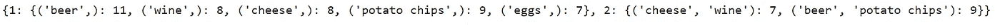

# Apriori 算法

> 原文：<https://towardsdatascience.com/the-apriori-algorithm-5da3db9aea95?source=collection_archive---------0----------------------->

## 利用 Python 中著名的 Apriori 算法进行购物篮分析的频繁项集挖掘

Apriori 算法。照片由[盒装水更好](https://unsplash.com/@boxedwater?utm_source=unsplash&utm_medium=referral&utm_content=creditCopyText)上 [Unsplash](https://unsplash.com/?utm_source=unsplash&utm_medium=referral&utm_content=creditCopyText)

在本文中，您将了解 Apriori 算法的所有知识。 **Apriori 算法**可以认为是**购物篮分析**中的基础算法。购物篮分析是研究顾客购物时的购物篮。

目标是找到经常一起购买的产品组合，我们称之为**频繁项目集**。该领域的技术术语是**频繁项目集挖掘**。

当我们使用频繁项目集和 Apriori 算法时，购物篮分析不是唯一的分析类型。理论上，它可以用于任何想要研究频繁项集的主题。

# Apriori 算法是如何工作的？

虽然我想让这篇文章更具应用性，而不是技术性，但是理解 Apriori 算法的基础是很重要的。

这里需要注意的是，有多种因素需要考虑:

*   如何在数据集中找到频繁项集？
*   如何高效的在数据集**中找到频繁项集**？

## 如何为 Apriori 算法组织数据？

让我们从头开始:您有一个客户正在购买多种产品的数据集。你的目标是找出**哪些产品组合经常一起购买**。

你需要以这样一种方式组织数据，即每一行都有一组产品。每套都包含在同一笔交易中购买的**产品。**

最基本的解决方案是遍历所有的事务，并在事务内部遍历所有的产品组合，并对它们进行计数。不幸的是，这将花费太多的时间，所以我们需要更好的东西。

两位科学家 Agrawal 和 Srikant 在他们 1994 年的论文《挖掘关联规则的快速算法》中首次提出了解决方案。他们的第一个解决方案是著名的 **Apriori 算法**。

## Apriori 算法的一个示例问题

让我们介绍一些示例数据，并尝试一步一步地完成算法。该数据是一个假设的数据集，来自一家夜店，顾客主要购买葡萄酒和奶酪或啤酒和薯片。有些人也去那里，当他们想烤一个蛋糕，但他们没有鸡蛋，面粉或黄油。

数据看起来像这样:

Apriori 算法。交易记录列表。

## Apriori 算法的步骤

让我们回顾一下 Apriori 算法的步骤。当然，不要犹豫，看看 Agrawal 和 Srikant 的论文，了解更多的细节和细节。

**第一步。计算每个单独项目的支持度**

该算法基于**支持**的概念。支持简单来说就是**特定产品(或产品组合)发生的交易数量**。

该算法的第一步是计算每个单独项目的支持度。这基本上可以归结为计算每种产品发生了多少次交易。

Apriori 算法。计算每个产品的出现次数。

**第二步。决定支持阈值**

现在我们已经获得了对每个产品的支持，我们将使用它来过滤掉一些不常用的产品。为此，我们需要确定一个支持阈值。对于我们当前的例子，让我们使用 7 作为最小值。

**第三步。选择常用项目**

很容易看出，有两个产品的支持度小于 7(意味着它们的出现次数少于 7)。那些产品是面粉和黄油。

因此，对于面粉和黄油来说，不幸的是，它们将不会被进一步考虑。

**第四步。寻找频繁项集的支持度**

下一步是做同样的分析，但是现在使用成对的产品而不是单个的产品。可以想象，这里组合的数量可以很快变大，尤其是如果你有大量的产品。

Apriori 算法背后的伟大“发明”是，我们将直接忽略包含任何非频繁项目的所有对。由于这一点，我们有少得多的项目对扫描。

这里列出了所有含有黄油、面粉或者两者都含有的食物。所有这些都可以丢弃，这将加快我们计数的执行速度。

Apriori 算法。根据上一步排除的项目集。

当然，本例中仍有一些组合需要计算在内:

Apriori 算法。每个项目集的出现次数。

正如你所看到的，在这一点上，只剩下两个产品组合在支持之上:*葡萄酒和奶酪*，以及*啤酒和薯片*。

**第五步。对更大的组重复此步骤**

我们现在将对包含三种产品的器械包重复同样的操作。和以前一样，我们不会对上一步中被淘汰的器械组进行评分。

其余的对是:

*   葡萄酒，奶酪
*   啤酒，薯片

那么，我们可以创建什么样的三元组，使其不包含任何被消除的配对呢？

*   葡萄酒、奶酪、啤酒->因为存在非频繁配对而被剔除(例如奶酪、啤酒)
*   葡萄酒、奶酪、薯片->因为出现不常见的一对而被剔除(例如奶酪、薯片)
*   啤酒、薯片、葡萄酒->因为出现非频繁配对而被淘汰(例如葡萄酒、薯片)
*   奶酪、啤酒、薯片->因为存在非频繁配对而被剔除(例如奶酪、啤酒)

没有不包含任何非频繁对的三元组。这意味着频繁集已被确定，它们是成对的葡萄酒、奶酪和啤酒、薯片。

**第六步。生成关联规则并计算置信度**

既然已经有了最大频繁项集，下一步就是将它们转换成**关联规则。**关联规则比仅仅列出频繁出现的产品更进了一步。

关联规则以如下格式编写:产品 X = >产品 y。这意味着您获得一条规则，告诉您如果您购买产品 X，您也可能购买产品 y。

还有一个额外的衡量标准叫做**信心。**置信度告诉您该规则有效的情况的百分比。100%的置信度意味着这种关联总是发生；例如，50%意味着该规则只适用于 50%的时间。

**第七步。计算升力**

一旦你得到了规则，最后一步是计算每个规则的提升。根据定义，规则的提升是一个性能度量，它指示规则中产品之间的关联强度。

规则提升的公式如下所示:

Apriori 算法。电梯公式。

这意味着 lift 基本上将关联规则的改进与整个数据集进行比较。如果在 10%的情况下“任何产品=> X ”,而在 75%的情况下“A => X ”,改进将是 75% / 10% = 7.5。

如果一个规则的提升是 1，那么乘积是相互独立的。任何提升为 1 的规则都可以被丢弃。

如果规则的提升大于 1，提升值会告诉您右侧乘积对左侧的依赖程度。

# 先验准确性:如何平衡规则的支持度、可信度和提升度？

这基本上给了我们三个指标来解释:

*   支持(产品同时出现的次数或百分比)
*   置信度(规则出现的次数，也是给定左侧的右侧的条件概率)
*   提升(联合的力量)

这三个指标都有各自的有效性。因此，很难在它们之间做出选择。例如，如果你有一个规则，它比另一个规则有更高的提升，但更低的可信度，就很难说一个规则比另一个规则更好。在这一点上，您可能只是想保留这两个规则，或者在您的特定用例中寻找一个理由来选择一个指标。

# Python 中的 Apriori 算法

由于购物篮分析任务是一个非常容易理解的主题，现在让我们继续看 Python 中的 **Apriori 算法的例子。**

## 有效先验包

在 Python 中有多种实现先验的可能性。对于本教程，我们将使用高效的 apriori 包。正如他们的 GitHub 上所说，他们维护这个包，他们的项目被可靠的来源使用和引用。如果你想了解更多关于这个包的信息，你可以在这里查看它的 GitHub。

另一个好的实现可以在这里的 [mlxtend 包](http://rasbt.github.io/mlxtend/api_subpackages/mlxtend.frequent_patterns/)中找到。我选择使用高效的 apriori 包，因为它允许在一个函数中执行 Apriori 算法和生成规则**，而 mlxtend 要求您分两步完成。**

您可以使用`pip install efficient-apriori`安装 efficient-apriori 包。

## 为高效的 apriori 算法准备数据

您不能在高效的 apriori 算法中使用数据帧。你需要使用一个**事务列表**。在这个列表中，**每个交易被表示为该交易**中产品的元组。

让我们输入上一个例子中的数据作为一个事务列表。您可以列出如下清单:

Apriori 算法。输入数据。

## 设置算法的参数并运行算法

下一步，我们将对这些数据应用 apriori 算法。您可能需要控制两个设置:

*   **min_support** :这是上面算法部分解释的支持阈值。一个小的区别是，它在这里表示为百分比，而不是数字。
*   **min_confidence** :这只是一个过滤器，过滤掉不符合最小置信度的规则。如果您想查看所有生成的规则，可以将它设置为零。

您可以使用以下代码运行 apriori 算法:

Apriori 算法。使用高效的 apriori 算法计算关联规则。

该算法的输出是已经生成的项目集和规则。让我们在下面几节中检查它们。

## 检查频繁项目集

让我们从检查项目集开始。您可以使用以下代码简单地打印:

Apriori 算法。显示频繁项目集。

您将获得如下所示的字典:

Apriori 算法。频繁项目集。

让我把它写出来，使它更易读:

在第一遍中，(key = 1)您获得了单个产品及其出现次数:

*   啤酒:11 英镑
*   葡萄酒:8 英镑
*   奶酪:8
*   薯片:9
*   鸡蛋:7 个

在第二遍(如算法部分所示),您有至少获得 7 分的最低支持的单个产品对。您也有它们出现的次数:

*   (奶酪、葡萄酒):7
*   (啤酒、薯片):9

该数据非常详细，但很高兴看到它证实了我们之前手工制作的示例的结果。

## 检查规则及其度量标准

现在让我们检查一下规则，以及它们的度量标准。您可以使用以下代码将它们打印出来:

Apriori 算法。打印规则。

您将获得以下结果:

Apriori 算法。关联规则。

为了便于阅读:

*   规则**薯片= >啤酒**有**信心 1** 和**升力 1.818**
*   规则**啤酒= >薯片**的**置信值为 0.818** 而**提升值为 1.818**
*   规则 **Wine = > Cheese** 的**置信度为 0.875** 而**提升为 2.188**
*   规则**奶酪= >葡萄酒**的**置信度为 0.875** 和**升力为 2.188**

作为这个数据的结论，我们可以说葡萄酒= >奶酪和奶酪= >葡萄酒这个规则的升力非常高。这家夜店的老板可能是想把奶酪和酒放在一起靠近。薯片= >啤酒和啤酒= >薯片的关联稍弱一些，但也足够高，可以把啤酒和薯片放在商店的同一个地方。

# 结论:Apriori 算法

总之，您已经发现了频繁项集挖掘中的一个基础算法，称为 Apriori 算法。您还看到了如何使用 Python 包将 Apriori 算法应用于购物篮分析。

在频繁项集挖掘领域还有很多东西有待发现，但我将把它留给下一篇文章。现在，*我希望这篇文章对你有用，不要犹豫，继续关注更多的数学、统计和数据内容！*