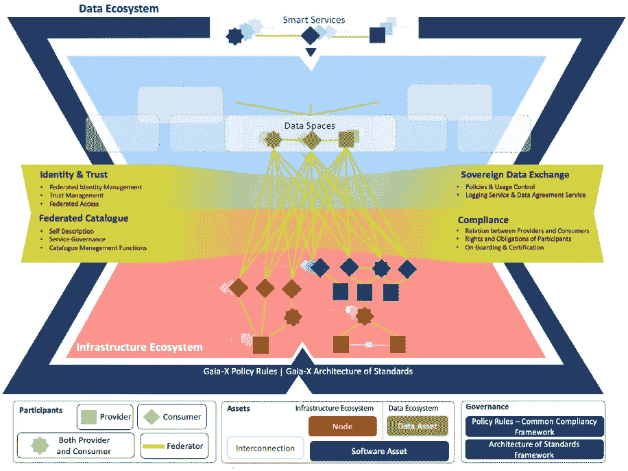
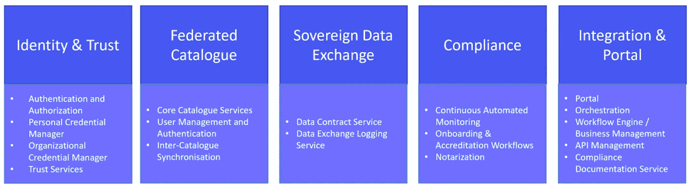
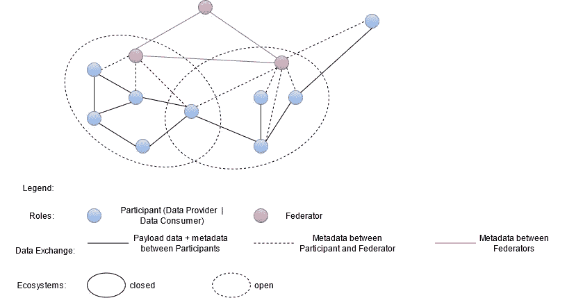

# 欧洲 Gaia-X 的架构

> 原文：<https://towardsdatascience.com/the-architecture-of-europes-gaia-x-850ba6f43519?source=collection_archive---------30----------------------->

## 技术概述

埃里克·韦伯在 [unsplash](http://unsplash.com) 上拍摄的照片。

尽管还不清楚 Gaia-X 会是一个主要的失望还是一个新的欧洲突破，让我对已经出来的架构和规范做一个彻底的分析。
因为规范中确实包含了很多有趣而新颖的概念值得分析。

# 那么 Gaia-X 到底是什么？

一些人将 Gaia-X 称为下一个欧洲云，它尊重用户及其数据的隐私。但它应该比这多得多。

Gaia-X 没有构建另一个云，而是设想了一个可以连接多个异构云系统和所有不同类型的数据生态系统的网络基础设施，同时遵守欧盟的政府要求和法律。

总之，新兴基础设施是一个网络系统，连接了许多云服务提供商和来自学术界和非政府组织的私营公司的数据源，同时确保了开放、透明和信任。

# **架构**

摘自 Gaia-X 的[架构白皮书](https://gaia-x.eu/pdf/Gaia-X_Architecture_Document_2103.pdf)

看一下上面的高层架构，就可以看出这个系统实际上有多复杂。
构建 Gaia-X 基础的核心组件被定义在图像的中心，称为联合服务。
围绕这一点，有更多的术语和技术，如法律基础，由政策规则文档提供支持；和数据空间，它们通过智能服务连接在一起，共同构建了一个数据生态系统。
此外，在图像的底部定义了几个角色，它们被分类为参与者、资产和治理。

# 实施标准

Gaia-X 应该是开源的，在 Apache 许可证(2.0 版)下获得许可。它将在 GitHub repository 中维护，主要用 Python 和 Java 编写。再者，rust，C++，go，NodeJS 都可以根据需要使用。由于该架构将被封装到微服务中，docker 或 podman 等容器解决方案将与 Kubernetes 一起用于编排。

# 核心部件有哪些？

整个 Gaia-X 基础设施由一些重型组件支持，这些组件是整个生态系统功能性和可扩展性的基本构建模块。

## **政策、资产和资源**

政策正在构建 Gaia-X 的法律基础。它们在[政策规则文档](https://www.gaia-x.eu/sites/default/files/2021-05/Gaia-X_Policy%20Rules_Document_2104.pdf)中进行了描述和定义，这是一个公开可用的文档，定义了 Gaia-X 的一组规则。它由 Gaia-X AISBL 的政策规则委员会创建，可能会有社区的协作和反馈。

资产和资源描述了 Gaia-X 生态系统的对象和商品，它们共同组成了一个服务产品。
资产可以是数据资产、软件资产、节点或互连资产。每项资产都有一套政策。资产不公开端点，端点是其他服务和功能的接口。
另一方面，资源确实公开了一个端点。他们也受到某些政策的约束。资源和资产的区别可以描述如下:资源代表供应资产所必需的那些要素。它们可以解释为不可订购的内部服务实例。例如，提供数据集的运行实例是一种资源。

## 参与者及其角色

Gaia-X 生态系统中的参与者可以属于的三个角色被称为提供者、消费者和联合者。

虽然消费者是可以搜索服务提供和消费服务实例以便为最终用户实现数字提供的参与者，但是提供商是提供服务实例的参与者。
服务实例包括自描述和技术策略，使用不同的资源，拥有不同的资产。
联邦者是一个相当特殊的角色，负责彼此自治的联邦服务和联邦。联合是指直接或间接消费、生产或提供资产和相关资源的一组松散的相互作用的参与者。

## **联邦服务**

联邦服务是 Gaia-X 的核心服务，应该能够使整个系统完美地运行。它们被设计为微服务，共同提供运行整个基础设施所需的核心功能，并进一步公开可用的代码结构，以将服务和产品集成到系统中。

联合服务由四组服务组成，它们是实现资产、资源、参与者和生态系统间交互的联合所必需的。这四个服务组是*身份和信任*、*联合目录*、*主权数据交换*和*合规性*。总之，基础设施将通过所谓的门户向公众公开。

联邦服务工作包。摘自[软件需求说明书](https://www.dtvp.de/Satellite/public/company/project/CXP4YMER6YS/en/documents)。

让我们仔细看看下面的每个工作包。

**身份和信任**

该服务组涵盖认证和授权、凭证管理、分散式身份管理以及模拟凭证验证。

这些服务能够对相关参与者进行验证，为参与者提供唯一的标识符，这是访问生态系统所必需的。

此外，还应涵盖参与者的整个生命周期过程，从入职维护到离职。

**联邦目录**

联合目录是自我描述的中央存储库，支持发现和选择提供商及其服务产品。自我描述是参与者和资产的属性和声明的表达，是在 Gaia-X 生态系统中实现透明和信任的关键要素。自我描述使用 [JSON-LD](https://json-ld.org/) 格式表示。
总之，联合目录是参与者可以用来搜索、消费和提供服务的目录。

**主权数据交换**

该服务组通过提供数据协议服务和数据记录服务来确保遵守政策，从而实现参与者的独立数据交换。进一步的使用约束可以由提供者策略作为自描述的一部分来表达。

**符合性**

合规服务小组提供了一些机制，以确保参与者在入职和服务交付期间遵守安全性、隐私透明性和互操作性等方面的政策规则。它的基础是策略规则文档。
原则上，有两个组成部分:第一，入职和注册工作流程(OAW ),确保所有参与者、资产、资源和服务产品在加入目录之前都经过验证流程。第二，持续自动监控(CAM ),它能够根据自我描述监控法规遵从性。这是通过自动与被测服务交互，使用标准化的协议和接口来检索技术证据来实现的。

**门户和集成**

Gaia-X 门户是 Gaia-X 的入口点，支持参与者的加入和认证，并提供服务发现、编排和样本服务供应的界面。
这是一个网络界面/仪表盘，可进一步提供对联合目录的访问。

所有这些服务组被分为 17 个批次，由 EU-广泛招标的选定申请人开发。

## 数据生态系统和数据空间

由[法比奥](https://unsplash.com/@fabioha)在 [unsplash](http://unsplash.com) 上拍摄的照片。

我想介绍的最后一个基本概念是数据空间和数据生态系统。

数据生态系统是基础架构、分析和应用程序的集合，随着时间的推移而不断发展。在这些生态系统中，可能存在数据空间。

数据空间是由国际数据空间协会(IDSA)进一步发展的概念。
该协会由弗劳恩霍夫协会的成员成立，目前他们已经编写了第一份[白皮书](https://internationaldataspaces.org/wp-content/uploads/IDSA-Brochure-IDS-Standard-for-Data-Sovereignty-Indispensible-Element-for-Data-Ecosystems.pdf)，通过创建安全可信的数据基础设施，定义了交换和存储数据的标准化方法。

IDSA 提供了一个参考架构、一个正式的标准和参考实现，包括示例代码，可以被公司请求和修改，以构建他们自己的市场就绪解决方案。

在 Gaia-X 中，可以有多个包含许多不同数据空间的数据生态系统。这种数据生态系统相互封装，但是如果生态系统的联合者同意的话，可以通过使用联合服务来互连。该功能使公司能够交换相似或互利的数据，以便开发新产品或改进现有产品。

盖亚-X 的联邦生态系统思想

> 所有这些服务，可能还有更多，共同构成了 Gaia-X 的基础。

# 未来展望

对于未来的版本，计划将开发开源模板代码，然后可用于参与 Gaia-X。更具体地说，这种锅炉代码可根据特定业务的需求进行扩展和调整，以快速启动和运行 Gaia-X 服务。然后，联合服务将构建基础，并链接数据空间和其他数据驱动的资源，这些资源可以相互通信，同时遵守参与者同意的策略规则和合规性。

此外，门户还为参与者提供了一个目录，供他们提供自己的服务、使用服务或消费和提供数据。由于创建一个坚实的法律基础并监控其合规性是一项艰巨的任务，因此由一组政府机构而不是单一的技术公司来创建更容易——这使得 Gaia-X 成为一个充满希望的想法，有望满足人们的期望。