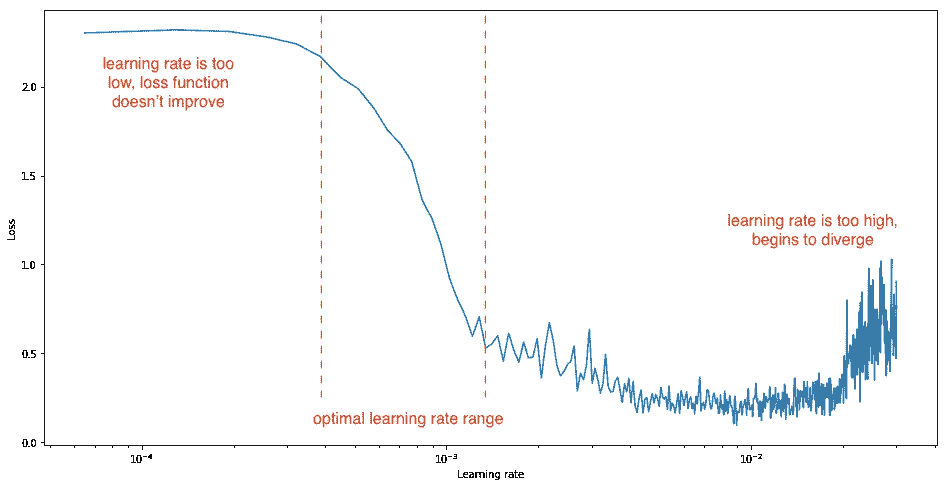

# 深度神经网络中超参数调整的艺术

> 原文：<https://towardsdatascience.com/the-art-of-hyperparameter-tuning-in-deep-neural-nets-by-example-685cb5429a38?source=collection_archive---------6----------------------->


[杰洛特](https://pixabay.com/users/geralt-9301/)在 [Pixabay](https://pixabay.com//?utm_source=medium&utm_medium=referral) 上的照片

H ello 开发者👋，如果你以前从事过构建深度神经网络的工作，你可能知道构建神经网络可能涉及设置许多不同的超参数。在本文中，我将与您分享一些技巧和指南，您可以使用这些技巧和指南来更好地组织您的超参数调优过程，这将使您更有效地发现超参数的良好设置。

# 什么是超参数？🤷‍♀️

很简单，超参数在模型之外，也就是说，它不能在估计器中学习，它的值也不能从数据中计算出来。

> *许多模型的重要参数无法从数据中直接估计出来。这种类型的模型参数被称为调整参数，因为没有可用的解析公式来计算适当的值。*

—第 64、65 页，[应用预测建模](https://link.springer.com/book/10.1007/978-1-4614-6849-3)，2013 年

超参数通常用于帮助估计模型参数的过程中，并且通常由您指定。在大多数情况下，为了调整这些超参数，您可能会使用一些基于您的经验的启发式方法，可能是超参数的起始值，或者是针对给定的问题通过反复试验找到最佳值。

正如我在本文开始时所说的，训练深度神经网络的一个痛苦之处是您必须处理大量的超参数。如果您使用 RMSprop 优化器( [Hinton 等人](https://www.cs.toronto.edu/~tijmen/csc321/slides/lecture_slides_lec6.pdf))，这些可能是您的学习率α、折现因子ρ和εϵ；如果您使用 Adam 优化器( [Kingma 等人](https://arxiv.org/abs/1412.6980))，这些可能是指数衰减率β₁和β₂。您还需要选择网络中的层数或各层的隐藏单元数，您可能会使用学习率调度程序，并希望对其进行配置和更多配置😩！我们确实需要更好地组织超参数调整过程的方法。

# 哪些超参数更重要？📑

通常，我们可以将超参数分为两组:用于*训练*的超参数和用于*模型设计* 🖌️.的超参数正确选择与模型训练相关的超参数将允许神经网络更快地学习，并在调整过程中实现增强的性能，这肯定是您想要关心的事情。模型设计的超参数更多地与神经网络的结构相关，一个普通的例子是隐藏层的数量和这些层的宽度。在大多数情况下，模型训练超参数可以很好地用作测量模型的学习 capacity🧠.的方法

在培训过程中，我通常最关注的是**学习速率α** 和**批量大小**，因为这些决定了收敛的速度，所以你应该考虑先调整它们或者给予它们更多的关注。然而，我坚信对于大多数模型来说，学习率α是最重要的超参数，因此值得更多的关注。我们将在本文后面讨论选择学习速率的方法。另外请注意，我在这里提到了*“通常”*，这肯定会根据您正在构建的应用程序的类型而变化。

接下来，我通常会考虑调整 RMSprop 和其他软件中的**动量项β** ，因为这有助于我们通过加强同一方向的权重更新来减少振荡，同时允许我们减少不同方向的变化。我经常建议使用β = 0.9，这是一个非常好的缺省值，也是最常用的。

这样做之后，我会尝试调整每层的隐藏单元数量，然后是隐藏层的数量，这基本上有助于改变模型结构，然后是学习率衰减，我们很快就会看到这一点。注意:本段中建议的顺序似乎对我很有效，最初是由[吴恩达](https://twitter.com/AndrewYNg)提出的。

此外，佟宇和朱红在他们的论文[中对 Ng 讲义中超参数的重要性顺序做了一个非常有用的总结](https://arxiv.org/abs/2003.05689)，提出了这个顺序:

*   学习率
*   动量β，对于 RMSprop 等。
*   小批量
*   隐藏层数
*   学习率衰减
*   正则化λ

# 调节 process🕹️的常用方法

我们在这一节中讨论的基本上是一些我认为重要的事情，并且适用于任何超参数的调整。因此，我们不会讨论与特定超参数调优相关的东西，而是适用于所有超参数的概念。

## 随机搜索

随机搜索和网格搜索(随机搜索的前身)是目前使用最广泛的方法，因为它们简单。以前，通常对网格中的点进行采样，然后系统地对用户指定的超参数集进行详尽的搜索。并且这工作得很好，并且适用于具有有限搜索空间的几个超参数。在这里的图表中，我们提到网格搜索要求我们系统地采样点，并尝试这些值，然后我们可以选择最适合我们的一个。


根据[吴恩达](https://www.andrewng.org/)的讲稿

为了执行深度神经网络的超参数调整，通常建议随机选择点。所以在上面的图像中，我们选择了相同数量的点，但是没有像左边那样按照系统的方法来选择这些点。你经常这样做的原因是，很难预先知道哪个超参数对你的问题最重要。假设这里的超参数 1 对您的问题很重要，而超参数 2 的作用很小，您基本上只能尝试超参数 1 的 5 个值，尝试超参数 2 的值后，您可能会发现几乎相同的结果，因为它的作用并不大。另一方面，如果您使用随机抽样，您将更丰富地探索可能值的集合。

因此，我们可以在调优过程的早期阶段使用随机搜索来快速缩小搜索空间，然后开始使用引导算法来获得从粗略到精细采样方案的更精细结果。下面是一个关于 TensorFlow 的简单示例，我尝试在*时尚 MNIST* 数据集上使用*随机搜索*来获得学习率和单元数量:

## 超波段

Hyperband ( [李等](https://arxiv.org/pdf/1603.06560.pdf))是我经常使用的另一个算法，它本质上是随机搜索的一个微小改进，结合了自适应资源分配和早期停止，以快速收敛到高性能模型。在这里，我们为几个时期训练大量的模型，并且只将表现最好的一半模型结转到下一轮。

早期停止对于深度学习场景特别有用，在深度学习场景中，深度神经网络经过多个时期的训练。训练脚本可以在每个时期之后报告目标度量，并且如果在相同数量的间隔之后，该运行明显不如先前的运行，则可以放弃该运行。

下面是一个关于 TensorFlow 的简单示例，我尝试在*时尚 MNIST* 数据集上使用 *Hyperband* 计算学习率和单位数:

# 选择学习率α🧐

我对选择适当的学习速率α特别感兴趣，因为对于大多数学习应用来说，它是最重要的超参数，因此也值得更多的关注。拥有一个恒定的学习速率是最直接的方法，通常被设置为默认时间表:

```
optimizer = tf.keras.optimizers.Adam(*learning_rate = 0.01*)
```

然而，结果表明，在 LR 恒定的情况下，网络通常可以被训练到足够的但不令人满意的精度，因为初始值可能总是较大，尤其是在梯度下降的最后几步。最佳学习率将取决于损失景观的拓扑结构，而这又取决于模型架构和数据集。所以我们可以说，一个最佳的学习率会使我们的损失函数急剧下降。降低学习速率会降低损失函数，但这种降低的速率非常低。另一方面，在最优学习率之后增加学习率将导致损失在最小值附近反弹。这里有一个数字来总结这一点:



来源:杰瑞米·乔登

现在你明白了为什么选择一个有效的学习率是重要的，让我们谈一谈在训练或制定时间表时更新你的学习率。一种流行的技术，称为*学习速率退火，*经常被使用，它建议从相对较高的学习速率开始，然后逐渐降低学习速率📉训练时。例如，当精度饱和时，我可以从 10⁻的学习率开始，或者当我达到一个平稳状态时，我们可以降低学习率，比如说降低到 10⁻，如果需要，可能再降低到 10⁻⁵。

> 在训练深度网络时，随着时间的推移调整学习速率通常是有帮助的。要记住的好的直觉是，在高学习率的情况下，系统包含太多的动能，参数向量无序地跳跃，无法停留在损失函数的更深但更窄的部分。

——斯坦福 [CS231n](https://cs231n.github.io/neural-networks-3/#annealing-the-learning-rate) 课程笔记[费-李非](https://profiles.stanford.edu/fei-fei-li/)、[兰杰·克里希纳](https://ranjaykrishna.com/index.html)、[丹飞·徐](https://cs.stanford.edu/~danfei/)

回到上面的例子，我怀疑我的学习率应该在 10⁻和 10⁻⁵之间，所以如果我简单地在这个范围内统一更新我的学习率*和*，我们使用了从 10⁻到 10⁻的 90%的资源，这是没有意义的。你可以更新对数标度上的 LR，这允许我们在 10⁻到 10⁻和 10⁻到 10⁻⁴.之间使用等量的资源现在对你来说应该超级容易😎了解广泛使用的 LR 程序指数衰减(【李】等)。指数时间表在开始时提供更剧烈的衰减，当接近收敛时提供平缓的衰减。


指数衰减

下面的示例展示了如何使用张量流执行指数衰减:

此外，请注意，初始值是有影响的，在这种情况下必须仔细确定，尽管您可能希望使用相对较大的值，因为它会在训练过程中衰减。

# 选择动量项β🧐

为了更好地帮助我们理解为什么我稍后会为动量项建议一些好的默认值，我想展示一下为什么在 RMSprop 和其他一些中使用动量项。RMSprop 背后的想法是加速梯度下降，就像前体阿达格拉德([杜奇等人](https://jmlr.org/papers/v12/duchi11a.html))和阿达德尔塔([泽勒等人](https://arxiv.org/abs/1212.5701))一样，但当步长变小时会产生更好的性能。RMSprop 使用平方的指数加权平均值，而不是直接使用∂w 和∂b:


在 RMSprop 中添加β项

现在你可能已经猜到了，移动平均项β应该是 0 到 1 之间的一个值。在实践中，0.9 在大多数情况下工作得很好(Geoffrey hint on[也建议这样做)，我认为这是一个非常好的默认值。您通常会考虑尝试介于 0.9(最后 10 个值的平均值)和 0.999(最后 1000 个值的平均值)之间的值。这里有一个非常精彩的图表来总结β的作用。这里是:](https://www.cs.toronto.edu/~hinton/coursera/lecture15/lec15.pdf)

*   红色线条代表 *β = 0.9*
*   绿色线条代表 *β = 0.98*


资料来源:吴恩达

如您所见，β值越小，新序列波动越大，因为我们对更少的样本求平均值，因此更接近噪声数据。然而，β值越大，我们得到的曲线就越平滑，但会向右偏移一点，因为我们对更多的例子求平均值。所以总的来说，0.9 提供了一个很好的平衡，但是正如我前面提到的，你经常会考虑尝试一个介于 0.9 和 0.999 之间的值。

正如我们在本文中谈到寻找一个好的学习速率α，以及在*线性标度*中这样做是没有意义的，而是在对数标度中这样做。类似地，如果您正在搜索一个好的β值，那么在 0.9 和 0.999 之间均匀随机地执行搜索也没有意义。因此，一个简单的技巧可能是在 10⁻到 10⁻的范围内搜索 1-β，我们将在对数标度内搜索它。下面是一些示例代码，用于以对数标度生成这些值，然后我们可以搜索这些值:

```
r = -2 * np.random.rand() # gives us random values between -2, 0
r = r - 1                 # convert them to -3, -1
beta = 1 - 10**r
```

# 选择模特设计 Hyperparameters🖌️

## 隐藏层数 d

我不会谈论一些关于隐藏层数的具体规则或建议，你很快就会明白我为什么不这样做(举例)。

*隐层数 d* 是决定神经网络整体结构的一个非常关键的参数，它直接影响最终的输出。我几乎总是看到，具有更多层的深度学习网络通常会获得更复杂的特征和相对更高的准确性，从而使这成为实现更好结果的常规方法。

例如，ResNet 模型([何等人](https://arxiv.org/abs/1512.03385))可以通过简单地使用更多层，根据他们对精度的需要重复基线结构，从 ResNet-18 扩大到 ResNet-200。最近，黄雁萍等人在[他们的论文](https://arxiv.org/abs/1811.06965)中通过将基线模型放大四倍，实现了 84.3 %的 ImageNet top-1 准确率！

## 神经元数量 w

在谈到层数之后，还必须仔细考虑每层 w 中神经元的数量。隐藏层中的神经元太少可能会导致拟合不足，因为模型缺乏复杂性。相比之下，太多的神经元可能会导致过度拟合，并增加训练时间。


神经元的数量很重要吗？

杰夫·希顿的几个建议非常有效，可能是调整神经元数量的良好开端。为了便于理解，这里我用 wᵢₙₚᵤₜ作为输入层的神经元数量，用 wₒᵤₜₚᵤₜ作为输出层的神经元数量。

*   隐藏神经元的数量应该在输入层的大小和输出层的大小之间。wᵢₙₚᵤₜ < w < wₒᵤₜₚᵤₜ
*   The number of hidden neurons should be 2/3 the size of the input layer, plus the size of the output layer. w = 2/3 wᵢₙₚᵤₜ + wₒᵤₜₚᵤₜ
*   The number of hidden neurons should be less than twice the size of the input layer. wᵢₙₚᵤₜ < 2 wₒᵤₜₚᵤₜ

And that is it for helping you choose the Model Design Hyperparameters🖌️, I would personally suggest you also take a look at getting some more idea about tuning the regularization λ and has a sizable impact on the model weights if you are interested in that you can take a look at this blog I wrote some time back addressing this in detail:

</solving-overfitting-in-neural-nets-with-regularization-301c31a7735f>  

Yeah! By including all of these concepts I hope you can start better tuning your hyperparameters and building better models and start perfecting the “Art of Hyperparameter tuning”🚀. I hope you liked this article.

If you liked this article, share it with everyone😄! Sharing is caring! Thank you!

*非常感谢*