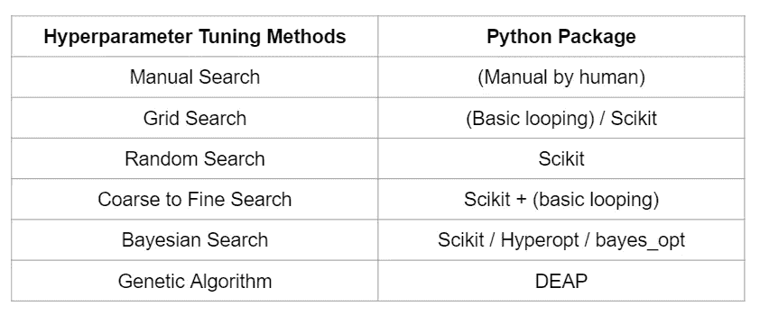
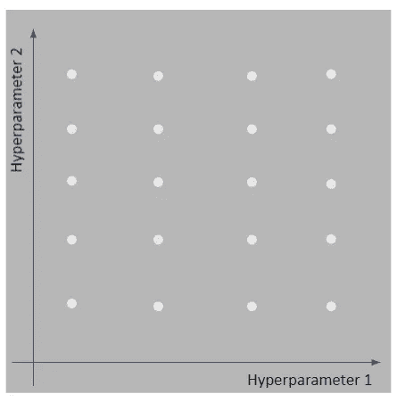
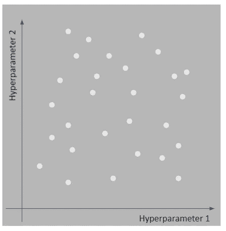
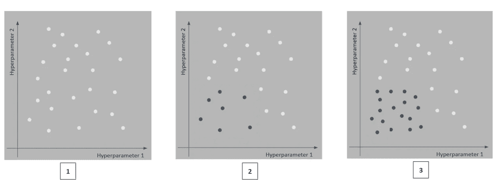
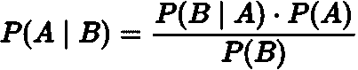
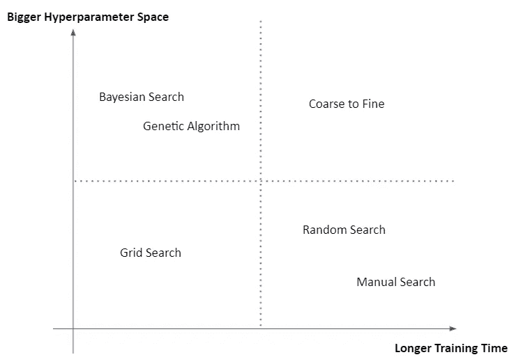

# Python 中超参数调优的艺术

> 原文：<https://towardsdatascience.com/the-art-of-hyperparameter-tuning-in-python-c581a129d4e4?source=collection_archive---------14----------------------->

## 网格、随机、由粗到细、贝叶斯、手动搜索和遗传算法！

照片由[德鲁·帕特里克·米勒](https://unsplash.com/@drewpatrickmiller?utm_source=medium&utm_medium=referral)在 [Unsplash](https://unsplash.com?utm_source=medium&utm_medium=referral) 上拍摄

> 假设您已经准备了数据并开发了 ML 模型的 POC，
> 
> 这很有效。
> 
> 但是，你意识到了，性能其实并不好。
> 
> 当然，您希望提高模型的性能，但是如何提高呢？
> 
> 该不该换型号？
> 
> 那是一个选项，但是如果在你改变了模型之后，你仍然不能达到预期的性能呢？
> 
> 您有两个选择:设计模型，或者重新访问数据。

前者被称为以**模型为中心的**方法，而后者被称为以**数据为中心的**方法。在本文中，我们将学习以模型为中心的方法，尤其是**超参数调优**部分。

关于如何在 Python 中执行超参数调优，有许多文章和教程可供参考。

> *那么，为什么我要花时间去阅读另一篇典型的文章呢？*

本文涵盖了所有有用的超参数调优方法。你不仅会学到每种超参数调节方法的概念，还会学到何时应该使用每种方法。

此外，解释还将伴随着相关的可视化，可以帮助您更好地理解每种方法是如何工作的。

本文将讨论 6 种方法:

1.  网格搜索
2.  随机搜索
3.  由粗到细的搜索
4.  贝叶斯搜索
5.  遗传算法
6.  手动搜索

不需要担心代码实现，因为您可以从本文末尾的链接中自由访问它！

由 [Pablo Heimplatz](https://unsplash.com/@pabloheimplatz?utm_source=medium&utm_medium=referral) 在 [Unsplash](https://unsplash.com?utm_source=medium&utm_medium=referral) 上拍摄的照片

不再浪费时间，让我们深呼吸，让自己舒服一点，准备好学习 Python 中超参数调优的艺术吧！

# 超参数对参数

在学习超参数调优方法之前，我们应该知道超参数和参数之间的区别。

> 超参数和参数之间的关键区别在于它们相对于模型的位置。

模型**参数**是模型**内部**的配置变量，其值**可从数据**中估算。

> 例如:逻辑回归/线性回归中的系数、神经网络中的权重、SVM 中的支持向量

模型**超参数**是模型外部的**配置，其值**无法从数据**中估计。**

> 例如:决策树中的 max_depth、神经网络中的学习率、SVM 的 C 和 sigma

另一个需要理解的重要术语是超参数空间。基本上，**超参数空间**就是超参数调优过程中可以调优的超参数的所有可能组合的空间。

# 超参数调谐

现在我们知道超参数和参数的区别了。接下来要知道为什么要做超参数调优。

> 基本上，超参数调整的目标是获得最佳的模型性能。

怎么会？通过选择超参数的最佳组合，因为它们不能从数据中估计出来。

> 但是，如何选择超参数的最佳组合呢？

这是本文将要回答的主要问题！有许多方法可以执行超参数调整。在这篇文章中，我们将学习其中的 6 种，并比较和指导何时使用它们。

作者图片

## 网格搜索

图片作者。

第一种也是最流行的方法叫做网格搜索。基本上，这是简单的蛮力，我们必须测试所有可能的组合。

> 当您已经知道适合您的情况的超参数空间时，这种方法是最适合的。

**优点:**

*   能够测试超参数空间内的所有组合
*   实施起来非常简单

**缺点:**

*   维度的诅咒
*   可能错过超参数空间之外的更好的超参数组合

## 随机搜索

图片作者。

我认为这是仅次于网格搜索的第二种最流行的超参数调优方法。随机搜索通过在超参数空间内随机选择超参数的组合来工作。

> 当您不知道合适的超参数空间时，这种方法最适合(这是最常见的情况)。

通常，当执行随机搜索时，我们将超参数空间设置得比执行网格搜索时更大。为什么？所以希望我们能得到更好的超参数组合。

**优点:**

*   非常适合发现和获得您无法凭直觉猜到的超参数组合

**缺点:**

*   通常需要更多的时间来执行，直到获得最佳组合

## 由粗到细的搜索

图片作者。

失败者的方法。从粗到细的搜索基本上是网格搜索和随机搜索的结合，但结果证明它非常强大。

这种方法是这样工作的:

1.  在初始超参数空间上执行随机搜索
2.  寻找有前途的地区
3.  在较小的区域执行网格/随机搜索
4.  继续，直到获得最佳分数或达到最大迭代次数

**优点:**

*   利用网格和随机搜索的优势
*   花更多的时间在搜索空间，这是给好的结果

**缺点:**

*   更难实现，因为还没有支持这个特性的包

不用担心，因为您将从本文中获得这个 underdog 方法的代码实现！

## 贝叶斯搜索

条件概率公式。图片作者。

贝叶斯搜索是一种“聪明”的算法，它利用贝叶斯定理来搜索超参数的最佳组合。

在高层次上，这种方法是这样工作的:

*   从参数分布的先验估计开始
*   维护超参数值和模型性能之间关系的概率模型
*   交替使用:

1.  使用最大化预期改善的超参数值进行训练
2.  使用训练结果来更新初始概率模型及其期望值

**优点:**

*   一种无需人工干预的选择超参数的有效方法

**缺点:**

*   难以从零开始实施

> 阅读这篇[文章](https://machinelearningmastery.com/what-is-bayesian-optimization/)了解更多关于贝叶斯搜索的细节。

> 该方法的代码实现可以在本文末尾的 Github Repo 中找到。

## 遗传算法

[国立癌症研究所](https://unsplash.com/@nci?utm_source=medium&utm_medium=referral)在 [Unsplash](https://unsplash.com?utm_source=medium&utm_medium=referral) 上拍摄的照片

这是一种更“聪明”的超参数调整方法。该方法受自然选择进化概念的启发。

在高层次上，遗传算法是这样工作的:

*   从人口开始
*   对于每次迭代，种群将通过执行选择、交叉和变异来“进化”
*   继续，直到达到最大迭代次数

> 观看这个[视频](https://youtu.be/6l6b78Y4V7Y)来学习更多关于遗传算法的知识。

> 该方法的代码实现可以在本文末尾的 Github Repo 中找到。

## 手动搜索

[猫韩](https://unsplash.com/@figmentprints?utm_source=medium&utm_medium=referral)在 [Unsplash](https://unsplash.com?utm_source=medium&utm_medium=referral) 上拍照

顾名思义，这是一种手动方法，其中人自己手动调整超参数组合，直到模型获得最佳性能。

当你想使用这种方法时，你必须真正理解算法是如何工作的。基本上，这种方法是这样工作的:

*   训练和评估模型
*   猜一个更好的超参数组合
*   重新训练和评估模型
*   继续直到获得最佳分数

**优点:**

*   对于熟练的从业者来说，这有助于减少计算时间

**缺点:**

*   很难猜测，即使你真的理解算法
*   耗时的

# 何时使用每种方法？

> 有时候。我们知道的越多，我们就变得越困惑。

我们现在知道在执行超参数调整时可以使用的 6 种方法。够不够？也许对于一个可以轻松掌握新概念的人来说，阅读上面的解释并准备在真实场景中实现它们就足够了。

然而，对于那些仍然不知道何时使用每种方法的人，这里我也创建了一个简单的矩阵，你们可以参考。

图片作者。

该矩阵可以帮助您根据训练时间和超参数空间的大小来决定应该使用哪种方法。

例如，当您训练具有大超参数空间的深度神经网络时，最好使用手动搜索或随机搜索方法，而不是使用网格搜索方法。

> 你可以在这里找到本文[中使用的所有代码。](https://github.com/louisowen6/hyperparameter_tuning)

# 最后的话

照片由 [Quino Al](https://unsplash.com/@quinoal?utm_source=medium&utm_medium=referral) 在 [Unsplash](https://unsplash.com?utm_source=medium&utm_medium=referral) 上拍摄

恭喜你坚持到了这一步！希望你从这篇文章中学到了一些新的东西。

阅读完本文后，您应该知道执行超参数调优的各种方法以及何时使用每种方法。如果你喜欢这些内容，请关注我的媒体账户，以获得关于我未来帖子的通知！

# 关于作者

[Louis Owen](https://louisowen6.github.io/) 是一个数据科学爱好者，他总是对新知识如饥似渴。他在印度尼西亚顶尖大学[*Institut Teknologi Bandung*](https://www.itb.ac.id/)攻读数学专业，并获得了最后一年的全额奖学金。最近，2020 年 7 月，他刚刚以优异的成绩毕业。

目前，Louis 是[*Bukalapak*](https://careers.bukalapak.com/)*的一名人工智能研究工程师，在那里他帮助提供各种人工智能解决方案(金融时间序列、自然语言处理和计算机视觉)。*

*查看路易斯的网站以了解更多关于他的信息！最后，如果您有任何疑问或需要讨论的话题，请通过 [LinkedIn](https://www.linkedin.com/in/louisowen/) 联系 Louis。*

# *参考*

*[https://machine learning mastery . com/difference-a-parameter-and-a-hyperparameter/](https://machinelearningmastery.com/difference-between-a-parameter-and-a-hyperparameter/)*

*[https://fullstackdeeplearning.com/spring2021/lecture-7/](https://fullstackdeeplearning.com/spring2021/lecture-7/)*