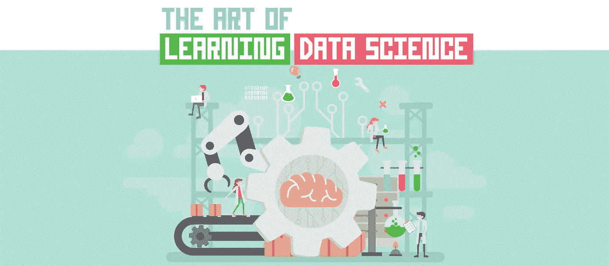
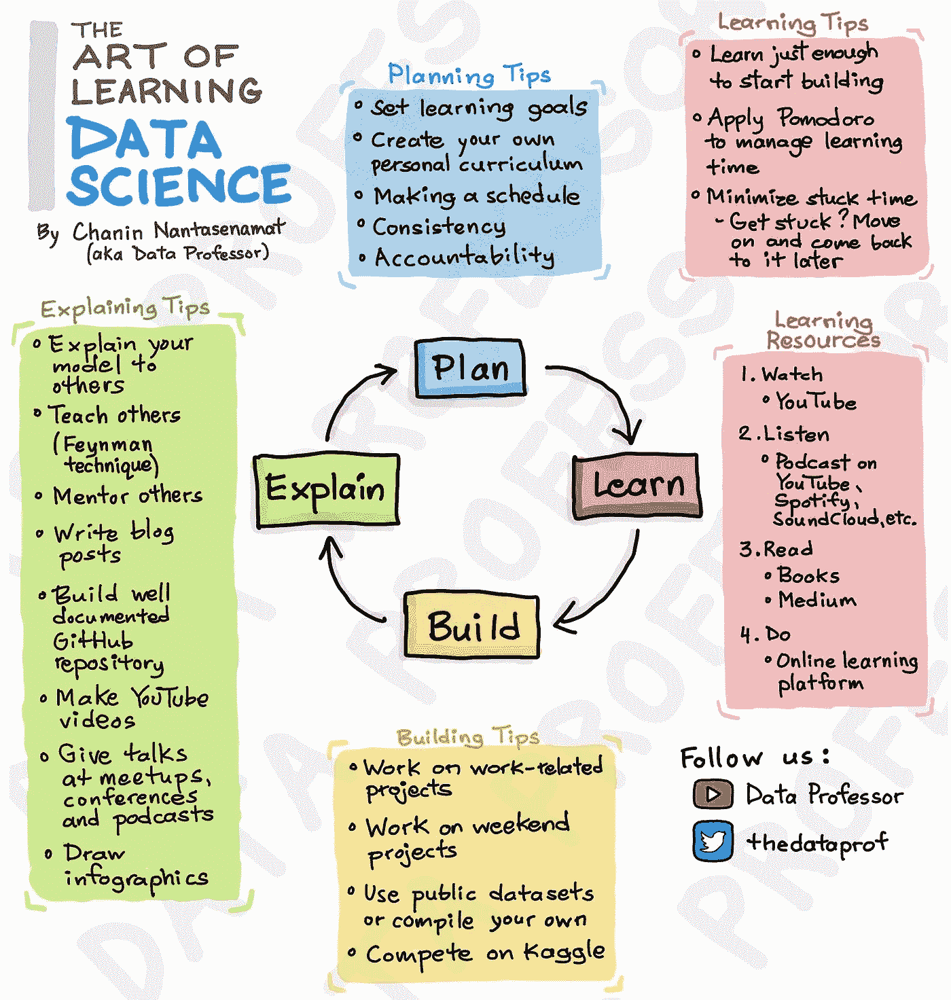
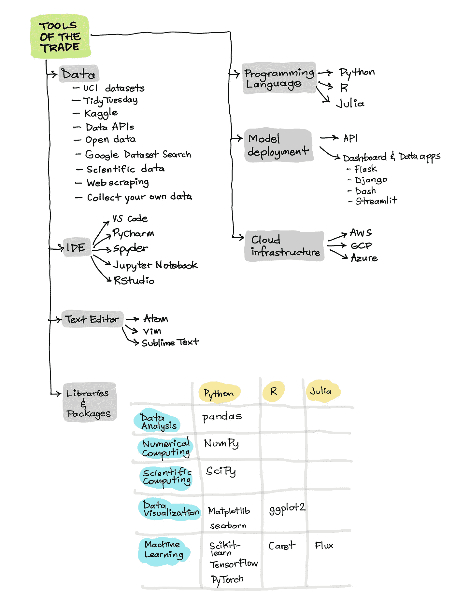

# 学习数据科学的艺术

> 原文：<https://towardsdatascience.com/the-art-of-learning-data-science-c367c02dc0d1?source=collection_archive---------3----------------------->

由 Chanin Nantasenamat 使用 [alexacrib](https://elements.envato.com/user/alexacrib/) 在 [envato elements](https://elements.envato.com/) 上的图形创建

## [入门](https://towardsdatascience.com/tagged/getting-started)；[数据科学](https://towardsdatascience.com/tagged/data-science)

## 如何学习数据科学

回到 2020 年 1 月，我发布了一个名为*2020 年学习数据科学的策略*的视频，分享了我关于如何开始学习数据科学的一些技巧。一年过去了，我认为这将是一个很好的机会来重温这个话题，我写了这篇文章*学习数据科学的艺术*，分享我关于如何在 2021 年学习数据科学的最佳技巧(以及几位杰出的数据科学家的技巧)。

我最喜欢的一句话是*“学习数据科学的最好方法是做数据科学。”我总是在我的 YouTube 上的每个视频结束时说这句话*但是为了做到这一点，你还需要知道。所以棘手的问题是:

> 要了解多少才能做数据科学？

让我们在这篇文章中了解一下吧！

**注意:**当你在看的时候，也一定要看看下面我之前创作的同名视频， [*学习数据科学的艺术*](https://youtu.be/oR670Txwh88) 。

☝️My 关于开始数据科学学习之旅的最佳提示。

# 1.本文的动机

在 2020 年的过程中，我在解释数据科学的概念时尝试了很多教育技术。其中包括制作 YouTube 视频、写博客、手绘信息图以及创造迷因。除此之外，我很幸运有机会认识其他数据科学家、数据科学 YouTubers(肯·吉、克里斯·纳伊克、马得和丹尼尔·伯克)以及与人工智能相关的公司。此外，我有机会阅读和参与 Twitter 或 LinkedIn 等各种平台上来自观众、其他数据科学家以及数据科学 YouTubers 的数千条评论。

这些评论中最受欢迎的一个问题是:

> 如何开始学习数据科学？
> 
> 为了做数据科学，一个人应该知道多少？

正如我之前提到的，在学习数据科学和从事数据科学之间似乎有一个平衡。因此，在你能做数据科学之前，你应该学习多少？

YouTube 上已经有几个视频在谈论如何学习数据科学。著名的数据科学 YouTubers 发布了这样的视频，例如 Ken Jee，他有几个视频与你分享他的最佳技巧，告诉你如果他必须从头开始，他将如何学习数据科学。在 Ken Jee 和 Andrew Mo 长达一小时的合作视频中，他们讨论了如果他们必须重新开始，他们将如何学习数据科学。到 2020 年底，Ken Jee 还发布了一个视频，讲述他将如何在 2021 年重新开始学习数据科学。

今年 2021 年初，Tina Huang 发布了一个病毒视频，讲述了她学习数据科学的*最小输入最大输出*方法。克里斯·纳伊克和达瓦尔·帕特尔也制作了他们自己的视频，谈论如何聪明地学习数据科学，以及如何免费学习数据科学。此外，Daniel Bourke 分享了机器学习和数据科学中关键主题的思维导图。

在写这篇文章之前，我花了几个月的时间从这些*如何学习数据科学*视频中收集要点，结合我自己的观点和想法，我总结了如何学习数据科学的所有关键概念。应该注意的是，这适用于有抱负的数据科学家以及希望提高技能或重新提高技能的实践数据科学家，以及希望获得新技术技能以提升其数据分析/数据工程师/数据科学技能的数据分析师或数据工程师。

我的目的是让这篇文章尽可能保持最新，所以请在这篇文章中随意评论这篇文章中缺少的任何学习数据科学的资源。

让我们开始吧！

# 2.学习数据科学艺术的 4 个步骤

由于一张图片胜过千言万语，因此我想出了这张信息图或卡通插图，总结了您可以在学习数据科学和数据技能时使用的概念框架。这个如何学习数据科学的例子叫做*学习数据科学的艺术*。

它主要由四个主要步骤组成:

*   **第一步。**计划
*   **第二步。**学习
*   **第三步。**构建
*   **第四步。**解释

我们这里有很多内容要讲，所以让我们开始吧！

**图解学习数据科学的艺术。**由 Chanin Nantasenamat(又名数据教授)手绘

# 3.第一步——计划

## 3.1.设定学习目标

在开始你的学习之旅之前，设定你的学习目标是非常必要的。考虑以下问题:

> 你希望从学习数据科学中获得什么？
> 
> 你打算用这些知识去找工作吗？
> 
> 你只是出于爱好而使用这些知识吗？
> 
> 你是否将这些知识应用到你现有的日常工作中。
> 
> 你有多少时间学习？

通过考虑以上问题，你会对自己的目标有更好的把握，对学习数据科学的期望也会更加现实。

通过意识到你的时间限制，你将能够留出一个固定的时间段来适应你的时间表。

通过开始这个学习之旅，这表明你有一个成长的心态。你相信如果你投入必要的时间和精力，你可以获得新的数据技能。

## 3.2.制作你自己的学习课程

创建自己的个人学习课程是非常必要的。

为什么？你可能会问。

正如一种尺寸不能适合所有人一样，学习课程也是如此。一般的课程可能是一个很好的起点，但如果课程变得个性化并符合你自己的兴趣，这将有助于使学习之旅成为一次更有价值的经历。因为在一天结束的时候，如果你正在学习的主题或你正在从事的项目有趣、吸引人，那么你就更有可能被激励去学习它或从事它。弄清楚是什么激发了你的好奇心，然后利用它来制作你自己的定制学习课程。

在这一部分，我将讨论一些主题(如数学、统计学、机器学习等。)帮助您迈出成为数据科学家的第一步。

## 3.3.贸易工具

行业工具插图。作者手绘。

## 3.4.数据科学中需要学习的主题

**3.4.1。数据处理**

在上机器学习之前，先说一些你应该了解的数据技巧。所以你应该知道的一些数据技能包括如何处理数据？如何清理数据？如何设计特征、将特征组合在一起(加、乘、减、除或对数变换)以改变或变换它们的值？

**3.4.2。数据可视化**

另一个重要的部分是如何可视化数据？如何选择合适的数据可视化图？你应该把它显示成散点图吗？是否应该显示为条形图？饼状图？一片森林？PCA 图？直方图？那要看你想展示什么了？您希望在数据中显示哪些趋势？

**3.4.3。型号说明**

另一个重要的数据技能是模型解释。所以有一些工具会帮到你。例如，随机森林具有内置的要素重要性功能，您可以查看基尼指数，然后合理调整要素对预测的重要性或贡献。在简单的线性回归中，您还可以利用回归系数来推断哪些特征是重要的，以及在哪个方向上对感兴趣的变量的预测贡献最大(正或负)。除此之外，黑盒算法很难搞清楚，它们对模型预测有什么贡献，或者如何贡献。你可以看看一些优秀的库，Python 中的 Shap 库可以让你检查黑盒算法的特性重要性。因此，Shapley 值将告诉您哪些特征是重要的，并有助于预测，还有其他库，如 Lime 和最近的 Dalex。所以你一定要去看看。

**3.4.4。学习类型**

好了，现在来看看机器学习。但是在谈论机器学习之前，让我们来看看一些流行的或一般的学习类别。我们有监督学习和非监督学习，还有强化学习。因此，对于数据科学课程来说，了解一些监督或非监督学习方法是非常必要的。

在*监督学习*中，你有一个 X 变量和一个 Y 变量的矩阵，你将使用 X 与 Y 相关联。因此你有回溯数据，你可以使用它来训练你的预测模型，它可以是回归模型或分类模型。所以给定 X，你可以预测 Y。所以在一个简单的 Y 等于 f 的 X 中，你将应用一个函数来计算给定 X 的 Y。所以 X 可以有多个 X 变量，在*无监督学习*中，你将在没有 Y 的情况下学习，你将只有 X 特征(自变量)，所以 X 变量也被称为自变量，Y 也被称为因变量。所以在无人监管的情况下，你只能访问 x。

这些算法的一个例子是聚类，因为通过聚类，您将能够看到每个数据样本之间的相对距离，在强化学习中，学习将会发生并得到改善。如果它正确地完成了任务，它将得到奖励，因此这将以迭代的方式发生。(机器学习)被分解为机器学习中的一些常见任务，包括分类、回归、聚类、关联规则、自然语言处理以及时间序列分析。所以对你来说，弄清楚你想深入了解哪些细节是非常重要的。因此，如果你一开始就知道你想学习自然语言处理，那么你可以自由地投入到自然语言处理中去。

## **3.5。从哪里开始？**

但是，如果你开始学习数据科学，但不知道要从哪里开始，我建议你从分类、回归和聚类开始。一旦你掌握了这三项，你也可以着手处理这里提到的另一项任务。我推荐大家看一下一些传统的机器学习算法，包括线性回归、逻辑回归、决策树、随机森林、支持向量机以及人工神经网络。因此，除了传统的反向传播神经网络，还有其他基于深度学习的神经网络。这包括卷积神经网络，一些常见的应用是计算机视觉。递归神经网络以及用于序列处理的长短期记忆。编码器解码器以及变压器，这是自然语言处理。自动编码器和生成对抗网络，这是用于生成学习的。因此，另一个需要考虑的重要话题是您将用于实施数据科学学习和数据科学项目的工具。

## **3.6。数据科学工作环境**

所以一个常见的问题是你应该买什么电脑，所以我的建议是使用你现在可以使用的任何电脑。没有必要购买任何计算机，因此您可以使用 Google Colab 来实施数据科学项目以及学习数据科学的一些最佳资源。Google Colab 是一个免费的资源，你可以用它来创建 Jupyter 笔记本，这些笔记本可以用于运行机器学习和深度学习的计算，因为它们也为你提供了一些免费的 GPU 资源。除了这些云计算，您可能还想在自己的计算机上安装一个本地版本，因此我建议安装 conda，您可以使用它为每个项目设置数据科学环境，或者您也可以使用 Python 安装虚拟环境。这里包含了一些您可以使用的文本编辑器或 IDE(集成开发环境)。一些流行的包括 Visual Studio Code(或 VS Code)、PyCharm、Atom、Jupyter、Spyder 和 Vim。有些甚至可能暗示崇高。

## 3.7。编码

在您的数据科学之旅中，非常重要并且可能是您应该开始学习的核心技能之一是学习如何编码。如果您正在处理大量数据，那么您肯定应该学习 SQL。

您可以了解的一些库和包就在这里。因此，如果您使用 Python 来操作数据或数据框，您应该使用 Pandas。在 R 中，你可以使用 tidyverse，tidyverse 有很多包，比如 tidyr，dplyr。如果你正在使用 Python，如果你正在使用数组，你肯定应该使用 NumPy，R 有它自己的内置数组系统，对于科学计算，SciPy 也值得一看。对于数据可视化，如果你正在使用 Python，你肯定应该学习 Matplotlib、Seaborn 和许多其他类似 Plotly、Bokeh 和 Altair 的工具。在 R 中，你一定要使用 R 的基本图和 ggplot2。ggplot2 有一些惊人的可视化功能，您可以利用这些数据。在 Python 中，要实现机器学习计算，scikit-learn 必不可少。如果你想实现深度学习模型，你肯定应该看看 TensorFlow 和 PyTorch，还有 fast.ai。在 r 中，你有 tidymodels，你有 parsnip，你有 caret，你也有 TensorFlow。

我提到过，除了使用自己的本地计算机来计算机器学习模型，如果你觉得有必要扩展你的计算资源，并且如果你是一名学生，你肯定可以查看这些云基础设施中的一些，它们将为你提供一些免费积分来帮助你入门。即使你不是学生，其中一些基础设施也会为你提供一些免费学分，帮助你开始你的数据科学项目。

最重要的事情之一也是 GitHub，因为你正在进行你的机器学习或数据科学项目，所以在 GitHub 上分享这些是非常必要的。所以做一个投资组合。

## **3.8。数据来源**

我马上会在学习数据科学的概念框架的第四部分中谈到这一点，有许多广泛的数据来源可供您在数据科学项目中使用。这包括 UCI 机器学习数据集，TidyTuesday。实际上我制作了一个关于这个的视频。所以我也会把这个包含在视频的描述里。Kaggle 也是一个非常好的数据集资源，你也可以参加他们的一些有趣的比赛，同时你可以从其他人的代码中学习，你可以用这些代码作为你自己项目的起点。现在有几个数据集是公开的，所以在谷歌上搜索，你可以输入“公开数据”。谷歌也发布了自己的谷歌数据集搜索，所以你一定要去看看，有一个杂志出版商叫 Nature-Springer，他们有一个杂志叫 Scientific Data，他们在那里分享(顾名思义)科学家发表的科学数据，供其他人在他们自己的项目中使用。所以你一定要检查一下，或者你也可以收集你自己的数据。你可以做一个调查来收集数据。你可以创建一些谷歌表单来收集数据(用户可以输入他们的数据到谷歌表单)。或者你也可以通过网络搜集来收集数据。所以有一些很好的工具供你使用。特别是在 Python 中，你可以使用漂亮的 Soup 来抓取数据。如果你期待部署你的机器学习模型，你绝对应该检查一下你可以用来实现一些有用功能的 API。因此，互联网上有各种各样的 API 可供使用，这些 API 将允许您访问独特的功能，例如，执行 web 抓取，这方面有一些 API。所以有些 API 是免费的，而有些 API 是你必须付费的。另一个例子是在生物信息学中，有一些 API 可以让你从生物活性数据库中获取数据。

## **3.9。模型部署**

通过部署您的模型，这意味着您正在将您的机器学习模型公之于众，在那里您可以共享它，它有一个图形用户界面。如果它没有图形用户界面，它被称为 API。但是如果它有一个图形用户界面，你可以称之为 web 应用，一些流行的方法是实现 Flask 和 Django。然而，这两者都需要大量的技术技能。另一方面，Dash 和 Streamlit 等低代码解决方案比 Flask 或 Django 更容易掌握和实现，我说的更容易是指花费的时间更少。我还有一个完整的视频系列，讲述如何使用 Streamlit 实施几个数据科学项目，使用 Streamlit，您可以部署机器学习模型，部署深度学习模型，还可以创建交互式数据应用。

我还创建了一个包含 30 多个视频的 [Streamlit 视频播放列表](https://youtube.com/playlist?list=PLtqF5YXg7GLmCvTswG32NqQypOuYkPRUE)，介绍如何使用 Streamlit 构建各种网络应用。

## **3.10。数据科学流程**

所以一定要去看看！数据科学课程的另一个重要部分是“数据科学过程”，有时也可以称之为“数据科学生命周期”简而言之，它包括了你在做数据科学时通常会遇到的一些任务。因此，您可以将此视为数据科学的蓝图，您可以参考数据科学家在实施数据科学项目时使用的一些最佳实践。这通常包括数据收集、数据清理、数据建模、数据探索、数据部署以及解释。所以我也制作了一个视频，你一定要看看这些视频。并且链接也将在描述中提供。好了，现在我们已经提到了数据科学课程的核心要素，让我们回到大背景。

## 3.11.一致性和问责制

好了，现在我们已经有了数据科学课程，下一步是制定学习数据科学的时间表。是的，我们知道学习数据科学可能是一个非常持久的过程。如果没有承诺和责任，学习数据科学是很难成功的。

由 Ken Jee 发起的名为#66daysofdata 的计划是启动您的数据科学学习之旅的一个很好的方式。参加#66daysofdata 很简单，你需要在 66 天内每天至少花 5 分钟学习或研究数据科学，然后在 Twitter 或 LinkedIn 等社交平台上分享你的进展。公开分享你的学习历程有利于增加你的责任感。不要相信我的话，发表在 [*转化行为医学*](https://link.springer.com/article/10.1007/s13142-012-0183-y) 杂志上的一项研究显示，在推特上公开分享减肥进展的参与者比那些没有分享的参与者能够减掉更多体重。但这还不是全部，下一个问题是为什么是 66 天？在《原子习惯》一书中，作者詹姆斯·克利尔讨论了一些科学发现，这些发现揭示了一个新习惯的形成大约需要 66 天。

因此，通过持续地公开分享你的学习进度，你将有效地对自己的学习进度负责，并见证社区中其他志同道合的学习者的意图和责任。因此，关于 66 天的数据的伟大之处在于，它允许你对你的学习之旅有一个一致的时间表。

试图在尽可能短的时间内学到尽可能多的东西可能是可取的，但重要的是要注意到，并不是所有的日子都是富有成效的。但是不要因为没有效率而责备自己。知道非生产性的日子可能会被其他生产性的日子所弥补，可能会让人安心。

## 3.12.时间管理

好的，当你学到足够的东西，然后你能够在数据科学项目中实现它， 另一个非常有用的建议是将某种形式的时间管理应用到您的学习中，一种流行的方法是使用番茄工作法，您工作 25 分钟，并专注于工作，然后每过 25 分钟，您将休息五分钟，这将构成一个循环，因此您可以在数据科学学习过程中实施几个循环。 你也可以设置一个具体的时间，比如你可以花一轮番茄大战来学习如何使用随机森林分类器，当这一轮结束时，你可以转到另一个主题学习，这样可以帮助你避免陷入某个特定的主题。防止你掉进兔子洞，你就能进入下一个话题。好吧，如果你被困住了，你可以继续前进，稍后再回来。

# 4.第 2 部分—学习

有大量的学习资源可供学习数据科学。这里有一些根据不同认知类型分类的资源(观看、倾听、项目工作等)。).

## 4.1.通过观看视频来学习

学习数据科学的第一资源是通过观看 YouTube 视频上的视频，或者你也可以观看各种学习平台上的视频，有 [Udemy](https://click.linksynergy.com/deeplink?id=PNeWWakF7rI&mid=39197&murl=https%3A%2F%2Fwww.udemy.com%2F) 、DataCamp、365 Data Science、Dataquest、Skillshare 等。

## 4.2.通过听播客来学习

你也可以在 YouTube、Spotify 和 SoundCloud 上听播客。还有几个关于人工智能和数据科学的很棒的播客。所以你可以跑步，慢跑，然后听数据科学。你可以开车去上班听音乐，你可以通勤去上班听播客。

以下是我听过的一些很棒的播客:

*   [肯最近的邻居](https://youtube.com/c/KensNearestNeighborsPodcast)
*   [数据科学的艺术家](https://youtube.com/channel/UCaToJX3gtTgnT7WNrrbtbqg)

## 4.3.通过读书来学习

因此，像 Abhishek 的[百页机器学习](https://amzn.to/2Zi32Zj)书、[数据科学家实用统计](https://amzn.to/3pzLKla)、[处理几乎任何机器学习问题](https://amzn.to/3vIxGa4)之类的书，他还有一个很棒的 YouTube 频道，在那里他详细介绍了各种机器学习项目和深度学习项目的实施，所以你绝对应该看看他的频道。你绝对不应该错过这本书[用 scikit-learn、Keras 和 TensorFlow 实践机器学习:构建智能系统的概念、工具和技术](https://amzn.to/3nspmHs)，如果你开始学习机器学习和数据科学，这是一本必不可少的书，所以它有很多很好的例子，它将涵盖重要的机器学习和深度学习库，如 Scikit-Learn 以及 Keras 和 TensorFlow。至于 R 用户，也有一些用 R 组成[深度学习的深度学习书籍。](https://amzn.to/3B5CO9f)

或者，如果你想使用 Python，你想从头开始实现深度学习，那么你肯定应该看看这本书，你在这里看到的背景中，我也有几本书，我期待着学习机器学习和深度学习。正如你在这里看到的，学习是一个终生的过程，数据科学是一个非常大的领域，不可能什么都知道。一旦你认为你知道很多主题，那么总会有一些新的主题被发布，被出版，所以学习永远不会停止。

机器学习背景下的数学好书是 [*机器学习的数学*](https://amzn.to/34cw1wk) 。作者还非常好心地在他们位于 https://mml-book.com/[的网站上免费提供这本书的 PDF 版本，而印刷版由剑桥大学出版社出版。](https://mml-book.com/)

有几本很好的统计学书籍，我手头的这本是 [*数据科学家实用统计学*](https://amzn.to/3upkcha) 。这本书的伟大之处在于，它有许多代码示例，当您在数据科学的背景下学习统计的关键概念时，可以参考这些示例。

至于学习机器学习，我有一本百页的机器学习书籍<https://amzn.to/3fkfnB6>*，它很好地解释了常见机器学习(ML)算法的本质。当我偶尔需要快速浏览 ML 算法的高级解释时，这本书就派上了用场。*

## *4.4.通过阅读博客来学习*

*除了书籍之外的其他资源是阅读 Medium 博客文章，我实际上在《走向数据科学》中发表了几篇文章，我在这些文章中一步一步地详细介绍了如何实施数据科学项目，因此 Medium 也是您学习数据科学的一个非常好的资源，所以您一定要去看看，有几个平台可以让您学习数据科学。*

## *4.5.学习如何学习*

*因此，作为一名数据科学家，最重要的事情之一就是热爱学习，热爱学习新工具，学习新的机器学习算法，学习新的框架，学习新的库，所以学习永远不会停止！这是我的一些学习建议，第一个也是其他 YouTubers 用户提到的，比如 Ken Jee 和 Tina Huang 在她的“最小输入最大输出”视频中提到的，就是学习刚刚开始。*

*我之前提到过在你能做之前你应该知道多少。当接近一个我想在项目中使用的新机器学习库时，我会使用的一个技巧是首先浏览 API 文档。准备好，看看函数的名字，看看输入参数，看看函数做什么，用什么输入，输出是什么样子。浏览他们的入门部分也很有帮助，他们很可能会有一些教程或分步 Jupyter 笔记本，其中他们使用 Iris 数据集或其他数据集示例实施了一个解决方案。如果你能理解这一点，你几乎可以开始为你的项目实现任何新的机器学习库或工具。*

*尝试找出什么是输入数据，什么是结果输出数据，以及在将输入转换为输出时执行了什么转换。实现了什么类型的计算来将输入数据转换成输出数据。好的，让我们以随机森林分类器为例。所以你要做的第一件事就是通过`from sklearn.ensemble import RandomForestClassifier`从`scikit-learn`导入`RandomForestClassifier()`函数。特别是，您可以将随机森林分类器函数分配给名为`clf`的变量。应该注意，您可以将输入参数留空，它将使用默认参数。但是，如果您想要指定参数，您应该查看 API 文档，您将会看到哪些输入参数是可用的，以及它们的用法示例。例如，你可以设置树的数量，你可以设置叶子节点的数量，最大叶子节点，等等。然后，您将通过运行命令`clf.fit(X_train, y_train)`来执行模型构建。特别地，指定的输入参数对应于来自用于建立机器学习模型的训练集的 X 和 Y 变量。一旦模型定型，您就可以应用该模型进行预测。*

*现在我们已经完成了第 2 步，下一步将是构建。*

# *5.步骤 3 —构建*

*现在，您将运用所学的知识来构建数据科学项目。这是我的一些建设项目的建议。*

*如果你正在为现有的工作获取数据科学技能，我建议你从事与工作相关的项目。因此，要做的第一件事就是弄清楚你想从事哪个项目。和你的老板谈谈，想出如何应用数据科学来解决业务/研究问题，这样做可以让你在工作中获得数据科学技能。*

*应该注意的是，这并不容易，因为它需要你自学。但是不要担心，我们为您提供了保障，您可以参考我们之前讨论过的上述资源。*

*或者，如果您无法在工作中学习数据科学，您也可以考虑在周末项目或业余时间进行项目。因此，在你朝九晚五的工作中，你将会工作，而对于你朝五晚九的工作，你肯定可以找到一些可以让你实施数据科学项目的副业，以推进你的学习之旅。我已经提到了一些你可以使用的公共数据集。此外，对你来说，编译你自己的数据集会更有趣、更吸引人。或许你可以从智能手表导出你的健身数据，从网飞导出观看历史，从 Spotify 导出收听历史。*

*另一种选择是，使用公开的数据集在 Kaggle 上竞争。这样做的好处是可以很好地融入社区，你肯定可以从 Kaggle 平台上共享的大量现有笔记本中学到很多东西。*

*如果你正在接受挑战，我最近启动了 [**开放生物信息学研究项目**](https://youtu.be/_GtEgiWWyK4) 倡议，我们可以在我编译的生物信息学数据集上工作。更多详情请见下面的视频:*

*[呼吁参与开放生物信息学研究项目](https://youtu.be/_GtEgiWWyK4) @ [数据教授](https://youtube.com/dataprofessor) YouTube 频道*

# *6.第 4 步——解释*

*学习数据科学框架艺术的最后一部分是解释。一旦你已经建立了数据科学项目，你需要向某人解释，向某人解释可以有多种形式(例如，博客、文章、谈话、讨论、视频、音频等。).*

*解释的实际过程将帮助你将你所获得的所有知识和实践技能具体化，成为一种已经内化并铭刻在你心中的具体形式。有几种解释的方法，我在这里列出了它们。*

*首先，告诉别人你是如何构建和解释机器学习模型的，这是一种强化过程细节的好方法。这被称为费曼技术。*

*其次，指导一个想学习数据科学的朋友也是巩固知识的好方法。*

*第三，写作也是另一个很好的方式，也许是写博客，*

*第四，你可以建立一个文档齐全的 GitHub portfolio 网站，展示和描述你的项目。*

*第五，你还可以制作关于数据科学特定主题的 YouTube 视频，以及谈论你的学习之旅，这可以激励其他人的学习之旅。*

*此外，你可以在聚会和会议上演讲，也可以参与播客。说到播客，我特别喜欢柴数据科学播客，肯最近的邻居和数据科学的艺术家(Harpreet Sahota)。至少对我来说最重要的是画出信息图来解释数据科学的概念。所以我也喜欢这样做，所以这是我绘制的信息图，总结了我关于如何开始学习数据科学的一些最佳技巧，所以我称之为学习数据科学的艺术。*

# *结论*

*总之，踏上数据科学的学习之旅是一次有益的经历，尽管有时会很困难。在这篇文章中，我总结了一些最佳的结构化技巧，以及如何让学习之旅尽可能顺利和容易。*

*如果你想分享你学习数据科学的技巧和诀窍，请在评论区分享！我期待任何意见和建议。*

# *公开*

*   *这篇文章中可能有附属链接，我可能会从合格的购买中获得，这将有助于未来内容的创建。*

# *接下来读这些*

*   *[**数据科学如何掌握 Python**](/how-to-master-python-for-data-science-1fb8353718bf)
    *下面是数据科学需要的必备 Python**
*   *[**如何掌握数据科学的熊猫**](/how-to-master-pandas-for-data-science-b8ab0a9b1042)
    *下面是数据科学需要的必备熊猫**
*   *[**如何用 Python 构建 AutoML 应用**](/how-to-build-an-automl-app-in-python-e216763d10cd)
    *使用 Streamlit 库的分步教程**
*   *[**学习数据科学的策略**](/strategies-for-learning-data-science-47053b58c19f)
    *打入数据科学的实用建议**
*   *[**如何免费搭建一个简单的作品集网站**](/how-to-build-a-simple-portfolio-website-for-free-f49327675fd9)
    *不到 10 分钟从零开始的循序渐进教程**

## *✉️ [订阅我的邮件列表，获取我在数据科学方面的最佳更新(偶尔还有免费赠品)!](http://newsletter.dataprofessor.org/)*

# *关于我*

*我是泰国一所研究型大学的生物信息学副教授和数据挖掘和生物医学信息学负责人。在我下班后的时间里，我是一名 YouTuber(又名[数据教授](http://bit.ly/dataprofessor/))制作关于数据科学的在线视频。在我做的所有教程视频中，我也在 GitHub 上分享 Jupyter 笔记本([数据教授 GitHub 页面](https://github.com/dataprofessor/))。*

*<https://www.youtube.com/dataprofessor>  

# 在社交网络上与我联系

✅YouTube:[http://youtube.com/dataprofessor/](http://youtube.com/dataprofessor/)
♇网站:[http://dataprofessor.org/](https://www.youtube.com/redirect?redir_token=w4MajL6v6Oi_kOAZNbMprRRJrvJ8MTU5MjI5NjQzN0AxNTkyMjEwMDM3&q=http%3A%2F%2Fdataprofessor.org%2F&event=video_description&v=ZZ4B0QUHuNc)(在建)
♇LinkedIn:[https://www.linkedin.com/company/dataprofessor/](https://www.linkedin.com/company/dataprofessor/)
♇Twitter:[https://twitter.com/thedataprof](https://twitter.com/thedataprof)
♇Facebook:[http://facebook.com/dataprofessor/](https://www.youtube.com/redirect?redir_token=w4MajL6v6Oi_kOAZNbMprRRJrvJ8MTU5MjI5NjQzN0AxNTkyMjEwMDM3&q=http%3A%2F%2Ffacebook.com%2Fdataprofessor%2F&event=video_description&v=ZZ4B0QUHuNc)
♇github:[https://github.com/dataprofessor/](https://github.com/dataprofessor/)
♇Instagram:)*