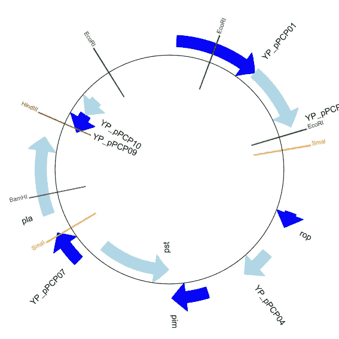
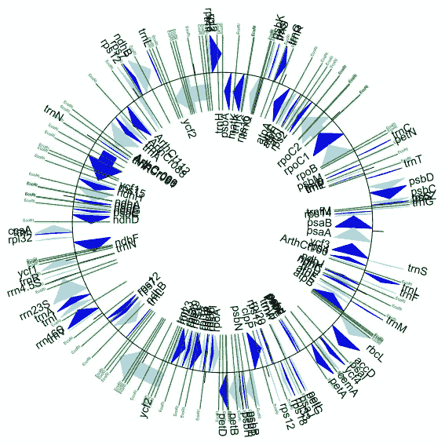
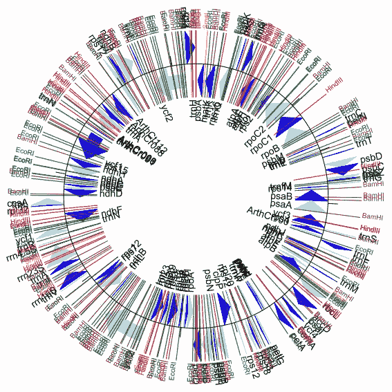
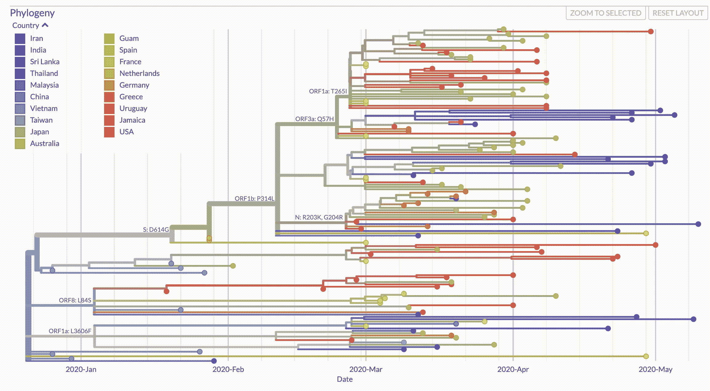

# 科学的艺术

> 原文：<https://towardsdatascience.com/the-art-of-science-7a2ebb72275f?source=collection_archive---------24----------------------->

## [数据科学](https://towardsdatascience.com/data-science/home)

## 创造有洞察力和美丽的生物信息学可视化

有一种误解，认为科学是枯燥的，没有幽默感的，过于技术化的，但事实并非如此！有效的可视化可以将原始 DNA 转化为清晰传达大量信息的惊人图形。

Biopython 是 python 的开源生物信息学或计算分子生物学包。它提供自定义的类和方法，解析标准的生物文件格式，并与其他生物信息学程序接口，如 [BLAST](https://blast.ncbi.nlm.nih.gov/Blast.cgi) 、 [EMBOSS](https://www.ebi.ac.uk/Tools/emboss/) 或 [Clustalw](https://www.genome.jp/tools-bin/clustalw) 。就本文的目的而言，它可以使用生物数据创建惊人的视觉效果。

我们将从 Biopython 处理 DNA、RNA 和蛋白质序列的方法开始。然后，我们可以使用这些方法来提高整个基因组的复杂性，以及这些基因组如何通过系统进化树可视化随时间变化。这一过程将允许你探索任何你感兴趣的基因组，并开始从原始数据中获得洞察力！

# 顺序

Biopython 有一个 Seq (Sequence)基类，类似于基本的 Python string 类，但是增加了一些方法来方便相关的生物学用例。例如，我们可以载入 DNA 序列。

```
>>> my_sequence = Seq('AGTCC')
```

我们可以对这个对象使用传统的字符串方法，比如迭代字符串中的每个字母，或者使用 len()获得字符串的长度。

```
# Print length
>>> print(len(my_sequence))
5# Print each basepair in the sequence
>>> for basepair in my_sequence:
>>>     print(basepair)
A
G
T
C
C
```

我们也可以通过它们的索引来选择碱基对，并正常地对序列进行切片。**切片会返回一个新的 Seq()对象**，可以存储在一个新的变量中，也可以覆盖原来的序列。

```
# Select basepair by index
>>> my_sequence[2]
'T'# Slice sequence (returns a new Seq() object)
>>> my_sequence[1:4]
Seq('GTC')
```

现在我们将看看 Seq()类中一些更有趣和生物学上有用的方法。我们可以很容易地生成 DNA 序列的互补和反向互补，并计算出序列中 G 和 C 碱基对的比例。

## **补码**

当 DNA 被复制时，每条链都被分离出来，用来构建另一条链。腺嘌呤(A)和胸腺嘧啶(T)是互补的，鸟嘌呤(G)和胞嘧啶(C)是互补的。所以一个“ACTG”序列会有一个互补的“TGAC”序列。在 RNA 中，碱基尿嘧啶(U)被用来代替胸腺嘧啶(T ),因此在转录过程中读取的“ACTG”DNA 序列将产生“UGAC”的 RNA 序列。

```
>>> my_sequence = Seq('AGTCC')# Generate complement sequence 
>>> my_sequence.complement()
Seq('TCAGG')
```

## 反向补码

在转录过程中，DNA 实际上是从运行 3’→5’的**模板链**中读取的，反向互补给出了 mRNA 序列。然而，我们通常从运行 5’→3’的**编码链**中分析 DNA。

虽然生物过程实际上是两步走的，首先是模板链的反向互补，然后转录成 RNA。我们可以简化这个过程，从编码链开始，用 T 碱基对代替 u 碱基对。

```
# Generate reverse complement sequence
>>> my_sequence.reverse_complement()
Seq('GGACT')# Two step solution from template strand
>>> coding_strand = Seq('ATGTAG')
>>> template_strand = coding_strand.reverse_complement()
>>> template_strand.reverse_complement().transcribe()
Seq('AUGUAG')# From coding strand
>>> coding_strand = Seq('ATGTAG')
>>> coding_strand.transcribe()
Seq('AUGUAG')
```

## 气相色谱含量

Biopython 还能够计算 DNA 或 RNA 序列中 GC 碱基与 AT(或 U)碱基的比例。这在生物学上是相关的，因为 GC 含量在物种之间是不同的，因此它可以用于根据已知物种的 GC 含量来鉴定未知基因组。

在基因组中，编码区(通常是基因)通常比非编码区具有更高的 GC 含量。因此，GC 含量可用于鉴定未知基因组中的基因。

```
# Calculate GC proportion
>>> from Bio.SeqUtils import GC
>>> GC(my_sequence)
60.0
```

## 翻译

既然我们已经从 DNA 中生成了 mRNA，我们需要翻译成真正的蛋白质序列！与转录非常相似，Biopython 提供了几种方法来实现这一点，要么是生物学上正确的方法，要么是从编码链 DNA 中更有效地实现。

```
# In the biologically correct way after creating the mRNA sequence
>>> mRNA = Seq('AUGGCCAUUGUA')
>>> mRNA.translate()
Seq('MAIV')# From the coding strand directly
>>> coding_strand = Seq('ATGGCCATTGTA')
>>> coding_strand.translate()
Seq('MAIV')
```

值得注意的是，不同的分类组需要不同的表来正确地从 mRNA 合成蛋白质序列。点击这里查看 [NCBI 遗传密码资源](https://www.ncbi.nlm.nih.gov/Taxonomy/Utils/wprintgc.cgi)。关键字参数可以在。translate()方法-。例如，translate(table = "脊椎动物线粒体")。

# 基因组数据

既然我们已经了解了序列如何在 Biopython 中工作，让我们进入一个更高的层次，并尝试可视化整个基因组。有一个叫做 GenomeDiagram 的模块，专门用于在线性或圆形图中可视化基因组(对于大多数原核生物)。

Biopython 有几个示例基因组，可以从 GitHub 下载。感兴趣的基因组也可以从 NIH 基因序列数据库 GenBank 下载，有多种文件格式(如。gbk 或者。fasta)。

```
# Import Libraries
from reportlab.lib import colors
from reportlab.lib.units import cm
from Bio.Graphics import GenomeDiagram
from Bio import SeqIO
from Bio.SeqFeature import SeqFeature, FeatureLocation# Read in our genome
record = SeqIO.read("NC_005816.gb", "genbank")gd_diagram = GenomeDiagram.Diagram(record.id)
gd_track_for_features = gd_diagram.new_track(1, name="Annotated Features")
gd_feature_set = gd_track_for_features.new_set()# We can color code every other gene for clarity
for feature in record.features:
    if feature.type != "gene":
        # Exclude this feature
        continue
    if len(gd_feature_set) % 2 == 0:
        color = colors.blue
    else:
        color = colors.lightblue
    gd_feature_set.add_feature(
        feature, sigil="ARROW", color=color, label=True, label_size=14, label_angle=0)# We can add in restriction sites for some popular enzymes 
for site, name, color in [
    ("GAATTC", "EcoRI", colors.green),
    ("CCCGGG", "SmaI", colors.orange),
    ("AAGCTT", "HindIII", colors.red),
    ("GGATCC", "BamHI", colors.purple)]:
    index = 0
    while True:
        index = record.seq.find(site, start=index)
        if index == -1:
            break
        feature = SeqFeature(FeatureLocation(index, index + len(site)))
        gd_feature_set.add_feature(
            feature,
            color=color,
            name=name,
            label=True,
            label_size=10,
            label_color=color)
        index += len(site)# Create our diagram!
gd_diagram.draw(
    format="circular",
    circular=True,
    pagesize=(20 * cm, 20 * cm),
    start=0,
    end=len(record),
    circle_core=0.5)# Can save to any standard photo format
gd_diagram.write("plasmid_circular_nice1.png", "PNG")
```

现在我们可以开始制作一些漂亮的可视化效果了！这里我们看到了鼠疫耶尔森氏菌生物变种田鼠的基因组，这是一种作为疫苗开发的淋巴腺鼠疫无毒菌株。基因以蓝色和浅蓝色显示，限制性酶位点用彩色线标出。



作者图片

可视化一个更复杂的基因组，一个水芹(*拟南芥*)叶绿体，显示出更多的基因和几十个 EcoRI 限制性位点。这个基因组有 154478 个碱基对，而上面只有 9609 个碱基对。


[图片](https://en.wikipedia.org/wiki/Arabidopsis_thaliana#/media/File:Arabidopsis_thaliana.jpg)由 [Brona](https://en.wikipedia.org/wiki/User:Brona) 在[维基百科](https://en.wikipedia.org/wiki/Main_Page)上以 [CC BY-SA 3.0](http://creativecommons.org/licenses/by-sa/3.0/) 授权提供。

这是一种水芹。它是遗传学中的模式生物。因此，我们可以使用与上述相同的基本代码从 GenBank 中指定基因组，以生成环状 DNA 序列。

```
# Specify the thale cress chloroplast genome
record = SeqIO.read("NC_000932.gb", "genbank")...# Only including the EcoRI sites (green)
for site, name, color in [("GAATTC", "EcoRI", colors.green)]:

    ... 
```



作者图片

这大概是一个基因组能够以任何清晰的方式呈现信息的最复杂程度了。但是，它也很有视觉冲击力。事实上，如果我们回去添加更多的限制性酶位点，就像我们在第一个基因组中所做的那样，我们会得到一个更加美丽的图像。

```
...for site, name, color in [
    ("GAATTC", "EcoRI", colors.green),
    ("CCCGGG", "SmaI", colors.orange),
    ("AAGCTT", "HindIII", colors.red),
    ("GGATCC", "BamHI", colors.purple)]:...
```



作者图片

# 发展史

现在我们已经从原始 DNA 序列到完整的基因组，我们知道基因组并不像我们希望的那样稳定。突变很频繁，尤其是在病毒中。开发病毒疫苗的一个主要困难是它们频繁变化的基因组。

我们可以通过比较新序列和基本序列来追踪变异是如何随着时间的推移而产生的。对于新型冠状病毒(新冠肺炎)病毒，碱基序列是来自中国武汉的初始毒株。

使用另一种可视化系统发育的工具， [Nextstrain](https://nextstrain.org/sars-cov-2/) 有几个软件包，允许公共卫生官员和研究人员分析当地社区的新冠肺炎新菌株。然后，您可以为各种特征构建动画视觉效果，例如突变数量、原产国、基因型、分支等。

你可以遵循这个[指南](https://nextstrain.github.io/ncov/setup)来创造你自己的新冠肺炎发展史。您将需要为 Nextstrain 创建一个新的 conda 环境(在指南中有介绍),因为您将下载许多依赖项。



1-5 月 SARS-cov-2 的系统发育。用 [Nextstrain 的 Auspice 可视化工具](https://nextstrain.org/sars-cov-2/)生成。作者 GIF。

# 结论

Biopython 是 python 中生物信息学的基础包。我希望这篇文章已经让我们领略了它在分析序列、转录和翻译 DNA → mRNA →蛋白质序列、可视化整个线性和环形基因组以及可视化染色体方面的作用。将来我可能会发布更多利用 Biopython 的文章。

Biopython 拥有大量的文档，并能够通过 FASTA 文件利用 NCBI 资源，如完整基因组、变异菌株基因组和染色体。因此，玩玩感兴趣的基因组，看看你能做什么！你可能最终会得到一个有效的、令人惊叹的可视化效果。

# 连接

我一直在寻找连接和探索其他项目！你可以在 [GitHub](https://github.com/ArenCarpenter) 或 [LinkedIn](https://www.linkedin.com/in/aren-carpenter/) 上关注我，并在[媒体](https://arencarpenter.medium.com/)上查看我的其他故事。我也有一个[推特](https://twitter.com/ArenCarpenter)！