# 机器学习的 Sprezzatura 艺术

> 原文：<https://towardsdatascience.com/the-art-of-sprezzatura-for-machine-learning-e2494c0db727?source=collection_archive---------16----------------------->

## [模型可解释性](https://towardsdatascience.com/tagged/model-interpretability)

## 构建可解释模型概述


[卡兰·泰勒](https://karltayloreducation.com/class/simple-food-photography-setup-croissant/)

[Sprezzatura](https://constantrenewal.com/sprezzatura/) 是一门让事物看起来自然而精致的艺术。在上图中，Karan 小心翼翼地让羊角面包看起来很自然。同样，将机器学习模型转化为少量规则也需要努力。相反，数据科学家建立了 107 个模型的复杂集合，以赢得网飞推荐内容。我们看到深度学习模型[拥有 100%的准确率](https://www.datarobot.com/blog/data-science-fails-if-it-looks-too-good-to-be-true/)，当仔细检查时，它们充满了方法上的缺陷。

这篇文章试图将 sprezzatura 的艺术应用于机器学习。除了获得风格，您的模型将更容易理解，被广泛采用，并且易于部署。

这篇文章的大部分评估了可解释模型的四种通用方法，从最灵活和精确的方法开始，到最简单的方法。其中一些接近黑盒 AutoML 集合模型的性能！这些方法包括 rulefit 算法、GA2M(广义加法模型加交互)算法、规则列表算法和记分卡方法。成人数据集被用作基准。最终结果的一个潜在峰值显示在该图中。

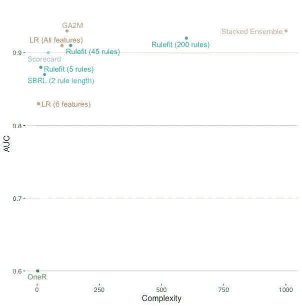

作者图片

**剧透警告:**其中两种可解释的方法与由 20 个独立模型组成的叠加系综 AutoML 模型的结果相同或略低！

该职位的结构:

*   为什么要使用可解释的模型
*   构建基线模型
*   规则拟合算法
*   GA2M 算法
*   规则集模型
*   记分卡模型

我写这篇文章的动机是作为一名长期关注模型可解释性和可解释性的数据科学家。你也可以在圣路易斯机器学习和数据科学会议上找到这个演讲的视频。您还可以访问笔记本，在 [rulez Github](https://github.com/rajshah4/rulez) 中可以找到运行这些可解释模型的完整代码。

# 为什么要使用可解释的模型

大多数数据科学家都不熟悉可解释的模型。[它们被定义为](https://arxiv.org/pdf/1811.10154.pdf)建模方法的子集，强调特征的稀疏性和理解这些特征如何相互作用以产生预测的能力。因此，这些模型更容易调试，非技术业务利益相关者和监管者也更容易信任它们。另一个意想不到的好处是，更简单的模型通常更容易操作！

构建模型涉及几个步骤，包括问题设置、标注数据、特征工程、特征选择、算法选择和实施。这篇文章(以及许多数据科学文献)关注的是算法选择。实际上，构建可解释的模型和解决方案需要这里提到的所有步骤，而不仅仅是选择正确的算法。例如，多重共线性对模型的可解释性有很大的影响。因此，虽然这篇文章关注的是算法选择，但让我们指出模型选择只是解决方案的**部分**。

阅读学术文章，你会认为算法选择是数据科学家工作的主要焦点。这种工作流强调通过预测准确性衡量的增量改进。类似地，Kaggle 风格的模型比赛强调通过提高准确性来获胜，然而，轻微的改进。虽然准确性无疑是重要的，但其他问题，如可解释性，也会受到影响。

首先，最精确的模型通常在企业环境中不可用。赢得 T4 100 万美元网飞竞赛的模特是其他 107 个模特的组合。虽然这个模型在准确性上是最好的，但对网飞来说太复杂了，难以实现。

其次，这些复杂的模型很难解释。实际上，这意味着受模型影响的涉众不信任他们不理解的模型。在受监管的企业中，模型风险管理团队的重点是管理机器学习模型的风险，他们拒绝批准复杂的模型。太多的失败可以归咎于黑盒模型，这些模型后来被发现有简单的缺陷，如[目标泄漏](https://changelog.com/practicalai/109)。最后，在数据移动的情况下，复杂的模型可能是脆弱的和不可用的。当数据转移成为一个问题时，可理解的模型更容易诊断和修改。

另一种选择是从一个[可解释的模型](https://arxiv.org/abs/2103.11251)开始。让我们考虑一个实际问题，然后应用可解释的模型。

# 问题:预测收入

让我们使用来自 UCI 的成人数据集直接比较复杂和简单的方法。这是一个[公共领域数据集](https://www.kaggle.com/uciml/adult-census-income)，用于根据人口统计和税收信息预测收入。该数据集包含超过 30，000 个观察值，并且包含连续特征和分类特征的混合。这些特征具有共线性和交互作用。其大小和复杂性类似于企业环境中的许多表格数据集。

# 基线模型

第一步是建立几个基线模型。这是建模时的一个重要步骤(有时会被忽略)。基线让你更好地理解你在一个模型中有多少信号，什么特征是重要的，以及其他算法提供了多少提升。所有这些都是有用的数据点，可以帮助您理解应该投入多少精力来改进您的模型。

当您开始计算您的基线时，您应该已经对最终模型的需求有了一些期望。您的业务合作伙伴应该帮助您了解为组织带来价值所需的预测性能、围绕部署的要求以及模型审查过程的严格程度。

首先，我将使用三种不同的算法作为基线。是的，三个！都有不同的用途，都用好就好。它们是逻辑回归、自动堆叠集成和 OneR 基于规则的模型。

## 逻辑回归

用成人数据集预测收入是一个分类问题。我建议基线模型的合适起点是逻辑回归模型。逻辑回归的加法性质很容易理解，并为我们提供了一个众所周知的与其他算法进行比较的基准。

对于这个数据集，我使用[开源 H2O 包](https://www.h2o.ai/products/h2o/)用几个命令构建了一个逻辑回归(LR)模型:

```
glm_model = H2OGeneralizedLinearEstimator(family= "binomial", lambda_ = 0, compute_p_values = True, remove_collinear_columns = True)
glm_model.train(x, y, training_frame= train, validation_frame=valid)
```

我构建了两个模型，一个是仅使用数字特征的非常简单的逻辑回归，另一个是使用分类和数字特征的更复杂的逻辑回归。在这种情况下，添加分类特征确实明显改善了模型。

模型结果:

*   LR (6 个数字特征):AUC 为 0.83 的逻辑回归模型。
*   LR (6 个数字和 6 个分类特征):分类特征的一个热编码导致 100 个逻辑回归模型的预测值，AUC 为 0.91。

逻辑回归模型通常被认为是容易理解的，并且被广泛认为是非常容易解释的。这些系数可以一起用于计算预测。这种透明度是 LR 在受监管行业中被广泛接受的一个重要原因。

逻辑回归模型的透明性经常导致人们认为它是一个容易理解的模型。然而，情况并非总是如此。添加大量要素，尤其是存在多重共线性时，会使理解逻辑回归模型变得非常困难。Poursabzi-Sangdeh 的研究发现，从 2 个特征增加到 8 个特征对模型的可理解性有显著影响。因此，虽然系数是有帮助的，但当目标是一个容易理解的模型时，它们不是灵丹妙药。

## 自动堆叠系综

AutoML 允许我们快速比较不同类型的特征工程和算法。我用 H2O 的汽车制造了一个挑战者。

```
aml = H2OAutoML(max_models=20, seed=1)
aml.train(x=x, y=y, training_frame=train)
```

模型结果:

*   AutoML H2O:最佳模型是所有 20 个模型的叠加组合，AUC 为 0.93。

这是一个非常精确但复杂的结果。一个由 20 个模型组成的堆栈集合包含了每一个预测的数万个决策点。虽然解释方法可以让您很好地理解模型可能会做什么，但大多数模型风险评估都无法通过这种方法。这简直太复杂了。然而，这给了我们一些预测性能上限的概念。

## 无比的人

[OneR](https://christophm.github.io/interpretable-ml-book/rules.html#learn-rules-from-a-single-feature-oner) 使用一个特征建立一个模型。它非常容易理解，也非常简单。它基本上是[只有一个分支的决策树](https://christophm.github.io/interpretable-ml-book/rules.html#learn-rules-from-a-single-feature-oner)。该模型通过查看所有特征并为最终模型选择一个特征来工作。你可以找到 R 和 [python](https://csinva.io/imodels/rule_list/one_r.html) 的 [OneR 的多种实现。](http://ackages/OneR/index.html)

```
from imodels import OneRClassifier,clf = Pipeline(steps=[('preprocessor', preprocessor),
                      ('classifier', OneRClassifier())])
clf.fit(X_train, y_train)
```

在成人数据集上运行这个给了我们一个简单的规则:

> 如果资本收益大于 5178 美元，那么这个人极有可能是高收入人群。

该模型比随机模型好，但比我们的其他基线模型差，AUC 为 0.60。OneR 是一个很好的检查基准，可以防止目标泄漏。在某些情况下，您可能会从一个特性中发现足够的启发，部署一个简单的规则比部署一个更复杂的模型更有用。

## 基线摘要

在特征数量、模型复杂性和预测性能之间的权衡应该是相当明显的。

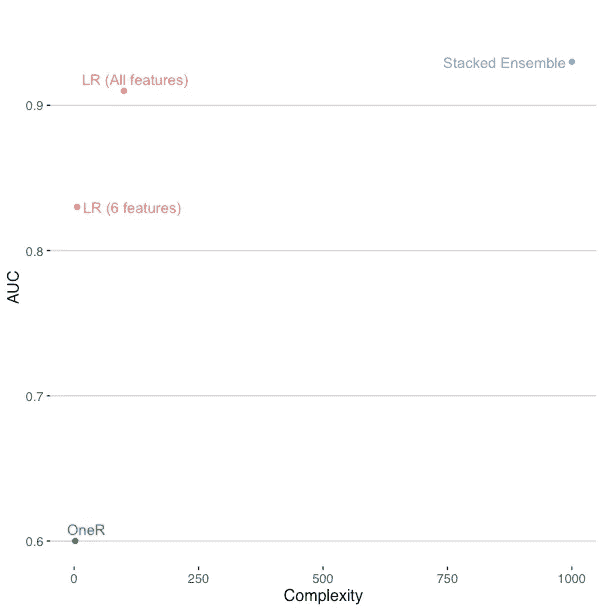

作者图片

这里的复杂性是一个说明性的数字，近似于模型中参数的数量。它旨在强调 OneR 与堆叠 AutoML 系综在复杂性上的差异。这使我们能够更好地理解提高预测性能和最终模型的复杂性之间的矛盾。

OneR 结果确定了不止一个特征是必要的。分别运行仅具有数字和分类特征的模型，很明显数字和分类数据都提供了有用的信号。当我们考虑用不同的方法来表示这些特性以及什么样的模型类型工作得最好时，这变得很重要。最后，我们看到复杂的算法和集成确实增加了一些提升。这暗示了数据中的一些复杂性，这些复杂性是我们当前的特征集所没有捕捉到的。这些线索可能会本能地促使数据科学家使用复杂的方法来解决问题。然而，让我们考虑一些更容易理解、部署和维护的替代方法。

# 规则匹配

[Friedman 和 Popescu (2008)](https://arxiv.org/abs/0811.1679) 的 RuleFit 算法是一个可解释的模型，能够提供高预测性能以及可理解的规则。它非常容易使用，并且有许多可用的实现。rulefit 算法创建一组重叠的规则。

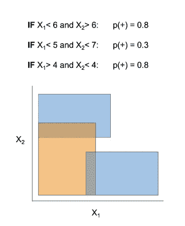

[钱丹·辛格—伊莫德尔斯](https://github.com/csinva/imodels)

H2O 最近增加了一个 rulefit 的[实现，它很快成为我的最爱。让我们从使用 5 条规则构建一个简单的模型开始。](https://docs.h2o.ai/h2o/latest-stable/h2o-docs/data-science/rulefit.html)

```
from h2o.estimators import H2ORuleFitEstimator# Build and train the model:
rfit = H2ORuleFitEstimator(max_num_rules=5,seed=1,
                           model_type='rules')
rfit.train(training_frame=train, x=x, y=y,validation_frame=valid)
```

接下来让我们向您展示模型创建的规则:

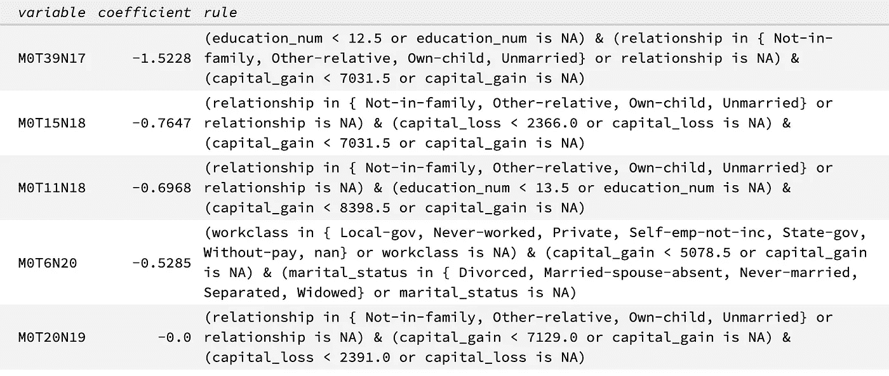

与逻辑回归模型类似，对于给定的预测，您需要确定与该预测相关的系数/规则。例如，当受教育少于 13 岁，资本收益少于 7031 美元，并且关系不是家庭内，其他亲属，自己的孩子，未婚时，上面的规则适用。这是在成人数据集中预测某人低收入的最强规则。

这个型号的性能不是很好。具有 5 个规则的 rulefit 在测试集上获得了 0.80 的 AUC 性能。可能的问题是，rulefit 是一种决策树方法，这意味着它会在连续数据中创建拆分。看看这些规则，你会发现其中既有绝对规则，如关系规则，也有连续规则，如资本收益规则。用五条规则，真的很难捕捉到那些连续的特征。

H2O 实现的一个很好的额外特性是将线性模型与决策树结合起来构建规则。这结合了两种模型的优势，使用了随着决策树不断变化的线性关系，决策树在宁滨和交互方面非常有效。通过加入线性成分，这是一个具有 5 条规则的规则拟合模型，实现了 0.88 的 AUC。

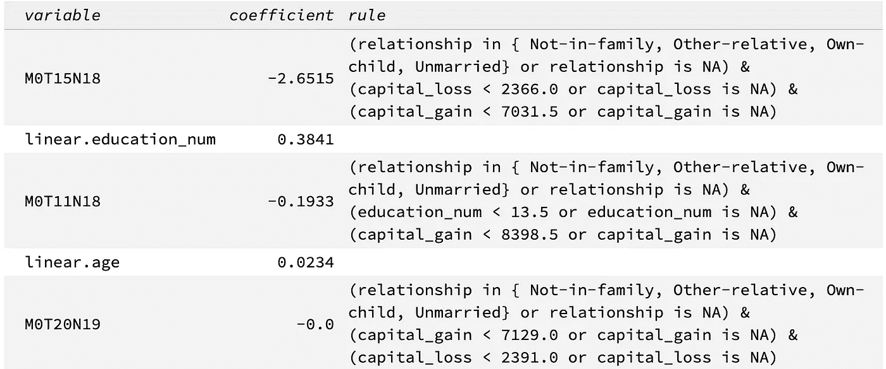

规则匹配结果，按作者排序的图像

线性规则很容易理解。例如，随着受教育程度和年龄的增加，预测高收入的概率也会增加。

这加强了这个数据集有很强的线性效应。通过添加线性效果，性能从 0.80 跃升至 0.88。任何只依赖少数决策树的方法都将在性能上受到限制。接下来，让我们改变规则的数量，并评估它们如何影响模型的性能。以下是一些结果:

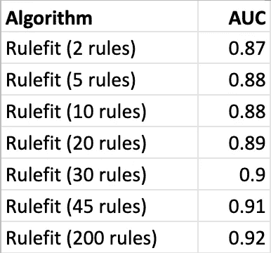

作者图片

为了说明 Rulefit 的灵活性，我绘制了一系列具有 AUC 和复杂性的模型。OneR 的复杂度为 2，而具有 100 个预测器的 LR 的复杂度为 100。对于 Rulefit 模型，复杂性是规则数乘以 3(因为每个规则允许三个特征)。

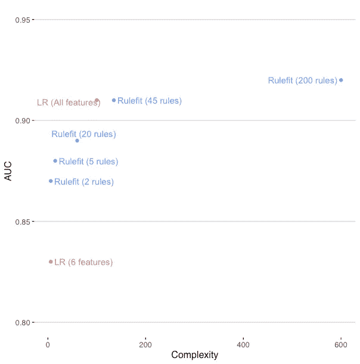

作者图片

总之，H2O 的规则拟合通过使用决策树和线性关系提供了很大的灵活性。虽然使用大量规则可以让您获得非常高的预测性能，但是重叠的规则使得理解任何单个预测变得更加困难。这使得跟踪预测或诊断模型问题变得更加复杂。让我们考虑另一种开发稀疏模型的方法，这种模型仍然提供良好的预测性能。

# GA2M

[广义加性模型(GAM)](https://multithreaded.stitchfix.com/blog/2015/07/30/gam/) 是一个可解释的模型，与逻辑回归模型一样透明，但可以更精确。一个 [GA2M 模型](https://www.cs.cornell.edu/~yinlou/papers/lou-kdd13.pdf)是一个包含了交互项的 GAM。这个相互作用项的加入通常提高了预测性能。

我在 DataRobot 工作时了解到 GA2M 模型，它有一个优秀的实现。GA2M 的开源实现可以在微软的 [interpretML 包](https://interpret.ml/docs/ebm.html#)中获得。让我们用成人数据集来探索这个问题。拟合模型很简单:

```
ebm = ExplainableBoostingClassifier(random_state=42)
```

查看带有成人数据集的模型对象，您将看到以下功能列表:

```
ebm.feature_names[‘age’, ‘workclass’, ‘fnlwgt’, ‘education’, ‘education_num’, ‘marital_status’, ‘occupation’, ‘relationship’, ‘race’, ‘sex’, ‘capital_gain’, ‘capital_loss’, ‘hours_per_week’, ‘native_country’, ‘relationship x hours_per_week’, ‘age x relationship’, ‘marital_status x hours_per_week’, ‘occupation x hours_per_week’, ‘education_num x occupation’, ‘age x capital_loss’, ‘fnlwgt x education_num’, ‘education x capital_loss’, ‘age x fnlwgt’, ‘occupation x relationship’]
```

GA2M 创建并选择一些交互特征用于模型中，例如“年龄 x 关系”。这个选择很有价值。我经常检查 GA2M 用来理解我的数据集的交互方式。即使我的最终模型不会是 GA2M，它仍然对识别交互非常有用。

对于成人数据集，这些交互特征提供了性能提升，AUC 为 0.93。**这个真好！**这与堆叠系综模型不相上下。

结果模型是透明的，所有系数都可用。甚至可以把一个[等级表](https://github.com/interpretml/interpret/issues/269)放在一起，列出一个因素的每个级别的系数因子。InterpretML 包还包括可视化，因此您可以自己看到这一点。这里我们看到婚姻状况的不同系数。

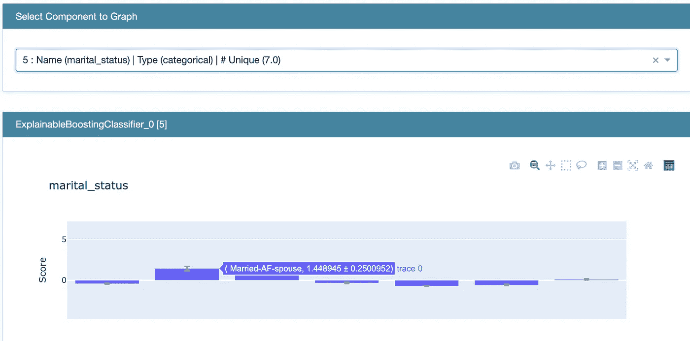

作者图片

总之，GA2M 模型从最好的线性模型开始，但也混合了结合*最佳*交互的能力。找到这些互动并不容易(你们都应该利用这些互动来传达自己对问题的理解)。通过添加这些交互作用，GA2M 通常可以提供非常好的预测性能。GA2M 使用系数和评级表是众所周知的做法，在模型风险管理实践和监管要求中被广泛接受。

# 规则列表

rulefit 算法依赖于重叠的规则集。这意味着几个规则可以影响一个预测。相比之下，规则列表被约束为没有任何重叠的规则。非重叠规则的优点是每个预测都可以追踪到一个规则。这使得结果非常容易理解。

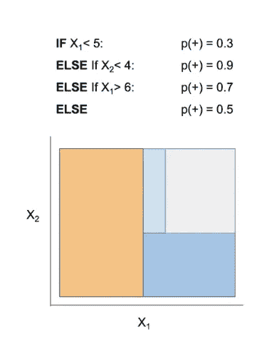

钱丹·辛格—伊莫德尔斯

构建规则列表模型在计算上可能是昂贵的。规则列表还绑定了连续的特征，因此线性关系可能很难合并到规则中。最后，规则列表的当前实现限于分类问题。

实现规则列表的一个很好的起点是可解释的机器学习模型包[(imodels)](https://github.com/csinva/imodels)。我从一个众所周知的方法开始，[certified Optimal RulE ListS](https://github.com/corels/corels)(CORELS)，但是在我的 Python 3.7+环境中安装时遇到了问题，而且它太慢了，只能在成人数据集上构建非常基本的规则列表。

我发现[可扩展贝叶斯规则列表](https://arxiv.org/abs/1602.08610)方法工作得更快。这只是一个过时的 R 包。我的测试使用成人数据集及其分类特征，以及 15，000 行的训练数据集。

```
sbrl_model <- sbrl(data_train, iters=30000, pos_sign="1",
                   neg_sign="0", rule_minlen=1, rule_maxlen=1, 
                   minsupport_pos=0.003, minsupport_neg=0.003, 
                   lambda=10.0, eta=1.0, nchain=10)
print(sbrl_model)
```

使用 rule_maxlen=1 运行这段代码只需要几秒钟。结果如下:

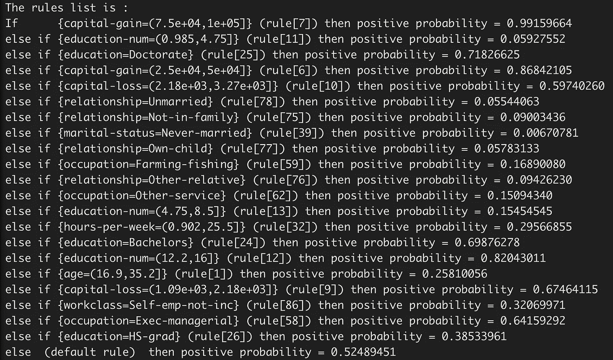

结果是按顺序读取的非重叠规则。这意味着任何人都可以识别哪个规则适用于他们的预测。理解任何预测的结果都会变得容易得多。

规则列表模型的 AUC 为 0.86，比 rulefit 发现的 5 个规则的 AUC 0.80 有了显著提高。然而，为了找到这个更好的解决方案，计算这个最佳规则集需要额外的计算。可以通过将 SBRL 模型的最大规则长度增加到 2 来提高性能。这将性能提高到 0.87 AUC。这确实会导致更复杂的规则:

> 如果{教育人数=(4.75，8.5)，婚姻状况=已婚公民配偶}，则正概率= 0.14173228

增加最大规则长度会增加搜索空间。移动到 2 的嵌线长度需要更长的计算时间。在我的笔记本电脑上无法计算规则长度 3。

这些规则的非重叠性对于部署期间的互操作性、错误检测和问题诊断来说是一个巨大的优势。但是请记住，计算这些规则是复杂的。然而，这些规则的简单性意味着它们在预测性能上往往落后于现代算法。

# 记分卡

一种常见的可解释的决策方法是使用记分卡。记分卡允许许多功能，预测分数基于简单的求和。它们非常容易使用，常见于医疗保健和刑事司法等领域。

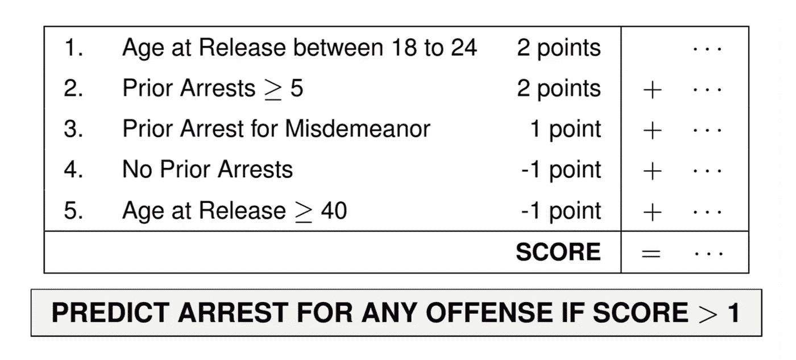

作为记分卡的累犯预测的可解释模型。"[优化的评分系统:医疗保健和刑事司法领域对机器学习的信任](https://users.cs.duke.edu/~cynthia/docs/WagnerPrizeCurrent.pdf)"接口 48，5 号(2018):449–466。

从机器学习中开发最佳记分卡在计算上具有挑战性。一个众所周知的技术是使用[超解析线性整数模型(SLIM)](https://arxiv.org/abs/1502.04269) 。在这篇文章中，我使用了 [OptBinning 包](http://gnpalencia.org/optbinning/scorecard.html)中的记分卡函数。记分卡的分数范围从最低收入概率的 0 到最高收入概率的 100。

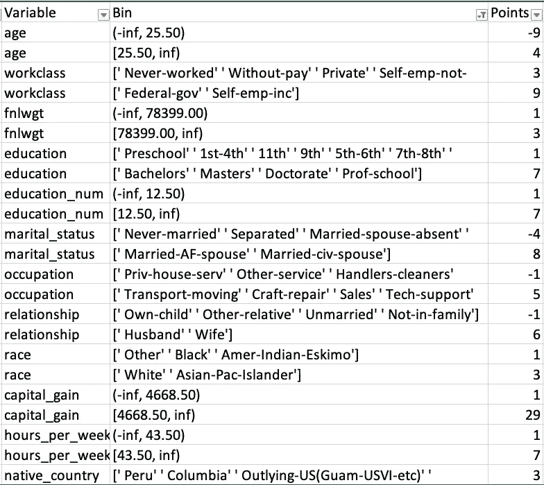

作者图片

相当简单的记分卡得出的 AUC 为 0.89。该模型非常接近使用所有特征(100 个预测值)的逻辑回归。然而，记分卡比逻辑回归系数更容易解释和部署。如果可解释性非常重要，记分卡方法非常有效。

# 后续步骤

为了提供一个总体视图，下面是预测性能与复杂性的结果和图表。重要的是要理解每种技术，rulefit、GA2M、规则列表和记分卡，都有其独特的权衡。我在 rulez githu b repo 上分享了代码，所以你可以全部尝试并做出相应的选择。

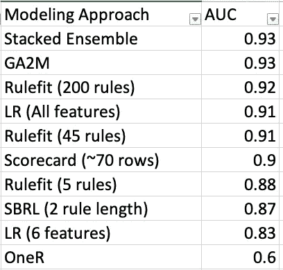

我希望这篇文章能给你的机器学习增加一点活力。花点时间去理解你的问题，处理你的数据，看看它是否适合一个更简单的可解释的模型。

有比这篇文章更广泛的可解释模型。还有其他流行的可解释模型，如贝叶斯方法，提供了预测的不确定性。超越[莫尔纳尔的可解释性论文](https://christophm.github.io/interpretable-ml-book/)的一个很好的起点是钱丹的 [imodels](https://github.com/csinva/imodels) 包，它包含了许多不同方法的样本。

我收到了许多人的反馈，包括乔纳森·达尔伯格、泰勒·拉金、钱丹·辛格、迈尔斯·阿德金斯、戴夫·海尼克和尼尚特·甘地。所以非常感谢他们所有人。

你也可以在推特[或 LinkedIn](https://twitter.com/rajcs4) 上关注我，并在我的项目网站上找到[以前的博客文章。](http://projects.rajivshah.com/blog/)