# 你要找的关于 PCA 和 LDA 的文章！！

> 原文：<https://towardsdatascience.com/the-article-on-pca-and-lda-you-were-looking-for-d234e03412f5?source=collection_archive---------24----------------------->

## *直觉、基础数学和更多…*

由 [Chandan Durgia](https://medium.com/u/25a92c29cc1?source=post_page-----d234e03412f5--------------------------------) 和 [Prasun Biswas](https://medium.com/u/1454a5b0169f?source=post_page-----d234e03412f5--------------------------------) 撰写

来源:Unsplash 来自 [Devin Avery](https://unsplash.com/@devintavery)

说实话，随着 AI/ML 世界的日益民主化，这个行业中的许多新手/有经验的人都操之过急，缺乏底层数学的一些细微差别。

这也很容易理解。AI/ML 世界对任何人来说都是势不可挡的，原因有很多:

a.一个人必须学习不断发展的编码语言(Python/R)，大量的统计技术，并最终理解这个领域。

b.人工智能/人工智能技术的发展速度令人难以置信。最近在某处读到，每天都有大约 100 篇 AI/ML 研究论文发表。

c.如果你没有特定的背景，基础数学可能会很难。不幸的是，这不适用于像神经网络等复杂的主题。对于回归、分类问题、降维等基本概念也是如此。

通过这篇文章，我们打算至少一劳永逸地选择两个广泛使用的主题:

-主成分分析

-线性判别分析

这两个主题都是“降维技术”，并且有一些相似的数学基础。我们之前在一篇单独的文章中已经介绍过 t-SNE(**)。**

**当人们想到降维技术时，有几个问题会出现:**

**a)为什么要降维？降维是什么意思？**

**b)线性代数与降维有什么关系？**

**c)为什么我们需要做线性变换？**

**d)特征值和特征向量与降维有什么关系？**

**e)根据变换的级别，是否可能有多个特征向量？**

**f)LDA 和 PCA 的目标有何不同，它如何导致不同的特征向量集？**

**g)除了我们讨论的内容之外，PCA 还有其他内容吗？我们要选择所有的主要成分吗？**

**h)除了使用散布矩阵之外，LDA 的计算类似吗？**

**I) PCA 与 LDA 的主要区别？什么时候该用什么？**

**还有更多…**

**我们试图用最简单的方式回答这些问题。如果您觉得任何特定的概念需要进一步简化，请随时回复这篇文章。**

**让我们开始吧。**

*****A)* *为什么要降维？降维是什么意思？*****

**当数据科学家处理具有大量变量/特征的数据集时，有几个问题需要解决:**

**a)由于要执行的功能太多，代码的性能变得很差，特别是对于像 SVM 和神经网络这样需要很长时间训练的技术。**

**b)许多变量有时不会增加多少价值。**

**降维是一种用于减少独立变量或特征数量的方法。**

**下图描绘了我们练习的目标，其中 X1 和 X2 概括了 Xa、Xb、Xc 等的特征。**

**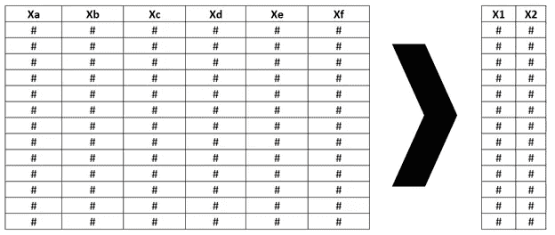**

**作者图片**

*****B)线性代数与降维有什么关系？*****

**人们可以把这些特征看作是坐标系的维度。**

**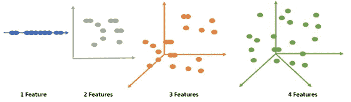**

**作者图片**

***4 功能图是说明性的**

**虽然目标是减少特性的数量，但这不应该以降低模型的可解释性为代价。即自变量可以解释多少因变量。因此，应该通过以下约束来减少维度——“数据集中各种变量的关系不应受到显著影响。”**

**这就是线性代数介入的地方(深呼吸)。简而言之，线性代数是一种从各种角度看待坐标系中任何数据点/向量(或数据点集)的方法。**

**我们来解码一下。**

**考虑 A 点和 B 点为(0，1)，(1，0)的坐标系。现在，为了从不同的透镜(坐标系)可视化该数据点，我们对坐标系进行以下修正:**

**a)旋转**

**b)拉伸或挤压**

**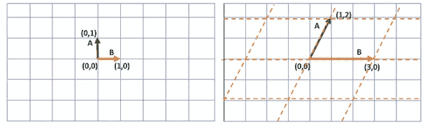**

**作者图片**

**正如你在上面看到的，新的坐标系被旋转了一定的角度并被拉伸。请注意，它仍然是相同的数据点，但我们改变了坐标系，在新的坐标系中，它位于(1，2)，(3，0)。**

**如果仔细分析，两种坐标系都具有以下特征:**

**a)所有线路保持线路状态。即曲线中的线条没有变化。**

**b)原点(0，0)保持不变。**

**c)拉伸/挤压仍然保持网格线平行且间隔均匀。**

**这就是线性代数或线性变换的本质。**

**每当进行线性变换时，它只是将一个坐标系中的向量移动到一个新的坐标系中，该坐标系被拉伸/挤压和/或旋转。**

**其实以上三个特征就是一个线性变换的性质。值得注意的是，由于这三个特征，尽管我们正在移动到一个新的坐标系，*一些特殊向量之间的关系不会改变*，这是我们将利用的部分。**

***有趣的事实*:当你将两个向量相乘时，它具有旋转和拉伸/挤压的相同效果。**

*****C)* *为什么我们需要做线性变换？*****

**线性变换有助于我们实现以下两点:**

**a)从不同的角度看世界，这会给我们带来不同的见解。**

**b)在这两个不同的世界中，可能有某些数据点的特征相对位置不会改变。**

**对于上面的#b，考虑下面有 4 个向量 A、B、C、D 的图片，让我们仔细分析转换给这 4 个向量带来了什么变化。**

**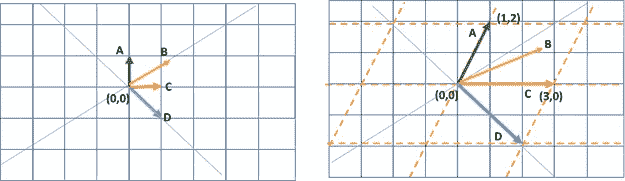**

**作者图片**

**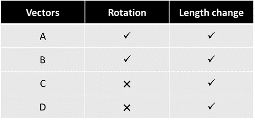**

**作者图片**

**所以，向量 C 和 d 发生了有趣的事情，即使有了新的坐标，这些向量的方向保持不变，只是长度变了。**

**为神奇的部分做好准备！！**

**如果我们能够设法将这个 2 维空间中的所有(大部分)向量(特征)与这些向量之一(C 或 D)对齐，我们将能够从 2 维空间移动到一维空间的直线。**

*****瞧，降维成功！！*****

**这个过程也可以从一个大维度的角度来思考。也就是说，如果我们的数据是 3 维的，那么我们可以将它简化为 2 维的“平面”(或一维的线)，如果我们有 n 维的数据，我们可以将其简化为 n-1 维或更小的维。**

**请注意，在现实世界中，不可能所有矢量都在同一条直线上。因此，对于不在线上的点，取其在线上的“投影”(详情如下)。通过投射这些向量，虽然我们失去了一些可解释性，但这是我们需要为降维付出的代价。同样，可解释性是自变量可以解释因变量的程度。**

*****D)特征值和特征向量与降维有什么关系？*****

**旋转特性不变的这些矢量(C&D)称为本征矢量，这些矢量被缩放的量称为“本征值”。正如您从上面的描述中所看到的，这些是降维的基础，并将在本文中广泛使用。**

**C = 3 的特征值(向量增加了原来大小的 3 倍)**

**D = 2 的特征值(向量增加了原来大小的 2 倍)**

**关键是，如果我们能够定义一种方法来找到特征向量，然后将我们的数据元素投影到这个向量上，我们就能够降低维度。**

**特征向量的关键特征是，它保持在其跨度(线)上，不旋转，它只是改变大小。即，对于任何特征向量 v1，如果我们应用变换 A(旋转和拉伸)，那么向量 v1 仅通过因子λ1 进行缩放。这里λ1 称为特征值。**

**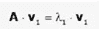**

**E)根据变换的级别，可能有多个特征向量吗？**

**是的，根据变换的级别(旋转和拉伸/挤压)，可能有不同的特征向量。因此，根据我们分析数据的*目标*，我们可以定义转换和相应的特征向量。请注意，练习的“*目标*很重要，这也是 LDA 和 PCA 存在差异的原因。**

*****F)LDA 和 PCA 的目标有何不同，它们如何导致不同的特征向量集？*****

**对于 PCA，目标是确保我们尽可能地捕捉我们的自变量的可变性。在下图中，我们可以看到数据在某个方向上的可变性。请注意，我们的原始数据有 6 个维度。这只是二维空间中的一个说明性的图形。**

**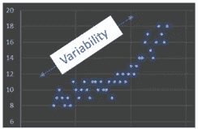**

**作者图片**

**使用协方差矩阵获取多个值的“可变性”度量。在我们的例子中，输入数据集有 6 维[a，f],覆盖矩阵的形状总是(d * d ),其中 d 是特征的数量。**

**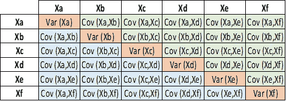**

**作者图片**

**这里，协方差计算如下:**

**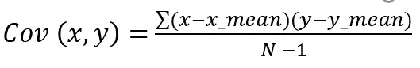**

**其中 N 是观察次数。**

**这就是我们计算特征向量的矩阵。**

**另一方面，线性判别分析(LDA)试图解决“监督”分类问题，其中目标不是理解数据的可变性，而是最大化已知类别的分离。在 LDA 中，协方差矩阵被散布矩阵“替代”,散布矩阵实质上捕捉了“类间”和“类内”散布的特征。**

*****G)PCA 还有比我们讨论的更多的内容吗？我们要选择所有的主要成分吗？*****

**还有一些额外的细节。因此，在这一节中，我们将在我们到目前为止讨论过的基础上进一步深入。**

**那么，让我们将它端到端地分解开来:**

**a.假设数据集包含 6 个要素。如前所述，这意味着数据集可以在 6 维空间中可视化(如果可能)。为了便于说明，我们假设这个空间看起来像:**

**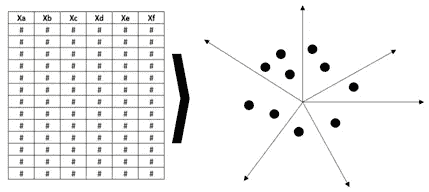**

**作者图片**

**b.为了降低维数，我们必须找到这些点可以投影的特征向量。因为这里的目标是捕捉这些特征的“变化”,所以我们可以计算协方差矩阵，如上面#F 中所描述的。**

**c.现在，我们可以使用下面的公式来计算这个矩阵的特征向量(EV1 和 EV2)。请注意，PCA 是以第一主成分占数据中最大可能方差的方式构建的。然后，因为它们都是正交的，所以一切都是迭代的。**

******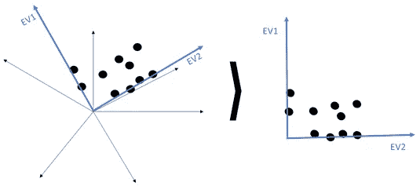**

**作者图片**

***为什么特征向量是垂直的？***

**如果使用的矩阵(协方差矩阵或散布矩阵)在对角线上对称，则特征向量是“实数”和“垂直的(正交)”。否则，特征向量将是“复数虚数”。**

**将任何矩阵转换成对称矩阵的方法是将其乘以其转置矩阵。在后面的部分中，在计算散布矩阵时，我们将使用它将一个矩阵转换成对称矩阵，然后再导出它的特征向量。**

**d.一旦我们从上面的等式中得到特征向量，我们就可以将数据点投影到这些向量上。为了简单起见，我们假设二维特征向量。**

**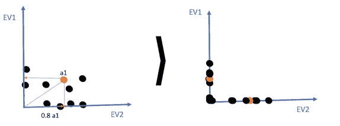**

**作者图片**

**注意，当把一个矢量投影到一条直线上时，它失去了一些可解释性。即，对于上图中的向量 a1，其在 EV2 上的投影是 0.8 a1。这就是主成分被写成单个向量/特征的某个比例的原因。**

****EV1 = PC1 = a1 * 0.8+a2 * 0.9+a3 * 0.78…****

**值得注意的一点是，计算的特征向量之一将自动成为数据的最佳拟合线，而另一个向量将与其垂直(正交)。**

**e.尽管在上面的例子中，为了简单起见，选择了 2 个主分量(EV1 和 EV2)。对于具有 n 个向量的情况，n-1 个或更低的特征向量是可能的。根据练习的目的，用户可以选择考虑多少个主成分。这取决于一个人想要获得多少可解释性。使用碎石图也可以得出同样的结论。**

**Scree plot 用于确定在数据的可解释性中有多少主成分提供了“真实值”。“真实值”意味着添加另一个主成分是否会有意义地提高可解释性。在碎石图上，曲线斜率变平的点(“弯头”)表示分析中应使用的因子数量。**

**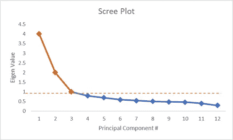**

**作者图片**

*****H)除了使用散布矩阵之外，LDA 的计算类似吗？*****

**与 PCA 不同，LDA 是一种监督学习算法，其目的是对低维空间中的一组数据进行分类。换句话说，目标是创建一个新的线性轴，并将数据点投影到该轴上，以最小的“类内”方差最大化“类间”的类可分性。见图三十**

**这在数学上可以表示为:**

**a)最大化类别可分性，即最大化均值之间的距离。即最大化两类平均值的差的平方。((平均值(a) — Mean(b))^2)**

**b)尽量减少每个类别中的差异。即最小化数据的传播。即(利差(一)^2 +利差(b)^二)**

**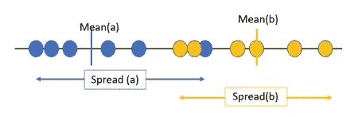**

**作者图片**

**注意，对于 LDA，从#b 到#e 的其余过程与 PCA 相同，唯一的区别在于#b 使用了散布矩阵而不是协方差矩阵。两种散布矩阵的公式都非常直观:**

**类间离差由下式给出:**

**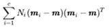**

**其中 m 是完整数据的组合平均值，mi 是各自的样本平均值。**

**类内离差由下式给出:**

**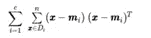**

**其中 x 是单个数据点，mi 是各个类别的平均值。**

**直观上，这找到了类内和类之间的距离，以最大化类的可分性。**

**请注意，对于这两种情况，散布矩阵乘以它的转置。如前所述，矩阵乘以其转置使其对称。这样做是为了使特征向量是“真实的”和“垂直的”。**

*****I) PCA vs LDA 的关键差异领域？什么时候该用什么？*****

****

**作者图片**

**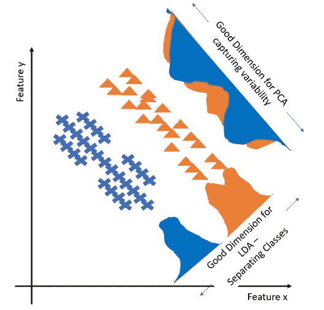**

**作者图片**

**希望这将清除一些讨论的主题的基础，你会有一个不同的视角来看待矩阵和线性代数向前发展。**

**就像他们说的，任何基本的东西的伟大之处在于它不局限于它被阅读的上下文。这是真正意义上的基础，人们可以在此基础上实现飞跃。**

**快乐学习！！**

****免责声明**:本文所表达的观点是作者以个人身份发表的观点，而非其各自雇主的观点。**