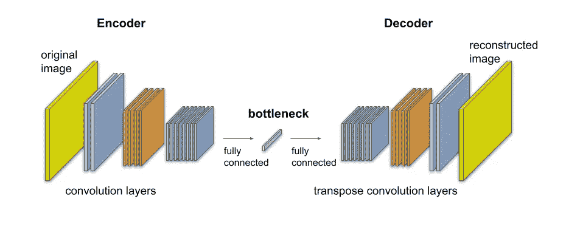
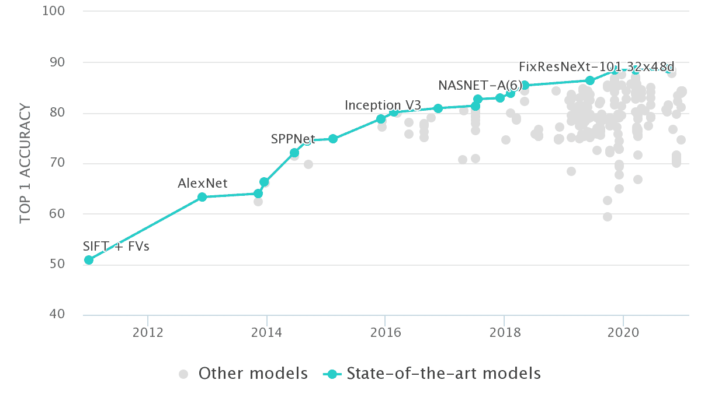
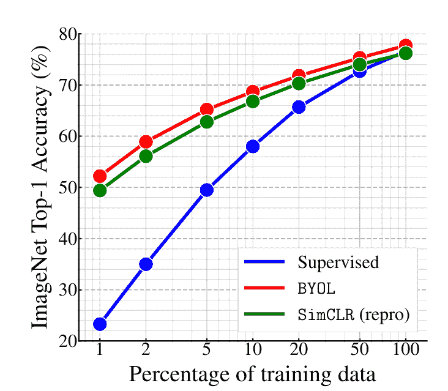
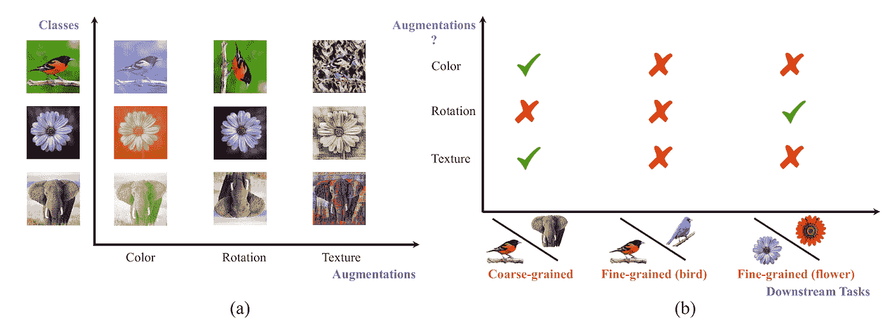

# 增强工程师

> 原文：<https://towardsdatascience.com/the-augmentation-engineers-1ac2a676710a?source=collection_archive---------20----------------------->

## [思想和理论](https://towardsdatascience.com/tagged/thoughts-and-theory)

## 一个几乎微不足道的训练技巧如何成为人工智能向自我监督学习转变的中心。

自从深度学习的早期，当我们仍然缺乏数据时，增强就已经存在了。这可能是书中最古老的把戏了。如果只需做一些改动，我就能把每张照片都变成一张“新”的，为什么还要凑合使用我数据集中的 20 张猫照片呢？我可以移动猫一点，缩放和裁剪，也许创建一个镜像，稍微旋转它，玩颜色直方图，瞧，我已经创建了一个新的猫图片！增强已经成为深度学习训练过程中不可或缺的一部分，以至于模型很少看到原始图片。事实上，模型很少两次看到相同的图片，因为每次需要向模型呈现图片时，它都会经历这样一种随机的转换组合，以至于我们使用相同的图片获得相同组合的机会实际上为零。为增强组合干杯！

**猫的增强**:旋转，缩放和裁剪，镜像，或者它们的组合。作者插图。

在所有这些使用中，我们假设即使我们改变了图像，我们所做的改变也不会影响它的**本质**。猫还是猫。或者，如果我们处理肺部的医学图像(CAT 扫描？)，如果我们拍摄镜像，肿瘤仍然会在那里。通过使用同一张图片的多个增强来训练模型，并告诉它预测相同的结果，我们实际上是在教模型不受图片中技术变化的影响，这些变化不会改变其本质。

把增强向前推进一步，随之而来的突破是令人惊讶的。为什么只在训练期间增加？为什么不在球场上，在产品本身上这样做呢？如果该算法是为了识别肺部肿瘤，为什么只显示一张肺部照片？我们可以拍摄同一张 x 光照片(T7)，稍微移动一下，缩放和裁剪，也许拍摄一张镜像，稍微旋转，改变颜色，并要求模特提供第二种意见。还有第三个。还有第四个。在这个过程的最后，我们将对所有的回答进行平均。事实证明，这种被称为测试时间增加的技巧，持续地将模型的性能提高了好几个百分点，为什么不呢？

**标签已经够多了**

深度学习的最新变化将增强放在了前沿和中心。这背后的原因是机器学习的圣杯——自我监督学习:没有任何标签的学习。事实上，这就是我们开始的地方，当时深度学习还处于起步阶段，数据匮乏。我们建立了*自动编码器*——将一张图片压缩成一个小的代表性向量，一个*瓶颈*，然后将其扩展回其完整大小的模型。我们会训练模型，使重建的图像尽可能与原始图像相似，并祈祷所有重要的图像信息都保留在瓶颈中，而不会指导模型保留什么是重要的。通过这种方式，我们能够在来自互联网各地的数百万张未标记图像上训练模型，这些模型只不过是将图像压缩到一个瓶颈向量(通常称为*特征向量*)中，然后将其提取回原始大小。

**一个自动编码器架构**。原始图像被压缩成瓶颈向量，然后被扩展回其原始大小。训练该模型，使得右边的黄色图片应该尽可能与左边的黄色图片相似。作者图。

直到第二阶段，我们才转向更小的带标签的数据集，它只包含几千张图像，其中只有几十张是猫，然后使用自动编码器将它们压缩成特征向量。相信这个向量也编码了图像是否包含猫的知识，并且它以一种比原始图像的像素更容易提取的方式被编码，这使我们认为我们能够训练一个不是特别渴望数据的非深度模型，也许只是一个普通的 SVM，将特征向量分类到不同的类别，然后知道图像是包含猫还是狗。

但是后来他们建造了金字塔。除了其他新世界奇迹，如谷歌的代码、亚马逊的仓库、苹果的 iPhone 和网飞的流媒体，还有一个名为 *ImageNet* 的项目，该项目拥有数百万张图像的数据集，这些图像被标记为一千种对象类型(包括数千张猫的图像！).这是亚马逊的在线贸易服务“土耳其机器人”在 2012 年制作的最大项目。因此，我们告别了自动编码器，开始训练深度模型，将图像直接映射到相应的类别，结果大大改善。

历年在 ImageNet 上训练和测试的不同模型的准确率。来源:[paperswithcode.com](https://paperswithcode.com/sota/image-classification-on-imagenet)

自 2012 年以来，大规模、公开、带标签的数据集的汇编已经将该领域的研究重新导向监督学习。鉴于那里是技术进步发生的地方，许多公司发起了收集和标记数据的大规模行动，有时是通过在第三世界国家雇用许多工人，这些工人几乎不做其他事情。例如，众所周知，Mobileye 的资产之一是从安装在汽车上的摄像头收集数据的机制，并使用位于斯里兰卡的指定团队标记数千万公里的道路行驶。然而，世界上大多数数据仍然是未标记的，只是坐在那里，等待一种知道如何使用它并击败标记数据算法的算法出现。

去年，2020 年，终于发生了。

这一领域的最新突破源于一种叫做*对比损失*的方法，在这种方法中，增强发挥了核心作用。这是一个两阶段的方法，工作方式类似于我们使用 autoencoder 的瓶颈向量。在第一阶段，我们训练一个模型，使用大量未标记的数据从每幅图像中生成高质量的特征向量，在第二阶段，我们使用有限的标记数据训练一个简单的(线性)模型来分类图像。

那么我们如何教会模型生成一个“高质量”的特征向量呢？首先，这样一个向量应该有什么特征？我们的一个见解是，我们希望有一个不受增强影响的矢量。我们之前说过，增强不会改变图像的本质，我们希望有一个不受图像中与其本质无关的技术变化影响的模型。与自动编码器不同，自动编码器必须在其瓶颈处对允许其使用与原始图像相同的像素来重建图像的一切进行编码，并且因此对任何可能的增强敏感，这里我们希望将同一原始图像的两个增强编码到同一特征向量中。

这导致了下面的训练方法:我们给模型两个图像， *x* 和*x’*，在它们以某种方式被增强之后。也许 *x* 是用原始图像旋转 90 度得到的，*x’*是通过改变颜色直方图得到的。该模型是一个神经网络(类似于自动编码器中的编码器)，它从每幅图像中生成一个特征向量，比如说 *y* 和*y’*。我们不告诉模型在每个这样的特征向量中放入什么，但是训练损失函数强加了一个间接的要求——如果两个增强 *x* 和*x’*是从相同的原始图像生成的**,我们希望两个特征向量 *y* 和*y’*非常相似。相反，如果两个增强是从两个不同的图像创建的**，**，我们希望它们的特征向量彼此不同。**

SimCLR 插图。来源:[谷歌 AI 博客](https://ai.googleblog.com/2020/04/advancing-self-supervised-and-semi.html)

因此，每次训练迭代，我们给计算机一批不同的图像。我们对每张图像应用两种随机增强，创建图像对——在一些图像对中，两张图像来自同一张图像，模型学习吸引它们各自的特征向量，而在另一些图像对中，图像是使用不同的原始图像创建的，模型学习排斥它们的特征向量。本质上，模型学会忽略增强，并且仅将不受其影响的事物编码到特征向量中。与图像的本质有关的东西，而不是它的技术元素。

这种方法在过去的一年里获得了发展势头，如谷歌的[sim clr](https://ai.googleblog.com/2020/04/advancing-self-supervised-and-semi.html)【1】和[BYOL](https://deepmind.com/research/publications/Bootstrap-Your--Latent-A-New-Approach-to-Self-Supervised-Learning)【2】等作品带来了新的技巧，进一步改善了特征学习过程，每批图像中驻留的图像更少。最新的结果表明，如果我们将 ImageNet 数据集视为一组*未标记的图像*，并将其用于第一阶段的训练，那么在第二阶段，我们可以仅使用一小部分已标记的图像来达到与使用完全标记的 ImageNet 数据训练的模型几乎相同的性能。图表还显示，如果我们增加模型中参数的数量，对比学习方法会变得更好。我确信在接下来的几个月里，我们将会听到使用这种方法获得的新的 ImageNet 高度。

在 ImageNet 上获得的性能是标记的 ImageNet 图像比例的函数。BYOL 和 SimCLR 算法也以未标记的方式使用完整的 ImageNet 数据库。监督算法仅使用标记图像。来源: [BYOL 论文](https://arxiv.org/abs/2006.07733)。

**找到增强(和异常)**

那些在*异常检测*领域工作的人很早就意识到，没有 ImageNet 能够拯救他们，我们将永远不得不处理数据不足的问题，因为异常(例如，行李 x 光扫描中的枪支)就其定义而言，是一种很难在有机组织的数据集中发现的现象。为了解决这个问题，通常使用自动编码器。如果自动编码器在大量没有手枪的手提箱上被训练，并且突然需要将手枪的扫描编码到瓶颈向量中，那么它将很难做到这一点，因为模型从未被要求重建手枪的图像。因此，与“常规”图像不同，在图像包含手枪的情况下，重建图像和原始图像之间可能会有显著差异，如果是这种情况，我们可以向安全部门报警。这种方法在一定程度上起了作用，并在相当一段时间内成为探测异常的主要方法。

但是另一个令人惊讶的突破来自增强领域。对于大量未标记的数据，我们可以做的一件事是自动标记它，尽管是针对我们并不真正感兴趣的任务，例如“找到增强”。在这个游戏中，我们从(比方说)70 种可能性(例如，180 度旋转，90 度旋转，拍摄镜像，缩放和裁剪，或者什么都不做)的集合中通过单个随机增强传递图像；然后，我们将它呈现给模型，并要求它猜测哪个增强(在上述所有可能性中)应用于图像。这是一个虚构的分类任务，虽然它本身并不有趣，但它利用了未标记的数据，我们现在可以训练一个视觉模型来执行它。

被训练来玩这个游戏的模型不会总是设法检测到正确的增强。例如，如果图像是旋转对称的对象，例如从顶部观看的花，那么模型将很难检测到 90 度的旋转。如果这是一张猫的图像，那么相对容易检测出 90 度的旋转，但镜像图像仍然无法与普通图像区分开来。我们可以说，“发现增强”模型将具有某种混淆特征:一些增强将很容易被检测到，而另一些则不那么容易。

然而，在他们 2018 年的论文[4]中，Yitzhak Golan 和 Ran El-Yaniv 教授注意到，当一个掌握了“找到增强”的模型获得一个异常图像时，该模型会以一种完全不同于常规图像的方式感到困惑。换句话说，它的混淆签名是不同的。这就产生了一种检测异常的新方法:将可疑图像进行 70 次放大，看看模型能识别多少。如果可疑图像的混淆签名与平均混淆签名(从“常规”图像估计)相差很大，则发出警报并呼叫保安。令人惊讶的是，这种方法击败了以前使用的自动编码器。

**增强工程师**

深度学习的人感到自豪的是，他们不再为了告诉模型如何读取数据而进行特征工程，随着我们向自我监督学习过渡，我们也将使用越来越少的标签和标记。尽管如此，我们仍然在设计对解决这个问题至关重要的东西:增强本身。最终，如果我们的目标是区分不同类型的花，那么改变图像的颜色作为可能的增强将阻止特征向量包含关于花的颜色的关键信息。然而，如果我们的目标是区分“花”和“车”，那么这种增强工作得很好。如果我们的目标是发现肺部的恶性肿瘤，它也可能沿着它们的边界出现，那么裁剪掉图像的一部分将是错误的，因为这样我们也可能裁剪掉肿瘤，但是肺部的镜像图像将会很好地工作。我们需要明智地选择我们的增强集，以便不破坏我们希望执行的任务的图像的本质。

**左**:不同的增强类型。**右**:y 轴增强是否有助于执行沿 x 轴描述的分类任务。例如，如果我们想要建立一个花分类器，那么旋转是一个有用的增强，但是改变花的颜色就不那么有用了。如果我的任务是区分不同的动物，反过来也是正确的。来源:Tete Xiao 等人的论文《对比学习中哪些不该对比》[3]。

事实上，只要我们需要为对比学习编译正确的增强集，这仍然是监督学习的一种形式，不是吗？为了摆脱这一层，在训练算法中需要另一个阶段，它将自动决定哪一组增强适合于我的数据和期望的任务。在此之前，在去除了特征工程、标签和模型架构之后，我们仍然只剩下“增强工程师”的角色。

## 参考

[1]陈婷，西蒙·科恩布利斯，穆罕默德·诺鲁齐，杰弗里·辛顿。 **SimCLR:视觉表征对比学习的简单框架。**PMLR 2020**arxiv**

****[2] Jean-Bastien Grill 等人(DeepMind)。引导你自己的潜能:自我监督学习的新方法。 NeurIPS 2020。[ [arxiv](https://arxiv.org/abs/2006.07733) ]****

****[3]永龙田，，本·普尔等.艾尔。(麻省理工，谷歌)。对比学习的好观点是由什么构成的？ NeurIPS 2020 [ [pdf](https://arxiv.org/pdf/2005.10243.pdf)****

****[4]伊扎克·戈兰，冉·亚尼夫。使用几何变换的深部异常检测。 NIPS 2018。[ [arxiv](https://arxiv.org/abs/1805.10917)****