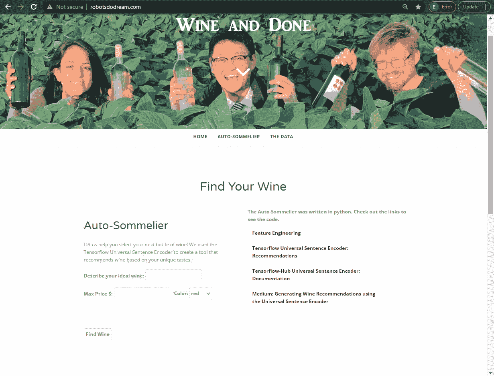
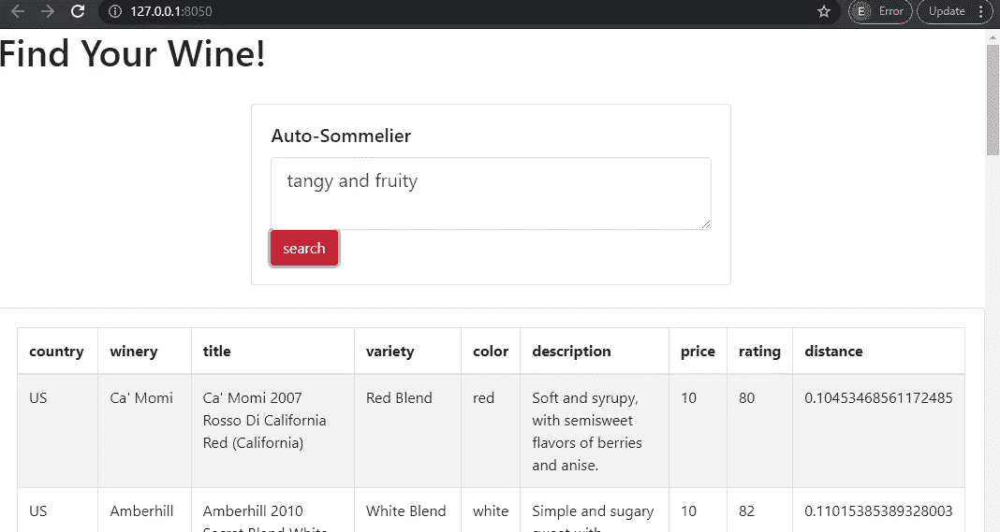
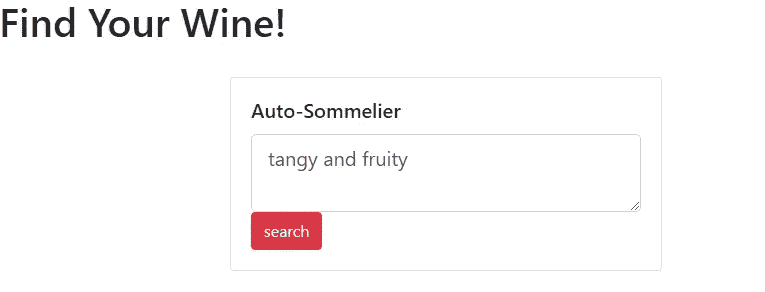

# 自动侍酒师——如何实现 HuggingFace Transformers 并构建搜索引擎

> 原文：<https://towardsdatascience.com/the-auto-sommelier-how-to-implement-huggingface-transformers-and-build-a-search-engine-9e0f401b1bda?source=collection_archive---------10----------------------->

## 享受一些葡萄酒，现代自然语言处理，简单的代码，情节和破折号


贾斯汀·艾金在 [Unsplash](https://unsplash.com?utm_source=medium&utm_medium=referral) 上的照片

# 创建自动侍酒师

回到 2019 年 8 月，我将我的第一个自然语言处理(NLP)项目投入生产，并在我的网站上主持了[自动侍酒师。使用](http://robotsdodream.com) [TensorFlow 1 和通用语句编码器](/generating-wine-recommendations-using-the-universal-sentence-encoder-d086edd13d00)，我允许用户描述他们理想的葡萄酒，并返回与查询相似的描述。该工具将葡萄酒评论和用户输入转换为向量，并计算用户输入和葡萄酒评论之间的余弦相似性，以找到最相似的结果。

[余弦相似度](https://en.wikipedia.org/wiki/Cosine_similarity)是一种比较文档相似度的常用方法，因为它适用于词频等对分析非常重要的数据。它反映了单个向量维度的相对比较，而不是绝对比较。在本文中，我不会深入探究余弦相似性背后的数学，但我知道它是内积空间的两个非零向量之间相似性的度量。



自动侍酒师(RobotsDoDreams.com)

# 增强时间到了

虽然该模型仍然有效，但自 2019 年以来，自然语言处理取得了巨大进展。使用像 HuggingFace 的 Transformers 这样的工具，将句子或段落转换成可用于语义相似性等 NLP 任务的向量从未如此简单。使用最新的技术和语言模型重构我的代码将会使它更有性能。如果你是 NLP 新手，可以看看我的初学者教程。

</how-to-vectorize-text-in-dataframes-for-nlp-tasks-3-simple-techniques-82925a5600db>  

在本教程中，我将解释如何使用[拥抱脸变形金刚库](https://huggingface.co/)、[非度量空间库](https://github.com/nmslib/nmslib)和 [Dash 库](http://pythondashboards.com)来构建一个新的和改进的自动侍酒师。完整的代码和 GitHub 链接可以在文章的底部找到。

# 葡萄酒数据

葡萄酒数据来自在[kaggle.com 上找到的](https://www.kaggle.com/)[葡萄酒评论](https://www.kaggle.com/zynicide/wine-reviews)数据集。原始数据包含大约 130，000 行数据，包括国家、描述、标题、品种、酒厂、价格和评级等列。

[查看所有](/generating-wine-recommendations-using-the-universal-sentence-encoder-d086edd13d00)数据工程代码的原文。

将数据放入 dataframe 后，我删除了包含重复描述的行和价格为空的行。我还将数据限制在有超过 200 条评论的葡萄酒品种上。

通过排除少于 200 条评论的品种来减少数据，我得到了 54 种葡萄酒。在清除了空数据和重复数据之后，剩下 100，228 行。通过谷歌搜索剩下的品种，我可以添加一个颜色栏，这样用户就可以通过想要的葡萄酒颜色来限制他们的搜索。

## 导入依赖项和数据

很容易将数据连接并加载到 dataframe 中，因为它已经是一个 sqlite 文件。按照三个步骤加载库、数据和数据帧。

1.导入 *pandas* 和 *sqlite3* 库。
2。连接到 **sqlite** 文件。
3。将数据加载到熊猫数据框架中。

```
#*Import dependencies* import numpy as np
import pandas as pd
import sqlite3
from sqlite3 import Errorimport texthero as hero
from texthero import preprocessing
from sentence_transformers import SentenceTransformer, util
import nmslibimport time
import datetime *#Establish connection to sqlite database*
conn = sqlite3.connect("wine_data.sqlite")*#load the data into a pandas DataFrame*
df = pd.read_sql("select * from wine_data", conn)
```

注意，我还导入了将在教程中使用的其他库。我将更多地介绍他们。使用 pandas **read_sql** 函数生成一个使用原始 sql 的数据帧。请注意，数据集中有 16 列和 100228 行。


葡萄酒数据 df.head(3)

# **拥抱脸🤗变形金刚(电影名)**

**如果你在过去一年左右的时间里参与了自然语言处理(NLP)领域，你可能已经听说过 HuggingFace🤗。HuggingFace 是一个专注于 NLP 的人工智能和深度学习平台，目标是实现人工智能技术的民主化。他们精简和简化了应用和微调预先训练的语言模型。**

**Transformers 是一个开源库，具有一个模型中心，允许用户基于通用架构(如 BERT、XLM、DistilBert 等)实现最先进的深度学习模型...它构建在 PyTorch、TensorFlow 和 Jax 之上，并且已知在框架之间具有良好的互操作性。**

**他们刚刚发布了一个完整的课程，带你穿越拥抱脸生态系统。我强烈推荐它:**

**<https://huggingface.co/course/chapter1>  

使用 pip 安装库

```
$ pip install transformers
```

在这个例子中，我将使用[***distilBERT-base-un cased***](https://huggingface.co/distilbert-base-uncased)模型，因为它与我们的用例、语义相似性表现良好。它将文本转换成 768 维向量。[如果你不想使用 distilBERT](https://huggingface.co/models?pipeline_tag=sentence-similarity) ，探索所有句子相似度的 HuggingFace 模型 [。这个模型是不区分大小写的，这意味着它不区分英语和英语。](https://huggingface.co/models?pipeline_tag=sentence-similarity)[查看官方文件，了解关于该型号的详细信息](https://arxiv.org/abs/1910.01108)。

要实现该模型，请遵循以下步骤:

1.  用*distil Bert-base-un cased*模型实例化 **SentenceTransformer** 。
2.  调用**编码**并将葡萄酒描述传入其中。将参数**convert _ to _ tensor**=*设置为 True。*

```
#load the distilbert model 
distilbert = SentenceTransformer('distilbert-base-uncased')#generate the embeddings for the wine reviews
embeddings = distilbert.encode(df['description'], convert_to_tensor=True)
```

***注意*** :如果您之前从未下载过该模型，您将看到它正在下载，并且可能会弹出一些消息。这很正常。

一旦该过程完成，文本描述将被转换成长度为 768 的向量。我们可以检查长度和第一次嵌入，以确保它看起来像预期的那样:


print(len(embeddings[0])
print(embeddings[0])

为了使向量更容易分析，使用 numpy 将数据从张量对象转换为列表对象，然后将列表附加到 pandas 数据帧。

```
#add embeddings to dataframe
df['distilbert'] = np.array(embeddings).tolist()#show the top row
df.head(1)
```


数据帧中的嵌入 df.head(1)** 

# **创建搜索索引**

**当使用像谷歌或必应这样的搜索引擎时，用户希望很快得到结果。为了以闪电般的速度搜索我们的结果集，我们可以使用轻量级且高效的[非度量空间库(NMSLIB)](https://github.com/nmslib/nmslib) 。**

**使用 pip 安装它:**

```
$ pip install nmslib
```

**如前所述，我们希望使用余弦相似度作为我们比较用户输入和葡萄酒描述的度量。我们需要能够找到与我们的搜索向量最近的向量。使用蛮力技术搜索和排序数据既昂贵又缓慢。相反，应该为数据点创建一个索引。**

**创建搜索余弦相似性索引相当简单:**

1.  **初始化一个新的索引，通过 *hnsw* 作为**方法**和*余弦米尔*作为**空间**。**
2.  **使用 **addDataPointBatch** 方法将嵌入添加到索引中。**
3.  **使用 **createIndex** 方法创建带有数据点的索引。**

```
# initialize a new index, using a HNSW index on Cosine Similarity
distilbert_index = nmslib.init(method='hnsw', space='cosinesimil')
distilbert_index.addDataPointBatch(embeddings)
distilbert_index.createIndex({'post': 2}, print_progress=True)
```

**如果您希望保存索引并在以后加载它(比如在生产服务器上)，请使用以下代码:**

```
#Save a meta index and the data
index.saveIndex('index.bin', save_data=True)#Re-intitialize the library, specify the space
newIndex = nmslib.init(method='hnsw', space='cosinesimil_sparse')*#Re-load the index and the data* newIndex.loadIndex('sparse_index.bin', load_data=**True**)
```

# **创建搜索功能**

**既然数据已经矢量化，搜索索引也已经填充，那么是时候创建接收用户查询并返回相似葡萄酒的函数了。**

****search_wine** 函数将接受两个输入: *DataFrame* 和 *UserQuery* 。用户查询将使用**编码**转换成一个向量，就像我们对葡萄酒描述所做的那样。然后 NMSLIB 可以用来返回用户查询向量的 [*k 近邻*](https://en.wikipedia.org/wiki/K-nearest_neighbors_algorithm) 。我设置了 *k=20* ，不过可以随意实验。**

```
def search_wine(dataframe, userQuery):

    if dataframe is not None and userQuery is not None:
        df = dataframe.copy()
        query = distilbert.encode([userQuery], convert_to_tensor=True)
        ids, distances = distilbert_index.knnQuery(query, k=20) matches = [] for i, j in zip(ids, distances): matches.append({'country':df.country.values[i]
                        , 'winery' : df.winery.values[i]
                        , 'title' : df.title.values[i]
                        , 'variety': df.variety.values[i]
                        , 'color' : df.color.values[i]
                        , 'description': df.description.values[i]
                        , 'price': df.price.values[i]
                        , 'rating': df.rating.values[i]
                        , 'distance': j
                       }) return pd.DataFrame(matches)
```

**注意结果被返回并作为字典附加到一个列表中。这使得将结果转换回数据帧变得容易。对于 ***距离*** 值，越小越好。例如，距离为 0 意味着向量相同。**

**测试功能:**

****

**搜索 _ 葡萄酒结果**

# **创建可视化资源管理器**

**除了文本搜索之外，我们还可以使用降维技术在二维空间中绘制葡萄酒，从而提供一个可视化的浏览器。使用 [Texthero 库](https://texthero.org/docs/api/texthero.representation.tsne)，很容易应用 [t-SNE 算法](https://en.wikipedia.org/wiki/T-distributed_stochastic_neighbor_embedding)来降低向量的维数并将其可视化。在引擎盖下，Texthero 使用 [Plotly](http://plotly.com) 制作交互式图表。**

**t-SNE(t-distributed random neighbor embedding)是一种用于可视化高维数据的[机器学习](https://en.wikipedia.org/wiki/Machine_learning)算法。t-SNE 技术应用了**非线性**降维。**

**将 t-SNE 应用于数据帧中的**蒸馏**向量列。**

```
df['tsnedistilbert'] = hero.tsne(df['distilbert'])
```

**使用 texthero 创建散点图。**

```
#create scatter plot of wines using the 
hero.scatterplot(df, col='tsnedistilbert'
                 , color='variety'
                 , title="Wine Explorer"
                 , hover_data = ['title','variety','price','description'])
```

****

**葡萄酒浏览器可视化**

**数据中有如此多的变化，以至于散点图看起来像宇宙背景辐射，但这没关系。将鼠标悬停在一个点上会显示更多信息。用户可以点击一个品种，将其从图表中删除。例如，这里是关于葡萄牙红色和白色的混合:**

****

**葡萄牙红色和白色混合**

**有趣的是，我们可以看到一些品种是如何聚集在一起的，而另一些品种是如何分散在各处的。**

# **创建用户界面**

**为了允许用户与搜索功能进行交互，我们可以使用 Dash by Plotly 构建一个简单的用户界面。 [Dash 是一个基于 Flask、Plotly.js 和 React.js 编写的 Python 框架](https://dash.plot.ly/)，如果你是 Dash 新手，想要掌握基础知识，请查看我的所有教程:**

**<https://medium.com/swlh/dashboards-in-python-for-beginners-and-everyone-else-using-dash-f0a045a86644>  

用户界面

如果您想在 jupyter 笔记本中构建 dash 应用程序，请安装 Dash、Dash 引导组件和 jupyter-dash。

```
pip install dash
pip install dash-bootstrap-components
pip install jupyter-dash #if you want to build in a jupyter notebook
```

Dash 应用程序由**布局**和**回调**组成:

## 布局

[布局](https://dash.plot.ly/getting-started)由组件树组成，描述了应用程序的外观以及用户如何体验内容。

## 复试

[回调](https://dash.plot.ly/getting-started-part-2)使 Dash 应用程序具有交互性。回调是 Python 函数，每当*输入*属性改变时，就会自动调用。

# 构建布局

布局超级简单，采取极简的手法。使用一张卡片来放置搜索框，让用户按一个按钮，然后返回结果。这个例子使用了[引导组件](https://dash-bootstrap-components.opensource.faculty.ai/docs/quickstart/)。

```
import dash
from jupyter_dash import JupyterDash
import dash_bootstrap_components as dbc
import dash_html_components as html
import dash_core_components as dcc
from dash.dependencies import Input, Outputexternal_stylesheets = [dbc.themes.BOOTSTRAP]app = JupyterDash(__name__, external_stylesheets = external_stylesheets)# Create server variable with Flask server object for use with gunicorn
server = app.server
```

添加 boiler-plate 代码以运行 Dash 应用程序后，创建将用作布局的组件树。我称第一个组件树为 search_card。

search_card 使用**卡**和**卡体**来包含**文本区**和**按钮**组件。在我看来，把它们放进卡片里会让它看起来更好一点。

```
search_card = dbc.Card(
    dbc.CardBody(
        [
            html.H5("Auto-Sommelier", className="card-title")
            , dbc.Textarea(id = 'user-input', bs_size="lg"
                     , placeholder="Describe Ideal Wine")
             ,dbc.Button('search', id = 'search', color="danger")
        ]
    )
)
```

第二个组件树充当 ***search_card*** 和包含葡萄酒结果的卡片的容器。该组件树将被设置为 **app.layout** 。

```
app.layout = html.Div([html.H1("Find Your Wine!")
                   , html.Br()
                   , dbc.Row(dbc.Col(**search_card**,
                        width={"size": 6, "offset": 3}))#end row
                  , html.Br()
                  , dbc.Card(dbc.CardBody(html.Div(id = 'results')))
                  ])
```

注意 ***search_card*** 被放到**行**和**列**组件中，这样更容易居中。在第二棵树的末尾，它包含另一个**卡片**和**卡片主体**，其中只包含一个 ***html。Div*** 与 ***id =结果*** 。该应用程序将依靠回调来用搜索结果填充 CardBody 的 Div 组件。

回调会将结果输出到结果 **Div** 。作为输入，回调将接受用户的查询和按钮点击。如果都不是，查询将被传递给 **search_wine** 函数，并以数据帧的形式返回结果。

```
[@app](http://twitter.com/app).callback(Output("results", "children")
              , [Input("user-input", "value")
                , Input("search", "n_clicks")
                ])
def return_wine(userquery, n):

    if userquery is not None and n is not None:

        dff = df.copy()
        results = search_wine(dff, userquery)
        table = dbc.Table.from_dataframe(results, striped=True, bordered=True, hover=True)

        return table
```

请注意，dataframe 是使用 bootstrap **Table** 组件转换成 HTML 表格的。

要运行 Dash 应用程序，请使用以下命令:

```
app.run_server()
#Dash app running on [http://127.0.0.1:8050/](http://127.0.0.1:8050/)
```



自动侍酒师

恭喜你！你刚刚用拥抱脸变形、余弦相似度和破折号制作了你自己的葡萄酒搜索引擎！** 

# **最后的想法和完整的代码**

**与我在 2019 年创建的原始自动侍酒师相比，这个版本的实现速度快得多，也简单得多。通过像 HuggingFace 这样的框架利用最先进的语言模型的能力为像我这样的机器学习爱好者打开了大门，让他们只用几行代码就可以构建一些令人敬畏的应用程序。现在是做一些分析的时候了，看看结果与原来的工具相比有什么改进！**

****

**比较同一查询的结果。新(顶部)**

**感谢阅读！以下是完整的代码:**

**<https://github.com/bendgame/MediumWineRecommend2>  

# 谢谢大家！

*   *如果你喜欢我的作品，* [*关注我中的*](https://medium.com/@erickleppen) *了解更多！*
*   [*通过订阅*](https://erickleppen.medium.com/membership) 获得对我的内容的完全访问和帮助支持！
*   *我们来连线上*[*LinkedIn*](https://www.linkedin.com/in/erickleppen01/)
*   *用 Python 分析数据？查看我的* [*网站*](https://pythondashboards.com/) ！

[**—埃里克·克莱彭**](http://pythondashboards.com/)

<https://erickleppen.medium.com/the-ultimate-guide-to-erics-articles-d32df8241353> **