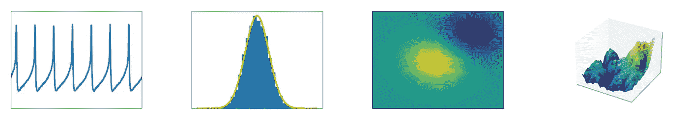
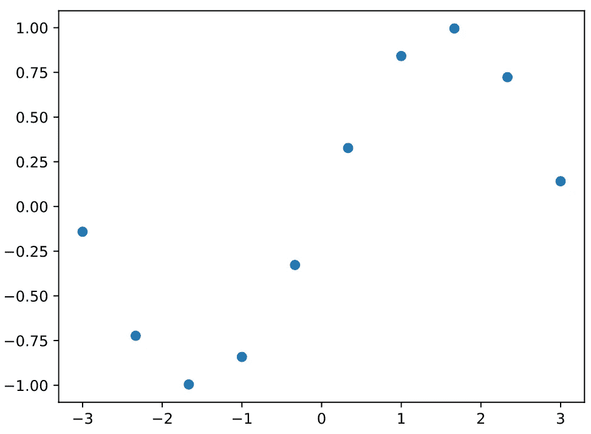
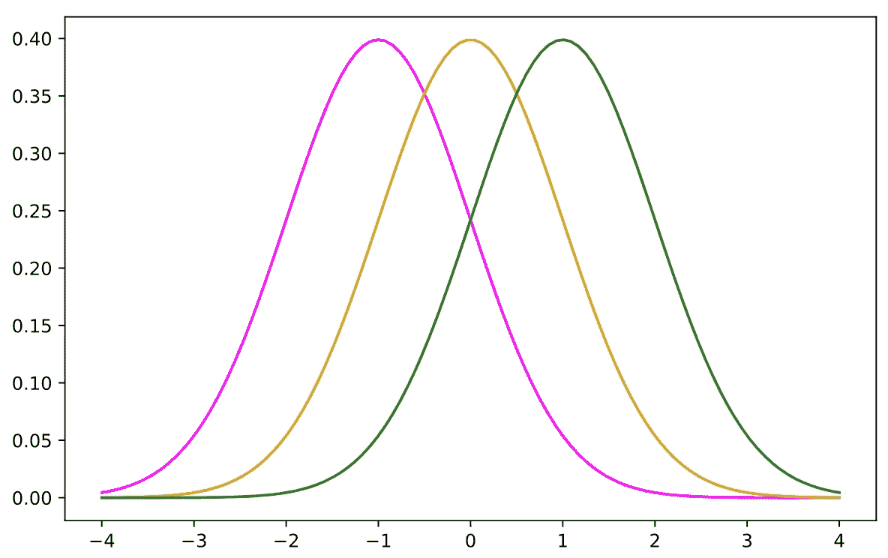
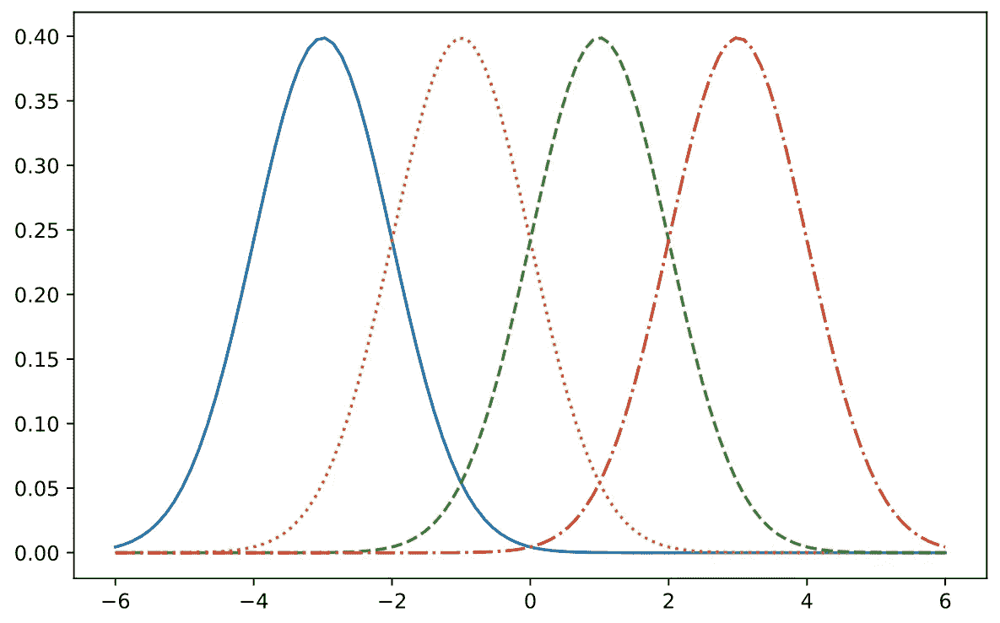
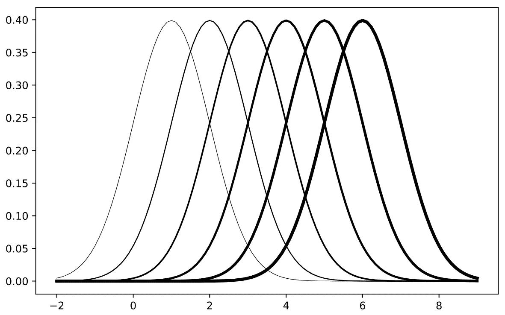
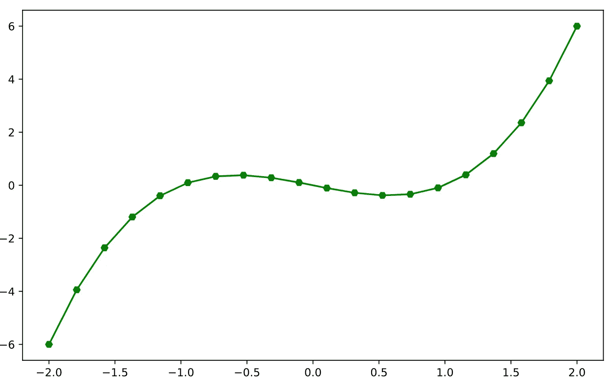
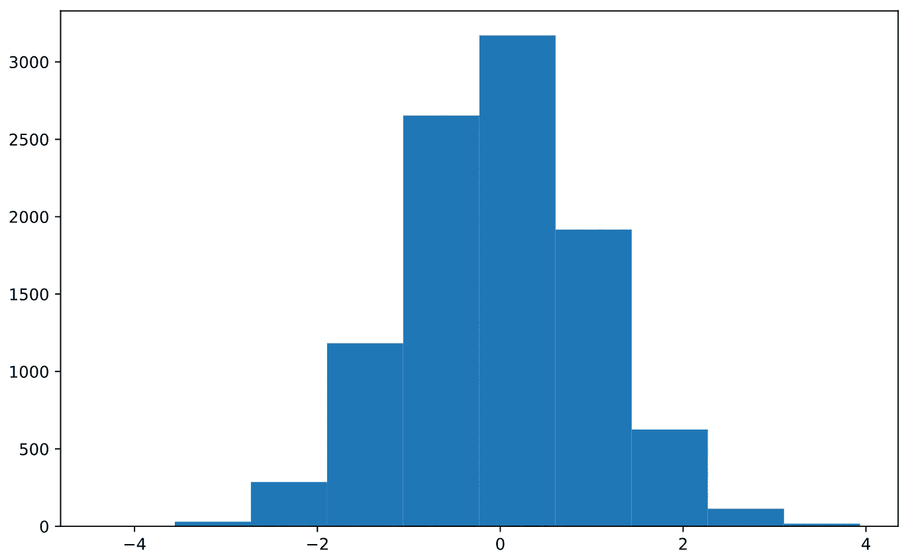
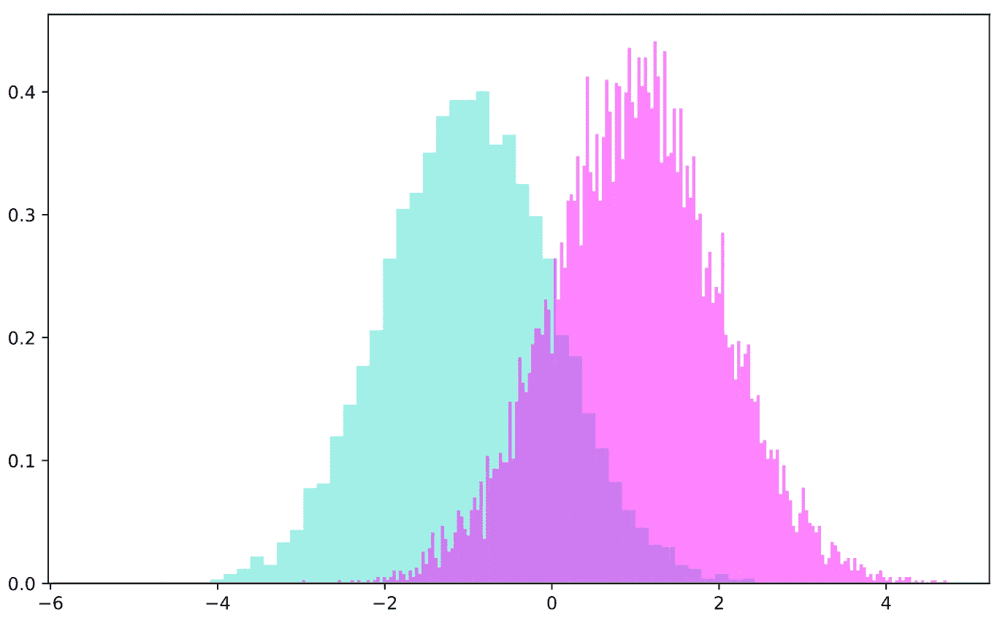
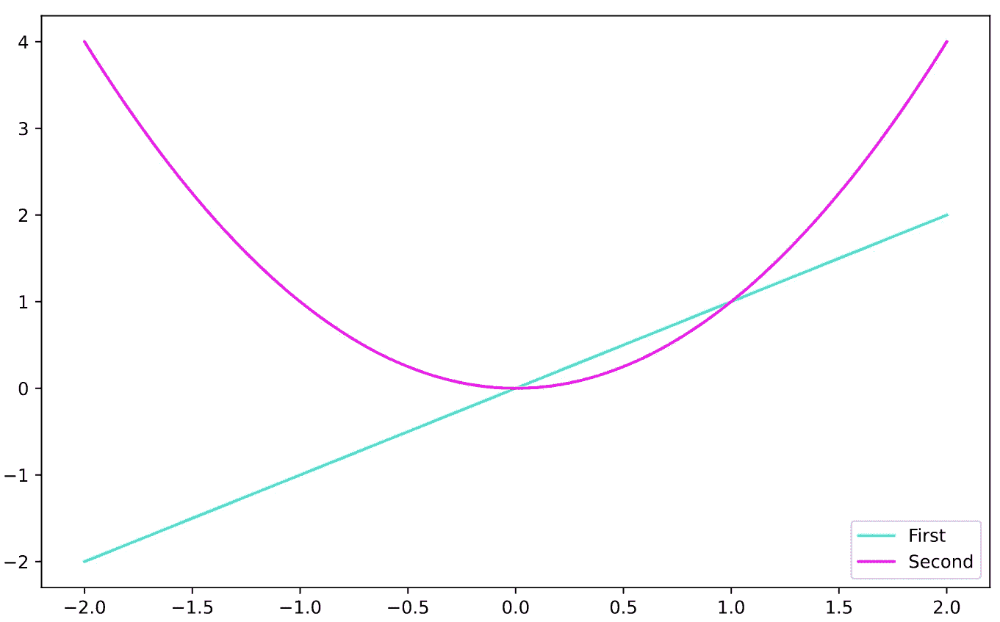
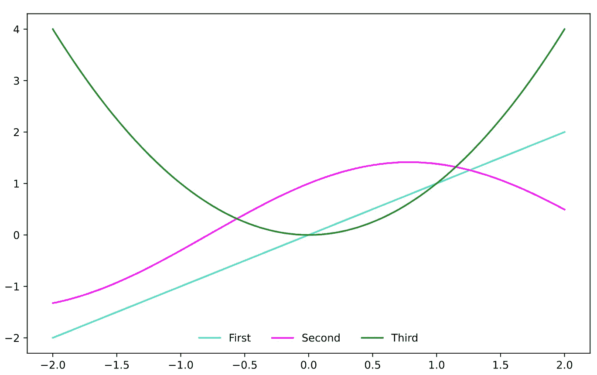

# Matplotlib 的最低指南

> 原文：<https://towardsdatascience.com/the-bare-minimum-guide-to-matplotlib-55556b15aeb8?source=collection_archive---------51----------------------->

## 折线图、散点图、直方图以及一系列定制它们的方法



点击 [**这里**](https://cookieblues.github.io/guides/2021/02/15/bare-minimum-matplotlib/) **，在我的个人博客上阅读这篇文章的更详细版本。**

用于数据可视化的典型 Python 库是 Matplotlib。它易于使用、灵活，并且许多其他可视化库都是在 Matplotlib 的基础上构建的。这意味着学习 Matplotlib 将更容易理解和使用一些更花哨的可视化库。

## 入门指南

您需要安装 Matplotlib 库。假设您有一些终端，并且安装了 [pip](https://en.wikipedia.org/wiki/Pip_(package_manager)) ，您可以使用以下命令安装 Matplotlib:`pip install matplotlib`。你可以在 Matplotlib 的[安装指南](https://matplotlib.org/users/installing.html)中阅读更多关于安装的信息。

## 面向对象的方法

我们将从制作一个简单的[散点图](https://en.wikipedia.org/wiki/Scatter_plot)开始。首先，我们必须导入 matplotlib。`plt`框架是我们将用于 Python 绘图的。

```
import matplotlib.pyplot as plt
import numpy as np
```

我们还导入了 numpy，所以我们可以很容易地生成点来绘图！让我们在[正弦函数](https://en.wikipedia.org/wiki/Sine)上挑选一些点。我们选择一些 x 值，然后用`np.sin`计算 y 值。

```
x = np.linspace(-3, 3, num=10)
y = np.sin(x)
```

现在我们已经生成了我们的点，我们可以制作我们的散点图！我们首先制作一个`Figure`对象和一个`Axes`对象。

```
fig = plt.figure()
ax = fig.add_subplot()
```

我们可以把`Figure`对象看作是我们想要放入图形的框架，而`Axes`对象是我们框架中的一个实际图形。然后，我们将散点图添加到`Axes`对象，并使用`plt.show()`来可视化图表。

```
ax.scatter(x, y)
plt.show()
```



这是它的要旨！

## 折线图

这里是我们可以使用的颜色的例子。我们可以用许多不同的方法来指定颜色；十六进制代码，RGB，普通旧名。

```
from scipy.stats import norm
x = np.linspace(-4, 4, num=100)fig = plt.figure(figsize=(8, 5))
ax = fig.add_subplot()ax.plot(x, norm.pdf(x, loc=-1, scale=1), color="magenta")
ax.plot(x, norm.pdf(x, loc=0, scale=1), color=(0.85, 0.64, 0.12))
ax.plot(x, norm.pdf(x, loc=1, scale=1), color="#228B22")plt.show()
```



我们还可以使用许多预定义的[线型](https://matplotlib.org/3.1.0/gallery/lines_bars_and_markers/linestyles.html)。注意，在没有定义颜色的情况下，Matplotlib 会自动为我们的线条选择一些不同的默认颜色。

```
x = np.linspace(-6, 6, num=100)fig = plt.figure(figsize=(8, 5))
ax = fig.add_subplot()ax.plot(x, norm.pdf(x, loc=-3, scale=1), linestyle="solid")
ax.plot(x, norm.pdf(x, loc=-1, scale=1), linestyle="dotted")
ax.plot(x, norm.pdf(x, loc=1, scale=1), linestyle="dashed")
ax.plot(x, norm.pdf(x, loc=3, scale=1), linestyle="dashdot")plt.show()
```



我们还可以调整线条的宽度！

```
x = np.linspace(-2, 9, num=100)fig = plt.figure(figsize=(8, 5))
ax = fig.add_subplot()for i in range(1,7):
    ax.plot(
        x, norm.pdf(x, loc=i, scale=1), color="black", linewidth=i/2
    )plt.show()
```



## 散点图

对于散点图，我们可以更改[标记](https://matplotlib.org/3.3.3/api/markers_api.html)及其大小。这里有一个例子

```
x = np.linspace(-4, 4, num=20)
y1 = x
y2 = -y1
y3 = y1**2fig = plt.figure(figsize=(8, 5))
ax = fig.add_subplot()ax.scatter(x=x, y=y1, marker="v", s=1)
ax.scatter(x=x, y=y2, marker="X", s=5)
ax.scatter(x=x, y=y3, marker="s", s=10)plt.show()
```

我们还可以使用`[ax.plot](https://matplotlib.org/3.3.4/api/_as_gen/matplotlib.pyplot.plot.html)`函数，通过改变`fmt`参数来组合折线图和散点图。`fmt`参数由标记、线条和颜色部分组成:`fmt = [marker][line][color]`。如果`fmt = "s--m"`，那么我们有正方形标记，一条虚线，它们将被染成洋红色。

```
x = np.linspace(-2, 2, num=20)
y = x ** 3 - xfig = plt.figure(figsize=(8, 5))
ax = fig.add_subplot()ax.plot(x, y, 'H-g')plt.show()
```



## 直方图

我们可以使用`ax.hist`功能轻松制作直方图。

```
x = np.random.randn(10000)fig = plt.figure(figsize=(8, 5))
ax = fig.add_subplot()ax.hist(x)plt.show()
```



我们可以改变直方图中的许多东西，使它变得更好——我们甚至可以添加多个！

```
x1 = np.random.randn(10000)-1
x2 = np.random.randn(10000)+1fig = plt.figure(figsize=(8, 5))
ax = fig.add_subplot()ax.hist(
    x1,
    color='turquoise',
    edgecolor='none',
    bins=50,
    alpha=0.5,
    density=True
)
ax.hist(
    x2,
    color='magenta',
    edgecolor='none',
    bins=200,
    alpha=0.5,
    density=True
)plt.show()
```



## 传说

很自然，我们会想在图表中添加一个图例。这可以通过`[ax.legend](https://matplotlib.org/stable/api/_as_gen/matplotlib.pyplot.legend.html)`功能简单实现。

```
x = np.linspace(-2, 2, num=100)
y1 = x
y2 = x**2fig = plt.figure(figsize=(8, 5))
ax = fig.add_subplot()ax.plot(x, y1, color='turquoise', label='First')
ax.plot(x, y2, color='magenta', label='Second')ax.legend()plt.show()
```



Matplotlib 将自动尝试并找到图表上图例的最佳位置，但是我们可以通过为`loc`参数提供一个参数来改变它。另外，一个常见的偏好是图例周围没有框架，我们可以通过将`frameon`参数设置为`False`来禁用它。此外，Matplotlib 在一列中列出了图例的元素，但是我们可以在`ncol`参数中提供要使用的列数。

```
x = np.linspace(-2, 2, num=100)
y1 = x
y2 = np.sin(x)+np.cos(x)
y3 = x**2fig = plt.figure(figsize=(8, 5))
ax = fig.add_subplot()ax.plot(x, y1, color='turquoise', label='First')
ax.plot(x, y2, color='magenta', label='Second')
ax.plot(x, y3, color='forestgreen', label='Third')ax.legend(loc='lower center', frameon=False, ncol=3)plt.show()
```



## 最终提示

您可以使用 Matplotlib 做许多奇怪的事情和不同的事情，不幸的是，我无法在这里一一提供。但是，有一些指导方针可以帮助您开始:

1.  使用`plt.savefig()`功能保存图表。
2.  有许多构建在 Matplotlib 基础上的库可能对您试图创建的特定图表有益，例如 [Seaborn](https://seaborn.pydata.org/) 、 [Bokeh](https://docs.bokeh.org/en/latest/) 、 [Plotly](https://plotly.com/) 等等。
3.  看[图库](https://matplotlib.org/stable/gallery/index.html)。拜托，拜托，看看[图库](https://matplotlib.org/stable/gallery/index.html)！如果有人已经做好了，不要浪费 3 个小时在图表上。