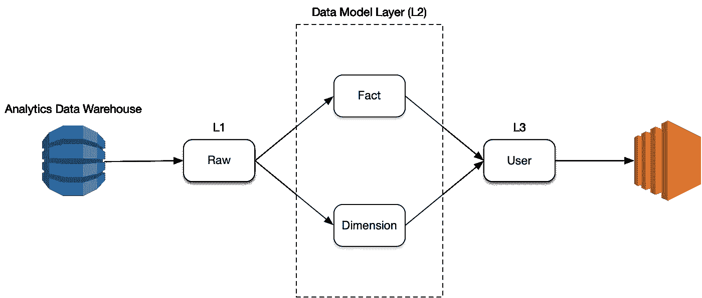

# 优秀分析数据仓库的基础

> 原文：<https://towardsdatascience.com/the-basics-of-a-good-analytics-data-warehouse-4407b4b5ce50?source=collection_archive---------25----------------------->

## 将您的数据恰当地分层到 L1、L2 和 L3 层

作者图片

分析数据仓库存储的数据基本上与事务数据库生成的数据相同，不多也不少。但是，尽管事务数据库可能被设计得尽可能快，但分析数据库必须被设计得尽可能灵活并且与数据仓库中嵌入的所有业务逻辑保持一致。分析数据仓库的目标是使数据科学家(或可互换的分析师)能够快速混合数据以回答复杂的问题，并发现不明显的有用信息。然而，分析数据仓库还有另一个同样重要的目标:让两个不同的数据科学家面对同一个问题得出不同答案的可能性极小。如果使用事务数据库执行分析，这是很有可能的，因为业务定义和业务逻辑没有嵌入事务数据库中。如果你的公司倾向于召开会议，不同的部门对非常简单的问题给出不同的答案，那么你可能没有一个正确设计的分析数据仓库。设计合理的分析数据仓库将使数据科学家很难得出不同的结论；他们将不得不*积极*尝试得出不同的结论。想象一下，如果一致的答案成为标准，公司将节省多少时间。不要浪费时间争论哪个数字是“正确的”，你可以花时间决定采取什么行动(或者讨论得出结论的逻辑)。那段时间的美元价值是巨大的(更不用说因为不能在基本问题上达成一致而延迟行动的机会成本了)。

创建良好的分析数据仓库的关键是将业务分解成一系列事实、维度和用户表。

1.  事实表:这正是天真、简单的英语解释。事实表是围绕单个实体的事实的集合。例如，如果您的企业使用互联网销售小部件，并且只在电视上做广告，那么您可能会有以下事实表:订单、客户、产品、网站和营销。orders 事实表将包含一个订单 ID、每个订单的值、下单日期、发货日期、订购该订单的客户的客户 ID 等等。customers 事实表有一个客户 ID、客户的姓名、客户的地址、一生的订单数、一生的销售额、他们的业务部门等等。营销事实表将具有电视商业广告 ID、电视商业广告的名称、它播出的电台的电台 ID、它播出的时间、商业广告的长度等等。将有额外的事实表来捕获关于电台的信息，例如观众的平均数量、地理位置等等；这些数据不会存储在营销事实表中，因为这些是关于电视台的事实，而不是企业经营的电视广告。这是创建适当的分析数据仓库的最困难的方面:通过识别数据必须分割成的正确的逻辑实体来正确地分离事实表。
2.  维度表:您可以使用简单的英语语句来标识维度；单词“by”后面的任何内容都是维度。例如，“我们一周有多少订单？我们每月有多少订单？一周中的每一天我们有多少订单？”在本例中，维度是“日期”。因此，任何值得使用的分析数据库都会有一个“日期维度”表。该表将有一个主键(如 2015 年 1 月 10 日)和许多许多提供该日期信息的列。例如，它将包含一年中的某一天(10)、一年中的某一周(2)、一周中的某一天(周六)、一年中的某一月(1)、一周的开始日期(2015–01–05)、一周的结束日期(2015–01–11)、是否是周末(是)、是否是联邦政府假日(否)、是否是公司假日(否)等等。另一个例子是“按业务部门划分，我们有多少订单”？因此，业务部门是一个维度，我们将有一个“业务部门维度”表。还有一个例子是“根据邮政编码，我们有多少销售额？按城市？按州？”因此，地理也是一个维度，分析数据仓库将有一个“地理维度”表。
3.  用户表:用户表通常通过将来自几个不同实体的事实与维度相结合来回答一个非常具体的问题。例如，“我们一周有多少未取消、未修复的订单？”或者“每月各业务部门的平均订单价值是多少？”大多数企业直接从他们的事务数据库中创建数十个甚至数百个用户表。直接从事务数据库创建用户表的问题是它们不灵活(如果不返回到源系统并从头开始，就不能重新组合数据来生成不同的视图),而且它们本质上是不一致的，因为每次创建用户表时，创建者都会决定应用什么逻辑。但是，从事实表和维度表派生的用户表非常有用，因为它们可以用来快速回答企业一直询问的基本问题。数据分析数据仓库可以自动创建一个用户表，在每天早上 5 点执行相同的步骤，并在早上 7 点到达时将结果通过电子邮件发送给数据科学家，供他或她审阅，而不是付钱给数据科学家，让他或她跨事务表运行一打 SQL 查询，并将数据拉入 Excel 电子表格并应用透视来回答问题。通过使用计算机自动化代替人工处理，这不仅节省了大量的时间，而且减少了错误。

尽管任何分析数据仓库都有一个很容易忽略但绝对重要的关键组件:维护良好、准确且有文档记录的数据模型。构建一个好的分析数据仓库不仅仅是写一堆 SQL 代码，它还包括创建和维护数据模型这一枯燥但重要的工作。您如何知道您是否在创建和维护数据模型文档方面做得很好？有一个任何企业都可以应用的简单测试:将数据模型打印在纸上，将所有的纸贴在墙上，并要求一名新的分析师快速写出 SQL 伪代码，说明他或她将如何提取一个基本问题的答案。如果分析师花了 2 分钟以上的时间快速查看墙上的文章并写出基本的伪代码(或者如果您知道伪代码是错误的，因为文档已经过时)，那么您就没有一个好的数据模型或适当的文档。这对您的业务至关重要，因为这是您真正释放并注意到正确构建的分析数据仓库的力量的时候。过去需要几小时到几天才能回答问题，现在只需几分钟就能回答。想象一下，如果您能够比竞争对手反应更快，因为您的分析师不会浪费时间费力地通过您的事务数据库来发现关键发现，那么这将为您的企业带来什么样的竞争优势！

在以后的文章中，我们将进一步深入设计良好的分析数据仓库中应该存在的每一层。在上图中，这些图层应该是 L1(即原始图层)、L2(即上述数据模型)和 L3(即用户图层)，在 L3 中，您可以像使用乐高积木一样重复使用 L2 中的组件。有时有一种误解，认为将数据分层会增加工作量；事实上，恰恰相反。将您的数据分层实际上会减少您的团队花费在获取他们需要的数据和维护这些数据上的工作量。我们将很快讨论如何！