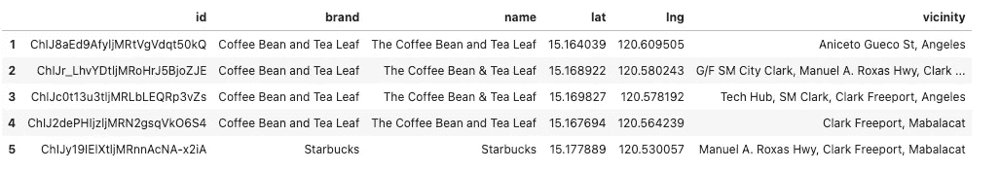
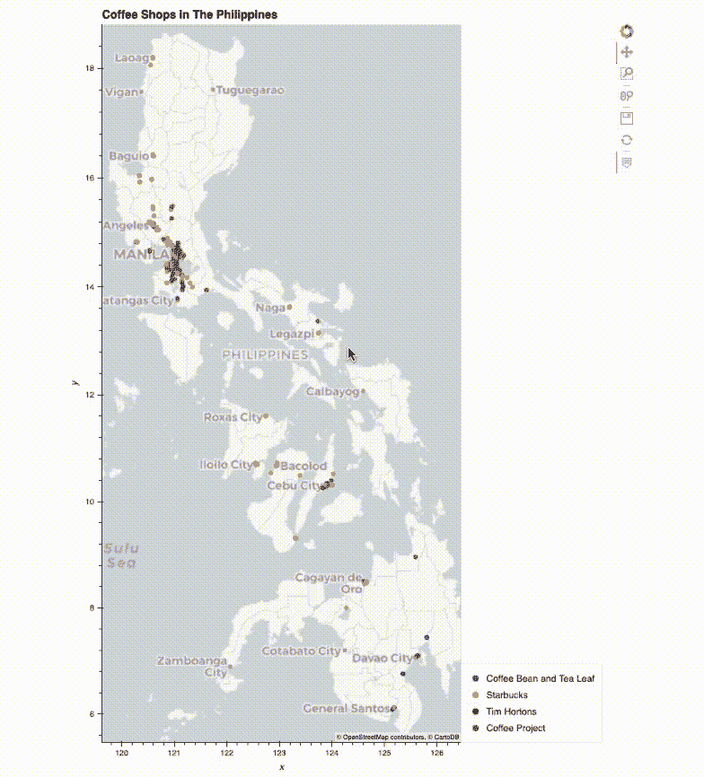
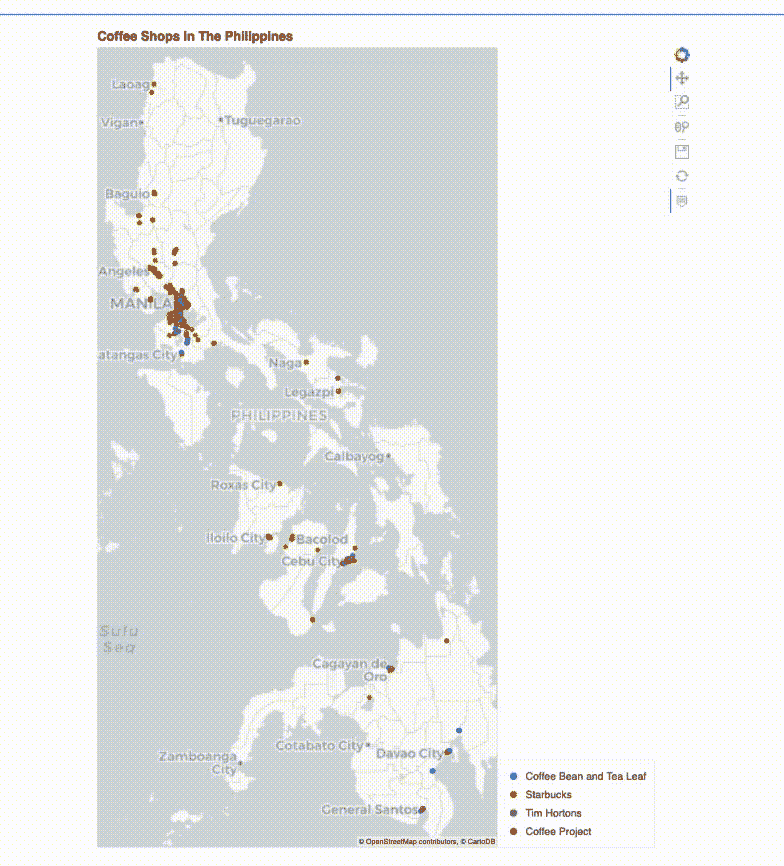
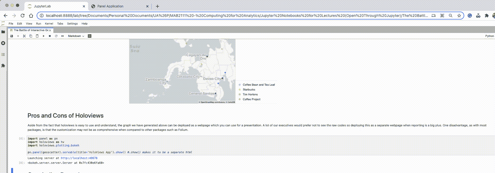

# 交互式地理可视化之战第 1 部分—使用一行代码的交互式 Geoplot

> 原文：<https://towardsdatascience.com/the-battle-of-interactive-geographic-visualization-part-1-interactive-geoplot-using-one-line-of-8214e9ed1bb4?source=collection_archive---------21----------------------->

## PYTHON。数据科学。地理可视化

## 使用 Holoviews 和 Python 的地理可视化


[GeoJango Maps](https://unsplash.com/@geojango_maps?utm_source=medium&utm_medium=referral) 在 [Unsplash](https://unsplash.com?utm_source=medium&utm_medium=referral) 拍摄的照片

# 介绍

地理空间数据可能是目前存在的最复杂的数据形式之一。一个原因是，这种形式的数据不用于分析师之间的日常对话。例如，分析师通常不谈论纬度和经度，和/或形状文件。

另一个原因是，地理空间数据所展示的模式并不容易显现。

因此，地理可视化在研究的初步分析和设计中发挥着重要作用。

# 地理散点图

地理散点图与普通散点图相似，只是地理散点图使用观察的地理编码(位置)作为制图的参考基础。这意味着，与具有 x 和 y 变量的普通散点图(*有理数字类型*)相反，地理散点图的 x 和 y 是经度和纬度，并且是*名义值*。

由于数据科学家追踪新冠肺炎感染的努力，地理散点图最近变得更加流行。

在本系列文章中，我们将使用相同的数据集，但使用不同的包。

# 关于数据集

我们将要使用的数据集是“菲律宾咖啡店足迹”数据集，它是我在 2020 年生成的，用来绘制谷歌地图上列出的菲律宾咖啡店。

生成这些数据的过程如下:[https://towards data science . com/mapping-your-favorite-coffee-shop-in-the-Philippine-using-Google-places-API-and-folio-2 F9 D5 ad 697 BF](/mapping-your-favorite-coffee-shop-in-the-philippines-using-google-places-api-and-folium-2f9d5ad697bf)

## 加载数据集

```
import pandas as pd
df = pd.read_csv('data/Coffee Brands Footprint.csv',
                index_col=0)
df.head()
```



作者图片:数据集预览

请注意，对于绘制地理空间图形，有一个经度和纬度列是很重要的。在某些情况下，您可以用 GeoPandas 几何对象(点、线、多边形)来替换它。

不多说了，我们开始吧。

# 使用全息视图的一行代码

Holoviews 是目前存在的高级绘图包之一。它非常容易使用，对于那些时间紧张的人，我推荐这个包。

`pip install holoviews`

注意确保也安装`geoviews`包。

`pip install geoviews`

使用这一行代码可以生成地理散射图:

```
df.hvplot.points(
    x='lng', #longitude column
    y='lat', #latitude column
    hover_cols=['vicinity'], #tooltip when hovered over
    c='brand', #color argument
    title='Coffee Shops in The Philippines', 
    geo=True,
    tiles='CartoLight')
```

请注意，它就像绘制一个普通的散点图！正如我们的介绍所述，x 和 y 参数属于经度和纬度列。

`geo=True`的参数对于 holoviews 将 x 和 y 变量解释为地理编码非常重要。



作者生成的 GIF。尝试使用以下任一选项来更改拼贴:#'CartoDark '，' CartoEco '，' CartoLight '，' CartoMidnight '，' EsriImagery '，
# ' EsriNatGeo '，' EsriReference''EsriTerrain '，' EsriUSATopo '，' OSM '，
# ' stamen labels '，' StamenTerrain '，' StamenTerrainRetina '，' StamenToner '，' StamenTonerBackground '，' stamen 水彩'

让我们删除框架，以及它可能不会在视觉上吸引人。这可以通过将`xaxis`和`yaxis`设置为`None`来实现。

```
df.hvplot.points(
    x='lng', 
    y='lat',
    frame_height=1000,
    frame_width=500,
    xaxis=None,
    yaxis=None,
    hover_cols=['brand', 'vicinity'], 
    c='brand', 
    title='Coffee Shops in The Philippines', 
    geo=True,
    tiles='CartoLight')
```



作者生成的 GIF。与第一张 GIF 图像相同，但没有 x 轴和 y 轴。

由于重叠的点，很难看到在特定区域有多少商店。在这种情况下，将点的透明度设置为小于 100%会有所帮助。

对于这些情况，我们可以尝试用关键字`alpha=0.3`将其设置为 30%。

```
df.hvplot.points(
    x='lng', 
    y='lat',
    alpha=0.3,
    frame_height=1000,
    frame_width=500,
    xaxis=None,
    yaxis=None,
    hover_cols=['vicinity'], 
    c='brand', 
    title='Coffee Shops in The Philippines', 
    geo=True,
    tiles='CartoLight')
```

# 全息视图的优点和 CONS

除了 holoviews 易于使用和理解的事实之外，我们上面生成的图表可以部署为一个网页，您可以使用它进行演示。

我们的许多高管不希望看到原始代码，因此在报告时将它部署为一个单独的网页是一个很大的优势。

要部署为单独的页面:

```
import panel as pn
import holoviews as hv
import holoviews.plotting.bokehpn.panel(geoscatter).servable(title='HoloViews App').show() #.show() makes it to be a separate html
```



作者生成的 GIF。

与大多数包一样，一个缺点是与其他包(如 follow)相比，定制可能不太全面。

# 结束语

我们可以做很多定制来改进我们上面已经有的可视化。对于有兴趣持续改进 geo-scatter 的读者，推荐以下:

1。**选择定制的调色板** —特别是，我们上面的是咖啡品牌，它们可以与特定的颜色相关联。例如，星巴克有一种特殊的绿色，可以很好地识别品牌。这里建议的方法是为品牌的颜色创建一个列，该列被提供给`c`或颜色参数。

2.**尝试不同的图块** —对于有许多不同颜色(非单调)的图表，理想的是图块颜色不太鲜艳，以强调要点。对于单调的颜色，适用于连续变量，彩色图形可以谨慎使用。主要的想法是，瓷砖不应该分散或带走地理图的信息，这就是为什么我们这样做的原因。

正如您从上面所看到的，可视化点提升了我们对地理空间数据的理解。像网络效应这样的模式是很容易得到的，我们可以推断这个地区的咖啡店越多，这个地方就越发达。

在下一个系列中，我们将尝试不同的包来比较整体的语法和美学。

我的 [Github 页面](https://github.com/francisadrianviernes/GeoVisualization/blob/master/The%20Battle%20of%20Interactive%20Geographic%20Visualization%20Part%201%E2%80%8A-%E2%80%8AInteractive%20Geoplot%20Using%20One%20Line%20of%C2%A0Code.ipynb)上的全部代码。

让我知道你的想法！