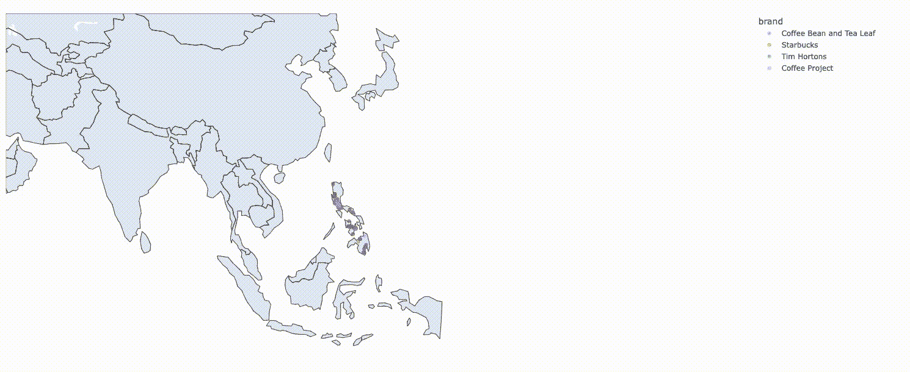

# 交互式地理可视化之战第 2 部分——使用一行代码的交互式 Geoplot

> 原文：<https://towardsdatascience.com/the-battle-of-interactive-geographic-visualization-part-2-interactive-geoplot-using-one-line-of-2118af59a77c?source=collection_archive---------25----------------------->

## PYTHON。数据科学。地理可视化

## 使用 Plotly Express 和 Python 进行地理可视化，并提供地理编码方面的额外提示


蒂莫·维林克在 [Unsplash](https://unsplash.com?utm_source=medium&utm_medium=referral) 上的照片

# 我们离开的地方

在上一篇文章中:[交互式地理可视化之战第 1 部分—使用一行代码的交互式 geo plot](/the-battle-of-interactive-geographic-visualization-part-1-interactive-geoplot-using-one-line-of-8214e9ed1bb4)，我们讨论了为数据探索制作 geo plot/geo Visualization 的重要性，因为它可能揭示数据的有趣见解和模式，从而将您的数据科学项目提升到一个全新的水平。

此外，我们使用交互式 Python 包 Holoviews 生成了数据集的地理散点图，作为奖励，我们将它部署为用于演示目的的网页。

在本文中，我们将使用相同的数据集来生成类似的交互式地理图，但使用的是 Plotly Express 包。

# PLOTLY EXPRESS

在我们开始学习 Plotly express 之前，有必要讨论一下 Plotly 是如何成为 Python、R 和其他编程语言的领先且最受欢迎的交互式绘图库之一的。

Plotly Express 是 Plotly 库的高级包装器，这意味着它调用 Plotly 库的功能，但语法更简单。

有了这样的介绍，让我们只用一行代码就能画出我们的图。

# 编码

## 预赛

```
import pandas as pd
# For Geovisualization
import plotly.express as px
```

## 加载数据集

```
df = pd.read_csv('data/Coffee Brands Footprint.csv',
                index_col=0)
df.head()
```


作者图片:我们数据集的前五次观察。

## PLOTLY EXPRESS 的一行代码

```
px.scatter_geo(df,
               lat = df['lat'],
               lon = df['lng'],
               color = df['brand'],
               hover_name = df["name"],
                     width=1600,
                    height=800,
                    )
```

我们有我们的输出:


作者图片

正如我们所看到的，我们已经制作了一个交互式 geoplot，但我们可以对其进行定制和进一步改进。

我们将进行以下改进:

1.  剧情以菲律宾为中心。
2.  让画面的焦点只在亚洲。
3.  更改了分散点的不透明度或透明度。

要完成这三(3)件事很简单:我们只需提供与这些所需更改相对应的参数，但首先，这是一个非常有用的提示:

## 提示:自动对一个国家进行地理编码

要自动提取国家/地区的地理编码，请导入姓名，然后继续执行以下操作:

```
from geopy.geocoders import Nominatim
geolocator = Nominatim(user_agent="geocoder") #Do not forget to put in the user_agent argument (and should be a customized one)
location = geolocator.geocode("Philippines")
print((location.latitude, location.longitude))
```


图片由作者提供:Nominatim 自动生成 PH 的地理编码

现在，我们可以使用这些坐标来填充需要字典输入的`center`。`scope`参数可用于改变任何大陆上的帧焦点。探索`projection`参数，看看你的情节如何随着每一个选择而变化。

最后，我们可以使用`opacity`参数改变点的透明度:

```
px.scatter_geo(df,
               lat = df['lat'],
               lon = df['lng'],
               color = df['brand'],
               hover_name = df["name"],
               scope='asia',
               projection='natural earth',
               width=1600,
               height=800,
               center={
                    'lat': location.latitude,
                    'lon': location.longitude
                },
                opacity=0.5
                    )
```



图片由作者提供；定制后的 Plotly Express Geoplot

# 优点和缺点

与其他库相比，易于使用本身是一个很大的优点，但也有缺点。

与其他库相比，plotly express 的另一个优势是它可以支持动画(*这是另一篇文章*)，并且将是我们已经令人印象深刻的可视化的一个愉快的补充。

然而，缺点是，与其他库(如更容易部署的 follow 甚至 Holoviews)相比，定制是有限的。

# 结束语

对于希望了解什么是以及如何进行交互式地理可视化的初学者，plotly express 提供了完美的培训场所和学习库。

然而，随着我们的需求变得更加复杂，我们可能需要执行更多的计算并使用更多的低级库来完成这些，但是我们将在后续文章中讨论这些。

我的 [Github](https://github.com/francisadrianviernes/GeoVisualization/blob/master/The%20Battle%20of%20Interactive%20Geographic%20Visualization%20Part%202-%E2%80%8AInteractive%20Geoplot%20Using%20One%20Line%20of%C2%A0Code.ipynb) 页面上的全部代码。

查看我的其他文章:

[交互式地理可视化之战第 1 部分—使用一行代码的交互式地理地图](/the-battle-of-interactive-geographic-visualization-part-1-interactive-geoplot-using-one-line-of-8214e9ed1bb4)

[使用地理编码计算两个位置之间的距离](/calculating-the-distance-between-two-locations-using-geocodes-1136d810e517?source=your_stories_page----------------------------------------)

[使用谷歌地图 API 生成地理编码](/generating-geocodes-using-google-maps-api-eb56028821a6?source=your_stories_page----------------------------------------)

[使用 Google Places API 和 leavy 绘制您在菲律宾最喜欢的咖啡店地图](/mapping-your-favorite-coffee-shop-in-the-philippines-using-google-places-api-and-folium-2f9d5ad697bf?source=your_stories_page----------------------------------------)