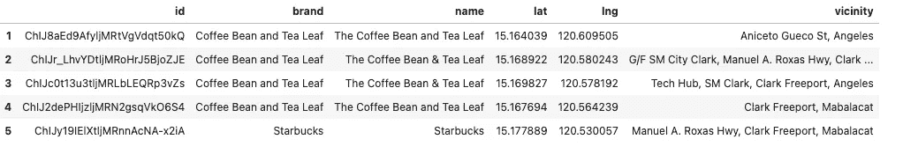
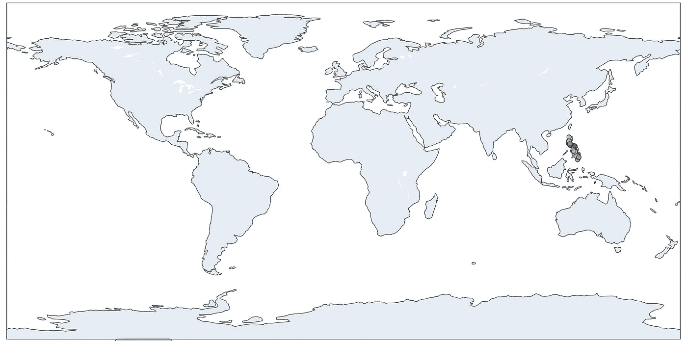
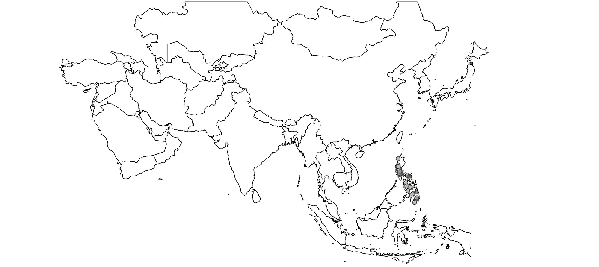
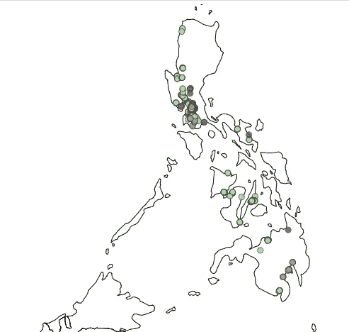
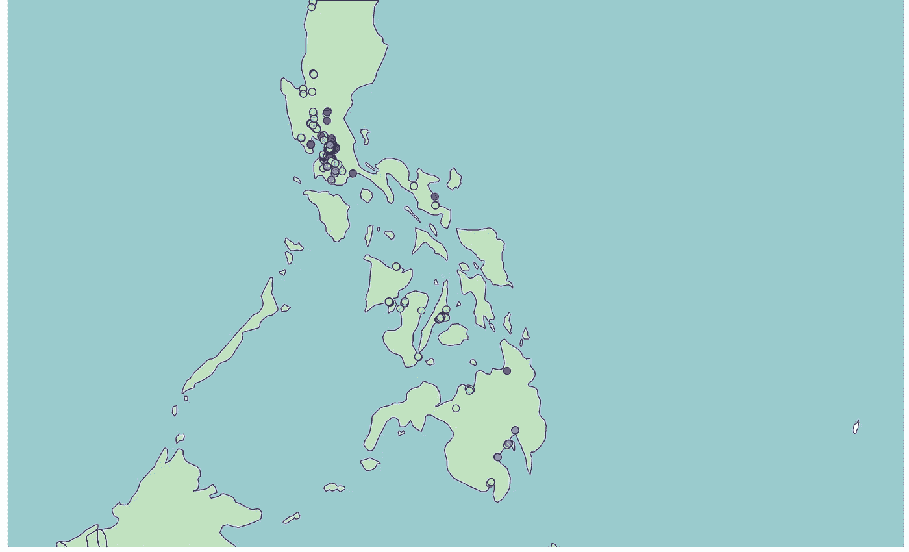
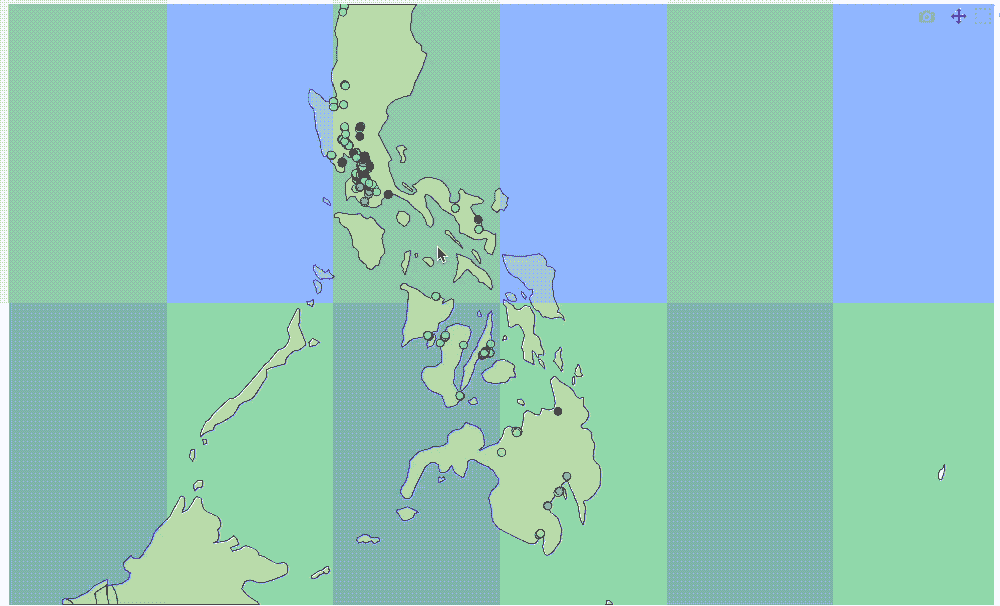

# 交互式地理可视化之战第三部分:Plotly 图形对象(Go)

> 原文：<https://towardsdatascience.com/the-battle-of-interactive-geographic-visualization-part-3-plotly-graph-objects-go-c3d3f2a00132?source=collection_archive---------36----------------------->

## PYTHON。数据科学。地理可视化。

## 充分利用 Plotly 对日益增长的地理可视化需求的响应


照片由[安德鲁·斯图特斯曼](https://unsplash.com/@drewmark?utm_source=medium&utm_medium=referral)在 [Unsplash](https://unsplash.com?utm_source=medium&utm_medium=referral) 上拍摄

# 我们离开的地方

在本系列的第一部分:[交互式地理可视化之战第 1 部分—使用一行代码的交互式 geo plot](/the-battle-of-interactive-geographic-visualization-part-1-interactive-geoplot-using-one-line-of-8214e9ed1bb4)，我们讨论了地理可视化对于以地理为特征的数据科学项目的重要性。通过一行命令，我们讨论了如何使用 **Holoviews** 交互绘制。

在[上一篇文章](/the-battle-of-interactive-geographic-visualization-part-2-interactive-geoplot-using-one-line-of-2118af59a77c)中，我们讨论了如何使用 Plotly express 绘制相同的数据集。虽然在语法方面易于理解，但 Plotly express 缺乏可以定制我们的绘图的高级工具和命令。

在本文中，我们将看到 Plotly 有一种方法来弥合这些需求，但使用了不同的包—**Plotly Graph Object(Plotly go)**。

# PLOTLY GRAPH OBJECTS (GO)与 PLOTLY EXPRESS

在这篇文章中，我们不会详细讨论为什么这个模块被称为 *graph objects* ，而是直接将它与上一篇文章中我们已经知道的内容进行比较。(*关于 graph_objects 的技术细节的详细解释可以在* [*这里*](https://plotly.com/python/graph-objects/) *找到。*)

在不使事情变得太复杂的情况下，plotly 和`plotly express`的`graph_objects`模块可以生成相同的基本图形。这里的关键词是“基本”。

这意味着你可以用 plotly express 做的任何事情，你都可以用`graph_objects`模块来做，尽管它不仅仅是一行程序。正如我们在上一篇文章中所解释的，plotly express 旨在拥有更简单的语法，同时保留大部分 plotly 功能。

然而，反过来就不正确了:并不是所有使用`graph_objects`模块可以做的事情在 plotly express 中都是可行的。这只是简单性和定制能力之间的权衡。

不多说了，让我们开始编码吧！

# 编码

## 预赛

```
import plotly.graph_objects as go
import pandas as pd
```

## 加载数据集

加载相同的数据集，我们有:

```
df = pd.read_csv('data/Coffee Brands Footprint.csv',
                index_col=0)
df.head()
```



作者图片:我们数据集的前五次观察。

## 颜色词典

为每个品牌建立我们想要的颜色:

```
color_dict = dict(zip(list(df.brand.unique()),
                      ['rosybrown', 'palegreen', 'indianred', 'brown']))
```

## 主代码

```
fig = go.Figure(data=go.Scattergeo(
        lon = df['lng'],
        lat = df['lat'],
        text = df['vicinity'],
        mode = 'markers',
        marker = dict(
            size = 8,
            opacity = 0.8,
            reversescale = True,
            autocolorscale = False,
            color=[color_dict[x] for x in df['brand']],
            symbol = 'circle',
            line = dict(
                width=1,
                color='rgba(102, 102, 102)'
            )        )))
```

让我们解释一下上面的代码部分:

*   走吧。Scattergeo 将提供的参数转换成 graph 对象，该对象将由`go.Figure`参数使用
*   `go.Figure`的争论改变了我们的走向。将地理对象分散成实际图形
*   我们将它存储在变量 fig 中，以便该对象可以接收我们想要实现的定制。

要查看这个图形，请调用 show()方法。

```
fig.show()
```


作者提供的图像:生成的底图类似于 Plotly Expres 的底图

现在我们已经有了基本地图，让我们添加一些自定义！

# 定制 1 —增加布局

为了增加版面，我们将访问`update_layout`模块。

```
fig.update_layout(height=600, margin={"r":0,"t":0,"l":0,"b":0})
fig.show()
```



作者提供的图片:更新了布局尺寸的底图

# 自定义 2-地图的缩放和居中

回想一下，在我们上次的更新中，我们发现很难将我们的地图放在菲律宾的中心，因此，我们总是需要缩放很多次才能看到我们想要的位置(例如菲律宾)。

使用 Plotly Go，我们已经可以做到这一点。

首先，我们把范围限制在“亚洲”。

```
fig.update_geos(
    visible=False, resolution=50, scope="asia",
    showcountries=True, countrycolor="Black",
    showsubunits=True, subunitcolor="Blue"
)fig.show()
```



作者图片:更新范围的地图

接下来，我们可以添加使地图以菲律宾、经度和纬度为中心的参数。回想一下，我们在之前的帖子中已经为此指定了代码。

```
from geopy.geocoders import Nominatim
geolocator = Nominatim(user_agent="geocoder") #Do not forget to put in the user_agent argument
location = geolocator.geocode("Philippines")
print((location.latitude, location.longitude))
```

接下来，参数`projection_scale`类似于 Mapbox 的缩放参数(我们将有单独的文章讨论)。摆弄这些信息给了我们:



作者提供的图像:应用于底图的投影比例

# 定制 3-地图的背景

最后，Plotly go 的另一个可能的定制是底图的定制。使用此选项，可以对地图元素进行定制，例如是否显示海洋、陆地、湖泊等。以及它们的颜色。

使用`update_geos`方法:

```
fig.update_geos(
    resolution=50,
    showcoastlines=True, coastlinecolor="RebeccaPurple",
    showland=True, landcolor="#C1E1C1",
    showocean=True, oceancolor="#99cccc",
    showlakes=True, lakecolor="Blue",
    showrivers=True, rivercolor="Blue"
)fig.show()
```



按作者分类的图像:应用于地图的背景

颜色参数可以提供十六进制或 RGB 代码，以便更好地定制。

# 最终图形

下面，我们将看到最终的图表，以及它的交互功能:



作者 GIF:最终输出

# 结束语

Plotly 图形对象真正是 Plotly 进入交互式可视化的战斗。通过交换我们在 Plotly express 中看到的一些简单性，我们可以对我们的交互式地图进行更多的定制。

我鼓励我们的读者尝试其他功能，如定制您自己的地图框图块并与 Plotly go 一起使用，以及使用定制标记。

在下一篇文章中，我们将探索另一种交互式地理空间可视化。敬请期待！

查看我的其他文章:

[交互式地理可视化之战第一部分——使用一行代码的交互式 geo plot](/the-battle-of-interactive-geographic-visualization-part-1-interactive-geoplot-using-one-line-of-8214e9ed1bb4)

[交互式地理可视化之战第二部分——使用一行代码的交互式地理地图](/the-battle-of-interactive-geographic-visualization-part-2-interactive-geoplot-using-one-line-of-2118af59a77c)

[使用地理编码计算两个位置之间的距离](/calculating-the-distance-between-two-locations-using-geocodes-1136d810e517?source=your_stories_page----------------------------------------)

[使用谷歌地图 API 生成地理编码](/generating-geocodes-using-google-maps-api-eb56028821a6?source=your_stories_page----------------------------------------)

[使用 Google Places API 和 fluous 为您在菲律宾最喜欢的咖啡店绘制地图](/mapping-your-favorite-coffee-shop-in-the-philippines-using-google-places-api-and-folium-2f9d5ad697bf?source=your_stories_page----------------------------------------)