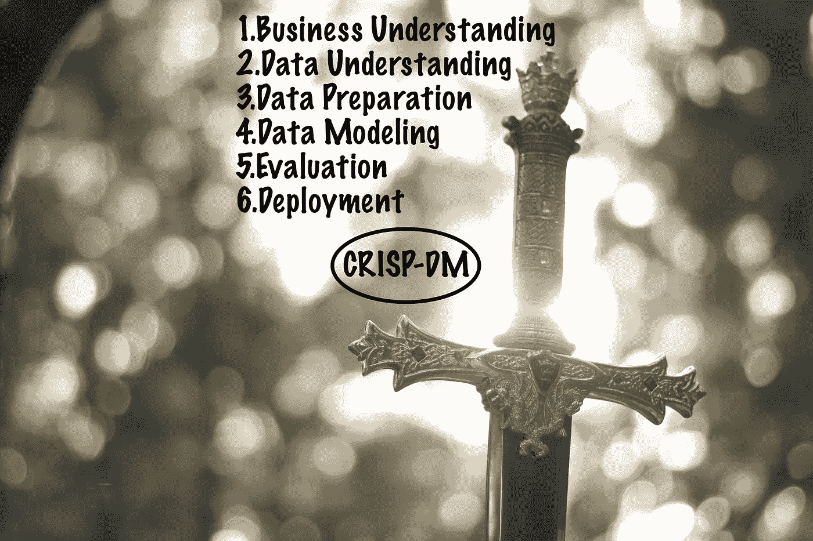
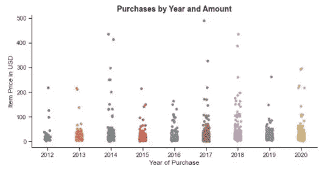
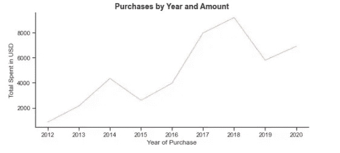
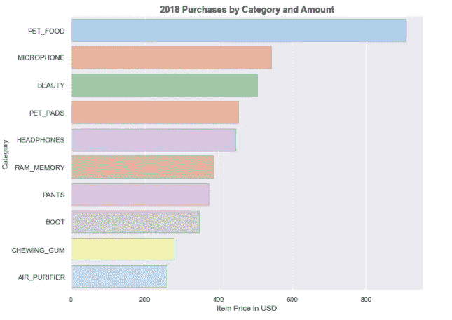
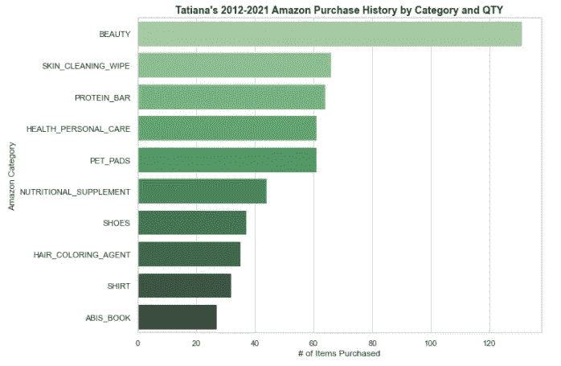
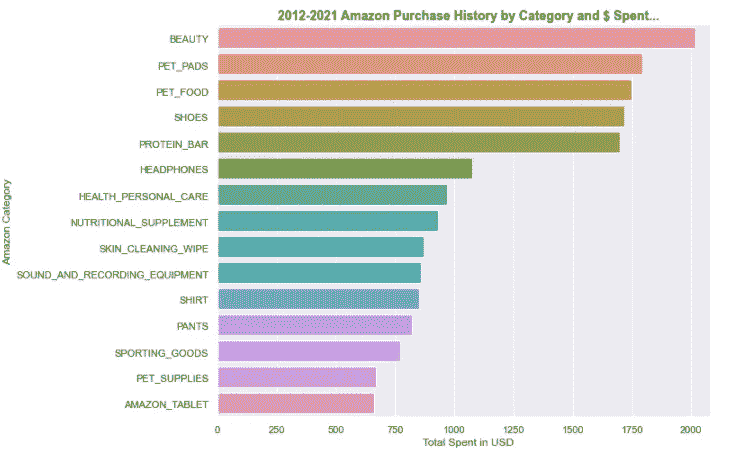
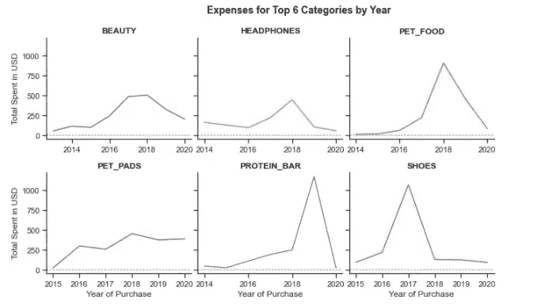
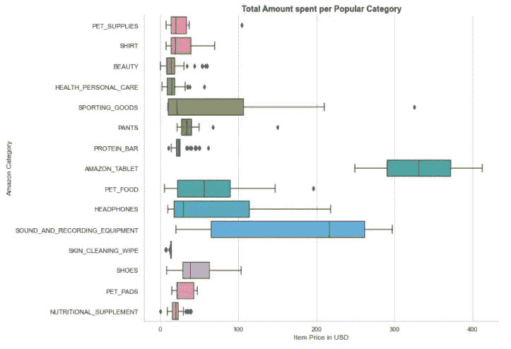
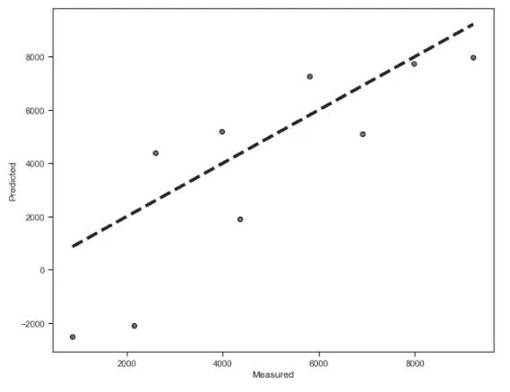
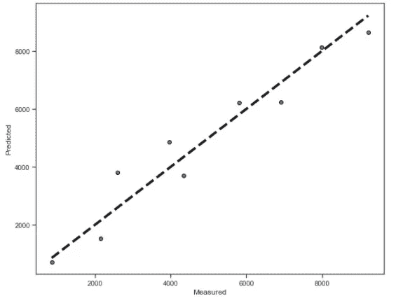

# 亚马逊消费的野兽，以及面对它的最佳方式。

> 原文：<https://towardsdatascience.com/the-beast-of-your-amazon-spendings-and-the-best-way-to-face-it-cebf428178f2?source=collection_archive---------63----------------------->

## [实践教程](https://towardsdatascience.com/tagged/hands-on-tutorials)

## 用 CRISP-DM 之剑划破数据的阴霾，用 Python 在我们身边征服金钱怪兽。

照片由[你好，我是尼克🎞](https://unsplash.com/@helloimnik?utm_source=unsplash&utm_medium=referral&utm_content=creditCopyText)开启[防溅](https://unsplash.com/s/photos/amazon?utm_source=unsplash&utm_medium=referral&utm_content=creditCopyText)

你是否倾向于在网上购买小额商品而不考虑这些商品加起来有多少钱？想要查看您的总支出，但又害怕打开您的购买历史记录？相信我，你和我在同一条船上。

虽然我认为自己是一个理性的买家，但没有一年我不在想我的收入有多少被亚马逊浪费了。我一直在进行一键式购物，通过[smile.amazon.com](http://smile.amazon.com/about)向慈善机构捐赠合格购买价格的 0.5%来安抚我的良心，而不看汇总统计。到目前为止，如果不多花 100 英镑购买抗焦虑药物，我不可能理解如何面对现实，但数据科学拯救了我。

阿基米德说:“给我一个支点，我可以撬动地球。”“给我一个笔记本，让我在里面记录熊猫”，我大声回答，“我会征服亚马逊的野兽！”

让我们把我们的英雄任务变成一出戏，用柔和调色板中的图表覆盖那些尖锐的数字，这样即使不能获胜，至少也有一点机会幸存下来并保持我们的理智。

首先，我们需要选择我们的武器。没有什么比 [CRISP-DM](https://www.datascience-pm.com/crisp-dm-2/) 之剑更能穿透数据的迷雾，这是一个经过行业验证的框架，有助于构建我们的分析工作。

由 [Ricardo Cruz](https://unsplash.com/@mavrick?utm_source=unsplash&utm_medium=referral&utm_content=creditCopyText) 在 [Unsplash](https://unsplash.com/s/photos/samurai-sword?utm_source=unsplash&utm_medium=referral&utm_content=creditCopyText) 上编辑的照片

## **业务理解**

在我的例子中，这意味着我需要定义一组问题:

*   我一年花了多少钱？哪一年我疯狂购物，花钱最多？请注意，我们不是问*为什么*，因为那需要一两次(或十几次)治疗。
*   在那疯狂购物的一年里买了什么？
*   我的大部分费用属于哪几类？
*   如果我们选择前 6 个类别，我是否倾向于每年花费相同的金额？
*   最可怕的问题是，我在最常见的费用类别上花费的最大金额是多少？
*   最后，我预计 2021 年的总购买量是多少？

## **数据理解**

在这里，我们将探索可用的数据。

**第一步。收集数据**。由于我是在和亚马逊打交道，所以我直接去了你的账户>你的订单> [订单历史报告](https://www.amazon.com/gp/b2b/reports/?ie=UTF8&download-report.x=1&isInternal=0&js=1&reportId=A1YR1JHHGE3WTK)，下载了一个. csv 文件，里面有我的订单历史。(谢天谢地，我现在还不用打开它。)

**第二步。让你的 Jupyter 笔记本运行起来，并加载一些库。**

**第三步。熟悉数据并概述数据质量和整洁性问题，如果有**。

我没有看到任何结构错误，所以就**整洁度**而言，我的数据状态良好。我确实做了一些结构上的修改，但那是在建模阶段。(顺便说一句，如果你想了解更多关于[什么构成了一个整洁的数据集](https://cran.r-project.org/web/packages/tidyr/vignettes/tidy-data.html)，这里有一篇很棒的文章。)

至于质量，这里有一些我需要注意的事情:

*   删除我不需要的额外列
*   将“订单日期”格式更改为日期时间
*   将“购买年份”提取到一个单独的列中，并删除 2021 年的值，以进行彻底的区分
*   通过删除$符号并将其转换为数字来格式化“项目合计”
*   删除或估算缺失值
*   给数据更恰当的标签

因此，我们进入下一阶段。

# 数据准备

按照上面列出的任务列表:

# 数据建模和结果评估

现在到了有趣的部分，我们通过执行建模和统计分析来找到问题的答案。在我们开始之前，我想分享一个我偶然发现的[seaborn cheat sheet](https://s3.amazonaws.com/assets.datacamp.com/production/course_15192/slides/chapter4.pdf)，讽刺的是它是由亚马逊 AWS 通过 DataCamp 托管的。(这几乎就像是亚马逊在推我前进。)

所以，我的第一个问题分为三个部分:

我一年花了多少钱，哪一年损失最大？

作者图片

根据以上判断，似乎 2014 年和 2017-2018 年在我的钱包上留下了印记(或者更确切地说，是一个大洞)，但我们需要更清晰的视角来确认。

作者图片

是的，就在那里，2018 年几乎就在 10K 了……为自己辩护，我丈夫和我经常在亚马逊上购买家用电器——但我真的能说是电子产品和智能技术打败了我吗？让我想想…

**2018 年采购的大部分是什么？**

作者图片

好了，麦克风、耳机、空气净化器——这些都很棒。但是口香糖，真的吗？我想知道如果我们看整个八年期间，它会得到什么排名。(不过，仔细想想，我*真的*想知道吗？)

**我的大部分支出属于哪几类？**

首先，按数量:

作者图片

然后按金额:

作者图片

更多的宠物垫和宠物食品(拥有腊肠狗是要付出代价的……)，鞋子和美容用品——好吧，这些我都能应付。谢天谢地，书籍进入了第一个数量表——你会在最底部看到它们。差不多 2000 美元的蛋白质棒，尽管……谢天谢地，Seaborn 漂亮的颜色减轻了打击。

现在的问题是**如果我们将自己限制在前 6 个类别，并查看整个 8 年期间的分布，我的支出会逐年变化吗？**

作者图片

答案是肯定的，它们确实有所不同。不确定这是好消息还是坏消息，因为显然不可预测的买家行为…我会用积极的方法，因为我似乎不再花一大笔钱在那些该死的蛋白质棒上。此外，美容和鞋类支出似乎正在逐步减少——这要归功于新冠肺炎。猜猜看，最后，我被宠物垫困住了。毕竟是坏消息。

我不认为情况会比这更糟，所以我准备回答最可怕的问题

我在普通商品上的最大花费是多少？

作者图片

如果你还不熟悉方框图，请注意圆点代表*异常值*(很高兴听到我没有每次花 200 美元买宠物食品和 300 多美元买体育用品)。方框内的竖线显示的是*中位数*，方框本身代表的是*四分位距*(基本上就是上半部分和下半部分中位数之差)。最后，外部线条(又名*胡须*)相应地指示最小值和最大值。

好吧，我要说这还不算太糟，尤其是考虑到这些昂贵的商品中没有一件价格超过 450 美元。另一个可以问的问题是，我购买的最贵的东西一般是什么*，不管他们的类别是否进入前 15 名，但这将是另一份报告的问题…*

# *部署*

*说到报告，我想说我们的 CRISP-DM 框架的最后阶段也已经完成。对我来说，这意味着开发并记录一个部署模型的计划，生成一个报告，并将发现传达给涉众。完了，完了，完了。*

*然而，一个细心的读者可能会想:2021 年购买预测的最后一个问题发生了什么？嗯，有人可能会认为这太可怕了，所以我决定不与公众分享。但事实上，我的模型是绝对可怕的，因为它缺乏任何相关的特征，这意味着我不能完全凭良心相信它预测的标签。*

*不管怎样，我将与你分享代码和结果，因为我只是为了练习而构建它。这是另一个诱因——两个模型都预测支出会比前几年低得多！这是不是意味着将会有另一次为期 10 个月的隔离封锁，没有理由去获取东西？我想这取决于你的解释…*

***附:sklearn 预测建模实践# 1***

*当我开始从事这项工作时，我必须处理分类数据(商品名称、亚马逊类别等。)，我随后将其转换为虚拟变量。但后来我意识到，我需要按年(而不是按项目)计算的总支出，所以我继续对数据进行分组，加入一些样本工资值:*

**

*作者图片*

*你可以看到我们的模型非常吻合，考虑到我给它的数据少得可笑。它预测我 2021 年的亚马逊年度支出将达到 5777 美元。*

***p . p . s . stats models 预测建模实践# 2***

*在这里，我必须引入一个截距(如果我要使用伪变量，就需要删除其中一个)。代码很简单，而且比第一个更合适，所以肯定是赢家(尽管就我的支出而言，它有点不太乐观，预计每年的商品价值为 5830 美元)。*

**

*作者图片*

*我说这就是有趣的周末项目。虽然，它永远不会真正结束，不是吗……下一次，不是穿过数据的迷雾，我说我们完全驱散它，使用回归模型，有真正的*权重和值。**

*直到我们再次相遇！*